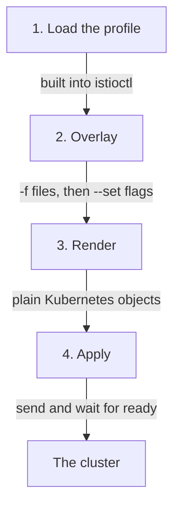

# The Render-And-Apply Pipeline

`istioctl install` looks like a command that installs software. In fact it renders a complete set of Kubernetes objects on your machine and then applies them to the cluster, much like `kubectl apply`. This matters because nothing in the cluster remembers what you typed. Once you know the stages the command runs through, the behaviour that surprises people later (removed gateways, lost settings, hand edits that come back) becomes easy to predict.

## Check the istioctl client first

Your playground has `istioctl` 1.30.5 installed and no Istio in the cluster. Before you start, check that the client works. The `--remote=false` flag asks only for the version of the binary on your machine, so the command works even with no Istio in the cluster.

<!-- astrona:playground:renew -->

```sh
istioctl version --remote=false
```

If that prints `command not found`, the installer put the binary in your home directory instead. Run `export PATH="$HOME/.local/bin:$PATH"` and try again.

## The four stages, in order

With a working client, you can look at what the install command does. This is the command you will use most often in this course. Do not run it yet; first read what it does:

```sh
istioctl install --set profile=demo -y
```

`istioctl install` runs four stages, and only the last one touches the cluster:



The diagram shows that stages 1 to 3 run on your machine and only stage 4 talks to the Kubernetes API server.

Stage 1 loads a built-in profile, which is a ready-made `IstioOperator` document. Stage 2 merges your files and flags on top of it. Stage 3 renders the result into ordinary Deployments, Services, ConfigMaps, CRDs (Custom Resource Definitions, which add new object kinds to the Kubernetes API) and webhook configurations. Stage 4 sends those objects to the cluster.

The rule behind this is short: **`istioctl install` renders on your machine, then applies.** The `IstioOperator` document is an input format. It is not an object that lives in the cluster and does work.

That matters more than it sounds. Older Istio versions ran an in-cluster operator: a controller that watched an `IstioOperator` resource and kept changing the cluster to match it. That operator is gone. No controller undoes a hand edit of the `istiod` Deployment, and no object in the cluster shows the configuration you installed. If you edit an installed object by hand, your edit stays until the next `istioctl install` overwrites it.

## Print the objects without applying them

Because stage 3 produces ordinary objects, you can stop before stage 4 and read them. `istioctl manifest generate` runs stages 1 to 3 and prints the result instead of applying it:

```sh
istioctl manifest generate --set profile=demo | head -40
```

`istioctl install --dry-run` also stops before applying, but it prints a summary, not the YAML. The `-o yaml` flag that used to print the YAML was removed. `manifest generate` is the command that gives you the objects, so it answers the question "what is this command about to do to my cluster?" without changing anything.

Next, count how many objects one install command would create, and which kinds are the most common:

```sh
istioctl manifest generate --set profile=demo | grep -c '^kind:'
istioctl manifest generate --set profile=demo | grep '^kind:' | sort | uniq -c | sort -rn | head -6
```

The output looks like this:

```text
42
     15 kind: CustomResourceDefinition
      4 kind: ServiceAccount
      3 kind: Service
      3 kind: RoleBinding
      3 kind: Role
      3 kind: Deployment
```

The exact counts change with the version and the profile. What matters is the size: a "one-line install" is dozens of objects, and `istioctl` rendered every one of them on your machine before the cluster received anything.

## The overlay order

Stage 2 is where your own settings enter, so it is worth knowing which setting wins. Stage 2 merges several sources into one `IstioOperator` document. For each field, the source with the highest priority wins. From lowest to highest priority:

1. The profile named by `--set profile=` or by `spec.profile` in a file. If you name none, it is `default`.
2. Any `-f <file>` documents, in the order you give them.
3. Any `--set key=value` flags, in the order you give them.


The diagram shows the order of priority: the profile is the weakest source, and `--set` flags always win.

So `istioctl install -f mine.yaml --set meshConfig.accessLogFile=/dev/stdout` uses your file, then overrides that one key. Swapping their places on the command line changes nothing: `--set` always beats `-f`, wherever it sits on the line.

The real risk is not the order. It is that a `--set` override leaves no record. Stages 1 and 2 run on your machine, and nothing stores the merged document. Months later the cluster shows the *result*, and nothing shows the *inputs*. That is why this course keeps the installation in a file that you save and commit.

## istioctl as two groups of commands

Before you run the first real check, it helps to know how the `istioctl` subcommands are organised. The name is **istio** plus **ctl** (control), the same ending as `kubectl` and `systemctl`. Its subcommands fall into two groups.

The install-time commands, `install`, `manifest`, `uninstall`, `x precheck` and `tag`, change or inspect *what is deployed*. (`upgrade` also exists; it is another name for `install`.) The `x` stands for `experimental`: a group of subcommands whose interface Istio has not promised to keep stable. Some commands stay there for years and work well, and `x precheck` is the best-known example.

The runtime inspection commands, `version`, `proxy-status`, `proxy-config`, `analyze` and `ztunnel-config`, ask the *running mesh* what it holds. Only the install-time group must be the same tool that owns your cluster. The inspection group only reads, so it is safe to use on any cluster, including one installed with Helm.

## What x precheck inspects

`istioctl x precheck` is the first install-time command to run on a new cluster. It only reads from the Kubernetes API server. It does not check the syntax of your configuration. It checks whether *this cluster* can accept *this version* of Istio, by looking at:

- **The Kubernetes version**, against the range the target Istio release supports.
- **Existing Istio CRDs.** Leftovers from an earlier install can have a schema that conflicts.
- **Existing webhook configurations.** A stale mutating webhook that points at a missing Service can block the pods the install creates.
- **Existing Istio configuration objects**, for fields the target version has deprecated or removed.
- **Cluster permissions** the install needs, such as the right to create CRDs and cluster roles.

Look at the clean cluster the way precheck sees it. The first two commands show the starting state, and the third runs the check:

```sh
kubectl get ns istio-system
kubectl api-resources --api-group=networking.istio.io
istioctl x precheck
```

The output looks like this:

```text
Error from server (NotFound): namespaces "istio-system" not found
NAME   SHORTNAMES   APIVERSION   NAMESPACED   KIND
✔ No issues found when checking the cluster. Istio is safe to install or upgrade!
  To get started, check out https://istio.io/latest/docs/setup/getting-started/.
```

The first two results are the true starting state. There is no `istio-system` namespace, and `kubectl api-resources` prints only its header line: the API server knows no resource in the `networking.istio.io` API group, because the CRDs are not installed. A passing precheck is a statement about the *cluster*: nothing is in the way.

On a cluster with history, a clean pass is rare, and the warnings are the useful part. They tell you what will break *after* you upgrade, while the old version still runs and you can still change course.

## What stage 4 waits for

Precheck covers the time before the install; stage 4 covers the install itself. The apply stage does not just send the objects and exit. `istioctl install` waits until the components it created report ready, then prints a summary with a tick for each group of components. That has two results.

First, a hung install is usually a pod that cannot be scheduled or cannot pull its image, and rarely a fault in Istio. While the install is still waiting, `kubectl -n istio-system get pods` shows which pod is stuck. Second, in a script, the command returning is a reliable sign that everything is ready. You do not need your own `kubectl wait` after it.

The `-y` flag skips the question that asks you to confirm the install. A script needs it. At a terminal, reading that question once is a free check that `kubectl` points at the cluster you meant.

You now know that `istioctl install` loads a profile, merges your overlays, renders plain Kubernetes objects on your machine and applies them, and that nothing in the cluster records what you typed. You can print those objects with `istioctl manifest generate` and check a cluster with `istioctl x precheck`. The open question is what a profile contains, and which objects end up in `istio-system` when you apply one.

## Common pitfalls

> [!WARNING]
> **Expecting something in the cluster to keep your `IstioOperator` in place.** The in-cluster operator is gone. The document is an input format. Nothing watches it, and a hand edit of an installed object stays until the next `istioctl install`.
>
> **Assuming the order on the command line decides the overlay.** `--set` beats `-f` wherever it appears. Only sources of the same kind are ordered among themselves.
>
> **Letting a `--set` flag be the only record of a decision.** Stages 1 and 2 leave no record. The cluster shows the result, never the inputs. Put the installation in a committed file.
>
> **Reaching for `istioctl install --dry-run -o yaml`.** The `-o yaml` flag was removed. `istioctl manifest generate` gives you the objects.
>
> **Reading `x precheck` as a check on your YAML.** It checks the *cluster*: the Kubernetes version, leftover CRDs, stale webhooks. It says nothing about whether your configuration is what you meant.
>
> **Treating a slow install as an Istio fault.** Stage 4 waits for readiness. A hang is nearly always a pod that cannot be scheduled or cannot pull an image. `kubectl -n istio-system get pods` names it while the command is still waiting.
