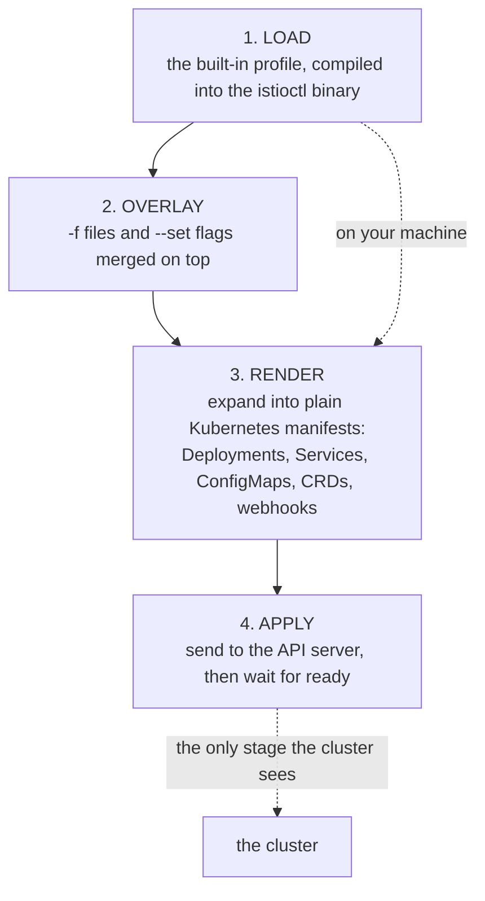

# Part 1 — The Render-And-Apply Pipeline

> Prerequisite: [the module landing page](./course.md). Next: [Part 2 — Profiles And The Objects They Produce](./course-02-profiles-and-installed-objects.md).

`istioctl install` looks like a command that installs software. It is closer to a template engine with a `kubectl apply` bolted on the end, and every confusing thing it does later follows from that. This part settles what actually happens between pressing Enter and the control plane being up, so that the rest of the module can talk about profiles, injection and reconciliation without hand-waving.

## The four stages, in order

Run the concrete case first:

```sh
istioctl install --set profile=demo -y
```

Four things happen, and the first three never touch the cluster:



Stages 1 to 3 happen entirely on your laptop. Only stage 4 touches the cluster — which is why you can stop after stage 3 and read exactly what is about to be applied.

The general rule: **`istioctl install` is client-side templating plus an apply.** The `IstioOperator` document is an *input format*, not an object that lives in the cluster doing work.

That last clause is the one worth dwelling on. Older Istio versions really did run an in-cluster operator that watched an `IstioOperator` resource and reconciled it continuously. That model is gone. There is no controller waiting to undo a hand-edit of the `istiod` Deployment, and no object you can `kubectl get` to see "the configuration Istio is maintaining". If you edit an installed object by hand, your edit stays until the next `istioctl install` overwrites it.

Because stage 3 produces ordinary manifests, you can stop before stage 4 and read them. `istioctl manifest generate` runs stages 1–3 and prints the result instead of applying it:

```sh
istioctl manifest generate --set profile=demo | head -40
```

(`istioctl install --dry-run` also stops short of applying, but it prints a summary rather than the YAML — the `-o yaml` flag that used to do that was removed. `manifest generate` is the command that hands you the objects.)

This is the honest answer to "what is this command about to do to my cluster", and it costs nothing.

> [!TIP]
> **Try it — count what one command would create**
>
> ```sh
> istioctl manifest generate --set profile=demo | grep -c '^kind:'
> istioctl manifest generate --set profile=demo | grep '^kind:' | sort | uniq -c | sort -rn | head -6
> ```
>
> Expect something like:
>
> ```text
> 42
>      15 kind: CustomResourceDefinition
>       4 kind: ServiceAccount
>       3 kind: Service
>       3 kind: RoleBinding
>       3 kind: Role
>       3 kind: Deployment
> ```
>
> Exact counts vary by version and profile. The shape is the point: a "one-line install" is dozens of objects across several API groups, and every one of them was produced on your laptop before the cluster heard about it.

## Where the overlay order bites

Stage 2 merges sources, and the merge is last-wins on a per-field basis. In increasing order of priority:

1. The profile named by `--set profile=` or `spec.profile` in a file (default: `default`).
2. Any `-f <file>` documents, in the order given.
3. Any `--set key=value` flags, in the order given.


So `istioctl install -f mine.yaml --set meshConfig.accessLogFile=/dev/stdout` uses your file and then overrides that one key. Reversing them on the command line does not change anything — `--set` always outranks `-f`, regardless of position on the line.

The trap is not the ordering itself; it is that a `--set` override leaves no trace. Stage 1 and 2 happen on your machine, and the merged document is not stored anywhere. Six months later, the cluster shows the *result* and nothing shows the *inputs*. That is the mechanical reason the rest of this course keeps insisting the installation lives in a committed file.

## Reading `istioctl` as a command family

`istioctl` is **istio** + **ctl** (control), the same `-ctl` convention as `kubectl` and `systemctl`. Its subcommands fall into two families, and remembering the split saves memorising the list:

- **Install-time** — `install`, `manifest`, `uninstall`, `x precheck`, `tag`. These change or inspect *what is deployed*. (`upgrade` also exists and is an alias for `install`.)
- **Runtime inspection** — `version`, `proxy-status`, `proxy-config`, `analyze`, `ztunnel-config`. These ask the *running mesh* what it thinks is true.

`x` is short for `experimental`: a subcommand family Istio has not committed to a stable interface for. Some commands live there for years and are entirely usable — `x precheck` is the obvious one.

The split matters operationally. Only the install-time family needs to be the same tool that owns your cluster. The runtime-inspection family is read-only and safe to point at any cluster, including one installed by Helm.

## What `x precheck` actually inspects

`istioctl x precheck` is a read-only audit run against the cluster's API server. It is not a syntax check on your configuration — it asks whether *this cluster* can accept *this version* of Istio. Concretely, it looks at:

- **The Kubernetes version**, against the target Istio release's supported range.
- **Existing Istio CRDs**, to spot leftovers from a previous install whose schema would conflict.
- **Existing webhook configurations**, because a stale mutating webhook pointed at a dead service will intercept and fail the install's own pod creations.
- **Existing Istio configuration objects**, for fields the target version has deprecated or removed.
- **Cluster capabilities** the install needs, such as the ability to create the CRDs and cluster roles.

It is fast, it changes nothing, and it catches the two failures that are most painful to unwind after the fact. Run it against a cluster you did not build yourself, always.

> [!TIP]
> **Try it — what a clean cluster looks like to precheck**
>
> ```sh
> kubectl get ns istio-system
> kubectl api-resources --api-group=networking.istio.io
> istioctl x precheck
> ```
>
> Expect something like:
>
> ```text
> Error from server (NotFound): namespaces "istio-system" not found
> error: unable to retrieve the complete list of server APIs: networking.istio.io/v1: the server could not find the requested resource
> ✔ No issues found when checking the cluster. Istio is safe to install or upgrade!
> ```
>
> The first two errors are the honest starting state — no namespace, and no `networking.istio.io` API group because the CRDs are not installed. `precheck` passing is a statement about the *cluster*, not about Istio: nothing is in the way.

On a cluster with history, a clean pass is rare and the warnings are the valuable output. They tell you what will break *after* you upgrade, while the old version is still running and you still have options.

## What stage 4 waits for

The apply stage is not fire-and-forget. `istioctl install` blocks until the components it created report ready, then prints a summary with a tick per component group. Two consequences:

- A hung install is usually a pod that cannot schedule or cannot pull its image, not Istio misbehaving. `kubectl -n istio-system get pods` while the install is still blocking tells you which.
- In a script, the command returning is a genuine readiness signal. You do not need to add your own `kubectl wait` after it.

`-y` skips the interactive confirmation prompt. In an automated context that is required; at a terminal, reading the prompt once is a free check that you are pointed at the cluster you meant.

## Common pitfalls

> [!WARNING]
> **Expecting something in the cluster to reconcile your `IstioOperator`.** The in-cluster operator is gone. The document is an input format; nothing watches it, and a hand-edit of an installed object survives until the next `istioctl install`.
>
> **Assuming command-line order decides the overlay.** `--set` outranks `-f` wherever it appears. Only same-kind sources are ordered among themselves.
>
> **Letting a `--set` be the only record of a decision.** Stages 1 and 2 leave no trace anywhere; the cluster shows the result and never the inputs. Put the installation in a committed file.
>
> **Reaching for `istioctl install --dry-run -o yaml`.** The `-o yaml` flag was removed. `istioctl manifest generate` is what hands you the objects.
>
> **Reading `x precheck` as a check on your YAML.** It audits the *cluster* — Kubernetes version, leftover CRDs, stale webhooks — and says nothing about whether your configuration is what you meant.
>
> **Treating a slow install as Istio misbehaving.** Stage 4 blocks on readiness. A hang is nearly always a pod that cannot schedule or cannot pull an image; `kubectl -n istio-system get pods` names it while the command is still waiting.

> *`istioctl install` renders a complete desired state on your machine and applies it — nothing in the cluster remembers what you typed.*

## Reference

- [Install with istioctl](https://istio.io/v1.30/docs/setup/install/istioctl/) — the canonical walkthrough, including the `--dry-run` and `-f` workflows.
- [istioctl command reference](https://istio.io/v1.30/docs/reference/commands/istioctl/) — every subcommand and flag, including which are `experimental`.
- [IstioOperator API](https://istio.io/v1.30/docs/reference/config/istio.operator.v1alpha1/) — the schema of the document stages 1 and 2 are building.
- `istioctl install --help` — the authoritative list of overlay flags for the version you actually have installed.
