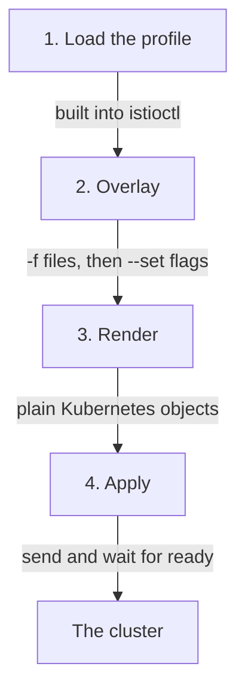

# The Render-And-Apply Pipeline

`istioctl install` looks like a command that installs software. It is closer to a drawing tool with a `kubectl apply` at the end. Astronaut, think of `istioctl` as your launch console: it draws a complete blueprint on your machine, then builds the solar system (your cluster) to match it. Every confusing thing the command does later follows from that picture.

This part shows what happens between pressing Enter and the control plane being up.

## Check your launch console first

Your playground has `istioctl` 1.30.5 installed, and no Istio in the cluster at all. Before you start, make sure the console works. The `--remote=false` flag asks only for the version of the binary on your machine, so it works even with no Istio in the cluster.

<!-- astrona:playground:renew -->

```sh
istioctl version --remote=false
```

If that prints `command not found`, the installer put the binary in your home directory instead. Run `export PATH="$HOME/.local/bin:$PATH"` and try again.

## The four stages, in order

`istioctl install` runs four stages, and only the last one touches the cluster. This section shows the stages, then the command that lets you stop before the last one.

### One real install

Here is the command you will run most often in this course:

```sh
istioctl install --set profile=demo -y
```

Four things happen, and the first three never touch the cluster:



The diagram shows that stages 1 to 3 run on your laptop. Stage 1 loads a built-in profile, stage 2 merges your files and flags on top, stage 3 turns the result into ordinary Deployments, Services, ConfigMaps, CRDs and webhooks, and only stage 4 sends them to the cluster.

### The rule behind it

**`istioctl install` is drawing on your machine, plus an apply.** The `IstioOperator` document is the blueprint: an input format, not an object that lives in the cluster and does work.

That matters more than it sounds. Older Istio versions ran an in-cluster operator. It was a controller that watched an `IstioOperator` resource and kept fixing the cluster to match it. That model is gone. No controller waits to undo a hand edit of the `istiod` Deployment. No object shows "the configuration Istio is keeping in place". If you edit an installed object by hand, your edit stays until the next `istioctl install` overwrites it.

### Print the blueprint without building

Because stage 3 produces ordinary objects, you can stop before stage 4 and read them. `istioctl manifest generate` runs stages 1 to 3 and prints the result instead of applying it:

```sh
istioctl manifest generate --set profile=demo | head -40
```

`istioctl install --dry-run` also stops before applying, but it prints a summary, not the YAML. The `-o yaml` flag that used to print the YAML was removed. `manifest generate` is the command that gives you the objects. It is the honest answer to "what is this command about to do to my cluster?", and it costs nothing.

### See it in your playground

Count how many objects one install command would create, and which kinds are the most common:

```sh
istioctl manifest generate --set profile=demo | grep -c '^kind:'
istioctl manifest generate --set profile=demo | grep '^kind:' | sort | uniq -c | sort -rn | head -6
```

Expect something like:

```text
42
     15 kind: CustomResourceDefinition
      4 kind: ServiceAccount
      3 kind: Service
      3 kind: RoleBinding
      3 kind: Role
      3 kind: Deployment
```

The exact counts change with the version and profile. The shape is the point: a "one-line install" is dozens of objects, and `istioctl` drew every one of them on your laptop before the cluster heard about it.

## Where the overlay order bites

Stage 2 merges several sources into one blueprint. For each field, the source with the highest priority wins. From lowest to highest priority:

1. The profile named by `--set profile=` or by `spec.profile` in a file. If you name none, it is `default`.
2. Any `-f <file>` documents, in the order you give them.
3. Any `--set key=value` flags, in the order you give them.


The diagram shows the order of strength: the profile is the weakest source, and `--set` flags always win.

So `istioctl install -f mine.yaml --set meshConfig.accessLogFile=/dev/stdout` uses your file, then overrides that one key. Swapping their places on the command line changes nothing. `--set` always beats `-f`, wherever it sits on the line.

The real trap is not the order. It is that a `--set` override leaves no trace. Stages 1 and 2 happen on your machine, and nothing stores the merged blueprint. Six months later the cluster shows the *result*, and nothing shows the *inputs*. That is why this course keeps the installation in a file you save and commit.

## Reading `istioctl` as a command family

`istioctl` is **istio** plus **ctl** (control), the same ending as `kubectl` and `systemctl`. Its subcommands fall into two families, and the split saves you from learning a long list.

### Install-time commands

`install`, `manifest`, `uninstall`, `x precheck` and `tag` change or inspect *what is deployed*. (`upgrade` also exists. It is another name for `install`.)

`x` is short for `experimental`: a group of subcommands whose interface Istio has not promised to keep stable. Some commands live there for years and work well. `x precheck` is the best-known example.

### Runtime inspection commands

`version`, `proxy-status`, `proxy-config`, `analyze` and `ztunnel-config` ask the *running mesh* what it thinks is true.

The split matters in practice. Only the install-time family must be the same tool that owns your cluster. The inspection family only reads, so it is safe to point at any cluster, including one installed with Helm.

## What `x precheck` actually inspects

`istioctl x precheck` is your pre-flight check of the launch pad. It only reads from the cluster's API server (the registry office where every Kubernetes object is filed). It does not check the syntax of your configuration. It asks whether *this cluster* can accept *this version* of Istio.

### What it looks at

- **The Kubernetes version**, against the range the target Istio release supports.
- **Existing Istio CRDs** (Custom Resource Definitions: new forms the registry office has learned to accept). Leftovers from an earlier install can have a schema that conflicts.
- **Existing webhook configurations.** A stale mutating webhook that points at a dead service can catch and fail the install's own pod creations.
- **Existing Istio configuration objects**, for fields the target version has deprecated or removed.
- **Cluster permissions** the install needs, such as the right to create CRDs and cluster roles.

It is fast, it changes nothing, and it catches the two failures that are hardest to undo afterwards. Always run it against a cluster you did not build yourself.

### See it in your playground

Look at the clean cluster the way precheck sees it:

```sh
kubectl get ns istio-system
kubectl api-resources --api-group=networking.istio.io
istioctl x precheck
```

Expect something like:

```text
Error from server (NotFound): namespaces "istio-system" not found
error: unable to retrieve the complete list of server APIs: networking.istio.io/v1: the server could not find the requested resource
✔ No issues found when checking the cluster. Istio is safe to install or upgrade!
```

The first two errors are the true starting state: no namespace, and no `networking.istio.io` API group because the CRDs are not installed. A passing precheck is a statement about the *cluster*: nothing is in the way.

On a cluster with history, a clean pass is rare, and the warnings are the useful part. They tell you what will break *after* you upgrade, while the old version still runs and you still have options.

## What stage 4 waits for

The apply stage does not just send the objects and leave. `istioctl install` waits until the components it created report ready. Then it prints a summary with a tick for each group of components. That has two results.

- A hung install is usually a pod that cannot be scheduled or cannot pull its image. It is rarely Istio misbehaving. While the install is still waiting, `kubectl -n istio-system get pods` tells you which pod is stuck.
- In a script, the command returning is a real sign that everything is ready. You do not need your own `kubectl wait` after it.

`-y` skips the question that asks you to confirm the install. A script needs it. At a terminal, reading that question once is a free check that you point at the cluster you meant.

`istioctl install` draws a complete blueprint on your machine and applies it, and nothing in the cluster remembers what you typed.

## Common pitfalls

> [!WARNING]
> **Expecting something in the cluster to keep your `IstioOperator` in place.** The in-cluster operator is gone. The document is an input format. Nothing watches it, and a hand edit of an installed object stays until the next `istioctl install`.
>
> **Assuming the order on the command line decides the overlay.** `--set` beats `-f` wherever it appears. Only sources of the same kind are ordered among themselves.
>
> **Letting a `--set` flag be the only record of a decision.** Stages 1 and 2 leave no trace. The cluster shows the result, never the inputs. Put the installation in a committed file.
>
> **Reaching for `istioctl install --dry-run -o yaml`.** The `-o yaml` flag was removed. `istioctl manifest generate` gives you the objects.
>
> **Reading `x precheck` as a check on your YAML.** It checks the *cluster*: the Kubernetes version, leftover CRDs, stale webhooks. It says nothing about whether your configuration is what you meant.
>
> **Treating a slow install as Istio misbehaving.** Stage 4 waits for readiness. A hang is nearly always a pod that cannot be scheduled or cannot pull an image. `kubectl -n istio-system get pods` names it while the command is still waiting.
