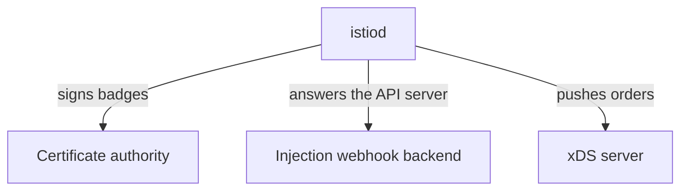

# Profiles And The Objects They Produce

The first thing `istioctl install` does is load a profile. Astronaut, a profile is a stock blueprint from the shipyard catalogue: a complete document you can read, compare and change. This part shows what a profile really is, and then the objects that come out the other end. By the end you can answer "what did that install put in my cluster?" without guessing.

## A profile is a document, not a setting

A **profile** is a named `IstioOperator` document that comes built into the `istioctl` binary. The `IstioOperator` document is the blueprint `istioctl` draws from. Picking `demo` does not switch on a mode. It picks a starting blueprint that you then change.

### The four profiles to know

Learn these four by heart:

| Profile | Installs | Typical use |
| --- | --- | --- |
| `default` | `istiod` + ingress gateway | Production starting point |
| `demo` | `istiod` + ingress **and** egress gateway, verbose telemetry | Learning and demos; not sized for production |
| `minimal` | `istiod` only | You supply gateways separately |
| `ambient` | `istiod` + `istio-cni` + `ztunnel` | Sidecar-less ambient mode |

`istiod` is mission control. The ingress gateway is the spaceport arrival gate, and the egress gateway is the departure gate.

### Print a profile instead of trusting the table

One command turns that table from something you remember into something you can check. **`istioctl manifest generate`** draws the blueprint and stops: it prints the Kubernetes objects the install *would* apply. `--set profile=<name>` prints a built-in profile, and `-f <file>` prints your own document.

Older Istio had an `istioctl profile` command family (`list`, `dump`, `diff`) that printed the merged `IstioOperator`. **Those subcommands were removed**, and `manifest generate` replaced them. If you follow material written for an older release, make that swap. The output is arguably more useful anyway: it shows the objects that will exist, not a merged YAML document.

Because the output is a list of objects, comparing two profiles is an ordinary `diff` of two outputs. Comparing only the *object names* keeps the answer to one screen.

### See it in your playground

Compare the object names of `default` and `demo`:

<!-- astrona:playground:renew -->

```sh
diff <(istioctl manifest generate --set profile=default | grep '^  name: ' | sort -u) \
     <(istioctl manifest generate --set profile=demo    | grep '^  name: ' | sort -u)
```

Expect something like:

```text
5a6,8
>   name: istio-egressgateway
>   name: istio-egressgateway-sds
>   name: istio-egressgateway-service-account
```

Three objects, all part of the egress gateway: the gateway, its secret-discovery configuration and its service account. `demo` is not a different product. It is `default` plus one component, and you can switch that component on or off yourself.

### What a wrong profile name looks like

No command lists the available profile names anymore. The release documents them, and the full release bundle ships them as YAML files under `manifests/profiles/`. The download that holds only `istioctl` does not include those files. In practice you learn the four that matter and let `istioctl` tell you when a name is wrong:

```sh
istioctl manifest generate --set profile=production
```

Expect something like:

```text
Error: merge inputs: profile "production" not found: open profiles/production.yaml: file does not exist
```

The error names the file it looked for. That shows profiles really are documents, not modes hidden in the binary. A few more exist beyond the four in the table: `empty` installs nothing and is a base for a fully hand-written document, `remote` and `external` set up a cluster whose control plane lives somewhere else, and `preview` carries features not yet in `default`.

## The control plane: one pod, three jobs

Installing `demo` produces three running workloads and two kinds of cluster-wide definition. Start with the one that matters most: `istiod`, mission control.



The diagram shows one pod doing three unrelated jobs. That is why "`istiod` is down" breaks new pods, certificate renewal and configuration pushes all at once, while existing proxies keep serving with what they already hold.

### The three jobs

**`istiod`** is a Deployment in the `istio-system` namespace, normally with one pod. That one process does three separate jobs. Name them one by one, because different failures point at different jobs:

- **xDS server.** xDS is the family of protocols Envoy uses to receive its configuration. `istiod` works out each proxy's configuration and pushes it over xDS, like mission control radioing new orders to every ship in flight. When a routing rule is applied but has no effect, this is the job you are debugging.
- **Certificate authority.** It signs the workload certificates (the ships' ID badges) that make mutual TLS (a secret handshake where both sides show a badge) possible, and it renews them on a schedule. When workloads start failing hours after an incident instead of at once, this is usually why.
- **Injection webhook backend.** The mutating webhook configuration points *at* `istiod`. This process makes the real decision about what to add to a pod.

### What happens when it is down

Because it is one process, losing `istiod` does not break traffic straight away. Proxies keep running on the last configuration they received. What stops is *change*: no new configuration, no new certificates, no injection. The mesh looks healthy right up until it is not.

## Webhooks, CRDs and gateways

The rest of the install is three kinds of object. Two of them never run anything; the third is a proxy on its own.

### The definitions

- **A mutating webhook configuration** (`istio-sidecar-injector`). It is cluster-wide. It tells the API server (the registry office) to call `istiod` before it stores certain pods. Picture a dock inspector the registry office calls before it files a new ship.
- **A validating webhook configuration** (`istio-validator-istio-system`). Also cluster-wide. It rejects badly formed Istio configuration when you apply it, so a typo in a `VirtualService` fails at once instead of being stored and quietly ignored.
- **CRDs** for `networking.istio.io`, `security.istio.io` and `telemetry.istio.io`. These are definitions, not workloads: new forms the registry office learns to accept. They teach the API server what a `VirtualService` is. Nothing runs.

### The gateways

**Gateways** come with the install if the profile includes them. An ingress or egress gateway is an ordinary Deployment running Envoy. It is the *same* proxy image that gets injected as a sidecar, deployed on its own at the edge with a Service in front of it.

That point clears up a whole kind of confusion: a gateway is not a special component. It is a pod running `istio-proxy`, configured by the same control plane over the same protocol, that sits at the border of the solar system instead of next to an app.

### See it in your playground

Install the `demo` profile, then list everything it produced:

```sh
istioctl install --set profile=demo -y
kubectl -n istio-system get deploy,svc
kubectl get crd | grep -c istio.io
kubectl get mutatingwebhookconfigurations,validatingwebhookconfigurations | grep istio
```

Expect something like:

```text
NAME                                   READY   UP-TO-DATE   AVAILABLE   AGE
deployment.apps/istio-egressgateway    1/1     1            1           62s
deployment.apps/istio-ingressgateway   1/1     1            1           62s
deployment.apps/istiod                 1/1     1            1           75s

15
mutatingwebhookconfiguration.admissionregistration.k8s.io/istio-sidecar-injector       ...
validatingwebhookconfiguration.admissionregistration.k8s.io/istio-validator-istio-system  ...
```

Three Deployments, a two-digit number of CRDs and two webhooks, all from one command, and all ordinary Kubernetes. The CRD count changes between versions; the shape does not.

## Confirming a gateway is just a proxy

The claim above is easy to check. Do it once and the rest of Istio's design makes more sense: if gateways and sidecars run the same program, everything you learn about debugging one works on the other.

### See it in your playground

Read the gateway pod's container name, its image and its Service ports:

```sh
kubectl -n istio-system get pod -l app=istio-ingressgateway \
  -o jsonpath='{.items[0].spec.containers[*].name}{"\n"}'
kubectl -n istio-system get pod -l app=istio-ingressgateway \
  -o jsonpath='{.items[0].spec.containers[0].image}{"\n"}'
kubectl -n istio-system get svc istio-ingressgateway -o jsonpath='{range .spec.ports[*]}{.name}{"\t"}{.port}{"\n"}{end}'
```

Expect something like:

```text
istio-proxy
docker.io/istio/proxyv2:1.30.5
status-port     15021
http2           80
https           443
tcp             31400
```

One container, named `istio-proxy`, running the `proxyv2` image: the same image an injected sidecar runs. Port `15021` is the health-check port that every Istio proxy opens. Ports `80` and `443` are the ones this gateway serves to the outside.

On `kind` the Service's `EXTERNAL-IP` stays `<pending>`, because there is no cloud load balancer. That is normal, and it does not stop the gateway working through node ports.

## Which components a profile switches on

A full `manifest generate` is exact but long. When the only question is "is this component on?", searching the printed object names is enough.

The `components` block of an `IstioOperator` maps one to one onto what you saw in the cluster:

| Field | What it creates |
| --- | --- |
| `components.pilot` | The `istiod` Deployment |
| `components.ingressGateways` | A list of ingress gateway Deployments |
| `components.egressGateways` | A list of egress gateway Deployments |
| `components.cni`, `components.ztunnel` | The ambient pieces |

Knowing that map lets you solve a task like "install Istio without an egress gateway" without looking anything up. The component that the `default` and `demo` comparison showed is the field you set.

A profile is a starting document you can print, compare and override, and every object in `istio-system` traces back to one line in it.

## Common pitfalls

> [!WARNING]
> **Treating a profile as a setting instead of a document.** A profile is a complete `IstioOperator`. Choosing one replaces a whole set of defaults. It does not flip one switch.
>
> **Mistyping a profile name and expecting a helpful error.** The error names the profile file it could not load, not the field you meant.
>
> **Assuming `demo` is a smaller `default`.** It is not a subset. It turns on extra components and looser settings for exploring, not for production.
>
> **Reading a gateway as something special.** It is the same Envoy program with no app beside it, reached through an ordinary Service.
>
> **Expecting removed `istioctl` subcommands to still exist.** The `istioctl profile` commands were removed. `manifest generate` is the one to use.
