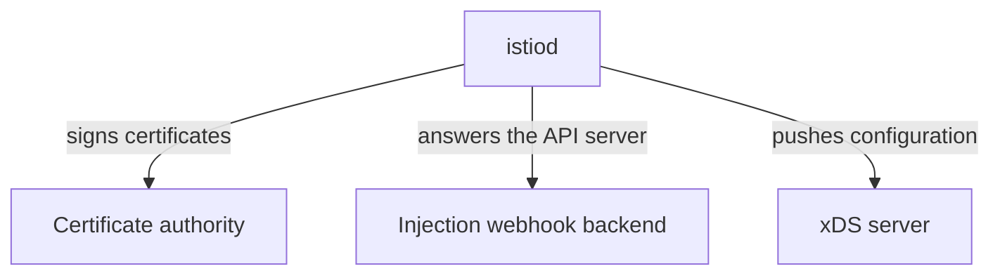

# Profiles And The Objects They Produce

The first thing `istioctl install` does is load a profile. If you do not know what a profile contains, you cannot say what an install will put in your cluster, and you cannot tell a missing component from a broken one. This part shows what a profile is, how to print it, and which objects come out of the install: the control plane, the webhooks, the CRDs and the gateways.

## A profile is a document, not a setting

A **profile** is a named `IstioOperator` document built into the `istioctl` binary. The `IstioOperator` document is the input that `istioctl install` renders into Kubernetes objects. Picking `demo` does not switch on a mode. It picks a complete starting document that you can then change.

Four profiles matter for the exam:

| Profile | Installs | Typical use |
| --- | --- | --- |
| `default` | `istiod` + ingress gateway | Production starting point |
| `demo` | `istiod` + ingress **and** egress gateway, verbose telemetry | Learning and demos; not sized for production |
| `minimal` | `istiod` only | You supply gateways separately |
| `ambient` | `istiod` + `istio-cni` + `ztunnel` | Ambient mode, without sidecars |

An ingress gateway is a proxy that accepts traffic entering the mesh from outside the cluster. An egress gateway is a proxy that traffic leaving the mesh can be sent through.

## Print a profile instead of trusting the table

The table is something you remember; one command turns it into something you can check. `istioctl manifest generate` renders the profile and stops: it prints the Kubernetes objects the install *would* apply. `--set profile=<name>` prints a built-in profile, and `-f <file>` prints your own document.

Older Istio had an `istioctl profile` command group (`list`, `dump`, `diff`) that printed the merged `IstioOperator`. **Those subcommands were removed**, and `manifest generate` replaced them. If you follow material written for an older release, make that swap. The output is more useful anyway: it shows the objects that will exist, not a merged YAML document.

Because the output is a list of objects, comparing two profiles is an ordinary `diff` of two outputs. Comparing only the *object names* keeps the answer to one screen. Compare the object names of `default` and `demo`:

<!-- astrona:playground:renew -->

```sh
diff <(istioctl manifest generate --set profile=default | grep '^  name: ' | sort -u) \
     <(istioctl manifest generate --set profile=demo    | grep '^  name: ' | sort -u)
```

The output looks like this:

```text
5a6,8
>   name: istio-egressgateway
>   name: istio-egressgateway-sds
>   name: istio-egressgateway-service-account
```

All three objects belong to the egress gateway: the gateway itself, its secret discovery (SDS) configuration and its service account. `demo` is not a different product. It is `default` plus one component, and you can turn that component on or off yourself.

No command lists the available profile names any more. The release documentation names them, and the full release bundle ships them as YAML files under `manifests/profiles/`. The download that holds only `istioctl` does not include those files. In practice you learn the four that matter and let `istioctl` tell you when a name is wrong:

```sh
istioctl manifest generate --set profile=production
```

The output looks like this:

```text
Error: merge inputs: profile "production" not found: open profiles/production.yaml: file does not exist
```

The error names the file `istioctl` looked for, which shows that profiles really are documents. A few more exist beyond the four in the table: `empty` installs nothing and is a base for a fully hand-written document, `remote` and `external` set up a cluster whose control plane runs somewhere else, and `preview` carries features not yet in `default`.

## The control plane: one pod, three jobs

Knowing what a profile asks for, you can now look at what it produces. Installing `demo` creates three running workloads and two kinds of cluster-wide definition. Start with the one that matters most, `istiod`.



The diagram shows one process doing three separate jobs.

`istiod` is a Deployment in the `istio-system` namespace, normally with one pod. Name its jobs one by one, because different failures point at different jobs:

- **xDS server.** xDS is the family of protocols Envoy uses to receive its configuration while it runs. `istiod` builds each proxy's configuration and pushes it over xDS. When a routing rule is applied but has no effect, this is the job you are debugging.
- **Certificate authority.** `istiod` signs the workload certificates that make mutual TLS (mTLS, where both sides of a connection prove their identity with a certificate) possible, and renews them on a schedule. When workloads start failing hours after an incident instead of at once, certificate renewal is usually why.
- **Injection webhook backend.** The mutating webhook configuration points *at* `istiod`. This process decides what to add to a new pod.

Because all three jobs run in one process, losing `istiod` does not stop traffic straight away. Proxies keep running on the last configuration they received. What stops is *change*: no new configuration, no new certificates, no injection into new pods. The mesh looks healthy until a pod restarts or a certificate expires.

## Webhooks, CRDs and gateways

The rest of the install is three kinds of object. Two of them never run anything; the third is a proxy of its own.

- **A mutating webhook configuration** (`istio-sidecar-injector`). It is cluster-wide. It tells the Kubernetes API server to call `istiod` before it stores certain pods, so that `istiod` can add the sidecar proxy.
- **A validating webhook configuration** (`istio-validator-istio-system`). Also cluster-wide. The API server calls it when you apply Istio configuration, and it rejects badly formed objects, so a typo in a `VirtualService` fails at once instead of being stored and ignored.
- **CRDs** for `networking.istio.io`, `security.istio.io` and `telemetry.istio.io`. These are definitions, not workloads. They teach the API server what a `VirtualService` is. Nothing runs.

**Gateways** come with the install if the profile includes them. An ingress or egress gateway is an ordinary Deployment running Envoy. It runs the *same* proxy image that is injected as a sidecar, deployed on its own at the edge of the mesh with a Service in front of it. A gateway is not a special component: it is a pod running `istio-proxy`, configured by the same control plane over the same protocol, with no application container beside it.

Now install the `demo` profile and list everything it produced:

```sh
istioctl install --set profile=demo -y
kubectl -n istio-system get deploy,svc
kubectl get crd | grep -c istio.io
kubectl get mutatingwebhookconfigurations,validatingwebhookconfigurations | grep istio
```

The output looks like this:

```text
NAME                                   READY   UP-TO-DATE   AVAILABLE   AGE
deployment.apps/istio-egressgateway    1/1     1            1           8s
deployment.apps/istio-ingressgateway   1/1     1            1           8s
deployment.apps/istiod                 1/1     1            1           20s

NAME                                  TYPE           CLUSTER-IP     EXTERNAL-IP   PORT(S)                                                                      AGE
service/istio-egressgateway           ClusterIP      10.96.72.90    <none>        80/TCP,443/TCP                                                               8s
service/istio-ingressgateway          LoadBalancer   10.96.43.134   <pending>     15021:32719/TCP,80:30818/TCP,443:32620/TCP,31400:32428/TCP,15443:30706/TCP   8s
service/istiod                        ClusterIP      10.96.1.40     <none>        15010/TCP,15012/TCP,443/TCP,15014/TCP                                        20s
service/istiod-revision-tag-default   ClusterIP      10.96.157.94   <none>        15010/TCP,15012/TCP,443/TCP,15014/TCP                                        0s
15
mutatingwebhookconfiguration.admissionregistration.k8s.io/istio-revision-tag-default   4          0s
mutatingwebhookconfiguration.admissionregistration.k8s.io/istio-sidecar-injector       4          20s
validatingwebhookconfiguration.admissionregistration.k8s.io/istio-validator-istio-system   1          20s
validatingwebhookconfiguration.admissionregistration.k8s.io/istiod-default-validator       1          0s
```

You see three Deployments, their Services, a two-digit number of CRDs and four webhook configurations, all from one command, and all ordinary Kubernetes objects. The two webhook configurations named after `default` belong to the default revision tag: `istioctl install` creates the tag `default`, and the tag gets its own copy of the webhooks and its own `istiod-revision-tag-default` Service, which points at the same `istiod` pods. The CRD count changes between versions; the kinds of object do not.

## Confirm that a gateway is just a proxy

The claim that a gateway is a plain proxy is easy to check, and it is worth checking once: if gateways and sidecars run the same program, everything you learn about debugging one works on the other. Read the gateway pod's container name, its image and its Service ports:

```sh
kubectl -n istio-system get pod -l app=istio-ingressgateway \
  -o jsonpath='{.items[0].spec.containers[*].name}{"\n"}'
kubectl -n istio-system get pod -l app=istio-ingressgateway \
  -o jsonpath='{.items[0].spec.containers[0].image}{"\n"}'
kubectl -n istio-system get svc istio-ingressgateway -o jsonpath='{range .spec.ports[*]}{.name}{"\t"}{.port}{"\n"}{end}'
```

The output looks like this:

```text
istio-proxy
registry.istio.io/release/proxyv2:1.30.5
status-port	15021
http2	80
https	443
tcp	31400
tls	15443
```

The pod has one container, named `istio-proxy`, running the `proxyv2` image: the same image an injected sidecar runs. Port `15021` is the health-check port that every Istio proxy opens. Ports `80` and `443` are the ports this gateway serves to clients outside the mesh.

On `kind` the Service's `EXTERNAL-IP` stays `<pending>`, because there is no cloud load balancer. That is normal, and the gateway still works through node ports.

## Which components a profile turns on

You have now seen every object the `demo` profile creates. Each one traces back to a field in the `components` block of the `IstioOperator` document:

| Field | What it creates |
| --- | --- |
| `components.pilot` | The `istiod` Deployment |
| `components.ingressGateways` | A list of ingress gateway Deployments |
| `components.egressGateways` | A list of egress gateway Deployments |
| `components.cni`, `components.ztunnel` | The ambient mode components |

Knowing that map lets you solve a task like "install Istio without an egress gateway" without looking anything up: the component that the `default` and `demo` comparison showed is the field you set.

You now know that a profile is a complete `IstioOperator` document that you can print, compare and override, and that the `demo` install creates `istiod`, two webhooks, the Istio CRDs and two gateways. `istiod` runs, but no application pod has a sidecar proxy yet. The open question is how a pod gets one, and how to check that every proxy runs the same version as the control plane.

## Common pitfalls

> [!WARNING]
> **Treating a profile as a setting instead of a document.** A profile is a complete `IstioOperator`. Choosing one replaces a whole set of defaults. It does not flip one switch.
>
> **Mistyping a profile name and expecting a helpful error.** The error names the profile file it could not load, not the field you meant.
>
> **Assuming `demo` is a smaller `default`.** It is not a subset. It turns on extra components and looser settings for exploring, not for production.
>
> **Reading a gateway as something special.** It is the same Envoy program with no application beside it, reached through an ordinary Service.
>
> **Expecting removed `istioctl` subcommands to still exist.** The `istioctl profile` commands were removed. `manifest generate` is the one to use.
