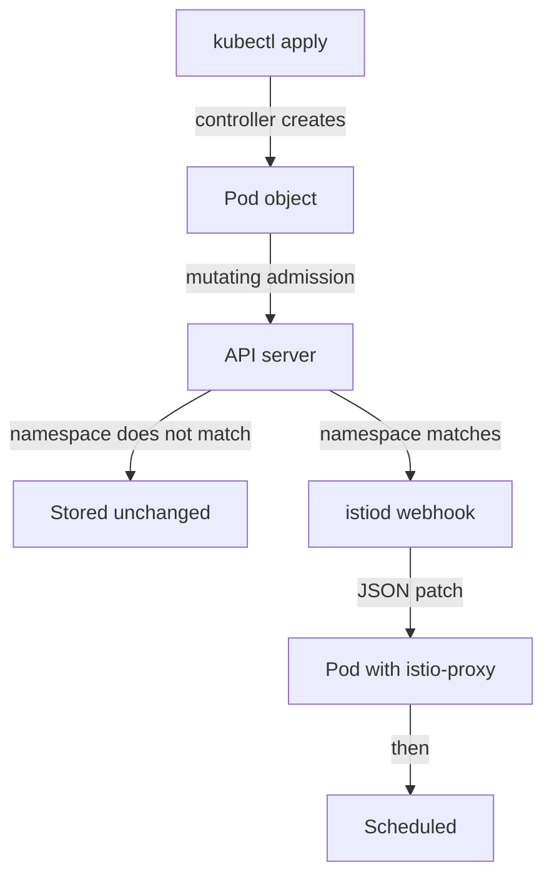
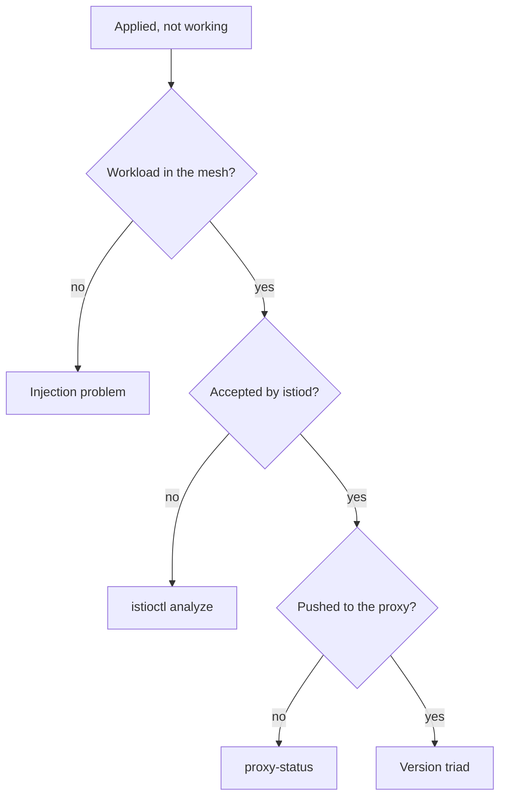

# Injection And The Version Triad

An installed control plane does nothing to your apps on its own. Astronaut, mission control is built, but no ship has a communications officer on board yet. This part covers the two things that close that gap: how a proxy gets into a pod when the pod is created, and the versions you must keep in line once proxies exist.

They share one part because they share a failure: in both cases the mesh looks fine, and your change quietly does not apply.

## The admission path, step by step

Sidecar injection is putting a communications officer (the Envoy proxy) on board each ship as it launches. It happens at one exact moment, inside the API server. This section follows one pod through that moment, then gives the two rules that come out of it.

### Follow one pod

Picture one `kubectl apply` of a Deployment in a namespace with injection switched on:



The diagram shows the path. The Deployment controller creates a Pod object. The API server checks who you are and what you may do, then runs mutating admission. If the namespace matches the webhook's selector, the API server sends the pod to `istiod`, which answers with a JSON patch that adds `istio-init` and `istio-proxy`. If it does not match, the pod is stored with no proxy, for good.

The decision happens once, inside the API server, before the pod is scheduled. Nothing looks at it again. That is the whole reason a namespace label does not change pods that already exist.

### The two rules

Two facts come out of that path, and they explain most injection questions.

**First: the webhook is called for pods, chosen by namespace.** The `namespaceSelector` on the webhook configuration is a label selector checked against the *namespace object*, not the pod. That is why the namespace label exists, and why it is the first thing to check.

**Second: this happens once, when the pod is created.** No controller watches for namespaces that become eligible later. A pod admitted without a sidecar never grows one: admission cannot rewrite an object that is already stored. The only way to change a pod's injection is to replace the pod.

### See it in your playground

Read the selector the webhook enforces. This needs Istio installed with the `demo` profile:

<!-- astrona:playground:renew -->

```sh
kubectl get mutatingwebhookconfiguration istio-sidecar-injector \
  -o jsonpath='{range .webhooks[*]}{.name}{"\n  rules: "}{.rules[0].resources}{"\n  ns-selector: "}{.namespaceSelector}{"\n\n"}{end}'
```

Expect something like:

```text
namespace.sidecar-injector.istio.io
  rules: ["pods"]
  ns-selector: {"matchExpressions":[{"key":"istio-injection","operator":"In","values":["enabled"]},...]}

object.sidecar-injector.istio.io
  rules: ["pods"]
  ns-selector: {...}
```

`rules: ["pods"]` confirms that the webhook fires on pods and nothing else: not Deployments, not ReplicaSets. The `ns-selector` is the rule the namespace must meet. There are two webhook entries. One handles the decision for the whole namespace, and the other handles overrides set on a single pod.

## Labelling, and the restart that completes it

The label that matches the default webhook is `istio-injection=enabled` on the namespace. It is a planet-wide order: every new ship launched here gets a communications officer. Adding it changes the *future*. It does nothing to ships already flying.

### See it in your playground

Label the namespace first, then create a pod:

```sh
kubectl label namespace default istio-injection=enabled
kubectl run tester --image=nginx
kubectl wait --for=condition=Ready pod/tester --timeout=120s
kubectl get pod tester -o jsonpath='{.spec.containers[*].name}{"\n"}'
```

Expect something like:

```text
namespace/default labeled
pod/tester created
pod/tester condition met
nginx istio-proxy
```

You defined a pod with one container, and it has two container names. The webhook wrote the second one into the spec between your `kubectl run` and the moment the API server stored the object. It appears in no file you wrote.

### Now the other order

Try it the other way round, because the rule sticks once you have watched it fail. Create a pod in a namespace with no label, then add the label, then look again. The pod still has one container, and it stays that way until the pod is deleted and created again.

For a real workload, `kubectl rollout restart deployment <name>` is the normal way to do that. It relaunches the ships: it replaces the pods a few at a time, not all at once, and each new pod passes through the webhook.

## Three versions, and why they drift

Once proxies exist, three Istio versions are in play. A mismatch between them causes the most misleading failure in the product: configuration you applied correctly seems to do nothing. Picture your launch console, mission control and the communications officers all running different software versions.

### The three versions

- **Client:** the `istioctl` binary in your hand. It decides what you can print and which checks you get. It changes the cluster only when you run `install`.
- **Control plane:** the image `istiod` runs. It decides what configuration is worked out and which fields are understood.
- **Data plane:** the proxy image inside each injected pod. It decides what the proxy can actually do with the configuration it receives.

### Why they drift

They drift for a reason built into the system, not through carelessness. Upgrading the control plane replaces one Deployment. Upgrading the data plane means replacing every meshed pod in the cluster. Those jobs differ in size, so they happen at different times.

Istio supports that gap across **one minor version**: a 1.30 control plane may serve 1.29 proxies, and makes no promise about 1.28 proxies.

## Reading `proxy-status`

`istioctl version` reports all three versions at once, so it is the first command to run when something behaves strangely. `istioctl proxy-status` goes further, like a roll call: it lists every proxy the control plane knows about, and whether each one has accepted the latest configuration. This section explains its columns, its values, and then shows it on your cluster.

### The columns

`CDS`, `LDS`, `EDS` and `RDS` are the xDS types: the four kinds of orders mission control sends.

| Column | Stands for | Carries |
| --- | --- | --- |
| `CDS` | Cluster Discovery Service | The groups of destinations a proxy can send to |
| `LDS` | Listener Discovery Service | The ports and filter chains the proxy accepts on |
| `EDS` | Endpoint Discovery Service | The actual pod IP addresses behind each cluster |
| `RDS` | Route Discovery Service | The HTTP routing rules |

### The values

- **`SYNCED`:** the proxy accepted the current version of that kind of order. This is the healthy state.
- **`STALE`:** `istiod` sent an update and is still waiting for the proxy to confirm it. A few seconds is normal after a change. A `STALE` that stays means the proxy is not accepting what it receives.
- **`NOT SENT`:** there is nothing of that kind to send. It is common and harmless. For example, a gateway with no `Gateway` resource attached has no routes, so `RDS` reads `NOT SENT`.

The last column, `ISTIOD`, names the control plane pod each proxy is connected to. On a cluster with one control plane it is not very interesting. During an upgrade with two control planes side by side, it is the true answer to "which mission control is serving this workload?".

### See it in your playground

Confirm that the whole mesh agrees on one version:

```sh
istioctl version
istioctl proxy-status
```

Expect something like:

```text
client version: 1.30.5
control plane version: 1.30.5
data plane version: 1.30.5 (3 proxies)

NAME                                   CLUSTER      CDS      LDS      EDS      RDS        ECDS       ISTIOD
tester.default                         Kubernetes   SYNCED   SYNCED   SYNCED   SYNCED     NOT SENT   istiod-...
istio-ingressgateway-...istio-system   Kubernetes   SYNCED   SYNCED   SYNCED   NOT SENT   NOT SENT   istiod-...
```

`data plane version: 1.30.5 (3 proxies)` is the line that matters. The gateways count as proxies, because they are proxies. When this line splits into two versions, an upgrade is in progress and not every pod has been restarted yet.

## When "applied but not working" points at which layer

Put the two halves of this part together and you get an order for checking a problem. It runs from the cheapest check to the most expensive.



The diagram shows four questions in order, and what to look at when the answer is no:

1. **Is the workload in the mesh at all?** Check the container count, or whether `proxy-status` lists it. If not, it is an injection problem. Check the namespace label, then check whether the pod is older than the label.
2. **Did the configuration reach the control plane?** Use `istioctl analyze` and `kubectl get` on the object. A rejected or badly formed object never gets further.
3. **Did the control plane push it?** Read the `proxy-status` columns. A `STALE` that stays points here.
4. **Can the proxy act on it?** Check the three versions. A 1.30 control plane can send configuration that a 1.28 proxy quietly ignores.

Most real incidents stop at step 1 or 2. Step 4 is rare, and it is almost always the tail end of an upgrade nobody finished.

Injection is decided once, when a pod is created. Versions drift because the control plane is one Deployment and the data plane is every pod.

## Common pitfalls

> [!WARNING]
> **Labelling a namespace and expecting running pods to change.** Injection is decided when the pod is created. Label first, then run `kubectl rollout restart deployment -n <namespace>`.
>
> **Reading the container count as health.** It tells you a proxy was injected, not that the proxy holds useful configuration.
>
> **Forgetting there are three versions, not one.** `istioctl`, the control plane and each sidecar can all differ, and only the data plane falls behind without telling you.
>
> **Letting the data plane trail by more than one minor version.** One minor version is the supported gap. Beyond it, a proxy may quietly ignore configuration the control plane sends.
>
> **Starting a diagnosis at the proxy.** The checking order runs cheapest first for a reason: most incidents stop at injection or at a rejected object.
