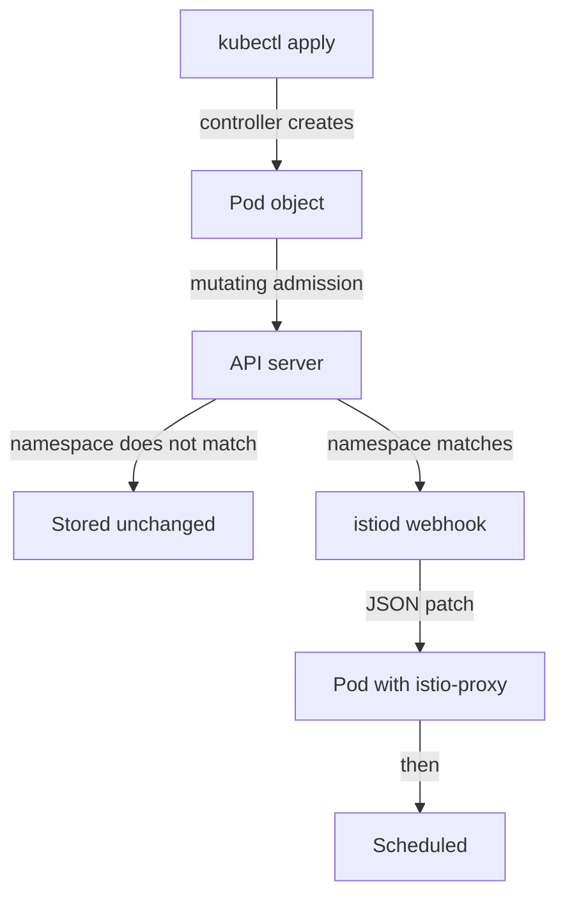
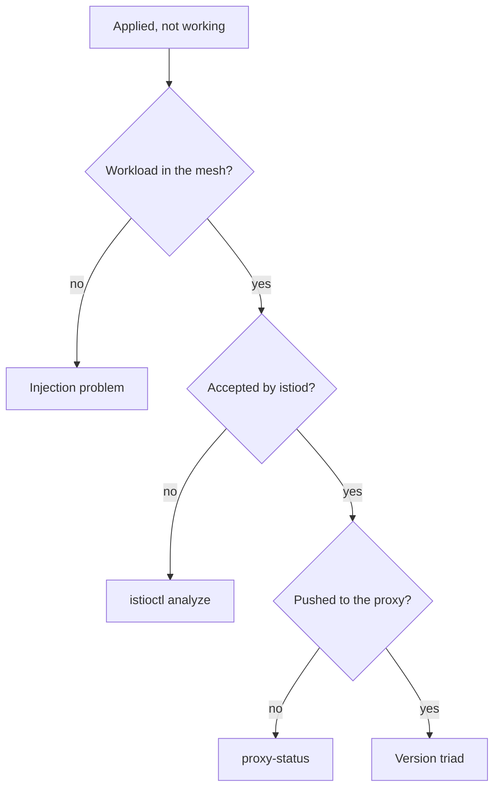

# Injection And The Version Triad

An installed control plane does nothing to your applications on its own. After the install, `istiod` runs, but no application pod has a sidecar proxy yet. A **sidecar proxy** is an Envoy container that Istio adds to a pod; all inbound and outbound traffic of the pod passes through it. This part covers how that proxy gets into a pod, and the three versions you must keep in line once proxies exist. Both topics share one failure: the mesh looks fine, and your change does not apply.

## The admission path, step by step

**Sidecar injection** is the step that adds the `istio-proxy` container to a pod. It happens at one exact moment, inside the Kubernetes API server, while the pod is being created. Follow one `kubectl apply` of a Deployment in a namespace with injection turned on:



The diagram shows the path of one new pod through the API server.

The Deployment controller creates a Pod object. The API server checks who sent it and what they may do, then runs mutating admission: it calls the webhooks that may change the object before it is stored. If the namespace matches the Istio webhook's selector, the API server sends the pod to `istiod`, and `istiod` answers with a JSON patch that adds `istio-init` and `istio-proxy`. If the namespace does not match, the API server stores the pod with no proxy, and it stays that way.

Two rules come out of that path, and they explain most injection questions. **First, the webhook is called for pods, chosen by namespace.** The `namespaceSelector` on the webhook configuration is a label selector that the API server checks against the *namespace object*, not the pod. That is why the namespace label exists, and why it is the first thing to check. **Second, this happens once, when the pod is created.** No controller watches for namespaces that become eligible later. Admission cannot rewrite an object that is already stored, so a pod admitted without a sidecar never gets one. The only way to change a pod's injection is to replace the pod.

You can read the selector the webhook uses. This needs Istio installed with the `demo` profile:

<!-- astrona:playground:renew -->

```sh
kubectl get mutatingwebhookconfiguration istio-sidecar-injector \
  -o jsonpath='{range .webhooks[*]}{.name}{"\n  rules: "}{.rules[0].resources}{"\n  ns-selector: "}{.namespaceSelector}{"\n\n"}{end}'
```

The output looks like this (shortened):

```text
namespace.sidecar-injector.istio.io
  rules: ["pods"]
  ns-selector: {"matchExpressions":[{"key":"istio-injection","operator":"In","values":["enabled"]},...]}

object.sidecar-injector.istio.io
  rules: ["pods"]
  ns-selector: {...}
```

`rules: ["pods"]` confirms that the API server calls the webhook for pods and nothing else: not Deployments, not ReplicaSets. The `ns-selector` is the rule the namespace must meet. There are two webhook entries. One handles the decision for the whole namespace, and the other handles overrides set on a single pod.

## Labelling, and the restart that completes it

The selector above tells you which label to set. The label that matches the default webhook is `istio-injection=enabled` on the namespace. It affects every pod created in that namespace *after* you set it. It does nothing to pods that already run.

Label the `default` namespace first, then create a pod in it and list its containers:

```sh
kubectl label namespace default istio-injection=enabled
kubectl run tester --image=nginx
kubectl wait --for=condition=Ready pod/tester --timeout=120s
kubectl get pod tester -o jsonpath='{.spec.containers[*].name}{"\n"}'
```

The output looks like this:

```text
namespace/default labeled
pod/tester created
pod/tester condition met
nginx istio-proxy
```

You defined a pod with one container, and it has two container names. The webhook added the second one to the spec after `kubectl run` sent the pod and before the API server stored it. It appears in no file you wrote.

The other order shows the second rule. If you create a pod in a namespace with no label, then add the label, the pod still has one container, and it keeps one container until it is deleted and created again. For a real workload, `kubectl rollout restart deployment <name>` is the normal way to do that. The Deployment controller replaces the pods a few at a time, not all at once, and each new pod passes through the webhook.

## Three versions, and why they drift

Once proxies exist, three Istio versions are in play. A mismatch between them causes a misleading failure: configuration you applied correctly seems to do nothing. The three versions are:

- **Client:** the `istioctl` binary on your machine. It decides which commands and checks you have. It changes the cluster only when you run `install`.
- **Control plane:** the image `istiod` runs. It decides which fields are understood and what configuration is built.
- **Data plane:** the proxy image inside each injected pod. It decides what the proxy can actually do with the configuration it receives.

They drift for a reason built into the system. Upgrading the control plane replaces one Deployment. Upgrading the data plane means replacing every pod in the mesh. Those jobs differ in size, so they happen at different times. Istio supports a gap of **one minor version**: a 1.30 control plane may serve 1.29 proxies, and makes no promise about 1.28 proxies.

## Reading istioctl version and proxy-status

Two commands show whether the three versions agree. `istioctl version` reports all three at once, so it is the first command to run when something behaves strangely. `istioctl proxy-status` goes further: it lists every proxy `istiod` knows about, and whether each one has accepted the latest configuration.

The columns `CDS`, `LDS`, `EDS` and `RDS` are the four main xDS types that `istiod` sends:

| Column | Stands for | Carries |
| --- | --- | --- |
| `CDS` | Cluster Discovery Service | The groups of destinations (Envoy clusters) a proxy can send to |
| `LDS` | Listener Discovery Service | The ports and filter chains the proxy accepts traffic on |
| `EDS` | Endpoint Discovery Service | The pod IP addresses behind each cluster |
| `RDS` | Route Discovery Service | The HTTP routing rules |

Each column holds one of three values. `SYNCED` means the proxy accepted the current version of that type; this is the healthy state. `STALE` means `istiod` sent an update and is still waiting for the proxy to confirm it. A few seconds is normal after a change, but a `STALE` that stays means the proxy is not accepting what it receives. `NOT SENT` means there is nothing of that type to send. It is common and harmless: for example, a gateway with no `Gateway` resource attached has no routes, so its `RDS` reads `NOT SENT`.

The `ISTIOD` column names the `istiod` pod each proxy is connected to. On a cluster with one control plane it adds little. During an upgrade with two control planes side by side, it answers the question "which control plane serves this workload?".

Now confirm that the whole mesh runs one version:

```sh
istioctl version
istioctl proxy-status
```

The output looks like this (shortened):

```text
client version: 1.30.5
control plane version: 1.30.5
data plane version: 1.30.5 (3 proxies)

NAME                                   CLUSTER      CDS      LDS      EDS      RDS        ECDS       ISTIOD
tester.default                         Kubernetes   SYNCED   SYNCED   SYNCED   SYNCED     NOT SENT   istiod-...
istio-ingressgateway-...istio-system   Kubernetes   SYNCED   SYNCED   SYNCED   NOT SENT   NOT SENT   istiod-...
```

`data plane version: 1.30.5 (3 proxies)` is the line that matters. The two gateways count as proxies, because they are proxies, and `tester` is the third. When this line shows two versions, an upgrade is in progress and not every pod has been restarted yet.

## Where "applied but not working" points

Put injection and versions together and you get an order for checking a problem, from the cheapest check to the most expensive:



The diagram shows four questions in order, and where to look when the answer is no.

1. **Is the workload in the mesh at all?** Check the container count, or whether `proxy-status` lists it. If not, it is an injection problem: check the namespace label, then check whether the pod is older than the label.
2. **Did `istiod` accept the configuration?** Use `istioctl analyze` and `kubectl get` on the object. A rejected or badly formed object never gets further.
3. **Did `istiod` push it?** Read `proxy-status`. A `STALE` that stays points here.
4. **Can the proxy act on it?** Check the three versions. A 1.30 control plane can send configuration that a 1.28 proxy ignores.

Most real incidents stop at step 1 or 2. Step 4 is rare, and it is almost always the end of an upgrade nobody finished.

You now know that the API server calls the injection webhook once, when a pod is created, and only for namespaces that carry the right label. You also know that the client, the control plane and the data plane each have a version, and that `istioctl version` and `istioctl proxy-status` show whether they agree. The open question is what happens to all of this when you run `istioctl install` a second time, or remove Istio.

## Common pitfalls

> [!WARNING]
> **Labelling a namespace and expecting running pods to change.** Injection is decided when the pod is created. Label first, then run `kubectl rollout restart deployment -n <namespace>`.
>
> **Reading the container count as health.** It tells you a proxy was injected, not that the proxy holds useful configuration.
>
> **Forgetting there are three versions, not one.** `istioctl`, the control plane and each sidecar can all differ, and only the data plane falls behind without telling you.
>
> **Letting the data plane trail by more than one minor version.** One minor version is the supported gap. Beyond it, a proxy may ignore configuration the control plane sends.
>
> **Starting a diagnosis at the proxy.** The checking order runs cheapest first for a reason: most incidents stop at injection or at a rejected object.

## Your mission: Install Istio With istioctl Lab

You can now install Istio with a profile, list what the install created, bring a workload into the mesh and check that the versions agree. The lab asks you to install a `demo` control plane on an empty cluster, bring an already-running workload into the mesh, and prove that the control plane and the data plane run the same version.

The lab runs on its own cluster, so first pause your playground. Nothing in it is lost:

```sh
astrona stop ats-013-playground-010-01
```

Then start the lab. The task is on the next page; solve it on your own first:

```sh
astrona run --git ssh://git@github.com/astrona-io/ATS013.git -c sections/section-010/module-01/labs/lab-01
```

When you think you are done, send it for grading:

```sh
astrona submit -c sections/section-010/module-01/labs/lab-01
```

When the lab is done, remove it and start your playground again:

```sh
astrona destroy ats-013-lab-010-01
astrona start ats-013-playground-010-01
```
