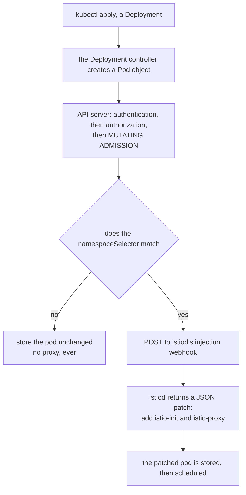
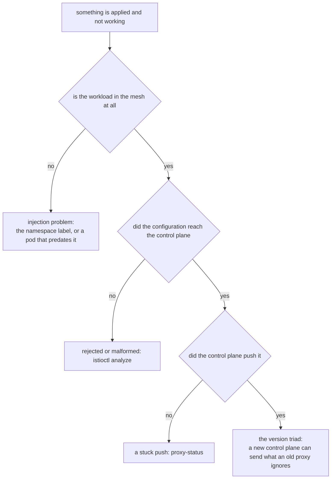

# Part 3 — Injection And The Version Triad

> Prerequisite: [Part 2 — Profiles And The Objects They Produce](./course-02-profiles-and-installed-objects.md). Next: [Part 4 — Reconciliation And Clean Removal](./course-04-reconciliation-and-removal.md).

An installed control plane does nothing to your applications. This part covers the two things that close that gap: the admission-time mechanism that puts a proxy into a pod, and the version relationships you have to keep aligned once proxies exist. They are together in one part because they share a failure mode — in both cases the mesh looks fine and your change quietly does not apply.

## The admission path, step by step

Trace one `kubectl apply` of a Deployment in an injection-enabled namespace:



The decision happens once, inside the API server, before the pod is ever scheduled. Nothing revisits it afterwards — which is the whole reason a namespace label does not change pods that already exist.


Two structural facts fall out of that diagram, and between them they explain most injection questions.

**First: the webhook is called for pods, selected by namespace.** The `namespaceSelector` on the webhook configuration is a label selector evaluated against the *namespace object*, not the pod. That is the mechanical reason the namespace label exists and why it is the first thing to check.

**Second: this happens once, when the pod is created.** There is no controller watching for namespaces that became eligible later. A pod admitted without a sidecar will never grow one — admission cannot retroactively rewrite an object that is already stored. The only way to change a pod's injection status is to replace the pod.

> [!TIP]
> **Try it — read the selector the webhook enforces**
>
> ```sh
> kubectl get mutatingwebhookconfiguration istio-sidecar-injector \
>   -o jsonpath='{range .webhooks[*]}{.name}{"\n  rules: "}{.rules[0].resources}{"\n  ns-selector: "}{.namespaceSelector}{"\n\n"}{end}'
> ```
>
> Expect something like:
>
> ```text
> namespace.sidecar-injector.istio.io
>   rules: ["pods"]
>   ns-selector: {"matchExpressions":[{"key":"istio-injection","operator":"In","values":["enabled"]},...]}
>
> object.sidecar-injector.istio.io
>   rules: ["pods"]
>   ns-selector: {...}
> ```
>
> `rules: ["pods"]` confirms the webhook fires on pods and nothing else — not Deployments, not ReplicaSets. The `ns-selector` is the contract the namespace has to satisfy. There are two webhook entries because one handles the namespace-level decision and the other handles pod-level overrides, which section 020's injection module takes apart in detail.

## Labelling, and the restart that completes it

The label that satisfies the default webhook is `istio-injection=enabled` on the namespace. Adding it changes the *future*; it does nothing to what is already running.

> [!TIP]
> **Try it — label first, then create**
>
> ```sh
> kubectl label namespace default istio-injection=enabled
> kubectl run tester --image=nginx
> kubectl wait --for=condition=Ready pod/tester --timeout=120s
> kubectl get pod tester -o jsonpath='{.spec.containers[*].name}{"\n"}'
> ```
>
> Expect something like:
>
> ```text
> namespace/default labeled
> pod/tester created
> pod/tester condition met
> nginx istio-proxy
> ```
>
> Two container names for a pod you defined with one. The second was written into the spec between your `kubectl run` and the API server storing the object — it appears in no manifest you wrote.

Now do it in the other order, because the rule is much stickier once you have watched it fail. Create a pod in a namespace with no label, then add the label, then look again: still one container, and it will stay that way until the pod is deleted and recreated. `kubectl rollout restart deployment <name>` is the normal way to force that for a real workload, since it replaces pods gradually rather than all at once.

## Three versions, and why they drift

Once proxies exist there are three Istio versions in play, and a mismatch between them produces the most misleading failure in the product: configuration you applied correctly appears to do nothing.

- **Client** — the `istioctl` binary in your hand. Affects what you can render and what diagnostics you get; affects the cluster only when you run `install`.
- **Control plane** — the image `istiod` is running. Decides what configuration is computed and what API fields are understood.
- **Data plane** — the proxy image inside each injected pod. Decides what the proxy can actually do with the configuration it receives.

They drift for a structural reason, not carelessness: upgrading the control plane replaces one Deployment, while upgrading the data plane means replacing every meshed pod in the cluster. Those are different-sized operations, so they happen at different times. Istio supports that gap across **one minor version** — a 1.30 control plane may serve 1.29 proxies, and makes no promise about 1.28 ones. Section 030 works through the consequences.

## Reading `proxy-status`

`istioctl version` reports all three versions at once, which makes it the first command to run when something behaves strangely. `istioctl proxy-status` goes further: it lists every proxy the control plane knows about and whether each has acknowledged the latest configuration.

Read it by its columns. `CDS`, `LDS`, `EDS` and `RDS` are Envoy's xDS resource types:

| Column | Expands to | Carries |
| --- | --- | --- |
| `CDS` | **C**luster **D**iscovery **S**ervice | Upstream groups a proxy can send to |
| `LDS` | **L**istener **D**iscovery **S**ervice | Ports and filter chains the proxy accepts on |
| `EDS` | **E**ndpoint **D**iscovery **S**ervice | The actual pod IPs behind each cluster |
| `RDS` | **R**oute **D**iscovery **S**ervice | HTTP routing rules |

The values mean:

- **`SYNCED`** — the proxy acknowledged the current version of that resource type. This is the healthy state.
- **`STALE`** — `istiod` sent an update and is still waiting for the acknowledgement. A few seconds is normal after a change; a persistent `STALE` means the proxy is not accepting what it is being sent.
- **`NOT SENT`** — there is nothing of that type to send. Common and harmless: a gateway with no `Gateway` resource attached has no routes, so `RDS` reads `NOT SENT`.

The last column, `ISTIOD`, names the control plane pod each proxy is connected to. On a single-control-plane cluster it is uninteresting. During a canary upgrade it is the authoritative answer to "which control plane is serving this workload?", and section 030's canary module leans on it heavily.

> [!TIP]
> **Try it — confirm the whole mesh agrees**
>
> ```sh
> istioctl version
> istioctl proxy-status
> ```
>
> Expect something like:
>
> ```text
> client version: 1.30.5
> control plane version: 1.30.5
> data plane version: 1.30.5 (3 proxies)
>
> NAME                                   CLUSTER      CDS      LDS      EDS      RDS        ECDS       ISTIOD
> tester.default                         Kubernetes   SYNCED   SYNCED   SYNCED   SYNCED     NOT SENT   istiod-...
> istio-ingressgateway-...istio-system   Kubernetes   SYNCED   SYNCED   SYNCED   NOT SENT   NOT SENT   istiod-...
> ```
>
> `data plane version: 1.30.5 (3 proxies)` is the line that matters, and note that the gateways are counted as proxies — they are, as Part 2 showed. When this line splits into two versions, you are mid-upgrade and have not restarted everything yet.

## When "applied but not working" is which layer

Putting the two halves of this part together gives a diagnostic order that is worth internalising, because it goes from cheapest to most expensive:



1. **Is the workload in the mesh at all?** Container count, or `proxy-status` listing it. If not, it is an injection problem — check the namespace label, then check whether the pod predates it.
2. **Did the configuration reach the control plane?** `istioctl analyze` and the relevant object's `kubectl get`. A rejected or malformed object never gets further.
3. **Did the control plane push it?** `proxy-status` columns. Persistent `STALE` points here.
4. **Can the proxy act on it?** The version triad. A 1.30 control plane can send a proxy configuration that a 1.28 proxy silently ignores.

Most real incidents stop at step 1 or 2. Step 4 is rare and is almost always the tail of an upgrade nobody finished.

## Common pitfalls

> [!WARNING]
> **Labelling a namespace and expecting running pods to change.** Injection is an admission-time decision. Label first, then `kubectl rollout restart deployment -n <namespace>`.
>
> **Reading the container count as health.** It tells you a proxy was injected, not that it holds useful configuration.
>
> **Forgetting there are three versions, not one.** `istioctl`, the control plane and each sidecar can all differ, and only the data plane lags silently.
>
> **Letting the data plane trail by more than one minor version.** That is the supported skew; beyond it, a proxy may quietly ignore configuration the control plane sends.
>
> **Starting a diagnosis at the proxy.** The ordered list above is cheapest-first for a reason: most incidents stop at injection or at a rejected object.

> *Injection is decided once, at pod creation; versions drift because the control plane is one Deployment and the data plane is every pod.*

## Reference

- [Installing the sidecar](https://istio.io/v1.30/docs/setup/additional-setup/sidecar-injection/) — the full injection decision, including the pod-level overrides section 020 covers.
- [Kubernetes dynamic admission control](https://kubernetes.io/docs/reference/access-authn-authz/extensible-admission-controllers/) — how mutating webhooks work in general, which is all Istio is using.
- [Istio's xDS and proxy-status](https://istio.io/v1.30/docs/ops/diagnostic-tools/proxy-cmd/) — reading `proxy-status` and `proxy-config` output.
- [Supported version skew](https://istio.io/v1.30/docs/releases/supported-releases/) — the one-minor-version rule stated by the project.
