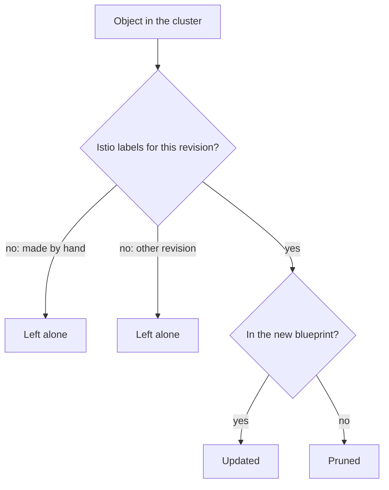

# Reconciliation And Clean Removal

`istioctl install` draws a complete blueprint and makes the cluster match it. Astronaut, that has a sharp edge: anything the new blueprint does not show gets taken down. This part covers what happens when you run the install a *second* time with different input, how Istio decides which existing objects to delete, and what `uninstall` does and does not remove.

Every item here follows from the word "declarative" (you describe the end state, and the tool makes it so), and every item is a real incident someone has had.

## The second install is not an addition

A second `istioctl install` does not add to the first one. It replaces the blueprint. This section shows that with whole components, then states the rule.

### One real case

Install `demo`, then install `minimal` on top of it. `minimal` draws a document with `istiod` and no gateways. Making the cluster match that document means the gateway Deployments are **deleted**.

### The rule

**`istioctl install` makes the cluster match the document you pass. Components that were only in the previous document are removed.** Nothing warns you beyond the install summary. From Istio's point of view, you asked for `minimal`, and `minimal` is what you got.

This goes beyond whole components, down to single fields. Say you set `meshConfig.accessLogFile` last time and leave it out this time. It does not keep its value. It goes back to whatever the profile says, which usually means the default. The component case is easier to see, so start there.

### See it in your playground

This changes the cluster: it deletes both gateway Deployments. On the playground that is the point. On a real cluster it would cut off incoming traffic. It needs Istio installed with the `demo` profile.

<!-- astrona:playground:renew -->

```sh
kubectl -n istio-system get deploy
istioctl install --set profile=minimal -y
kubectl -n istio-system get deploy
```

Expect something like:

```text
NAME                   READY   UP-TO-DATE   AVAILABLE   AGE
istio-egressgateway    1/1     1            1           8m
istio-ingressgateway   1/1     1            1           8m
istiod                 1/1     1            1           8m

✔ Istio core installed
✔ Istiod installed
✔ Installation complete

NAME     READY   UP-TO-DATE   AVAILABLE   AGE
istiod   1/1     1            1           8m
```

Two Deployments are gone, and the only sign was a *missing* line, "Ingress gateways installed", in the summary. Look at `istiod`'s `AGE`: it did not reset. `istioctl` updated the object it already owned instead of creating it again.

## How Istio knows what to prune

Deleting things you did not mention is only safe if Istio can tell its own objects from yours. Pruning means deleting the objects that are no longer in the blueprint. Istio does it with ownership labels that the install writes onto every object it creates.

### The ownership labels

The key label is `install.operator.istio.io/owning-resource`. Next to it, `operator.istio.io/component` names the component an object belongs to, and `istio.io/rev` names the revision that owns it. A revision is a named mission control, so two can run side by side.

On each install, `istioctl` draws the new set of objects. It lists the existing objects that carry its ownership labels for that revision. Then it deletes the ones that are no longer in the new set.



The diagram shows how one object is judged. Only objects with Istio's ownership labels for this revision can be updated or pruned. Objects you made by hand, and objects that belong to another revision, are always left alone.

### Three results of that check

- **Objects you created by hand are never pruned.** A `VirtualService` you applied has none of these labels, so the install ignores it completely. Install-time reconciliation only touches install-time objects.
- **Pruning stays inside one revision.** An install of revision `1-30-5` does not prune objects owned by the default revision. That is exactly what lets two control planes live side by side during an upgrade: neither one's install can see the other's objects.
- **Hand edits to installed objects are quietly undone.** If you `kubectl edit` the `istiod` Deployment, nothing undoes it straight away, because no operator runs in the cluster. But the next `istioctl install` draws the object from the document and overwrites your change. The edit survives exactly until someone runs the install again, which is the worst possible length of time.

### See it in your playground

Read the ownership labels on `istiod`:

```sh
kubectl -n istio-system get deploy istiod -o jsonpath='{.metadata.labels}{"\n"}' | tr ',' '\n' | grep -E 'operator|rev'
```

Expect something like:

```text
"install.operator.istio.io/owning-resource":"unknown"
"operator.istio.io/component":"Pilot"
"istio.io/rev":"default"
```

`component: Pilot` is the control plane under its old name, and `istio.io/rev: default` is what keeps pruning inside one revision. The exact label values change between versions. What matters is that they exist: they are the marks that let `istioctl` manage an object.

## Removing one revision, or all of it

`istioctl uninstall` has two modes, and the difference is serious.

### The two modes

- **`istioctl uninstall --revision <name>`** removes one named control plane and the objects labelled for it. Everything else survives, including the CRDs and any other revision. You use it to retire an old revision after an upgrade with two control planes. It is the normal case.
- **`istioctl uninstall --purge`** demolishes every Istio building, foundations included: **every** revision and all cluster-wide Istio resources, CRDs too. You use it to get back to a truly clean cluster. In the middle of an upgrade it is a mistake, because it takes the new control plane with the old one.

Neither mode removes the `istio-system` namespace itself, and neither removes the injection label from namespaces you opted in. So a full cleanup takes three commands, not one.

> [!TIP]
> When two control planes are running and you want to retire one, always name it, for example `istioctl uninstall --revision default -y`. `--purge` means "every revision", and the new control plane is a revision too.

## What survives an uninstall

Removing Istio is less complete than it looks. Each leftover has a reason.

### The leftovers

- **CRDs stay unless you use `--purge`.** They are cluster-wide and shared by all revisions. Removing them in a single-revision uninstall would break the revisions still running.
- **Namespace labels stay.** `istio-injection=enabled` sits on *your* namespace object, which Istio does not own. It goes quiet, because the webhook it pointed at is gone. It wakes up again the moment someone installs Istio again.
- **Existing pods keep their sidecars.** Injection happened when each pod was created, and the container is part of the stored pod spec. Those proxies keep running with no control plane to talk to: no configuration updates, and no certificate renewal when the current certificate expires.
- **Your Istio configuration objects stay** until the CRDs go, and become unreadable when they do.

The third leftover matters most in practice. A pod with an orphaned sidecar does not look broken. It serves traffic with its last configuration, right up until a certificate expires or the workload restarts into a cluster with no injector.

### See it in your playground

Remove everything, then check what is really gone and what is not:

```sh
istioctl uninstall --purge -y
kubectl delete namespace istio-system --ignore-not-found
kubectl api-resources --api-group=networking.istio.io
kubectl get ns default --show-labels
kubectl get pod tester -o jsonpath='{.spec.containers[*].name}{"\n"}'
```

Expect something like:

```text
All Istio resources will be pruned from the cluster
...
namespace "istio-system" deleted
error: unable to retrieve the complete list of server APIs: networking.istio.io/v1: the server could not find the requested resource

NAME      STATUS   AGE   LABELS
default   Active   41m   istio-injection=enabled,kubernetes.io/metadata.name=default

nginx istio-proxy
```

The CRDs really are gone: you get the same error as on a cluster that never had Istio. But the namespace still has its label, and `tester` still has a sidecar with nothing to talk to. Finish the job with `kubectl label namespace default istio-injection-` and `kubectl delete pod tester`.

## Making the install repeatable

Everything above points to one habit, so here it is as a rule: **the installation is a file, committed, and passed with `-f` on every run.** That gives you a document to compare before you apply it, a set of objects to review with `istioctl manifest generate -f`, and a clear answer to what the cluster should look like.

`--set` is fine for a quick experiment that you will throw away.

Reconciliation deletes what your new document leaves out, and uninstall leaves more behind than it removes. Both follow from "declarative", and both surprise people exactly once.

## Common pitfalls

> [!WARNING]
> **"The second install added `minimal` on top of `demo`."** It did not. Reconciliation removes components the new document does not contain. Keep one `IstioOperator` file as the single source of truth and pass it every time.
>
> **`--set` flags as the record of the installation.** They live in your shell history and nowhere else, and the cluster shows the result, not the inputs. Commit a file.
>
> **Hand-editing an installed object.** It works until the next install, then quietly reverts. Change the document instead.
>
> **`istioctl uninstall` without `--purge`, expecting a clean cluster.** The CRDs stay. The next install starts on top of old definitions, which is exactly what `x precheck` warns about.
>
> **`--purge` in the middle of an upgrade.** It removes every revision, the new one included.
>
> **Assuming uninstall removes sidecars.** It does not. Existing pods keep the proxy container until they are created again.
>
> **`istioctl` and Helm both owning one cluster.** Two tools making the cluster match two different sets of ownership labels means changes that revert at random. Pick one method per cluster.

## Your mission: Install Istio With istioctl

You can now install Istio with a profile, list what the install created, bring a workload into the mesh and check that the versions agree. Now prove it in a graded mission: install a `demo` control plane on an empty cluster, bring a running workload into the mesh, and show that the control plane and data plane run the same version.

The mission runs in its own training solar system, so first pause your playground. Nothing in it is lost:

```sh
astrona stop ats-013-playground-010-01
```

Then start the mission:

```sh
astrona run --git ssh://git@github.com/astrona-io/ATS013.git -c sections/section-010/module-01/labs/lab-01
```

Read the task in [`question.md`](./labs/lab-01/question.md) and solve it on your own first. When you think you are done, send it for grading:

```sh
astrona submit -c sections/section-010/module-01/labs/lab-01
```

When the mission is done, remove it and wake your playground up again:

```sh
astrona destroy ats-013-lab-010-01
astrona start ats-013-playground-010-01
```
