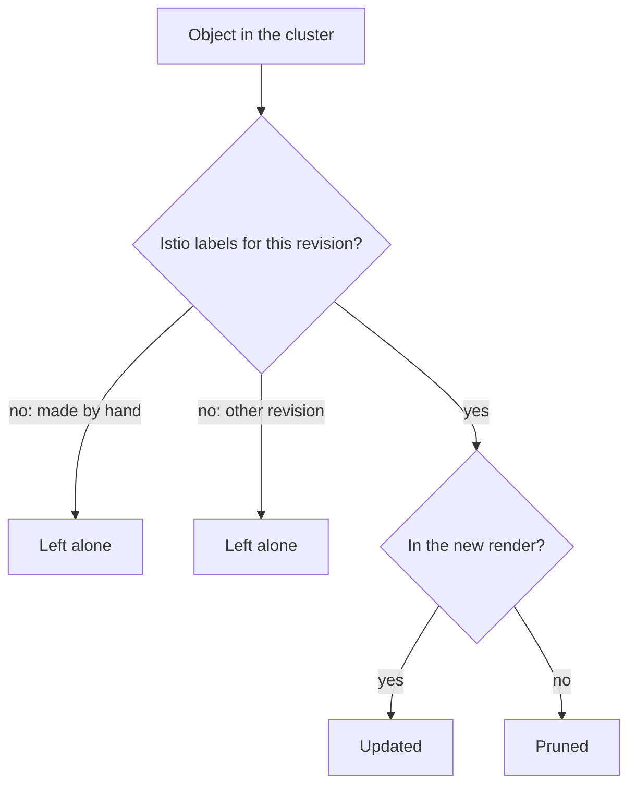

# Reconciliation And Clean Removal

`istioctl install` renders a complete set of objects and makes the cluster match it. That has a sharp edge: anything the new render does not contain is removed. This part covers what happens when you run the install a *second* time with different input, how `istioctl` decides which existing objects to delete, and what `istioctl uninstall` does and does not remove. Each point follows from the word "declarative" (you describe the end state, and the tool makes it so), and each one is a mistake people make on real clusters.

## The second install is not an addition

A second `istioctl install` does not add to the first one. It replaces the whole install with the new document. The clearest example uses whole components: install `demo`, then install `minimal` on top of it. `minimal` renders `istiod` and no gateways. Making the cluster match that render means `istioctl` **deletes** the gateway Deployments.

The rule is: **`istioctl install` makes the cluster match the document you pass. Components that were only in the previous document are removed.** Nothing warns you except the install summary. From the point of view of `istioctl`, you asked for `minimal`, and `minimal` is what you got.

The same rule applies to single fields. Say you set `meshConfig.accessLogFile` last time and leave it out this time. It does not keep its value. It goes back to whatever the profile says, which usually means the default. The component case is easier to see, so run it.

This step changes the cluster: it deletes both gateway Deployments. On the playground that is the point; on a real cluster it would cut off incoming traffic. It needs Istio installed with the `demo` profile.

<!-- astrona:playground:renew -->

```sh
kubectl -n istio-system get deploy
istioctl install --set profile=minimal -y
kubectl -n istio-system get deploy
```

The output looks like this:

```text
NAME                   READY   UP-TO-DATE   AVAILABLE   AGE
istio-egressgateway    1/1     1            1           8m
istio-ingressgateway   1/1     1            1           8m
istiod                 1/1     1            1           8m

✔ Istio core installed
✔ Istiod installed
✔ Installation complete

NAME     READY   UP-TO-DATE   AVAILABLE   AGE
istiod   1/1     1            1           8m
```

Two Deployments are gone, and the only sign in the summary was a *missing* line, "Ingress gateways installed". Look at the `AGE` of `istiod`: it did not reset. `istioctl` updated the object it already owned instead of creating it again.

## How istioctl knows what to prune

Deleting objects you did not mention is only safe if `istioctl` can tell its own objects from yours. **Pruning** means deleting the objects that are no longer in the render. `istioctl` does it with ownership labels that the install writes onto every object it creates.

The key label is `install.operator.istio.io/owning-resource`. Next to it, `operator.istio.io/component` names the component an object belongs to, and `istio.io/rev` names the revision that owns it. A **revision** is a named control plane installation, so that two control planes can run side by side.

On each install, `istioctl` renders the new set of objects. It lists the existing objects that carry its ownership labels for that revision. Then it deletes the ones that are no longer in the new set:



The diagram shows how `istioctl` judges one object: only objects with its ownership labels for this revision can be updated or pruned.

Three results follow from that check. First, **objects you created by hand are never pruned.** A `VirtualService` you applied has none of these labels, so the install ignores it. Second, **pruning stays inside one revision.** An install of revision `1-30-5` does not prune objects owned by the default revision. That is what lets two control planes run side by side during an upgrade: neither install touches the other's objects. Third, **hand edits to installed objects are undone later.** If you `kubectl edit` the `istiod` Deployment, nothing undoes it straight away, because no operator runs in the cluster. But the next `istioctl install` renders the object from the document and overwrites your change, so the edit lasts only until someone runs the install again.

Read the ownership labels on `istiod`:

```sh
kubectl -n istio-system get deploy istiod -o jsonpath='{.metadata.labels}{"\n"}' | tr ',' '\n' | grep -E 'operator|rev'
```

The output looks like this:

```text
"install.operator.istio.io/owning-resource":"unknown"
"operator.istio.io/component":"Pilot"
"istio.io/rev":"default"
```

`Pilot` is the older name of the control plane component, and `istio.io/rev: default` is the label that keeps pruning inside one revision. The exact label values change between versions. What matters is that they exist: they are what lets `istioctl` manage an object.

## Removing one revision, or all of it

Pruning removes parts of an install; `istioctl uninstall` removes a whole install. It has two modes, and choosing the wrong one can take down a running control plane.

**`istioctl uninstall --revision <name>`** removes one named control plane and the objects labelled for it. Everything else stays, including the CRDs and any other revision. You use it to retire an old revision after an upgrade with two control planes. It is the normal case.

**`istioctl uninstall --purge`** removes **every** revision and all cluster-wide Istio resources, CRDs included. You use it to get back to a fully clean cluster. In the middle of an upgrade it is a mistake, because it removes the new control plane together with the old one.

Neither mode removes the `istio-system` namespace itself, and neither removes the injection label from namespaces you opted in. So a full cleanup takes three commands, not one.

> [!TIP]
> When two control planes are running and you want to retire one, always name it, for example `istioctl uninstall --revision default -y`. `--purge` means "every revision", and the new control plane is a revision too.

## What survives an uninstall

Even `--purge` removes less than it seems to. Each leftover has a reason:

- **CRDs stay unless you use `--purge`.** They are cluster-wide and shared by all revisions. Removing them in a single-revision uninstall would break the revisions still running.
- **Namespace labels stay.** `istio-injection=enabled` sits on *your* namespace object, which Istio does not own. It has no effect while the webhook is gone, and it takes effect again as soon as someone installs Istio again.
- **Existing pods keep their sidecars.** Injection happened when each pod was created, and the container is part of the stored pod spec. Those proxies keep running with no control plane: no configuration updates, and no certificate renewal when the current certificate expires.
- **Your Istio configuration objects stay** until the CRDs are removed, and are deleted with them.

The third leftover matters most in practice. A pod with a sidecar and no control plane does not look broken. It serves traffic with its last configuration until a certificate expires or the workload restarts into a cluster with no injection webhook.

Remove everything, then check what is really gone and what is not:

```sh
istioctl uninstall --purge -y
kubectl delete namespace istio-system --ignore-not-found
kubectl api-resources --api-group=networking.istio.io
kubectl get ns default --show-labels
kubectl get pod tester -o jsonpath='{.spec.containers[*].name}{"\n"}'
```

The output looks like this (shortened):

```text
All Istio resources will be pruned from the cluster
...
namespace "istio-system" deleted
error: unable to retrieve the complete list of server APIs: networking.istio.io/v1: the server could not find the requested resource

NAME      STATUS   AGE   LABELS
default   Active   41m   istio-injection=enabled,kubernetes.io/metadata.name=default

nginx istio-proxy
```

The CRDs really are gone: you get the same error as on a cluster that never had Istio. But the `default` namespace still has its label, and the `tester` pod still has a sidecar with no control plane to connect to. Finish the cleanup with `kubectl label namespace default istio-injection-` and `kubectl delete pod tester`.

## Making the install repeatable

Everything in this part points to one habit: **keep the installation in a file, commit it, and pass it with `-f` on every run.** That gives you a document to compare before you apply it, a set of objects to review with `istioctl manifest generate -f`, and a clear answer to what the cluster should contain. `--set` is fine for a quick experiment that you will throw away.

You now know that a second `istioctl install` makes the cluster match the new document and prunes the objects it owns that are no longer in it, and that the ownership labels keep hand-made objects and other revisions safe. You also know that `uninstall --revision` removes one control plane, `uninstall --purge` removes all of them with the CRDs, and that namespace labels and existing sidecars survive both. The open question is how the same install looks when Helm owns it instead of `istioctl`.

## Common pitfalls

> [!WARNING]
> **"The second install added `minimal` on top of `demo`."** It did not. The install removes components the new document does not contain. Keep one `IstioOperator` file as the single source of truth and pass it every time.
>
> **`--set` flags as the record of the installation.** They live in your shell history and nowhere else, and the cluster shows the result, not the inputs. Commit a file.
>
> **Hand-editing an installed object.** It works until the next install, then the install overwrites it. Change the document instead.
>
> **`istioctl uninstall` without `--purge`, expecting a clean cluster.** The CRDs stay. The next install starts on top of old definitions, which is exactly what `x precheck` warns about.
>
> **`--purge` in the middle of an upgrade.** It removes every revision, the new one included.
>
> **Assuming uninstall removes sidecars.** It does not. Existing pods keep the proxy container until they are created again.
>
> **`istioctl` and Helm both owning one cluster.** Two tools each making the cluster match their own set of objects means changes that are undone at random. Pick one method per cluster.

## Your mission: Remove Istio Completely With istioctl Lab

You can now tell `--revision` from `--purge` and name what an uninstall leaves behind. The lab asks you to remove a running `demo` install so the cluster is fully clean, recreate two injected workloads without their sidecars, and prove that they still talk to each other.

The lab runs on its own cluster, so first pause your playground. Nothing in it is lost:

```sh
astrona stop ats-013-playground-010-01
```

Then start the lab. The task is on the next page; solve it on your own first:

```sh
astrona run --git ssh://git@github.com/astrona-io/ATS013.git -c sections/section-010/module-01/labs/lab-02
```

When you think you are done, send it for grading:

```sh
astrona submit -c sections/section-010/module-01/labs/lab-02
```

When the lab is done, remove it and start your playground again:

```sh
astrona destroy ats-013-lab-010-01-02
astrona start ats-013-playground-010-01
```
