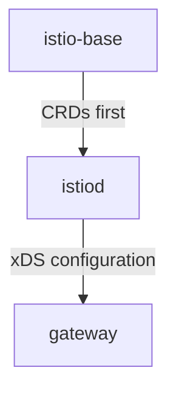

# The Chart Model And Its Ordering

Before you install anything, it helps to know what Istio's Helm packaging really is. A Helm **chart** is a package of templates for Kubernetes objects. A Helm **release** is one installation of a chart in the cluster, under a name you choose. "Install Istio with Helm" means three releases, not one, installed in an order you cannot change, and placed in two different namespaces. Each of those facts has a reason. When you know the reasons, you can debug a failed install instead of retrying it.

## Five charts, three of them for sidecar mode

Istio publishes five charts, but a classic install with sidecar proxies needs only three of them. A full sidecar-mode install is these commands, in this order. Do not run them yet; they only show the shape of the install:

```text
helm install istio-base           istio/base     -n istio-system
helm install istiod               istio/istiod   -n istio-system
helm install istio-ingressgateway istio/gateway  -n istio-ingress
```

Each of the five charts has one job. The table lists what each chart installs and whether it runs pods:

| Chart | Installs | Runs pods? |
| --- | --- | --- |
| `istio/base` | CRDs and cluster-wide resources (cluster roles, bindings) | No |
| `istio/istiod` | The control plane Deployment, plus both webhook configurations | Yes |
| `istio/gateway` | One Envoy gateway Deployment and Service per release | Yes |
| `istio/cni` | The node-level traffic redirection DaemonSet | Yes: ambient, or sidecar mode without init containers |
| `istio/ztunnel` | The per-node layer 4 proxy DaemonSet | Yes: ambient only |

`istio/base` holds the definitions. A CRD (Custom Resource Definition) adds a new object kind, such as `VirtualService`, to the Kubernetes API server, so the API server accepts objects of that kind. `istio/istiod` installs the control plane. `istio/gateway` installs one gateway: an Envoy proxy that runs on its own, at the edge of the mesh, instead of next to an application. The last two charts are for ambient mode, which this course does not use. For a classic sidecar install, three charts are the whole list.

Chart versions follow Istio releases exactly: chart `1.30.5` installs Istio `1.30.5`. That one-to-one match makes `--version 1.30.5` a real pin. It is also why the chart repository shows `CHART VERSION` and `APP VERSION` as the same string.

You can see this in your playground. `helm search repo` lists the charts in the repository you added, and `helm show chart` prints the metadata of one chart:

<!-- astrona:playground:renew -->

```sh
helm search repo istio
helm show chart istio/base | head -6
```

The output looks like this:

```text
NAME               	CHART VERSION	APP VERSION	DESCRIPTION                                       
istio/istiod       	1.30.5       	1.30.5     	Helm chart for istio control plane                
istio/istiod-remote	1.23.6       	1.23.6     	Helm chart for a remote cluster using an extern...
istio/ambient      	1.30.5       	1.30.5     	Helm umbrella chart for ambient                   
istio/base         	1.30.5       	1.30.5     	Helm chart for deploying Istio cluster resource...
istio/cni          	1.30.5       	1.30.5     	Helm chart for istio-cni components               
istio/gateway      	1.30.5       	1.30.5     	Helm chart for deploying Istio gateways           
istio/ztunnel      	1.30.5       	1.30.5     	Helm chart for istio ztunnel components           
apiVersion: v2
appVersion: 1.30.5
description: Helm chart for deploying Istio cluster resources and CRDs
icon: https://istio.io/latest/favicons/android-192x192.png
keywords:
- istio
```

The five charts from the table are all on the same version. The list has two more entries. `istio/ambient` is an umbrella chart: a chart that only pulls in other charts (`base`, `cni`, `istiod` and `ztunnel`), and it is for ambient mode only. `istio/istiod-remote` is an old chart, still on `1.23.6`, for a cluster that uses a control plane in another cluster. For sidecar mode there is no umbrella chart, and Istio leaves it out on purpose. The pieces have different lifecycles, and in a real organisation they often have different owners.

By default `helm search repo` shows only the newest version of each chart. Add `--versions` to list every published version; then each chart has many rows, newest first.

## The order is a dependency, not a habit

Knowing the three charts is not enough; you also need to know why they go in that order. The order comes from what each chart needs to exist before it. There are two links in that chain, and the first one is strict.

### Why base comes first

The `istiod` chart itself creates only built-in kinds: a Deployment, Services, a ConfigMap, roles and webhook configurations. So the API server accepts it even when no Istio CRD exists, and `helm install istiod` reports `STATUS: deployed`. `istiod` even starts and reports ready. The failure comes later, and from somewhere else: every Istio object you apply is rejected, because a `CustomResourceDefinition` tells the API server what a kind *is*, and until it exists, the API server knows no `VirtualService`.

That difference matters when you read the error. A wrong order does not produce a Helm error or a Helm dependency warning. It produces an API error from `kubectl` when you first apply Istio configuration, and it looks like a broken file. This is what `kubectl apply` printed for a `VirtualService` in a file called `vs.yaml`, on a cluster with the `istiod` release and no `istio-base` release (the file path in the output is shortened):

```text
error: resource mapping not found for name: "test" namespace: "default" from "vs.yaml": no matches for kind "VirtualService" in version "networking.istio.io/v1"
ensure CRDs are installed first
```

The last line is the whole diagnosis: install the `istio-base` release. Read the kind in the error before you assume anything else is wrong.

### Why gateway comes after istiod

The second link is softer. A gateway pod is an Envoy proxy that gets its whole configuration from `istiod` over xDS. xDS is the set of discovery protocols (LDS, RDS, CDS and EDS, for listeners, routes, clusters and endpoints) that `istiod` uses to send configuration to proxies while they run. A gateway started with no control plane to reach comes up with no listeners and no routes. It does not crash, but it serves nothing. It recovers when `istiod` appears. Still, if you install the gateway after `istiod`, the gateway serves traffic from the moment it is ready.



The diagram shows the chain: `istio-base` defines the kinds, `istiod` creates objects of those kinds and sends configuration, and the gateway has nothing to serve until `istiod` exists.

## Why a gateway is its own release

The order explains why there are separate charts. It does not yet explain why the gateway is separate from the control plane. The `istiod` chart has no flag that says "also give me an ingress gateway". This is a deliberate packaging choice, and it has three results.

The first result is a separate area of failure. A gateway is a workload that faces the internet, with its own Service, its own scaling and its own ways to fail. `istio-system` holds the control plane and the certificate authority that signs every proxy certificate in the mesh. When the two live apart, you can let a team manage their gateway (scale it, change its Service type, restart it) without giving them any rights in `istio-system`.

The second result is that you can run as many gateways as you need. Install the same chart twice, under two release names in two namespaces, and you get two independent gateways. Splitting public traffic from internal traffic, or giving each team its own edge, is one more `helm install`, not a different design.

The third result matters most in daily work: the release name becomes the object name. The chart builds the Deployment name, the Service name and the pod labels from the release name. A `Gateway` resource you write later selects a gateway workload *by its labels*. So the release name is not decoration; your traffic configuration depends on it.

You can see this without installing anything. `helm template` renders a chart's objects on your machine and prints them, without touching the cluster, much like `istioctl manifest generate`. Print the names the chart would use for a release called `my-edge`:

```sh
helm template my-edge istio/gateway -n istio-ingress \
  | grep -E '^kind:|^  name:|    app:|    istio:' | head -20
```

The output looks like this:

```text
kind: ServiceAccount
  name: my-edge
    app: my-edge
    istio: my-edge
kind: Role
  name: my-edge
    app: my-edge
    istio: my-edge
kind: RoleBinding
  name: my-edge
    app: my-edge
    istio: my-edge
  name: my-edge
  name: my-edge
kind: Service
  name: my-edge
    app: my-edge
    istio: my-edge
    app: my-edge
    istio: my-edge
```

`head -20` stops the list here. Without it, the list goes on with a `Deployment` and a `HorizontalPodAutoscaler`, both named `my-edge` with the same `app` and `istio` labels. Every name and label here came from the release name `my-edge`. If you change the release name, all of them change with it, including the `istio:` label that a `Gateway` resource selects.

## Where the values tree comes from

One more fact about the structure saves you from learning the same thing twice. Chart values follow the **same tree** as `spec.values` in an `IstioOperator` document. `meshConfig.accessLogFile` is `meshConfig.accessLogFile` whether you write it in a Helm values file or in an `IstioOperator`.

That is no accident: `istioctl install` uses the Istio charts internally. The two install methods are two front ends on one templating layer. That is why what you learn about one carries over to the other. It is also why running both against one cluster gives you two owners of the very same objects.

You now know that Istio ships as separate charts because its pieces have separate lifecycles, that `base` must come first because it defines the CRDs, and that the gateway release name becomes the name of its objects. The open question is how to run the three installs for real, and where your own settings enter.

## Common pitfalls

> [!WARNING]
> **Treating the order as a habit.** `base` defines the CRDs. Without it, the API server rejects the objects in the `istiod` chart. The error names the missing kind.
>
> **Expecting one chart to install everything.** Sidecar mode needs three releases, and a gateway is deliberately its own.
>
> **Forgetting the gateway release.** Without it there is no ingress workload, and a `Gateway` object you apply selects nothing and does nothing, with no error.
>
> **Assuming the release name is decoration.** It becomes the object name and the selector label, so you will read it in `kubectl get` for the life of the cluster.
