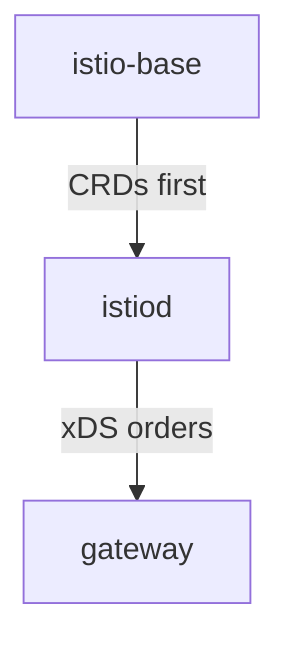

# The Chart Model And Its Ordering

Before you run anything, settle what Istio's Helm packaging really is. Astronaut, a Helm chart is a flat-pack kit from the shipyard, and a Helm release is one kit assembled in your solar system under a name. "Install Istio with Helm" means three kits, not one, in an order you cannot change, ending up in two different namespaces. Each of those facts has a reason, and knowing the reasons lets you debug the install instead of retrying it.

## Five charts, three of them for sidecar mode

Istio publishes five charts. A classic install with sidecars needs only three of them. This section shows the three commands, then what every chart contains.

### The three installs

A full sidecar-mode install is these commands, in this order:

```text
helm install istio-base           istio/base     -n istio-system
helm install istiod               istio/istiod   -n istio-system
helm install istio-ingressgateway istio/gateway  -n istio-ingress
```

### What each chart installs

| Chart | Installs | Runs pods? |
| --- | --- | --- |
| `istio/base` | CRDs and cluster-wide resources (cluster roles, bindings) | No |
| `istio/istiod` | The control plane Deployment, plus both webhook configurations | Yes |
| `istio/gateway` | One Envoy gateway Deployment and Service per release | Yes |
| `istio/cni` | The node-level traffic redirection DaemonSet | Yes: ambient, or sidecar mode without init containers |
| `istio/ztunnel` | The per-node layer 4 proxy DaemonSet | Yes: ambient only |

`istio/base` holds the foundations: CRDs (Custom Resource Definitions) are new forms the API server, the solar system's registry office, learns to accept. `istio/istiod` is mission control, and `istio/gateway` is a spaceport gate. The last two charts are for ambient mode. For a classic sidecar install, three is the whole list.

Chart versions follow Istio releases exactly: chart `1.30.5` installs Istio `1.30.5`. That one-to-one match is what makes `--version 1.30.5` a real pin, and it is why the chart repository shows `CHART VERSION` and `APP VERSION` as the same string.

### See it in your playground

List the charts and their versions:

<!-- astrona:playground:renew -->

```sh
helm search repo istio --versions | head -8
helm show chart istio/base | head -6
```

Expect something like:

```text
NAME                    CHART VERSION   APP VERSION     DESCRIPTION
istio/base              1.30.5          1.30.5          Helm chart for deploying Istio cluster resources
istio/cni               1.30.5          1.30.5          Helm chart for Istio CNI components
istio/gateway           1.30.5          1.30.5          Helm chart for deploying Istio gateways
istio/istiod            1.30.5          1.30.5          Helm chart for istio control plane
istio/ztunnel           1.30.5          1.30.5          Helm chart for Istio ztunnel components
```

Five charts, all on the same version. There is no umbrella chart that pulls in the others. Istio does not ship one on purpose: the pieces have different lifecycles, and in a real organisation they often have different owners.

## The order is a dependency, not a habit

The install order comes from what each chart needs to exist before it. This section explains both links in the chain.

### Why `base` comes first

The `istiod` chart creates objects of kinds that `base` defines. A `CustomResourceDefinition` teaches the API server what a kind *is*. Until it exists, the API server rejects any object of that kind, with an error that names the missing resource. Helm does not reject it; the API server does.

That is the important difference. A wrong order does not produce a Helm dependency warning. It produces an API error that reads like a broken chart:

```text
Error: INSTALLATION FAILED: unable to build kubernetes objects from release manifest:
resource mapping not found for name: "istio-validator-istio-system" ...
ensure CRDs are installed first
```

The last clause is the whole diagnosis. Read the kind in the error before you assume anything else is wrong.

### Why `gateway` comes after `istiod`

A gateway pod is an Envoy proxy that fetches its whole configuration from the control plane over xDS (the protocols mission control uses to radio orders). Started with no control plane to reach, it comes up and sits there with empty orders. It does not crash; it is just useless. It recovers when `istiod` appears, so this link is softer than the first one. Still, installing into a working control plane means the gateway serves traffic from the moment it is ready.



The diagram shows the chain. `istio-base` defines the kinds, `istiod` creates objects of those kinds and becomes the source of orders, and the gateway has nothing to do until `istiod` exists.

## Why a gateway is its own release

The control plane chart has no flag that says "also give me an ingress gateway". This is a deliberate packaging choice, and it has three results.

### A separate blast radius

A gateway is a workload facing the internet, with its own Service, its own scaling and its own ways to fail. `istio-system` holds the cluster's security-critical control plane and its certificate authority. Keeping them apart means you can let a team manage their gateway (scale it, change its Service type, restart it) without giving them anything in `istio-system`.

### As many gateways as you need

Install the same chart twice, under two release names in two namespaces, and you get two independent gateways. Splitting public from internal traffic, or giving each team its own edge, is one more `helm install`, not a different design.

### The release name becomes the object name

The chart builds the Deployment name, the Service name and the pod labels from the release name. That matters because a `Gateway` resource you write later selects a gateway *workload by its labels*. So the release name is not decoration. Your traffic configuration depends on it.

### See it in your playground

Print the names the chart would use for a release called `my-edge`:

```sh
helm template my-edge istio/gateway -n istio-ingress \
  | grep -E '^kind:|^  name:|    app:|    istio:' | head -20
```

Expect something like:

```text
kind: ServiceAccount
  name: my-edge
kind: Deployment
  name: my-edge
    app: my-edge
    istio: my-edge
kind: Service
  name: my-edge
    app: my-edge
    istio: my-edge
```

`helm template` draws the objects on your machine without touching the cluster, much like `istioctl manifest generate`. Every name and label here came from the release name `my-edge`. Change the release name and all of them change with it, including the `istio:` label that a `Gateway` resource selects.

## Where the value tree comes from

One more fact about the structure, because it saves you learning the same thing twice. Chart values follow the **same tree** as `spec.values` in an `IstioOperator` document. `meshConfig.accessLogFile` is `meshConfig.accessLogFile` whether you write it in a Helm values file or in an `IstioOperator`.

That is no accident: `istioctl install` uses the Istio charts internally. The two install methods are two front ends on one templating layer. That is why what you learn carries over between them, and also why running both against one cluster gives you two owners of the very same objects.

Istio ships as separate charts because its pieces have separate lifecycles, and the install order comes from the CRDs, not from style.

## Common pitfalls

> [!WARNING]
> **Treating the order as a habit.** `base` defines the CRDs. Without it, the API server rejects the objects in `istiod`'s chart. The error names the missing kind.
>
> **Expecting one chart to install everything.** Sidecar mode needs three releases, and a gateway is deliberately its own.
>
> **Forgetting the gateway release.** Without it there is no ingress workload, and a `Gateway` object you apply selects nothing and quietly does nothing.
>
> **Assuming the release name is decoration.** It becomes the object name and the selector label, so you will read it in `kubectl get` for the life of the cluster.
