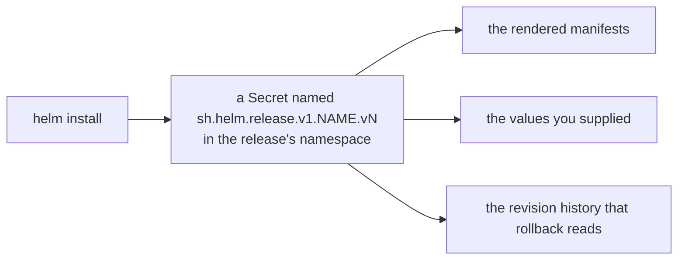

# Part 3 — Release State, Verification And Cleanup

> Prerequisite: [Part 2 — Installing The Three Releases](./course-02-installing-the-releases.md). Next: [the module landing page](./course.md), then [Section 020 — Customizing Your Istio Installation](../../section-020/README.md).

Three releases reporting `deployed` is not proof that the mesh works. This part covers what `deployed` actually means, where Helm keeps the information you will need during an upgrade, how to prove the install end to end, and what is still in the cluster after you uninstall. The upgrade module in section 030 depends directly on everything here.

## Where a release lives



Helm keeps no state of its own — everything it knows is in those Secrets, in the cluster. Delete them to tidy a namespace and you have deleted the history and the rollback with it.

Helm stores each release's full state **in the cluster**, as a Secret in the release's namespace, of type `helm.sh/release.v1`. That record contains the rendered manifests and the values used to produce them, gzipped and base64-encoded.

Every `install` or `upgrade` writes a new Secret and increments the **revision** number, starting at 1. Old revisions are kept. That store is what makes `helm history` and `helm rollback` possible — and it is also why values that exist only inside a release are values you can lose but not easily notice losing.

> [!TIP]
> **Try it — find the release record itself**
>
> ```sh
> kubectl -n istio-system get secret -l owner=helm
> kubectl -n istio-system get secret -l owner=helm,name=istiod \
>   -o jsonpath='{.items[0].metadata.labels}{"\n"}'
> ```
>
> Expect something like:
>
> ```text
> NAME                                 TYPE                 DATA   AGE
> sh.helm.release.v1.istio-base.v1     helm.sh/release.v1   1      6m
> sh.helm.release.v1.istiod.v1         helm.sh/release.v1   1      5m
>
> {"name":"istiod","owner":"helm","status":"deployed","version":"1"}
> ```
>
> The Secret name encodes the release and revision. `version: "1"` is the revision number, not the chart version — a distinction that matters when reading `helm history`. Deleting these Secrets to "clean up" destroys your rollback path and your ability to recover values.

## The four read commands

Everything you need to answer "what is installed and how is it configured" comes from four commands:

- **`helm ls -A`** — one line per release in every namespace, with chart version, app version and current revision. The fastest cluster-wide inventory.
- **`helm history <release> -n <ns>`** — every revision of one release, with status and a description of what each did. This is what rollback targets.
- **`helm get values <release> -n <ns>`** — the values *you supplied*, with chart defaults omitted. Add `--revision N` for an older revision.
- **`helm get values <release> -n <ns> --all`** — the full effective value set, defaults included. Long, but it is the honest answer to "what is this release actually configured with".

Treat `helm get values` as a **recovery path, not a routine one**. If your values file is committed and passed on every run, the file is the source of truth. `helm get values` is how you reconstruct that file when whoever installed before you did not commit it — which is exactly the scenario section 030's upgrade module drops you into.

> [!TIP]
> **Try it — what the cluster knows about your install**
>
> ```sh
> helm ls -A
> helm get values istiod -n istio-system
> ```
>
> Expect something like:
>
> ```text
> NAME                    NAMESPACE       REVISION  STATUS    CHART           APP VERSION
> istio-base              istio-system    1         deployed  base-1.30.5     1.30.5
> istio-ingressgateway    istio-ingress   1         deployed  gateway-1.30.5  1.30.5
> istiod                  istio-system    1         deployed  istiod-1.30.5   1.30.5
>
> USER-SUPPLIED VALUES:
> global:
>   proxy:
>     resources:
>       requests:
>         cpu: 10m
>         memory: 64Mi
> meshConfig:
>   accessLogFile: /dev/stdout
> ...
> ```
>
> `USER-SUPPLIED VALUES` is precisely the file you wrote in Part 2, read back out of the cluster. Note that the `USER-SUPPLIED VALUES:` header is a human-facing line, not YAML — strip it with `tail -n +2` if you are redirecting the output into a file.

## What `deployed` does and does not mean

`STATUS: deployed` means Helm rendered its templates and the API server accepted every object. It says nothing about whether those objects do their job. For Istio specifically, the load-bearing question is whether the mutating webhook that `istiod`'s chart created is actually serving injection requests — and the only honest test is to create a pod and count its containers.

That test exercises the whole chain in one go: the CRDs from `base`, the webhook configuration from `istiod`, the control plane process behind it, and the network path between the API server and that process.

> [!TIP]
> **Try it — end-to-end proof that the install is real**
>
> ```sh
> kubectl label namespace default istio-injection=enabled --overwrite
> kubectl run tester --image=nginx
> kubectl wait --for=condition=Ready pod/tester --timeout=120s
> kubectl get pod tester -o jsonpath='{.spec.containers[*].name}{"\n"}'
> istioctl proxy-status
> ```
>
> Expect something like:
>
> ```text
> nginx istio-proxy
>
> NAME                                   CLUSTER      CDS      LDS      EDS      RDS        ISTIOD
> istio-ingressgateway-...istio-ingress  Kubernetes   SYNCED   SYNCED   SYNCED   NOT SENT   istiod-...
> tester.default                         Kubernetes   SYNCED   SYNCED   SYNCED   SYNCED     istiod-...
> ```
>
> `nginx istio-proxy` proves the webhook fired. `proxy-status` listing both the pod and the gateway proves the control plane is reachable from the data plane and pushing configuration. Either one alone is weaker evidence than people assume — a pod can be injected by a webhook whose backend later died.

This is also the point at which `istioctl` earns its place on a Helm-managed cluster. `version`, `proxy-status`, `proxy-config` and `analyze` are read-only diagnostics that talk to the running control plane; using them does not make `istioctl` an owner of the install. Only `istioctl install` and `istioctl uninstall` do that.

## What uninstall leaves behind

`helm uninstall <release> -n <ns>` deletes the objects in that release and the release record. Two things survive, both deliberately.

**CRDs are not deleted.** Helm's documented behaviour is to leave CRDs in place on uninstall, because deleting a CRD deletes every custom resource of that kind cluster-wide — including ones other releases or other people depend on. So `helm uninstall istio-base` leaves the entire `networking.istio.io` API group installed, along with any `VirtualService` objects in it.

**Namespace labels are not touched.** `istio-injection=enabled` is on your namespace object, which no release owns. It becomes inert when the webhook disappears and reactivates the moment Istio is installed again.

And as with `istioctl`, **existing pods keep their sidecars**. The proxy container is part of the stored pod spec; removing the control plane leaves those proxies running with no configuration source and no certificate renewal.

> [!TIP]
> **Try it — uninstall, then check what is still there**
>
> ```sh
> helm uninstall istio-ingressgateway -n istio-ingress
> helm uninstall istiod -n istio-system
> helm uninstall istio-base -n istio-system
> helm ls -A
> kubectl get crd | grep -c istio.io
> ```
>
> Expect something like:
>
> ```text
> release "istio-ingressgateway" uninstalled
> release "istiod" uninstalled
> release "istio-base" uninstalled
>
> NAME    NAMESPACE   REVISION    STATUS  CHART   APP VERSION
>
> 15
> ```
>
> No releases left, and all fifteen CRDs still installed. A cluster in this state looks clean to `helm` and is not clean to Istio — the next install starts on top of stale definitions, which is exactly what `istioctl x precheck` warns about.

Finishing the cleanup takes three more commands, and the middle one is worth reading before you run it:

```sh
kubectl get crd -o name | grep 'istio.io$' | xargs -r kubectl delete
kubectl delete namespace istio-system istio-ingress --ignore-not-found
kubectl label namespace default istio-injection-
```

> [!WARNING]
> **Deleting a CRD deletes every object of that kind**
>
> The first command removes the Istio API group cluster-wide, and with it every `VirtualService`, `DestinationRule`, `AuthorizationPolicy` and `Gateway` in every namespace — not just the ones related to this install. On a shared cluster, inventory them first with `kubectl get virtualservices,destinationrules,gateways -A`. On this playground there is nothing to lose.

> [!WARNING]
## Common pitfalls

> [!WARNING]
> **Installing `istiod` before `base`.** The API server rejects the unknown kinds. Read the kind named in the error rather than retrying.
>
> **Treating `STATUS: deployed` as proof the mesh works.** It means the manifests applied. Inject a pod to prove the rest.
>
> **Relying on `helm get values` as the source of truth.** It is a recovery tool. A committed values file passed with `-f` on every run is the source of truth — section 030 shows what goes wrong otherwise.
>
> **Expecting `helm uninstall` to clean up CRDs.** It never does. Remove them explicitly, and understand what that deletes.
>
> **Deleting `sh.helm.release.v1.*` Secrets to tidy a namespace.** That is the release history: rollback and value recovery both go with it.
>
> **Assuming a gateway comes with the control plane.** Without an `istio/gateway` release there is no ingress, and a `Gateway` resource you apply matches no workload and silently does nothing.
>
> **Omitting `--version`.** Two runs a month apart install two different Istio versions.
>
> **Mixing Helm and `istioctl install` on one cluster.** Both write the same Deployments and webhooks; each run reverts parts of the other.

> *Helm's state lives in Secrets in the cluster, `deployed` only means the manifests applied, and uninstall leaves the CRDs, the namespace labels and every running sidecar exactly where they were.*

## Reference

- [Helm: uninstall and CRDs](https://helm.sh/docs/chart_best_practices/custom_resource_definitions/) — why CRDs are deliberately left behind.
- [helm get values](https://helm.sh/docs/helm/helm_get_values/) — including `--revision` and `--all`.
- [Uninstall Istio installed with Helm](https://istio.io/v1.30/docs/setup/install/helm/#uninstall) — Istio's own cleanup steps.
- `helm history --help` — the revision list rollback operates on.
