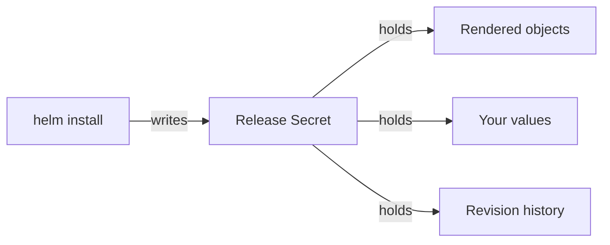

# Release State And Verification

Three Helm releases that say `deployed` do not prove that the mesh works. They also hide a fact that matters during every upgrade: Helm keeps no state on your machine. This part covers where Helm stores what it applied, the commands that read it back, what `deployed` really means, and how to prove the install works from end to end.

## Where a release lives

Everything Helm knows about a release lives in the cluster, in Secrets. A **Secret** is a Kubernetes object that stores a small amount of data; Helm uses one per release revision. The flow is short:



The diagram shows one install writing one Secret, named `sh.helm.release.v1.NAME.vN`, in the release's namespace, and what that Secret holds.

Each of those Secrets has the type `helm.sh/release.v1`. It contains the rendered objects and the values used to produce them, compressed with gzip and encoded in base64. Every `install` or `upgrade` writes a new Secret and adds one to the **revision** number, starting at 1. Helm keeps the old revisions. That store makes `helm history` and `helm rollback` possible. It is also why values that exist only inside a release are values you can lose without noticing.

You can find these records on your cluster. The commands below need the three releases `istio-base`, `istiod` and `istio-ingressgateway` installed, with `istiod` installed from `istiod-values.yaml`. The first command lists the Helm Secrets in `istio-system`, and the second prints the labels of the `istiod` record:

<!-- astrona:playground:renew -->

```sh
kubectl -n istio-system get secret -l owner=helm
kubectl -n istio-system get secret -l owner=helm,name=istiod \
  -o jsonpath='{.items[0].metadata.labels}{"\n"}'
```

The output looks like this:

```text
NAME                               TYPE                 DATA   AGE
sh.helm.release.v1.istio-base.v1   helm.sh/release.v1   1      41s
sh.helm.release.v1.istiod.v1       helm.sh/release.v1   1      27s
{"modifiedAt":"1791589161","name":"istiod","owner":"helm","status":"deployed","version":"1"}
```

The Secret name holds the release name and the revision. `modifiedAt` is the time Helm last wrote the record, in seconds since 1970. `version: "1"` is the revision number, not the chart version; keep that difference in mind when you read `helm history`. If you delete these Secrets to "clean up" a namespace, you also delete your rollback path and your only way to recover the values.

## The read commands

You will rarely read those Secrets directly. Helm has four commands that decode them and answer the question "what is installed, and how is it configured?":

- **`helm ls -A`:** one line per release in every namespace, with chart version, app version and current revision. The fastest list for the whole cluster.
- **`helm history <release> -n <namespace>`:** every revision of one release, with its status and a description of what it did. This is the list `helm rollback` chooses from.
- **`helm get values <release> -n <namespace>`:** the values *you supplied*, without the chart defaults. Add `--revision N` for an older revision.
- **`helm get values <release> -n <namespace> --all`:** the full set of values in effect, defaults included. It is long, but it is the honest answer to "what is this release really configured with?".

Treat `helm get values` as a **recovery path, not a routine**. If your values file is committed and passed with `-f` on every run, the file is the source of truth. `helm get values` is how you rebuild that file when whoever installed before you did not commit it.

Ask the cluster what it knows about your install. The first command lists all releases, and the second prints the values you gave `istiod`:

```sh
helm ls -A
helm get values istiod -n istio-system
```

The output looks like this:

```text
NAME                	NAMESPACE    	REVISION	UPDATED                              	STATUS  	CHART         	APP VERSION
istio-base          	istio-system 	1       	2026-10-10 01:39:03.556136 +0200 CEST	deployed	base-1.30.5   	1.30.5     
istio-ingressgateway	istio-ingress	1       	2026-10-10 01:39:21.708271 +0200 CEST	deployed	gateway-1.30.5	1.30.5     
istiod              	istio-system 	1       	2026-10-10 01:39:16.916769 +0200 CEST	deployed	istiod-1.30.5 	1.30.5     
USER-SUPPLIED VALUES:
global:
  proxy:
    resources:
      requests:
        cpu: 10m
        memory: 64Mi
meshConfig:
  accessLogFile: /dev/stdout
  outboundTrafficPolicy:
    mode: ALLOW_ANY
pilot:
  autoscaleEnabled: false
  resources:
    requests:
      cpu: 100m
      memory: 256Mi
```

`USER-SUPPLIED VALUES` is exactly the `istiod-values.yaml` file you installed with, read back out of the cluster.

> [!TIP]
> The `USER-SUPPLIED VALUES:` header is a line for people, not YAML. When you save the output to a file to reuse it, strip that line with `tail -n +2`.

## What deployed does and does not mean

The read commands all report `STATUS: deployed`, and it is tempting to stop there. `deployed` means that Helm rendered its templates and the API server accepted every object. It says nothing about whether those objects do their job.

For Istio, the key question is whether the mutating admission webhook from the `istiod` chart really serves injection requests. A **mutating admission webhook** is a call the Kubernetes API server makes while it creates an object, so that another service (here `istiod`) can change the object before it is stored. The only honest test is to create a pod in a namespace with injection turned on and list its containers. That test checks the whole chain at once: the CRDs from `base`, the webhook configuration from `istiod`, the `istiod` process behind it, and the network path from the API server to that process.

Prove the install works from end to end. The commands label the `default` namespace for injection, create a pod, wait for it, print the names of its init containers and its containers, and then list the proxies that `istiod` serves:

```sh
kubectl label namespace default istio-injection=enabled --overwrite
kubectl run tester --image=nginx
kubectl wait --for=condition=Ready pod/tester --timeout=120s
kubectl get pod tester -o jsonpath='{.spec.initContainers[*].name} {.spec.containers[*].name}{"\n"}'
istioctl proxy-status
```

The output looks like this (shortened: the first three lines, from `kubectl label`, `kubectl run` and `kubectl wait`, are left out):

```text
istio-init istio-proxy tester
NAME                                                    CLUSTER        ISTIOD                     VERSION     SUBSCRIBED TYPES
istio-ingressgateway-556fd5bc7b-mv6hc.istio-ingress     Kubernetes     istiod-ff9c4ff46-8vlbv     1.30.5      3 (CDS,LDS,EDS)
tester.default                                          Kubernetes     istiod-ff9c4ff46-8vlbv     1.30.5      4 (CDS,LDS,EDS,RDS)
```

`istio-init istio-proxy tester` proves that the webhook added the sidecar proxy. The pod you created has one container, `tester`. The webhook added `istio-init`, which sets up the traffic redirection and exits, and `istio-proxy`, the sidecar proxy. Both are init containers: Istio 1.30 runs the proxy as a native sidecar, an init container with `restartPolicy: Always` that keeps running beside the application. `istioctl proxy-status` lists every proxy connected to `istiod`, with the `istiod` pod it uses, its version, and the xDS types it receives (`CDS`, `LDS`, `EDS`, `RDS`). The gateway does not receive `RDS` yet, because no `Gateway` resource gives it any routes. Seeing both the pod and the gateway here proves that the proxies reach the control plane and that `istiod` pushes configuration to them. Either check alone is weaker than people think: a pod can be injected by a webhook whose backend stopped later.

This is also where `istioctl` earns its place on a cluster installed with Helm. `version`, `proxy-status`, `proxy-config` and `analyze` only read from the running control plane. Using them does not make `istioctl` an owner of the install. Only `istioctl install` and `istioctl uninstall` do that.

You now know that Helm stores each release revision as a Secret in the cluster, that `helm ls`, `helm history` and `helm get values` read those Secrets back, and that only an injected pod and `istioctl proxy-status` prove the install works. The open question is what happens to all of this when you remove the releases again.

## Common pitfalls

> [!WARNING]
> **Treating `STATUS: deployed` as proof the mesh works.** It means the objects were applied. Inject a pod to prove the rest.
>
> **Relying on `helm get values` as the source of truth.** It is a recovery tool. A committed values file passed with `-f` on every run is the source of truth.
>
> **Deleting `sh.helm.release.v1.*` Secrets to tidy a namespace.** That is the release history: rollback and value recovery both go with it.
>
> **Reading the Secret's `version` label as the chart version.** It is the release revision number.
>
> **Mixing Helm and `istioctl install` on one cluster.** Both write the same Deployments and webhooks, and each run undoes parts of the other. The read-only `istioctl` commands are safe.

## Your mission: Install Istio With Helm Lab

You can now install Istio as three pinned Helm releases, drive mesh settings from a values file and read back what the cluster really runs. The lab asks you to install the three releases in order, put the gateway in its own namespace under its own release name, set access logging from a values file, and bring a running workload into the mesh.

The lab runs on its own cluster, so first pause your playground. Nothing in it is lost:

```sh
astrona stop ats-013-playground-010-02
```

Then start the lab. The task is on the next page; solve it on your own first:

```sh
astrona run --git ssh://git@github.com/astrona-io/ATS013.git -c sections/section-010/module-02/labs/lab-01
```

When you think you are done, send it for grading:

```sh
astrona submit -c sections/section-010/module-02/labs/lab-01
```

When the lab is done, remove it and start your playground again:

```sh
astrona destroy ats-013-lab-010-02
astrona start ats-013-playground-010-02
```
