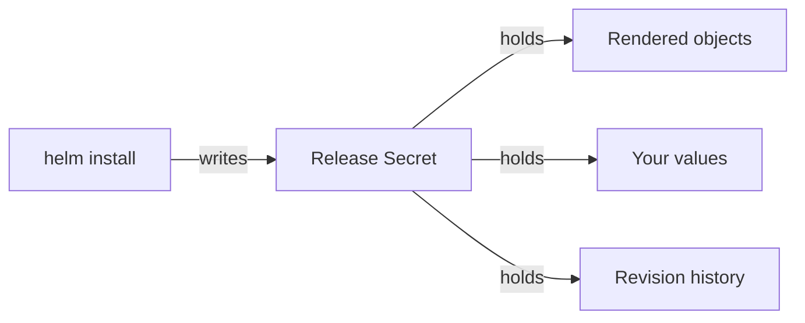

# Release State, Verification And Cleanup

Three releases that say `deployed` do not prove the mesh works. Astronaut, this part covers what `deployed` really means, where Helm keeps the logbook you will need during an upgrade, how to prove the install works from end to end, and what is still in the cluster after you uninstall.

## Where a release lives

Helm keeps no state on your machine. Everything it knows about a release lives in the cluster, in Secrets. This section shows where, and why you must not delete them.



The diagram shows one install writing one Secret, named `sh.helm.release.v1.NAME.vN`, in the release's namespace. That Secret holds the rendered objects, the values you supplied and the revision history that `helm rollback` reads. Delete those Secrets to tidy a namespace, and you delete the history and the rollback with them.

### The logbook

Helm stores each release's full state **in the cluster**, as a Secret of type `helm.sh/release.v1` in the release's namespace. That record contains the rendered objects and the values used to produce them, compressed with gzip and encoded in base64.

Think of it as the release's logbook, one page per build. Every `install` or `upgrade` writes a new Secret and adds one to the **revision** number, starting at 1. Old revisions are kept. That store makes `helm history` and `helm rollback` possible. It is also why values that exist only inside a release are values you can lose without noticing.

### See it in your playground

Find the release records themselves. This needs the three releases installed:

<!-- astrona:playground:renew -->

```sh
kubectl -n istio-system get secret -l owner=helm
kubectl -n istio-system get secret -l owner=helm,name=istiod \
  -o jsonpath='{.items[0].metadata.labels}{"\n"}'
```

Expect something like:

```text
NAME                                 TYPE                 DATA   AGE
sh.helm.release.v1.istio-base.v1     helm.sh/release.v1   1      6m
sh.helm.release.v1.istiod.v1         helm.sh/release.v1   1      5m

{"name":"istiod","owner":"helm","status":"deployed","version":"1"}
```

The Secret name holds the release name and the revision. `version: "1"` is the revision number, not the chart version. Keep that difference in mind when you read `helm history`. Deleting these Secrets to "clean up" destroys your rollback path and your way to recover the values.

## The four read commands

Four commands answer "what is installed, and how is it configured?". This section lists them, then shows two of them on your cluster.

### The commands

- **`helm ls -A`:** one line per release in every namespace, with chart version, app version and current revision. The fastest list for the whole cluster.
- **`helm history <release> -n <namespace>`:** every revision of one release, with its status and a description of what it did. This is what rollback aims at.
- **`helm get values <release> -n <namespace>`:** the values *you supplied*, without the chart defaults. Add `--revision N` for an older revision.
- **`helm get values <release> -n <namespace> --all`:** the full set of values in effect, defaults included. It is long, but it is the honest answer to "what is this release really configured with?".

Treat `helm get values` as a **recovery path, not a routine**. If your values file is committed and passed on every run, the file is the source of truth. `helm get values` is how you rebuild that file when whoever installed before you did not commit it.

### See it in your playground

Ask the cluster what it knows about your install:

```sh
helm ls -A
helm get values istiod -n istio-system
```

Expect something like:

```text
NAME                    NAMESPACE       REVISION  STATUS    CHART           APP VERSION
istio-base              istio-system    1         deployed  base-1.30.5     1.30.5
istio-ingressgateway    istio-ingress   1         deployed  gateway-1.30.5  1.30.5
istiod                  istio-system    1         deployed  istiod-1.30.5   1.30.5

USER-SUPPLIED VALUES:
global:
  proxy:
    resources:
      requests:
        cpu: 10m
        memory: 64Mi
meshConfig:
  accessLogFile: /dev/stdout
...
```

`USER-SUPPLIED VALUES` is exactly the `istiod-values.yaml` file you installed with, read back out of the cluster.

> [!TIP]
> The `USER-SUPPLIED VALUES:` header is a line for people, not YAML. When you save the output to a file to reuse it, strip that line with `tail -n +2`.

## What `deployed` does and does not mean

`STATUS: deployed` means Helm rendered its templates and the API server accepted every object. It says nothing about whether those objects do their job.

### The one honest test

For Istio, the key question is whether the mutating webhook from the `istiod` chart really serves injection requests. The only honest test is to create a pod and count its containers.

That test checks the whole chain at once: the CRDs from `base`, the webhook configuration from `istiod`, the control plane process behind it, and the network path from the API server to that process.

### See it in your playground

Prove the install works from end to end:

```sh
kubectl label namespace default istio-injection=enabled --overwrite
kubectl run tester --image=nginx
kubectl wait --for=condition=Ready pod/tester --timeout=120s
kubectl get pod tester -o jsonpath='{.spec.containers[*].name}{"\n"}'
istioctl proxy-status
```

Expect something like:

```text
nginx istio-proxy

NAME                                   CLUSTER      CDS      LDS      EDS      RDS        ISTIOD
istio-ingressgateway-...istio-ingress  Kubernetes   SYNCED   SYNCED   SYNCED   NOT SENT   istiod-...
tester.default                         Kubernetes   SYNCED   SYNCED   SYNCED   SYNCED     istiod-...
```

`nginx istio-proxy` proves the webhook fired. `proxy-status` listing both the pod and the gateway proves the proxies can reach the control plane and that `istiod` pushes configuration to them. Either check alone is weaker than people think: a pod can be injected by a webhook whose backend died later.

### Where `istioctl` fits on a Helm cluster

This is also where `istioctl` earns its place on a cluster installed with Helm. `version`, `proxy-status`, `proxy-config` and `analyze` only read from the running control plane. Using them does not make `istioctl` an owner of the install. Only `istioctl install` and `istioctl uninstall` do that.

## What uninstall leaves behind

`helm uninstall <release> -n <namespace>` deletes the objects in that release and the release record. Some things survive, on purpose. This section lists them, shows them on your cluster, and then finishes the cleanup by hand.

### What survives

**CRDs are not deleted.** Helm leaves CRDs in place on uninstall by design, because deleting a CRD deletes every custom resource of that kind in the whole cluster, including ones other releases or other people depend on. So `helm uninstall istio-base` leaves the whole `networking.istio.io` API group installed, with any `VirtualService` objects in it.

**Namespace labels are not touched.** `istio-injection=enabled` sits on your namespace object, which no release owns. It goes quiet when the webhook disappears, and wakes up again the moment Istio is installed again.

**Existing pods keep their sidecars.** The proxy container is part of the stored pod spec. Removing the control plane leaves those proxies running with no source of orders and no certificate renewal.

### See it in your playground

Uninstall the three releases, then check what is still there:

```sh
helm uninstall istio-ingressgateway -n istio-ingress
helm uninstall istiod -n istio-system
helm uninstall istio-base -n istio-system
helm ls -A
kubectl get crd | grep -c istio.io
```

Expect something like:

```text
release "istio-ingressgateway" uninstalled
release "istiod" uninstalled
release "istio-base" uninstalled

NAME    NAMESPACE   REVISION    STATUS  CHART   APP VERSION

15
```

No releases are left, and all fifteen CRDs are still installed. A cluster in this state looks clean to `helm` and is not clean to Istio. The next install starts on top of old definitions, which is exactly what `istioctl x precheck` warns about.

### Finish the cleanup

Three more commands finish the job. Read the first one carefully before you run it:

```sh
kubectl get crd -o name | grep 'istio.io$' | xargs -r kubectl delete
kubectl delete namespace istio-system istio-ingress --ignore-not-found
kubectl label namespace default istio-injection-
```

**Deleting a CRD deletes every object of that kind.** The first command removes the Istio API group from the whole cluster, and with it every `VirtualService`, `DestinationRule`, `AuthorizationPolicy` and `Gateway` in every namespace, not just the ones from this install. On a shared cluster, list them first with `kubectl get virtualservices,destinationrules,gateways -A`. On this playground there is nothing to lose.

Helm's state lives in Secrets in the cluster, `deployed` only means the objects were applied, and uninstall leaves the CRDs, the namespace labels and every running sidecar exactly where they were.

## Common pitfalls

> [!WARNING]
> **Installing `istiod` before `base`.** The API server rejects the unknown kinds. Read the kind named in the error instead of retrying.
>
> **Treating `STATUS: deployed` as proof the mesh works.** It means the objects were applied. Inject a pod to prove the rest.
>
> **Relying on `helm get values` as the source of truth.** It is a recovery tool. A committed values file passed with `-f` on every run is the source of truth.
>
> **Expecting `helm uninstall` to clean up CRDs.** It never does. Remove them yourself, and understand what that deletes.
>
> **Deleting `sh.helm.release.v1.*` Secrets to tidy a namespace.** That is the release history: rollback and value recovery both go with it.
>
> **Assuming a gateway comes with the control plane.** Without an `istio/gateway` release there is no ingress, and a `Gateway` resource you apply matches no workload and quietly does nothing.
>
> **Leaving out `--version`.** Two runs a month apart install two different Istio versions.
>
> **Mixing Helm and `istioctl install` on one cluster.** Both write the same Deployments and webhooks, and each run undoes parts of the other.

## Your mission: Install Istio With Helm

You can now install Istio as three pinned Helm releases, drive mesh settings from a values file and read back what the cluster really runs. Now prove it in a graded mission: install the three releases in order, put the gateway in its own namespace under its own release name, set access logging from a values file, and bring a running workload into the mesh.

The mission runs in its own training solar system, so first pause your playground. Nothing in it is lost:

```sh
astrona stop ats-013-playground-010-02
```

Then start the mission:

```sh
astrona run --git ssh://git@github.com/astrona-io/ATS013.git -c sections/section-010/module-02/labs/lab-01
```

Read the task in [`question.md`](./labs/lab-01/question.md) and solve it on your own first. When you think you are done, send it for grading:

```sh
astrona submit -c sections/section-010/module-02/labs/lab-01
```

When the mission is done, remove it and wake your playground up again:

```sh
astrona destroy ats-013-lab-010-02
astrona start ats-013-playground-010-02
```
