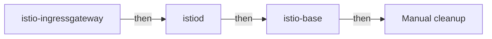

# Uninstall And Clean Removal

Removing Istio sounds like the easy half of the job: run `helm uninstall` three times and you are done. In practice, a cluster where every release is gone can still hold the Istio CRDs (Custom Resource Definitions), namespaces labelled for injection, and pods that run a sidecar proxy with no control plane behind it. The next install then starts on top of old definitions. This part shows what `helm uninstall` removes, what it leaves in the cluster on purpose, and how to finish the removal by hand.

## What helm uninstall removes

`helm uninstall <release> -n <namespace>` deletes the objects that belong to that release, and then deletes the release record: the `sh.helm.release.v1.*` Secrets that hold its history. After that, Helm no longer knows the release existed.

The order is the install order in reverse. The gateway goes first, because it depends on `istiod` for its configuration. `istiod` goes next, and `istio-base` goes last, because it holds the definitions the other two used:



The diagram shows the removal order, and that a manual cleanup step still follows the last `helm uninstall`.

## What survives, and why

Some things survive a `helm uninstall` on purpose. Each one has a reason, and each one needs its own step if you want a clean cluster.

**The CRDs are not deleted.** Helm leaves the Istio CRDs in place when you uninstall `istio-base`. This is deliberate: every Istio CRD in the `base` chart carries the annotation `helm.sh/resource-policy: keep`, which tells Helm to skip that object when it uninstalls the release. Deleting a CRD deletes every custom resource of that kind in the whole cluster, including objects that other teams depend on. So `helm uninstall istio-base` leaves the whole `networking.istio.io` API group installed, together with every `VirtualService` in it.

**Namespace labels are not touched.** `istio-injection=enabled` sits on your namespace object, and no release owns that object. The label does nothing while no injection webhook exists. It takes effect again the moment Istio is installed again.

**Existing pods keep their sidecars.** The `istio-proxy` container is part of the stored pod spec, so removing the control plane does not change running pods. Those proxies keep running with no source of configuration and no certificate renewal, until the pod is created again.

Uninstall the three releases, then check what is still there. The last two commands list the remaining releases and count the Istio CRDs:

<!-- astrona:playground:renew -->

```sh
helm uninstall istio-ingressgateway -n istio-ingress
helm uninstall istiod -n istio-system
helm uninstall istio-base -n istio-system
helm ls -A
kubectl get crd | grep -c istio.io
```

The output looks like this:

```text
release "istio-ingressgateway" uninstalled
release "istiod" uninstalled
release "istio-base" uninstalled

NAME    NAMESPACE   REVISION    STATUS  CHART   APP VERSION

15
```

No releases are left, and all fifteen CRDs are still installed. A cluster in this state looks clean to `helm` but is not clean for Istio. The next install starts on top of old definitions, which is exactly what `istioctl x precheck` warns about.

## Finish the removal by hand

The releases are gone, so the rest of the work is plain `kubectl`. Three more commands finish the job. The first deletes every CRD whose name ends in `istio.io`, the second deletes the two namespaces, and the third removes the injection label from `default`. Read the first one carefully before you run it:

```sh
kubectl get crd -o name | grep 'istio.io$' | xargs -r kubectl delete
kubectl delete namespace istio-system istio-ingress --ignore-not-found
kubectl label namespace default istio-injection-
```

**Deleting a CRD deletes every object of that kind.** The first command removes the Istio API groups from the whole cluster. With them go every `VirtualService`, `DestinationRule`, `AuthorizationPolicy` and `Gateway` in every namespace, not only the ones from this install. On a shared cluster, list them first with `kubectl get virtualservices,destinationrules,gateways -A`. On this playground there is nothing to lose. The `grep 'istio.io$'` filter also matters: it keeps CRDs from other products out of the delete.

One step is still open: the pods that already run a sidecar. The `tester` pod in `default` still has its `istio-proxy` container, because the label change does not touch pods that exist. For a workload managed by a Deployment, run `kubectl rollout restart deployment <name> -n <namespace>` after you remove the label. The Deployment controller then replaces the pods, and the new pods pass through the API server with no injection webhook and no label, so they come back with only the application container.

You now know that `helm uninstall` removes the release objects and the release record, and that it leaves the CRDs, the namespace labels and the sidecars of running pods in place. A clean removal adds three manual steps: delete the Istio CRDs and only those, delete the namespaces, and remove the injection labels before you restart the workloads. The open question for a real cluster is always who else depends on those CRDs before you delete them.

## Common pitfalls

> [!WARNING]
> **Expecting `helm uninstall` to remove the CRDs.** It leaves them in place on purpose. Remove them yourself, and understand what that deletes.
>
> **Deleting every CRD in the cluster.** `kubectl delete crd --all` also removes the definitions and objects of other products. Filter on the `istio.io` suffix.
>
> **Deleting the namespaces instead of uninstalling.** It removes the release Secrets and the namespaced objects, but cluster-wide objects such as the webhook configurations and cluster roles stay, and Helm no longer knows they exist.
>
> **Removing the label and stopping.** Running pods keep their sidecars until they are created again. Restart the workload after you remove the label.
>
> **Restarting the workload before the webhook is gone.** If the namespace still carries `istio-injection=enabled` and a webhook still exists, the new pods get a sidecar again.

## Your mission: Remove An Istio Helm Install Completely Lab

You can now remove an Istio install made with Helm and finish the cleanup that `helm uninstall` leaves behind. The lab asks you to uninstall all three releases, delete only the Istio CRDs, delete the Istio namespaces, and bring an injected workload back out of the mesh without replacing its Deployment.

The lab runs on its own cluster, so first pause your playground. Nothing in it is lost:

```sh
astrona stop ats-013-playground-010-02
```

Then start the lab. The task is on the next page; solve it on your own first:

```sh
astrona run --git ssh://git@github.com/astrona-io/ATS013.git -c sections/section-010/module-02/labs/lab-02
```

When you think you are done, send it for grading:

```sh
astrona submit -c sections/section-010/module-02/labs/lab-02
```

When the lab is done, remove it and start your playground again:

```sh
astrona destroy ats-013-lab-010-02-02
astrona start ats-013-playground-010-02
```
