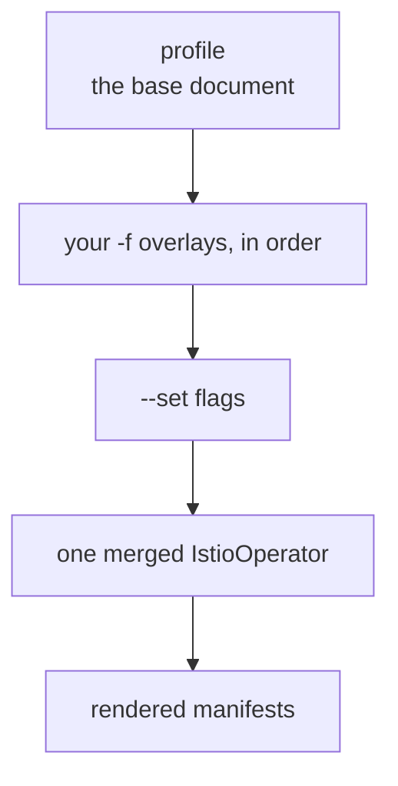

# Part 1 — The Four Configuration Layers

> Prerequisite: [the module landing page](./course.md). Next: [Part 2 — meshConfig: From File To ConfigMap To Proxy](./course-02-meshconfig-from-file-to-proxy.md).

Every install-time setting in Istio lives in one of four places in an `IstioOperator` document. They are not four styles of writing the same thing — they take different effect, at different times, on different objects. This part settles which is which, so that Parts 2 and 3 can talk about a specific layer without ambiguity.

## The document, and what each key owns

```yaml
apiVersion: install.istio.io/v1alpha1
kind: IstioOperator
spec:
  profile: demo          # 1. the baseline document
  components: {}         # 2. which components exist + their Kubernetes settings
  meshConfig: {}         # 3. mesh-wide runtime behaviour
  values: {}             # 4. raw Helm values passthrough
```

Read it as a pipeline: `profile` picks a starting document, `components` and `meshConfig` are the structured, supported ways to deviate from it, and `values` is the escape hatch for anything the structured API has not modelled.

**`spec.components` — what is deployed, and how big.** It turns a component on or off and configures it *as a Kubernetes workload*. Concretely, `components.egressGateways[0].enabled: false` deletes a Deployment, and `components.pilot.k8s.resources.requests.cpu: 100m` changes a field on a pod template. The component names map onto what you saw in `istio-system`:

| Key | Object in the cluster |
| --- | --- |
| `components.base` | The CRDs and cluster-scoped resources |
| `components.pilot` | The `istiod` Deployment (historical name) |
| `components.ingressGateways[]` | One Deployment + Service per list entry |
| `components.egressGateways[]` | Same, for egress |
| `components.cni`, `components.ztunnel` | The ambient DaemonSets (section 040) |

Under any component, `k8s:` is the fixed sub-key for Kubernetes-level settings — `resources`, `replicaCount`, `hpaSpec`, `nodeSelector`, `service`, `serviceAnnotations`. If a setting would be a field on a Deployment or a Service, it goes under `k8s:`.

**`spec.meshConfig` — how deployed things behave.** Access log destination and format, outbound traffic policy, tracing providers, default proxy settings. Nothing here changes *what* is deployed; it changes what the deployed proxies do. Part 2 follows one of these settings from the file to a running proxy.

**`spec.values` — the passthrough.** It is handed straight to the underlying Helm charts and uses the identical tree to the values file in [section 010's Helm module](../../section-010/module-02/course-02-installing-the-releases.md). Reach for it when a chart exposes something the structured API does not.

## When two layers could set the same thing

`components` and `values` overlap, because `components` is a structured front end over a subset of what `values` can reach. Two rules resolve it:

1. **Prefer the structured field.** `components` and `meshConfig` are the interface Istio commits to keeping stable. `values` is a passthrough to chart internals, with weaker compatibility guarantees across versions.
2. **When both set the same thing, `components` wins.** It is applied after the values overlay during rendering. Relying on that precedence is a bad idea regardless — setting one thing in two places is how a future reader ends up changing the one that does nothing.

The practical form of both rules: use `values` only for settings with no `components` or `meshConfig` equivalent, and leave a comment saying why.

## How the layers merge



Later sources win field by field, not document by document — so an overlay that sets one key leaves every other key from the profile intact.

Part 1 of the section 010 istioctl module described the overlay order for *sources* — profile, then `-f` files, then `--set` flags. Within a single document, the layers are not a priority stack at all: they configure disjoint things and are all applied. `profile` is the only one that behaves like a base to be overridden.

Merging is **per field, not per block**. Setting `components.pilot.k8s.resources.requests.cpu` does not discard the rest of `components.pilot` from the profile; it replaces that one leaf. The exception is lists, and that exception has teeth — Part 3 covers it.

The way to make this concrete is `istioctl manifest generate`, which runs the install's rendering stages and prints the Kubernetes objects a document would produce, without touching the cluster. (Older Istio had an `istioctl profile dump` command for this; that family was removed, and `manifest generate` replaced it.)

> [!TIP]
> **Try it — see the `components` layer as real objects**
>
> ```sh
> istioctl manifest generate --set profile=demo | grep -E '^kind:' | sort | uniq -c | sort -rn | head -6
> istioctl manifest generate --set profile=demo | grep -E '^  name: istio-(ingress|egress)gateway$' | sort -u
> ```
>
> Expect something like:
>
> ```text
>   15 kind: CustomResourceDefinition
>    4 kind: ServiceAccount
>    3 kind: Service
>    3 kind: RoleBinding
>    3 kind: Role
>    3 kind: Deployment
>
>   name: istio-egressgateway
>   name: istio-ingressgateway
> ```
>
> Three Deployments — `istiod` and both gateways — is the `components` layer made visible, and the fifteen CRDs are the `base` component. Nothing here is `meshConfig`: that layer creates no objects of its own, it is rendered into the contents of a ConfigMap, which is what Part 2 reads.

## The boundary that decides whether this module applies at all

Before choosing a layer, check the requirement belongs at install time. The test is whether the setting describes *the mesh's plumbing* or *the traffic flowing through it*.

| Belongs in `IstioOperator` | Belongs in a runtime resource |
| --- | --- |
| Whether an egress gateway exists | Which external hosts are reachable (`ServiceEntry`) |
| `istiod` replicas, CPU, autoscaling | Retries and timeouts for one service (`VirtualService`) |
| Mesh-wide access logging (`meshConfig`) | Access logging for one workload (`Telemetry`) |
| Default sidecar resource requests | mTLS mode for a namespace (`PeerAuthentication`) |
| Which trust domain the mesh uses | Who may call what (`AuthorizationPolicy`) |

Two practical consequences. First, a runtime change takes effect in seconds with no control plane restart; an install-time change re-runs the install and rolls `istiod`. Reaching for the heavier tool when the lighter one exists is a self-inflicted outage risk.

Second, install-time settings are **mesh-wide by construction**. `meshConfig` applies to every proxy, gateways included. When a requirement is genuinely per-namespace or per-workload, the install-time layer cannot express it, and forcing it there means changing behaviour for workloads nobody asked you to touch.

> [!TIP]
> **Try it — confirm what the baseline does and does not set**
>
> ```sh
> kubectl -n istio-system get cm istio -o jsonpath='{.data.mesh}' | grep -E 'accessLogFile|outboundTrafficPolicy' || echo '(neither key is present)'
> kubectl -n istio-system get deploy -o custom-columns='NAME:.metadata.name,CPU-REQ:.spec.template.spec.containers[0].resources.requests.cpu'
> ```
>
> Expect something like:
>
> ```text
> (neither key is present)
>
> NAME                   CPU-REQ
> istio-egressgateway    10m
> istiod                 500m
> istio-ingressgateway   10m
> ```
>
> Absence is meaningful here: the stock `demo` profile sets neither `accessLogFile` nor `outboundTrafficPolicy`, so the built-in defaults apply. Those two keys appearing later is how you will know your own document took effect. The CPU requests come from the profile's `components.*.k8s.resources` blocks — a `components` layer setting, visible on an ordinary Deployment.

> *`components` decides what exists and how big; `meshConfig` decides how it behaves; `values` is the escape hatch — and none of them is the right place for something a runtime resource can express.*

## Common pitfalls

> [!WARNING]
> **Setting a runtime concern at install time.** Gateways, routing and policy are objects you apply to a running mesh, not installation fields.
>
> **Expecting a merge to replace a whole block.** The merge is per field, so a partial overlay leaves the rest of the profile in place.
>
> **Putting a value in the wrong layer.** `meshConfig` is mesh-wide; component settings are per component. Both are accepted, only one takes effect.
>
> **Losing the overlay.** The merged document exists only during the render, so the file you passed is the only record of what you chose.

## Reference

- [Customizing the configuration](https://istio.io/v1.30/docs/setup/additional-setup/customize-installation/) — the `components` / `meshConfig` / `values` split in Istio's own words.
- [IstioOperator API](https://istio.io/v1.30/docs/reference/config/istio.operator.v1alpha1/) — the schema for every key in this part.
- [Global mesh options](https://istio.io/v1.30/docs/reference/config/istio.mesh.v1alpha1/) — every `meshConfig` field and its default.
- `istioctl manifest generate --set profile=<name> | less` — the fastest way to see what a profile actually produces on the version you have.
