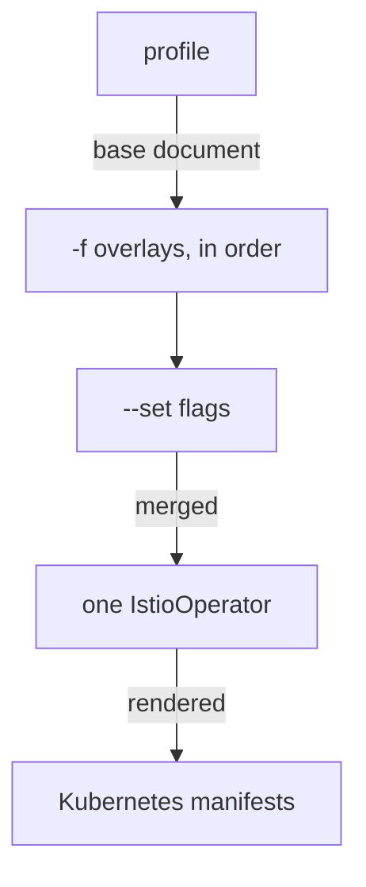

# The Four Configuration Layers

A change to an Istio installation can apply cleanly and still do nothing. The usual cause is that the setting sits in the wrong part of the file. Every installation setting in Istio lives in one of four places in an `IstioOperator` document. An `IstioOperator` document is the YAML file you pass to `istioctl install`; it describes the whole Istio installation you want.

The four places are not four ways to write the same thing. They take effect at different times, on different objects. This part sorts out which is which, so you always know where a setting belongs.

## The document, and what each key owns

The four layers are the four keys under `spec`. Here is the empty shape of the document:

```yaml
apiVersion: install.istio.io/v1alpha1
kind: IstioOperator
spec:
  profile: demo          # 1. the baseline document
  components: {}         # 2. which components exist + their Kubernetes settings
  meshConfig: {}         # 3. mesh-wide runtime behaviour
  values: {}             # 4. raw Helm values passthrough
```

Read it from top to bottom. `profile` picks one of the built-in documents that come with `istioctl`, such as `demo`. `components` and `meshConfig` are the supported, structured ways to change that profile. `values` is the fallback for anything the structured layers do not cover. The next three sections look at the last three keys one by one.

### `spec.components`: what is deployed, and how big

The `components` layer turns a component on or off, and configures it as a Kubernetes workload. For example, `components.egressGateways[0].enabled: false` removes a Deployment. `components.pilot.k8s.resources.requests.cpu: 100m` changes one field on a pod template.

Each component name maps to objects you can see in `istio-system`:

| Key | Object in the cluster |
| --- | --- |
| `components.base` | The CRDs and cluster-scoped resources |
| `components.pilot` | The `istiod` Deployment (historical name) |
| `components.ingressGateways[]` | One Deployment + Service per list entry |
| `components.egressGateways[]` | Same, for egress |
| `components.cni`, `components.ztunnel` | The ambient DaemonSets |

A CRD (Custom Resource Definition) adds a new object kind to the Kubernetes API, for example `VirtualService`. `pilot` is the old name of the component that became `istiod`. `istiod` is Istio's control plane: it turns Istio resources into proxy configuration and sends it, together with certificates, to every proxy.

Under any component, `k8s:` is the fixed sub-key for Kubernetes settings: `resources`, `replicaCount`, `hpaSpec`, `nodeSelector`, `service` and `serviceAnnotations`. If a setting would be a field on a Deployment or a Service, it goes under `k8s:`.

### `spec.meshConfig`: how deployed things behave

The `meshConfig` layer holds mesh-wide settings. Examples are where to write access logs and in what format, which outbound destinations are allowed, tracing, and default proxy settings. Nothing here changes *what* is deployed. It changes what the deployed proxies do. A proxy here is the Envoy sidecar proxy, a container Istio adds to each pod; all inbound and outbound traffic of the pod passes through it.

### `spec.values`: the passthrough

The `values` layer goes straight to the Helm charts that `istioctl` uses inside. Helm is a package manager for Kubernetes, and a chart is one Helm package. `values` uses exactly the same tree as a Helm values file for the `istiod` chart. Use it when a chart offers a setting that the structured layers do not.

## When two layers could set the same thing

Knowing what each layer owns leaves one problem: `components` and `values` overlap. That is because `components` is a structured front end over part of what `values` can reach. Two rules settle it:

1. **Prefer the structured field.** Istio promises to keep `components` and `meshConfig` stable. `values` passes straight into the inside of the charts, and it can change more between versions.
2. **When both set the same thing, `components` wins.** `istioctl` applies it after the `values` overlay while it renders the document. Do not rely on this. Setting one thing in two places is how a future reader ends up changing the copy that does nothing.

In practice, use `values` only for settings with no `components` or `meshConfig` field, and leave a comment that says why.

## How the layers merge

The layers live in one document, but that document is only one of the inputs. `istioctl install` builds one final document from several sources before it renders anything. This section shows the order of those sources, and the one rule about how fields combine.

### The order of the sources

`istioctl` reads the sources in a fixed order, and a later source wins:



The diagram shows that the profile is the base, your `-f` files go on top of it in the order you give them, and `--set` flags go on top of everything.

Inside one document, the four layers are not a priority stack. They configure different things, and `istioctl` applies all of them. Only `profile` behaves like a base that the rest overrides.

### The merge is per field

`istioctl` merges **one field at a time, not one block at a time**. Setting `components.pilot.k8s.resources.requests.cpu` does not throw away the rest of `components.pilot` from the profile. It replaces that one leaf, and everything else stays.

Lists are the exception, and it is an important one. `istioctl` matches list entries by their `name`, and it adds an entry whose name matches nothing as a new entry.

## What a profile renders to

The merged document is only an input. What reaches the cluster is the set of Kubernetes objects `istioctl` renders from it. `istioctl manifest generate` runs every rendering stage of `istioctl install` and prints those objects, without touching the cluster. Older Istio had an `istioctl profile dump` command for this; it was removed, and `manifest generate` replaced it.

Count the kinds of object the `demo` profile produces, and list its gateways:

<!-- astrona:playground:renew -->

```sh
istioctl manifest generate --set profile=demo | grep -E '^kind:' | sort | uniq -c | sort -rn | head -6
istioctl manifest generate --set profile=demo | grep -E '^  name: istio-(ingress|egress)gateway$' | sort -u
```

The output looks like this:

```text
  15 kind: CustomResourceDefinition
   4 kind: ServiceAccount
   3 kind: Service
   3 kind: RoleBinding
   3 kind: Role
   3 kind: Deployment

  name: istio-egressgateway
  name: istio-ingressgateway
```

The three Deployments (`istiod` and both gateways) are the `components` layer made visible, and the fifteen CRDs are the `base` component. Nothing here comes from `meshConfig`. That layer creates no objects of its own; `istioctl` writes it into the contents of a ConfigMap instead.

## The line between installation and runtime

Before you choose a layer, check that the requirement belongs in the installation at all. This section gives you the test, and then shows what the unchanged cluster sets.

### Plumbing or traffic?

The test is simple: does the setting describe the mesh's plumbing, or the traffic that flows through it? Plumbing goes in the `IstioOperator` document. Traffic rules are runtime resources. A runtime resource is an ordinary Kubernetes object that you apply and delete at any time, and `istiod` picks it up within seconds.

| Belongs in `IstioOperator` | Belongs in a runtime resource |
| --- | --- |
| Whether an egress gateway exists | Which external hosts are reachable (`ServiceEntry`) |
| `istiod` replicas, CPU, autoscaling | Retries and timeouts for one service (`VirtualService`) |
| Mesh-wide access logging (`meshConfig`) | Access logging for one workload (`Telemetry`) |
| Default sidecar resource requests | mTLS mode for a namespace (`PeerAuthentication`) |
| Which trust domain the mesh uses | Who may call what (`AuthorizationPolicy`) |

The right column lists Istio resource kinds. A `ServiceEntry` adds a host outside the cluster to Istio's list of known services. A `VirtualService` sets routing rules for a host, and a `Telemetry` resource sets logging, metrics and tracing for a scope. A `PeerAuthentication` sets the mTLS (mutual Transport Layer Security, where both sides prove their identity with certificates) mode, and an `AuthorizationPolicy` decides which callers may reach a workload.

Two things follow from the table. First, a runtime change takes effect in seconds with no control plane restart. An installation change runs the install again and rolls out `istiod` again. Picking the heavy tool when the light one exists is a risk you create yourself.

Second, installation settings are **mesh-wide by design**. `meshConfig` applies to every proxy, gateways included. If a requirement is really for one namespace or one workload, the installation layer cannot express it. Forcing it there changes the behaviour of workloads nobody asked you to touch.

### What the unchanged cluster sets

With the test in mind, look at what the unchanged `demo` profile sets for access logging and outbound traffic, and how much CPU each Deployment requests:

```sh
kubectl -n istio-system get cm istio -o jsonpath='{.data.mesh}' | grep -E 'accessLogFile|outboundTrafficPolicy' || echo '(neither key is present)'
kubectl -n istio-system get deploy -o custom-columns='NAME:.metadata.name,CPU-REQ:.spec.template.spec.containers[0].resources.requests.cpu'
```

The output looks like this:

```text
(neither key is present)

NAME                   CPU-REQ
istio-egressgateway    10m
istiod                 500m
istio-ingressgateway   10m
```

The missing keys tell you something. The built-in `demo` profile sets neither `accessLogFile` nor `outboundTrafficPolicy`, so the built-in defaults apply. When those two keys appear later, you know your own document took effect. The CPU requests come from the profile's `components.*.k8s.resources` blocks: a `components` setting, visible on an ordinary Deployment.

You now know that `components` decides what exists and how big it is, `meshConfig` decides how it behaves, and `values` is the fallback for anything else. You also know that none of them is the right place for something a runtime resource can express. The open question is how a `meshConfig` setting gets from your file to a running proxy, and how to check each step on the way.

## Common pitfalls

> [!WARNING]
> **Setting a runtime concern at install time.** Routing, policy and per-workload behaviour are objects you apply to a running mesh, not installation fields.
>
> **Expecting a merge to replace a whole block.** The merge is per field, so a partial overlay leaves the rest of the profile in place.
>
> **Putting a value in the wrong layer.** `meshConfig` is mesh-wide; component settings are per component. Both are accepted, but only the right one takes effect.
>
> **Losing the overlay.** The merged document exists only during the render, so the file you passed is the only record of what you chose.
