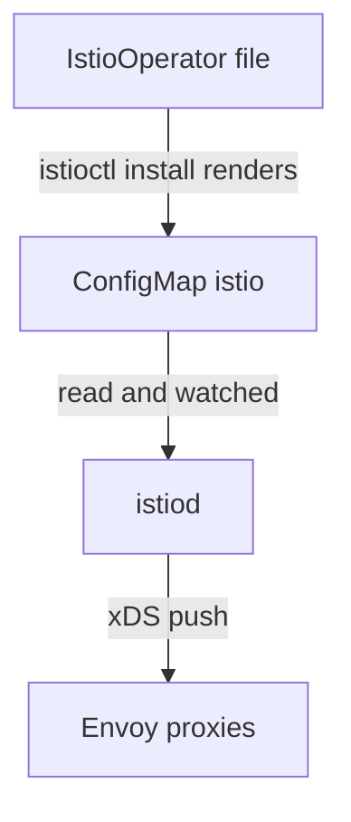

# meshConfig: From File To ConfigMap To Proxy

`meshConfig` holds the fleet's standing orders: mesh-wide settings such as access logging and which outbound destinations are allowed. Of the four layers in an `IstioOperator` document, it is the one whose live value you can read straight back from the cluster. That makes it your fastest debugging tool.

In this part you follow one setting all the way from your file to a proxy that enforces it, and learn the check for each stop on the way. You can use the same order of checks for any mesh-wide setting.

## The path a setting travels

A `meshConfig` setting passes through four stops before a proxy acts on it. Knowing the stops tells you where to look when a setting "does not work".

### Four stops



The diagram shows the path: your file is rendered into the `istio` ConfigMap in `istio-system` (its `mesh` key holds the whole `meshConfig` block as YAML), `istiod` reads that ConfigMap at startup and watches it for changes, and `istiod` then sends the new orders to every connected proxy.

That last step is an xDS push: mission control radioing new orders to every ship in flight, with no landing and no restart. Only the first stop is a file you own. A setting that is right in the file but missing from the ConfigMap failed early. A setting that is in the ConfigMap but not in effect failed at the proxy.

### A check for every stop

Each stop has its own question and its own command:

| Stage | Question | Check |
| --- | --- | --- |
| File | Did I write it correctly? | `istioctl validate -f`, `istioctl manifest generate -f` |
| ConfigMap | Did it reach the cluster? | `kubectl -n istio-system get cm istio -o jsonpath='{.data.mesh}'` |
| Control plane | Did `istiod` act on it? | `istioctl proxy-status`: are proxies `SYNCED` or `STALE`? |
| Proxy | Is it being enforced? | Real traffic, or `istioctl proxy-config` |

Most wasted debugging time comes from jumping straight to the last row. "The setting is not working" can be four different faults. The ConfigMap check takes two seconds and rules out half of them.

## The ConfigMap is the control plane's input

`istiod` never reads your `IstioOperator` file. `istioctl install` renders the file on your own machine, and the file itself never reaches the cluster. What reaches the cluster is the ConfigMap named `istio` in `istio-system`: mission control's notice board with the standing orders pinned on it.

That has one useful effect and one dangerous one. Useful: the ConfigMap is a clear record of what mission control was told, no matter what is on anyone's disk. Dangerous: it is an ordinary ConfigMap, so `kubectl edit` works on it, `istiod` picks up the change, and the next `istioctl install` quietly puts the old value back. Editing it by hand is fine for a quick test and a terrible way to configure a cluster.

### See it in your playground

Read the standing orders of the untouched `demo` installation:

<!-- astrona:playground:renew -->

```sh
kubectl -n istio-system get cm istio -o jsonpath='{.data.mesh}'
```

Expect something like:

```text
defaultConfig:
  discoveryAddress: istiod.istio-system.svc:15012
  proxyMetadata: {}
  tracing:
    zipkin:
      address: zipkin.istio-system:9411
defaultProviders:
  metrics:
  - prometheus
enablePrometheusMerge: true
rootNamespace: istio-system
trustDomain: cluster.local
```

There is no `accessLogFile` key and no `outboundTrafficPolicy` key. The stock `demo` profile does not set them. Missing means "the built-in default applies", not "off".

Notice `defaultConfig` too. It is the block that becomes each proxy's own settings, including `discoveryAddress`: that is how a sidecar knows where to find `istiod`.

## Applying a mesh-wide change

Now set two `meshConfig` keys and watch them appear. The second one changes how every meshed workload reaches the outside world, so read what it does first.

### What `REGISTRY_ONLY` does

`outboundTrafficPolicy.mode` has two values. `ALLOW_ANY`, the default, lets a meshed pod connect to any host, whether or not Istio knows about it. `REGISTRY_ONLY` blocks every destination that is not in the mesh registry, Istio's star chart of known destinations: if a host is not a Kubernetes Service and not added with a `ServiceEntry`, the signal falls into a black hole.

That is a useful security setting. It is also an outage if you turn it on without first listing what your workloads call outside the cluster. On this playground it is safe. On a shared cluster, expect calls to external APIs, package mirrors and webhooks to start failing the moment it takes effect.

### Write and apply the change

Save this as `istio-custom.yaml`:

```yaml
apiVersion: install.istio.io/v1alpha1
kind: IstioOperator
spec:
  profile: demo
  meshConfig:
    accessLogFile: /dev/stdout
    outboundTrafficPolicy:
      mode: REGISTRY_ONLY
```

Apply it:

```sh
istioctl install -f istio-custom.yaml -y
```

Then check the result at the ConfigMap stop and the control plane stop:

```sh
kubectl -n istio-system get cm istio -o jsonpath='{.data.mesh}' | grep -A2 -E 'accessLogFile|outboundTrafficPolicy'
istioctl proxy-status
```

Expect something like:

```text
accessLogFile: /dev/stdout
outboundTrafficPolicy:
  mode: REGISTRY_ONLY

NAME                                   CLUSTER      CDS      LDS      EDS      RDS        ISTIOD
istio-ingressgateway-...istio-system   Kubernetes   SYNCED   SYNCED   SYNCED   NOT SENT   istiod-...
```

Both keys are now in the ConfigMap, so the second stop is confirmed. Every proxy showing `SYNCED` confirms the third stop: `istiod` worked out the new orders and pushed them, and the proxies accepted them. A few seconds of `STALE` right after an install is normal. A `STALE` that stays means a proxy is not accepting what it is sent.

## Confirming enforcement with real traffic

The ConfigMap proves the setting was stored, and `proxy-status` proves it was pushed. Neither proves a proxy is *acting* on it. For `REGISTRY_ONLY` you can see the difference directly: a pod in the mesh loses access to hosts the mesh does not know, while Services inside the cluster keep working.

### See it in your playground

Switch on injection for the `default` namespace, start a `tester` pod with `curl` (your test shuttle), and send one signal outside the cluster and one inside it:

```sh
kubectl label namespace default istio-injection=enabled --overwrite
kubectl run tester --image=curlimages/curl:8.11.1 --command -- sh -c 'sleep 3600'
kubectl wait --for=condition=Ready pod/tester --timeout=120s
kubectl exec tester -c tester -- curl -s -o /dev/null -w 'external: %{http_code}\n' http://example.com
kubectl exec tester -c tester -- curl -s -o /dev/null -w 'in-cluster: %{http_code}\n' http://istiod.istio-system.svc:15014/ready
```

Expect something like:

```text
external: 502
in-cluster: 200
```

The tester's sidecar refuses the external host with `502`, and the Service inside the cluster answers normally. Nothing about the pod changed between the two calls. The proxy is applying a mesh-wide rule that arrived through the ConfigMap.

This is also exactly what it looks like when someone turns on `REGISTRY_ONLY` by accident, so it is worth seeing once on purpose.

### Reading the failure

The failure is a `502` from the proxy, not a timeout or a name lookup error. That difference is the clue. A timeout suggests a problem with the network path. An immediate `502` from a meshed pod to an external host suggests mesh policy.

The access logs you just switched on make it explicit: `kubectl logs tester -c istio-proxy --tail=5` shows the refused request, with a response flag saying no route was found.

## Why a setting can be in the ConfigMap and still not apply

Two things cause this, and both are worth recognising.

**The proxy has not received the push.** `istiod` sends settings that come from `meshConfig` on its normal push cycle. A proxy that is disconnected, restarting or stuck keeps its old orders. `proxy-status` shows this as `STALE`, or the proxy is missing from the list.

**A runtime resource overrides it.** `meshConfig` sets *defaults*. A `Telemetry` resource can change logging for one namespace. A `DestinationRule` can change TLS behaviour for one host. A `ServiceEntry` adds a planet from another solar system to the star chart, so that one external host becomes reachable even under `REGISTRY_ONLY`. In each case the more specific runtime object wins, on purpose, and the ConfigMap still shows your mesh-wide setting, in effect everywhere else.

That second case is not a bug to fix. It is the layers working as designed. So when "the ConfigMap says X and this workload does Y", look next at the runtime resources that apply to that workload.

## Common pitfalls

> [!WARNING]
> **Editing the `istio` ConfigMap by hand.** It works until the next `istioctl install` renders the ConfigMap from your document and overwrites the edit.
>
> **Expecting every `meshConfig` change to need a restart.** `istiod` watches the ConfigMap and pushes again; a restart is the exception, not the rule.
>
> **Reading the ConfigMap as proof of enforcement.** It is the control plane's input. Whether a proxy acts on it is a separate question, and real traffic answers it.
>
> **Assuming a mistyped key is rejected.** An unknown field can be carried into the ConfigMap and ignored by everything after it.
>
> **Turning on `REGISTRY_ONLY` without a list of outbound dependencies.** Every external host your workloads call starts failing with `502` until it gets a `ServiceEntry`.
