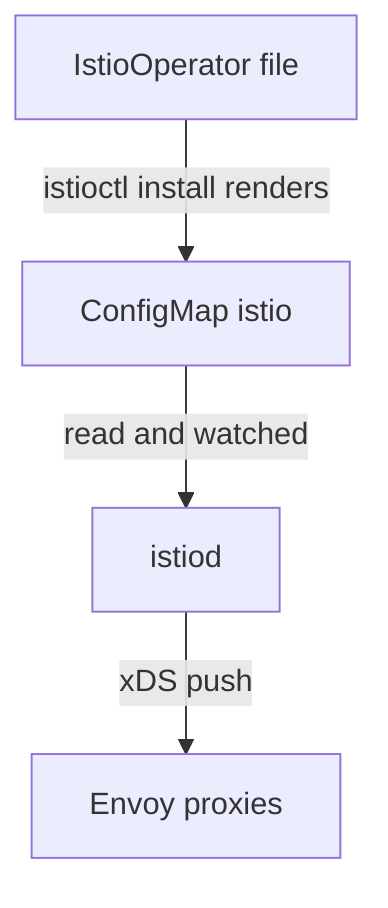

# meshConfig: From File To ConfigMap To Proxy

"I set it, and it does not work" is the most common complaint about a mesh-wide setting. `meshConfig` is the layer of an `IstioOperator` document that holds those settings, such as access logging and which outbound destinations are allowed. Of the four layers in the document, it is the one whose live value you can read straight back from the cluster. That makes it your fastest debugging tool.

In this part you follow one setting all the way from your file to a proxy that enforces it, and learn the check for each step on the way. You can use the same order of checks for any mesh-wide setting.

## The path a setting travels

A `meshConfig` setting passes through four stops before a proxy acts on it. When you know the stops, you know where to look when a setting "does not work".

### Four stops



The diagram shows the path from your file, through the `istio` ConfigMap and `istiod`, to every Envoy proxy.

`istioctl install` renders your file into the ConfigMap named `istio` in `istio-system`. Its `mesh` key holds the whole `meshConfig` block as YAML. `istiod`, Istio's control plane, reads that ConfigMap at startup and watches it for changes. `istiod` then sends the new settings to every connected proxy.

That last step is an xDS push. xDS is the protocol `istiod` uses to send configuration to Envoy proxies while they run, with no restart. Only the first stop is a file you own. A setting that is right in the file but missing from the ConfigMap failed early. A setting that is in the ConfigMap but not in effect failed at the proxy.

### A check for every stop

Because each stop can fail on its own, each stop has its own question and its own command:

| Stage | Question | Check |
| --- | --- | --- |
| File | Did I write it correctly? | `istioctl validate -f`, `istioctl manifest generate -f` |
| ConfigMap | Did it reach the cluster? | `kubectl -n istio-system get cm istio -o jsonpath='{.data.mesh}'` |
| Control plane | Did `istiod` act on it? | `istioctl proxy-status`: are proxies `SYNCED` or `STALE`? |
| Proxy | Is it being enforced? | Real traffic, or `istioctl proxy-config` |

Most wasted debugging time comes from jumping straight to the last row. "The setting is not working" can be four different faults. The ConfigMap check takes two seconds and rules out half of them.

## The ConfigMap is the control plane's input

The ConfigMap check works because of one fact: `istiod` never reads your `IstioOperator` file. `istioctl install` renders the file on your own machine, and the file itself never reaches the cluster. What reaches the cluster is the `istio` ConfigMap in `istio-system`, and that ConfigMap is what `istiod` reads.

That has one useful effect and one dangerous one. The useful effect is that the ConfigMap is a clear record of what `istiod` was told, no matter what is on anyone's disk. The dangerous effect is that it is an ordinary ConfigMap, so `kubectl edit` works on it. `istiod` picks up the hand edit, and the next `istioctl install` puts the old value back without a warning. A hand edit is fine for a quick test and a bad way to configure a cluster.

Read the mesh configuration of the unchanged `demo` installation:

<!-- astrona:playground:renew -->

```sh
kubectl -n istio-system get cm istio -o jsonpath='{.data.mesh}'
```

The output looks like this:

```text
accessLogFile: /dev/stdout
defaultConfig:
  discoveryAddress: istiod.istio-system.svc:15012
defaultProviders:
  metrics:
  - prometheus
enablePrometheusMerge: true
extensionProviders:
- envoyOtelAls:
    port: 4317
    service: opentelemetry-collector.observability.svc.cluster.local
  name: otel
- name: skywalking
  skywalking:
    port: 11800
    service: tracing.istio-system.svc.cluster.local
- name: otel-tracing
  opentelemetry:
    port: 4317
    service: opentelemetry-collector.observability.svc.cluster.local
- name: jaeger
  opentelemetry:
    port: 4317
    service: jaeger-collector.istio-system.svc.cluster.local
rootNamespace: istio-system
trustDomain: cluster.local
```

`accessLogFile: /dev/stdout` is already there, because the `demo` profile turns on access logging. There is no `outboundTrafficPolicy` key, because the profile does not set it. A missing key means "the built-in default applies", not "off"; for `outboundTrafficPolicy` the default is `ALLOW_ANY`. The `extensionProviders` list names telemetry backends that the `demo` profile defines but does not use until a `Telemetry` resource points at them.

Notice `defaultConfig` too. It is the block that becomes each proxy's own settings, including `discoveryAddress`. That field tells a sidecar proxy the address of `istiod`.

## Applying a mesh-wide change

Now that you know what the unchanged ConfigMap holds, set two `meshConfig` keys and watch the new one appear. The second key changes how every workload in the mesh reaches the outside world, so first read what it does.

### What `REGISTRY_ONLY` does

`outboundTrafficPolicy.mode` has two values. `ALLOW_ANY`, the default, lets a pod in the mesh connect to any host, whether or not Istio knows about it. `REGISTRY_ONLY` blocks every destination that is not in the mesh registry. The mesh registry is the list of services Istio knows about: every Kubernetes Service, plus every host added with a `ServiceEntry` resource. With `REGISTRY_ONLY`, the sidecar proxy refuses a request to any other host.

That is a useful security setting. It also causes an outage if you turn it on before you list what your workloads call outside the cluster. On this playground it is safe. On a shared cluster, expect calls to external APIs, package mirrors and webhooks to fail as soon as it takes effect.

### Write and apply the change

The change is a short `IstioOperator` document that keeps the `demo` profile and sets two `meshConfig` keys. `accessLogFile` has the same value the profile already sets; writing it down in your own file keeps the setting even if someone later changes the profile. Save this as `istio-custom.yaml`:

```yaml
apiVersion: install.istio.io/v1alpha1
kind: IstioOperator
spec:
  profile: demo
  meshConfig:
    accessLogFile: /dev/stdout
    outboundTrafficPolicy:
      mode: REGISTRY_ONLY
```

Apply it:

```sh
istioctl install -f istio-custom.yaml -y
```

Then check the result at the ConfigMap stop and the control plane stop:

```sh
kubectl -n istio-system get cm istio -o jsonpath='{.data.mesh}' | grep -A2 -E 'accessLogFile|outboundTrafficPolicy'
istioctl proxy-status
```

The output looks like this:

```text
accessLogFile: /dev/stdout
defaultConfig:
  discoveryAddress: istiod.istio-system.svc:15012
--
outboundTrafficPolicy:
  mode: REGISTRY_ONLY
rootNamespace: istio-system
NAME                                                   CLUSTER        ISTIOD                      VERSION     SUBSCRIBED TYPES
istio-egressgateway-b7dd4655b-qn8b6.istio-system       Kubernetes     istiod-7dc9684c55-gsnz6     1.30.5      3 (CDS,LDS,EDS)
istio-ingressgateway-7f54444996-zn2k8.istio-system     Kubernetes     istiod-7dc9684c55-gsnz6     1.30.5      3 (CDS,LDS,EDS)
```

`grep -A2` prints two lines after each match, and `--` separates the two matches. Both keys are now in the ConfigMap, so the second stop is confirmed. `proxy-status` lists both gateways, connected to `istiod`. To see whether each proxy accepted the new configuration, add `-v 1`, which prints the sync state of every xDS type:

```sh
istioctl proxy-status -v 1
```

```text
NAME                                                   CLUSTER        CDS             ECDS        EDS             LDS             RDS         ISTIOD                      VERSION
istio-egressgateway-b7dd4655b-qn8b6.istio-system       Kubernetes     SYNCED (4s)     IGNORED     SYNCED (4s)     SYNCED (4s)     IGNORED     istiod-7dc9684c55-gsnz6     1.30.5
istio-ingressgateway-7f54444996-zn2k8.istio-system     Kubernetes     SYNCED (4s)     IGNORED     SYNCED (4s)     SYNCED (4s)     IGNORED     istiod-7dc9684c55-gsnz6     1.30.5
```

`SYNCED (4s)` confirms the third stop: four seconds ago `istiod` pushed the new configuration, and the proxy accepted it. `IGNORED` means the proxy did not ask for that type; the gateways have no `Gateway` resource yet, so they need no routes (`RDS`). A few seconds of `STALE` right after an install is normal. A `STALE` that stays means a proxy does not accept what `istiod` sends.

## Confirming enforcement with real traffic

The ConfigMap proves that the cluster stored the setting, and `proxy-status` proves that `istiod` pushed it. Neither proves that a proxy *acts* on it. For `REGISTRY_ONLY` you can see the difference directly: a pod in the mesh loses access to hosts the mesh does not know, while Services inside the cluster keep working.

Turn on sidecar injection for the `default` namespace, start a `tester` pod that has `curl`, and send one request to a host outside the cluster and one to a Service inside it:

```sh
kubectl label namespace default istio-injection=enabled --overwrite
kubectl run tester --image=curlimages/curl:8.11.1 --command -- sh -c 'sleep 3600'
kubectl wait --for=condition=Ready pod/tester --timeout=120s
kubectl exec tester -c tester -- curl -s -o /dev/null -w 'external: %{http_code}\n' http://example.com
kubectl exec tester -c tester -- curl -s -o /dev/null -w 'in-cluster: %{http_code}\n' http://istiod.istio-system.svc:15014/version
```

The output looks like this (shortened: the lines from `kubectl label`, `kubectl run` and `kubectl wait` are left out):

```text
external: 502
in-cluster: 200
```

The sidecar proxy of the `tester` pod refuses the external host with `502`, and the `istiod` Service inside the cluster answers normally on its monitoring port `15014`, where `/version` returns the `istiod` version. Nothing about the pod changed between the two requests. The proxy applies a mesh-wide rule that arrived through the ConfigMap. This is also exactly what it looks like when someone turns on `REGISTRY_ONLY` by accident, so it is worth seeing once on purpose.

The kind of failure is the clue. It is a `502` from the proxy, not a timeout or a name lookup error. A timeout points to a problem on the network path. An immediate `502` from a pod in the mesh to an external host points to mesh policy. The access log makes it explicit. Read the last lines of the `istio-proxy` container's log:

```sh
kubectl logs tester -c istio-proxy --tail=5
```

The output looks like this (shortened: the startup lines before the request are left out):

```text
[2026-10-09T23:46:40.561Z] "GET / HTTP/1.1" 502 - direct_response - "-" 0 0 0 - "-" "curl/8.11.1" "43e8081a-0b95-90c7-99be-34c0c5c8121f" "example.com" "-" - - 104.20.23.154:80 10.244.0.8:58124 - block_all
```

The fields after the status code are the response flag and the response code details. The response flag is a short Envoy code that says why a request failed; here it is `-`, because Envoy did not fail to reach anything. The details say `direct_response`: the proxy answered the request itself, without sending it on. The last field is the name of the route that matched, `block_all`. Under `REGISTRY_ONLY`, `istiod` gives every sidecar this route for hosts outside the mesh registry, and it answers with `502`.

## Why a setting can be in the ConfigMap and still not apply

Real traffic sometimes disagrees with the ConfigMap. Two things cause this, and both are worth recognising.

**The proxy has not received the push.** `istiod` sends settings that come from `meshConfig` on its normal push cycle. A proxy that is disconnected, restarting or stuck keeps its old configuration. `proxy-status` shows this as `STALE`, or the proxy is missing from the list.

**A runtime resource overrides it.** `meshConfig` sets *defaults*. A `Telemetry` resource can change logging for one namespace. A `DestinationRule`, which sets traffic policy such as TLS for one host, can change TLS behaviour for that host. A `ServiceEntry` adds one external host to the mesh registry, so that host becomes reachable even under `REGISTRY_ONLY`. In each case the more specific runtime object wins, on purpose. The ConfigMap still shows your mesh-wide setting, and it is in effect everywhere else.

That second case is not a bug to fix. It is the layers working as designed. So when "the ConfigMap says X and this workload does Y", look next at the runtime resources that apply to that workload.

You now know the four stops a `meshConfig` setting passes through, the check for each one, and how to prove enforcement with a real request. You also know the two reasons a proxy can disagree with the ConfigMap. The open question is how to write a full `IstioOperator` file that changes several layers at once, and how to catch a mistake in it before it reaches the cluster.

## Common pitfalls

> [!WARNING]
> **Editing the `istio` ConfigMap by hand.** It works until the next `istioctl install` renders the ConfigMap from your document and overwrites the edit.
>
> **Expecting every `meshConfig` change to need a restart.** `istiod` watches the ConfigMap and pushes again; a restart is the exception, not the rule.
>
> **Reading the ConfigMap as proof of enforcement.** It is the control plane's input. Whether a proxy acts on it is a separate question, and real traffic answers it.
>
> **Assuming a mistyped key is rejected.** An unknown field can be carried into the ConfigMap and ignored by everything after it.
>
> **Turning on `REGISTRY_ONLY` without a list of outbound dependencies.** Every external host your workloads call starts failing with `502` until it gets a `ServiceEntry`.
