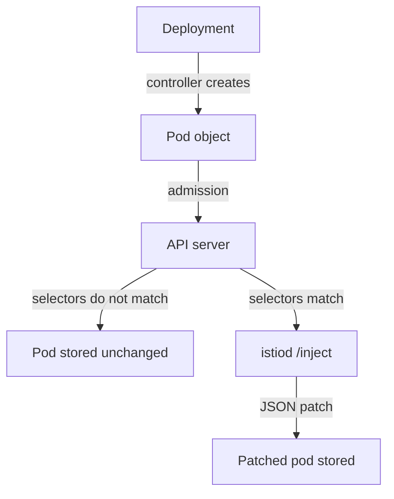

# Injection As Admission Control

You label a namespace for Istio, look at your pods, and nothing has changed. This is the most common injection surprise, and it is not a bug. **Sidecar injection** adds the `istio-proxy` container, the Envoy sidecar proxy that handles all traffic in and out of a pod, when the pod is created. Injection is not a special Istio feature bolted onto Kubernetes. It uses a standard Kubernetes extension point, and Istio registers a handler for it.

Once you know the path a pod takes through that extension point, the two rules that trip everyone up stop being facts to memorise. You can work them out yourself. This part builds that path, then tests it on the playground.

## The path a pod takes

Every new pod passes through the Kubernetes API server before it is stored and scheduled. The API server is the component that receives every create, update and delete request in the cluster. Injection happens inside it, at one exact moment.

Before the API server stores a new object, it runs **admission**: a set of checks, some of which may change the object. A **mutating admission webhook** is an outside service that the API server calls during admission. The webhook may answer with changes to the object. Istio's webhook service is `istiod`, the Istio control plane, and its change is "add the sidecar proxy".



The diagram shows that the Deployment controller creates the Pod object, the API server runs mutating admission, and only when the webhook's selectors match does the API server send the pod to `istiod`.

`istiod` answers with a JSON patch. The patch adds the `istio-proxy` container, the `istio-init` container, volumes, environment variables and annotations. Injection is a job for the API server, not for the scheduler. By the time a pod is on a node, the decision is made, and it is final for that pod.

Two facts follow from that path, and together they answer most injection questions. **First, the API server calls the webhook for Pods, not for Deployments.** Istio registers its handler for the `pods` resource and the `CREATE` operation, so it never sees your Deployment. Every label that affects injection must be somewhere the *pod* carries it.

**Second, the decision happens once, when the pod is created.** Mutating admission runs between the moment a request arrives and the moment the object is stored. Nothing watches for namespaces that become eligible later, because admission is not a loop that keeps checking. A pod stored without a sidecar never gets one. The only way to change it is to replace the pod.

## The two webhook entries

The two facts above say *when* the API server calls `istiod`. The webhook configuration says *for which pods*. Istio registers one `MutatingWebhookConfiguration` named `istio-sidecar-injector`, and it holds **two** webhook entries. Both send the pod to the same `istiod` endpoint. What differs is the selector that decides when each one fires.

| Entry | Fires when | Purpose |
| --- | --- | --- |
| `namespace.sidecar-injector.istio.io` | the **namespace** carries an injection label | The opt-in for a whole namespace |
| `object.sidecar-injector.istio.io` | the **pod** carries `sidecar.istio.io/inject: "true"` | The override for one workload, in a namespace that has not opted in |

That split is why a pod label can force injection in a namespace with no label. It is not a special case inside `istiod`. It is a second webhook entry with a different selector. The API server checks both, and a match on either one sends the pod to `istiod`.

Two selector fields do the work. The **`namespaceSelector`** is a label selector that the API server checks against the *namespace object*; this is why the namespace label exists at all. The **`objectSelector`** is a label selector that the API server checks against the *pod being admitted*.

You can read both selectors straight from the webhook configuration. This command prints, for each entry, the resource and operation it is registered for and its two selectors:

<!-- astrona:playground:renew -->

```sh
kubectl get mutatingwebhookconfiguration istio-sidecar-injector \
  -o jsonpath='{range .webhooks[*]}{"── "}{.name}{"\n  resources: "}{.rules[0].resources}{"\n  operations: "}{.rules[0].operations}{"\n  nsSelector: "}{.namespaceSelector}{"\n  objSelector: "}{.objectSelector}{"\n\n"}{end}'
```

The output looks like this (shortened):

```text
── namespace.sidecar-injector.istio.io
  resources: ["pods"]
  operations: ["CREATE"]
  nsSelector: {"matchExpressions":[{"key":"istio-injection","operator":"In","values":["enabled"]},...]}
  objSelector: {"matchExpressions":[{"key":"sidecar.istio.io/inject","operator":"NotIn","values":["false"]}]}

── object.sidecar-injector.istio.io
  resources: ["pods"]
  operations: ["CREATE"]
  nsSelector: {"matchExpressions":[{"key":"istio-injection","operator":"NotIn","values":["enabled"]},...]}
  objSelector: {"matchExpressions":[{"key":"sidecar.istio.io/inject","operator":"In","values":["true"]}]}
```

`resources: ["pods"]` and `operations: ["CREATE"]` are the two facts everything else follows from. Read the entries as a pair. The first says "the namespace opted in, and the pod did not opt out". The second says "the namespace did not opt in, but the pod opted in". Together they cover all four combinations.

## The starting state

With the selectors in hand, you can predict the playground's starting state. The playground created `inject-demo` with no injection label at all. Neither entry can match: the namespace has not opted in, and no pod template carries `sidecar.istio.io/inject: "true"`.

Check the namespace labels and the containers in each pod:

```sh
kubectl get ns inject-demo --show-labels
kubectl -n inject-demo get pods -o custom-columns='POD:.metadata.name,CONTAINERS:.spec.containers[*].name'
```

The output looks like this (shortened):

```text
NAME          STATUS   AGE    LABELS
inject-demo   Active   4m2s   kubernetes.io/metadata.name=inject-demo

POD                        CONTAINERS
batch-job-...              batch-job
logging-agent-...          logging-agent
notification-service-...   notification-service
```

The only label is the one Kubernetes adds by itself. Neither webhook entry matches, so the API server never calls `istiod`, and each pod has exactly one container. That is the *expected* state here, not a fault, and every later step is measured against it.

## Labelling, and why it seems to do nothing

The label `istio-injection=enabled` on the namespace makes the first webhook entry match. It applies to every pod created in the namespace from that moment on. Label the namespace, then look at the pods again:

```sh
kubectl label namespace inject-demo istio-injection=enabled
kubectl -n inject-demo get pods -o custom-columns='POD:.metadata.name,CONTAINERS:.spec.containers[*].name'
```

The output looks like this (shortened):

```text
namespace/inject-demo labeled

POD                        CONTAINERS
batch-job-...              batch-job
logging-agent-...          logging-agent
notification-service-...   notification-service
```

The label is on, and every pod still has one container. This is not a delay, and waiting will not fix it. The API server admitted those pods before the webhook applied to them, and admission happens once per object.

Creating the pods again completes the change. `kubectl rollout restart deployment` is the right tool. The Deployment controller replaces the pods a few at a time, so the Service stays up while the new pods pass through admission:

```sh
kubectl -n inject-demo rollout restart deployment notification-service logging-agent batch-job
kubectl -n inject-demo rollout status deployment notification-service --timeout=120s
kubectl -n inject-demo get pods -o custom-columns='POD:.metadata.name,CONTAINERS:.spec.containers[*].name'
```

The output looks like this (shortened):

```text
POD                        CONTAINERS
batch-job-...              batch-job,istio-proxy
logging-agent-...          logging-agent,istio-proxy
notification-service-...   notification-service,istio-proxy
```

All three pods now carry `istio-proxy`, including `logging-agent`, which should not. The namespace label is a blunt tool that applies to every pod in the namespace. That is exactly why overrides for single workloads exist.

## What happens when the webhook cannot be reached

The restart worked because the API server could reach `istiod`. The webhook configuration has a `failurePolicy` field, and Istio sets it to `Fail`. If the API server cannot reach `istiod`, it **refuses** to create a pod in a matching namespace. It does not quietly go ahead without a sidecar.

That is the right default. Pods that silently miss their sidecar in a mesh that requires mTLS (mutual TLS, where both sides of a connection present a certificate) would be worse. But know the cost before it surprises you. A control plane outage does not only stop configuration updates. It stops new pods from starting in every injected namespace. Running pods keep running; the API server refuses new ones.

This is also why a stale webhook configuration, left behind by a removed install, causes so much trouble. It still points at an `istiod` that no longer exists, so pod creation fails. `istioctl x precheck` looks for exactly that.

You now know that the API server calls the injection webhook for Pods, on `CREATE` only, when the namespace or the pod carries the right label. A pod admitted without a sidecar keeps that state until it is created again. The open question is what happens when the namespace and the pod disagree, and which label Istio reads first.

## Common pitfalls

> [!WARNING]
> **Labelling a namespace and expecting running pods to change.** The decision is made at admission. Label first, then create the pods again.
>
> **Reading a missing sidecar as a broken webhook.** The far more common cause is a selector that does not match, or a pod created before the label existed.
>
> **Forgetting the webhook is in the request path.** If the API server cannot reach `istiod`, it refuses to create pods in injected namespaces, because Istio sets `failurePolicy: Fail`.
>
> **Assuming injection is retried.** It happens once, for that pod object, and never again.
