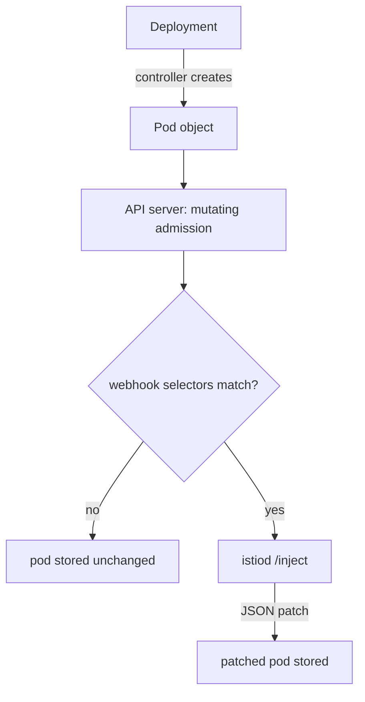

# Injection As Admission Control

Sidecar injection puts a communications officer, the `istio-proxy` sidecar container, on board a ship (a pod) when it launches. It is not an Istio feature bolted onto Kubernetes. It uses a standard Kubernetes extension point, and Istio simply registers a handler for it.

Once you have that path in your head, the two rules that trip everyone up stop being facts to memorise. You can work them out yourself. This part builds that path.

## The path a pod takes

Every new pod passes through the Kubernetes API server, the solar system's registry office, before it is stored and scheduled. Injection happens there, at one exact moment.

### Mutating admission

Before the API server stores a new object, it runs admission: a set of checks, some of which may change the object. A mutating admission webhook is a dock inspector the registry office calls before it files a new ship. The inspector may hand back changes. Istio's inspector is `istiod`, and its change is "add a communications officer".



The diagram shows that the Deployment controller creates the Pod object, the API server runs mutating admission, and only if the webhook's selectors match does it send the pod to `istiod`. `istiod` returns a patch that adds the `istio-proxy` container, the `istio-init` container, volumes, environment variables and annotations.

Injection is a job for the API server, not for the scheduler. By the time a pod is on a node, the decision is made, and it is final for that pod.

### Two facts that follow

Two facts follow from that path, and together they answer most injection questions.

**The webhook is called for Pods, not Deployments.** Istio's handler is registered for the `pods` resource and the `CREATE` operation. It never sees your Deployment. So every label that affects injection must be somewhere the *pod* carries it.

**The decision happens once, when the pod is created.** Mutating admission runs between the moment an object is sent and the moment it is stored. Nothing watches for namespaces that become eligible later, because admission is not a loop that keeps checking. A pod stored without a sidecar never grows one. The only way to change it is to replace the pod.

## The two webhook entries

Istio registers one `MutatingWebhookConfiguration` named `istio-sidecar-injector`, and it holds **two** webhook entries. Both send the pod to the same `istiod` endpoint. What differs is the selector that decides when each one fires.

### Which entry fires when

| Entry | Fires when | Purpose |
| --- | --- | --- |
| `namespace.sidecar-injector.istio.io` | the **namespace** carries an injection label | The namespace-level opt-in |
| `object.sidecar-injector.istio.io` | the **pod** carries `sidecar.istio.io/inject: "true"` | The per-workload override, in a namespace that has not opted in |

That split is why a pod label can force injection in an unlabelled namespace. It is not a special case inside `istiod`. It is a second webhook entry with a different selector. Kubernetes checks both, and a match on either sends the pod to `istiod`.

Two selector fields do the work:

- **`namespaceSelector`** is a label selector checked against the *namespace object*. This is why the namespace label exists at all.
- **`objectSelector`** is a label selector checked against the *pod being admitted*.

### See it in your playground

Read the selectors straight out of the webhook configuration:

<!-- astrona:playground:renew -->

```sh
kubectl get mutatingwebhookconfiguration istio-sidecar-injector \
  -o jsonpath='{range .webhooks[*]}{"── "}{.name}{"\n  resources: "}{.rules[0].resources}{"\n  operations: "}{.rules[0].operations}{"\n  nsSelector: "}{.namespaceSelector}{"\n  objSelector: "}{.objectSelector}{"\n\n"}{end}'
```

Expect something like:

```text
── namespace.sidecar-injector.istio.io
  resources: ["pods"]
  operations: ["CREATE"]
  nsSelector: {"matchExpressions":[{"key":"istio-injection","operator":"In","values":["enabled"]},...]}
  objSelector: {"matchExpressions":[{"key":"sidecar.istio.io/inject","operator":"NotIn","values":["false"]}]}

── object.sidecar-injector.istio.io
  resources: ["pods"]
  operations: ["CREATE"]
  nsSelector: {"matchExpressions":[{"key":"istio-injection","operator":"NotIn","values":["enabled"]},...]}
  objSelector: {"matchExpressions":[{"key":"sidecar.istio.io/inject","operator":"In","values":["true"]}]}
```

`resources: ["pods"]` and `operations: ["CREATE"]` are the two facts everything else follows from. Read the entries as a pair. The first says "the namespace opted in, and the pod did not opt out". The second says "the namespace did not opt in, but the pod opted in". Together they cover all four combinations.

## The starting state, and why nothing has a sidecar

With the selectors in hand, you can predict the playground's starting state. `inject-demo` was created with no injection label at all, so neither entry can match: the namespace has not opted in, and no pod template carries `sidecar.istio.io/inject: "true"`.

### See it in your playground

Check the namespace labels and the containers in each pod:

```sh
kubectl get ns inject-demo --show-labels
kubectl -n inject-demo get pods -o custom-columns='POD:.metadata.name,CONTAINERS:.spec.containers[*].name'
```

Expect something like:

```text
NAME          STATUS   AGE    LABELS
inject-demo   Active   4m2s   kubernetes.io/metadata.name=inject-demo

POD                        CONTAINERS
batch-job-...              batch-job
logging-agent-...          logging-agent
notification-service-...   notification-service
```

The only label is the one Kubernetes adds by itself. Neither webhook entry matches, so `istiod` is never asked, and each pod has exactly one container. That is the *expected* state here, not a fault, and every later step is measured against it.

## Labelling, and why it seems to do nothing

Adding `istio-injection=enabled` to the namespace is a planet-wide order: every new ship launched here gets a communications officer. It makes the first webhook entry match, for pods created from that moment on.

### See it in your playground

Label the namespace, then look at the pods again:

```sh
kubectl label namespace inject-demo istio-injection=enabled
kubectl -n inject-demo get pods -o custom-columns='POD:.metadata.name,CONTAINERS:.spec.containers[*].name'
```

Expect something like:

```text
namespace/inject-demo labeled

POD                        CONTAINERS
batch-job-...              batch-job
logging-agent-...          logging-agent
notification-service-...   notification-service
```

The label is on, and every pod still has one container. This is not a delay, and waiting will not fix it. Those pods were admitted before the webhook applied to them, and admission happens once per object.

### Restart, and watch the mesh appear

Recreating the pods completes the change. `kubectl rollout restart deployment` is the right tool: the Deployment controller replaces the pods a few at a time, so the service stays up while the new pods pass through admission.

```sh
kubectl -n inject-demo rollout restart deployment notification-service logging-agent batch-job
kubectl -n inject-demo rollout status deployment notification-service --timeout=120s
kubectl -n inject-demo get pods -o custom-columns='POD:.metadata.name,CONTAINERS:.spec.containers[*].name'
```

Expect something like:

```text
POD                        CONTAINERS
batch-job-...              batch-job,istio-proxy
logging-agent-...          logging-agent,istio-proxy
notification-service-...   notification-service,istio-proxy
```

All three now carry `istio-proxy`, including `logging-agent`, which should not. The namespace label is a blunt tool that applies to every pod in the namespace. That is exactly why per-workload overrides exist.

## What happens when the webhook cannot be reached

The webhook configuration has a `failurePolicy`, and Istio sets it to `Fail`. If the API server cannot reach `istiod`, creating a pod in a matching namespace is **refused**. It does not quietly go ahead without a sidecar.

That is the right default: pods silently missing their sidecar in a mesh that demands mTLS (mutual TLS, the secret handshake both ships do before they talk) would be worse. But know the cost before it bites you at 3am. A control plane outage does not only stop configuration updates. It stops new pods from starting in every injected namespace. Running pods keep running; new ones are refused.

It is also why a stale webhook configuration, left behind by a removed install, causes so much trouble, and why `istioctl x precheck` looks for exactly that.

In short: the webhook fires on Pod `CREATE` only, selected by the namespace or by a pod label. Every injection surprise follows from those words.

## Common pitfalls

> [!WARNING]
> **Labelling a namespace and expecting running pods to change.** The decision is made at admission. Label first, then recreate the pods.
>
> **Reading a missing sidecar as a broken webhook.** The far more common cause is a selector that does not match, or a pod created before the label existed.
>
> **Forgetting the webhook is in the request path.** If `istiod` cannot be reached, creating pods in injected namespaces fails, because Istio sets `failurePolicy: Fail`.
>
> **Assuming injection is retried.** It happens once, for that pod object, and never again.
