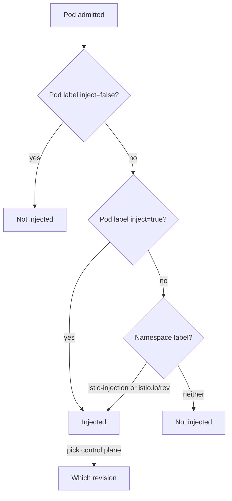

# The Precedence Rules

A namespace label puts a sidecar proxy on every new pod in the namespace, and that is rarely what you want for every workload. Three labels decide whether a pod gets the `istio-proxy` sidecar container and which control plane it connects to. This part states exactly how those labels combine, then tries each rule on the playground's three workloads.

The decision order is the most examinable thing in this module. The rule about which field the label sits on is the most common mistake, because the wrong field gives no error at all.

## The labels in play

Four label settings take part in the decision. The table names each one and the object it goes on:

| Label | Goes on | Means |
| --- | --- | --- |
| `istio-injection=enabled` | namespace | Inject, using the **default** control plane |
| `istio.io/rev=<revision-or-tag>` | namespace | Inject, using **that** control plane |
| `sidecar.istio.io/inject="true"` / `"false"` | **pod template** | Override the namespace decision for this workload |
| `istio.io/rev=<revision>` | **pod template** | Pin this workload to a specific control plane |

A **revision** is a named installation of the control plane. Revisions let two control planes run side by side in one cluster, for example during an upgrade. The two `istio.io/rev` rows use the same label key on two different objects. They mean the same thing at two scopes: the whole namespace, or one workload.

## The decision, in order

When the API server admits a new pod, Istio reads these labels in a fixed order. The order answers two questions, one after the other: *whether* to inject, and only then *which* control plane to use.



The diagram shows that a pod template label `sidecar.istio.io/inject: "false"` beats everything, a `"true"` label injects whatever the namespace says, and otherwise the namespace label decides.

For the second question, *which* control plane, the pod's own `istio.io/rev` label comes first. Then comes the namespace's `istio-injection` label, then the namespace's `istio.io/rev` label. Most confusion comes from answering the second question while the first one has already said no.

Two rules come out of this order. **The pod label beats the namespace, in both directions.** `"false"` pulls a workload out of an injected namespace, and `"true"` pushes one into a namespace without injection. They are the `namespace` and `object` webhook entries, with selectors that complement each other.

**`istio-injection` beats `istio.io/rev` on the same namespace.** If both are present, the workload uses the *default* control plane, and Istio ignores the revision label. There is no warning and no error. This trap makes canary upgrades look as if they do nothing. Removing the old label is part of moving a namespace to a revision, not an optional tidy-up.

## The field that has to be right

The order tells you which label wins; the field decides whether the webhook sees the label at all. The pod labels belong in `spec.template.metadata.labels`, the labels that end up on each *pod*. They do not belong in the Deployment's own `metadata.labels`:

```yaml
kind: Deployment
metadata:
  labels: {}                                    # the webhook never reads this
spec:
  template:
    metadata:
      labels:
        sidecar.istio.io/inject: "false"        # here
```

This follows from how the webhook is registered. The API server calls it for `pods`, so it checks the `objectSelector` against the pod object. The Deployment controller copies only the template labels to the pod, never the Deployment's own labels. Both places apply cleanly, neither gives an error, and only one has any effect.

Note the quotes. Kubernetes label values are always strings. An unquoted `false` in YAML is a boolean, so the API server rejects the object. That mistake, at least, fails loudly.

## Opting a workload out

With the rule clear, you can fix the playground. The namespace label put a sidecar on every pod in `inject-demo`, including the log shipper. The commands below need `inject-demo` labelled with `istio-injection=enabled` and all three pods restarted with a sidecar.

Patch the label into the pod template of `logging-agent`, wait for the rollout, and list the init containers and containers:

<!-- astrona:playground:renew -->

```sh
kubectl -n inject-demo patch deployment logging-agent -p \
  '{"spec":{"template":{"metadata":{"labels":{"sidecar.istio.io/inject":"false"}}}}}'
kubectl -n inject-demo rollout status deployment logging-agent --timeout=120s
kubectl -n inject-demo get pods -o custom-columns='POD:.metadata.name,INIT:.spec.initContainers[*].name,CONTAINERS:.spec.containers[*].name'
```

The output looks like this (shortened: the `patched` and `rollout status` lines are left out, and so is the old `logging-agent` pod, which takes up to 30 seconds to stop; run the last command again until only three pods are listed):

```text
POD                                     INIT                     CONTAINERS
batch-job-7fb8f97445-wcq6f              istio-init,istio-proxy   batch-job
logging-agent-6d5d6dd6fc-l2lnr          <none>                   logging-agent
notification-service-74f46b78d7-hkf2k   istio-init,istio-proxy   notification-service
```

`logging-agent` is back to one container and no init containers. A change to the pod template changes its hash, and the Deployment controller starts a rollout by itself, so you did not need a separate `rollout restart`. Remember the difference: a label change *in the template* restarts the workload for you, and a label change on the *namespace* does not.

The same label one level too high shows why the field matters. Put the label on the Deployment metadata of `batch-job` on purpose, restart it, and check the pod and the Deployment:

```sh
kubectl -n inject-demo patch deployment batch-job -p \
  '{"metadata":{"labels":{"sidecar.istio.io/inject":"false"}}}'
kubectl -n inject-demo rollout restart deployment batch-job
kubectl -n inject-demo rollout status deployment batch-job --timeout=120s
kubectl -n inject-demo get pod -l app=batch-job -o jsonpath='{.items[0].spec.initContainers[*].name} {.items[0].spec.containers[*].name}{"\n"}'
kubectl -n inject-demo get deployment batch-job -o jsonpath='{.metadata.labels}{"\n"}'
```

The output looks like this (shortened: the `patched`, `restarted` and `rollout status` lines are left out):

```text
istio-init istio-proxy batch-job
{"app":"batch-job","sidecar.istio.io/inject":"false"}
```

The label is clearly on the Deployment, and the pod still has its sidecar. Nothing rejected it and nothing warned you. That silence is what makes the mistake expensive. Remove the label before you go on:

```sh
kubectl -n inject-demo label deployment batch-job sidecar.istio.io/inject-
```

## Forcing a workload in

The same label with `"true"` works the other way. It injects a workload even when its namespace has not opted in. That is how you bring one job into the mesh in a namespace that is otherwise outside it.

Put `"true"` on the pod template of `batch-job`, remove the namespace label, and restart the two workloads that are in the mesh:

```sh
kubectl -n inject-demo patch deployment batch-job -p \
  '{"spec":{"template":{"metadata":{"labels":{"sidecar.istio.io/inject":"true"}}}}}'
kubectl label namespace inject-demo istio-injection-
kubectl -n inject-demo rollout restart deployment batch-job notification-service
kubectl -n inject-demo rollout status deployment batch-job --timeout=120s
kubectl -n inject-demo get pods -o custom-columns='POD:.metadata.name,INIT:.spec.initContainers[*].name,CONTAINERS:.spec.containers[*].name'
```

The output looks like this (shortened: only the last command is shown, after the old pods have stopped):

```text
POD                                     INIT                     CONTAINERS
batch-job-85577f8686-ccllb              istio-init,istio-proxy   batch-job
logging-agent-6d5d6dd6fc-l2lnr          <none>                   logging-agent
notification-service-8569f95c5f-hjdf9   <none>                   notification-service
```

`notification-service` left the mesh when the namespace label went away and the pod restarted, because no pod label overrides the namespace for it. `batch-job` stayed in because of its own `"true"` label. The `object.sidecar-injector.istio.io` entry matched on that pod label and never needed the namespace.

Put the namespace label back, so the namespace is injected again:

```sh
kubectl label namespace inject-demo istio-injection=enabled
```

## Choosing a control plane, not just a switch

So far every pod used the one control plane in the cluster. The second question, *which* control plane, matters only when a cluster runs more than one, which is what a canary upgrade creates. `istio-injection=enabled` means "inject, using the default". `istio.io/rev=<revision-or-tag>` names a specific control plane, and the namespace's new pods connect to it.

The pod template form of `istio.io/rev` pins one workload to a revision, whatever its namespace says. It is the tool for trying a new control plane on one service inside a namespace. The same restart rule applies: only new pods pick it up. This playground runs a single default control plane, so there is no second revision here to pin anything to.

You now know the order Istio reads the injection labels in: the pod label first, in both directions, then the namespace label, and `istio-injection` before `istio.io/rev`. You also know that a pod label works only on `spec.template.metadata.labels`. The open question is what injection actually writes into the pod once the answer is yes.

## Common pitfalls

> [!WARNING]
> **`sidecar.istio.io/inject` on the Deployment's `metadata.labels`.** It must be on `spec.template.metadata.labels`. In the wrong place it applies cleanly and does nothing.
>
> **Unquoted `true` or `false`.** Label values are strings; the API server rejects a YAML boolean.
>
> **Changing a namespace label and not restarting.** Injection is decided when a pod is created. Without `kubectl rollout restart` the change has no visible effect.
>
> **Both `istio-injection` and `istio.io/rev` on one namespace.** `istio-injection` wins silently, and the workload uses the default control plane, not the revision you named.
>
> **Removing a workload from the mesh under strict mTLS.** A pod without a sidecar has no workload certificate. If a `PeerAuthentication` requires strict mutual TLS, the sidecars of other workloads refuse its plain-text connections. Opting out is a policy decision, not just a saving.
>
> **Treating the container count as the only check.** It works only in sidecar mode. In ambient mode, a pod in the mesh keeps exactly one container.

## Your mission: Control Sidecar Injection Lab

You can now opt a namespace in, pull one workload out and force another one in, with every label on the object the webhook reads. The lab asks you to build that three-way result in one namespace, starting from no injection label at all.

The lab runs on its own cluster, so first pause your playground. Nothing in it is lost:

```sh
astrona stop ats-013-playground-020-02
```

Then start the lab. The task is on the next page; solve it on your own first:

```sh
astrona run --git ssh://git@github.com/astrona-io/ATS013.git -c sections/section-020/module-02/labs/lab-01
```

When you think you are done, send it for grading:

```sh
astrona submit -c sections/section-020/module-02/labs/lab-01
```

When the lab is done, remove it and start your playground again:

```sh
astrona destroy ats-013-lab-020-02
astrona start ats-013-playground-020-02
```
