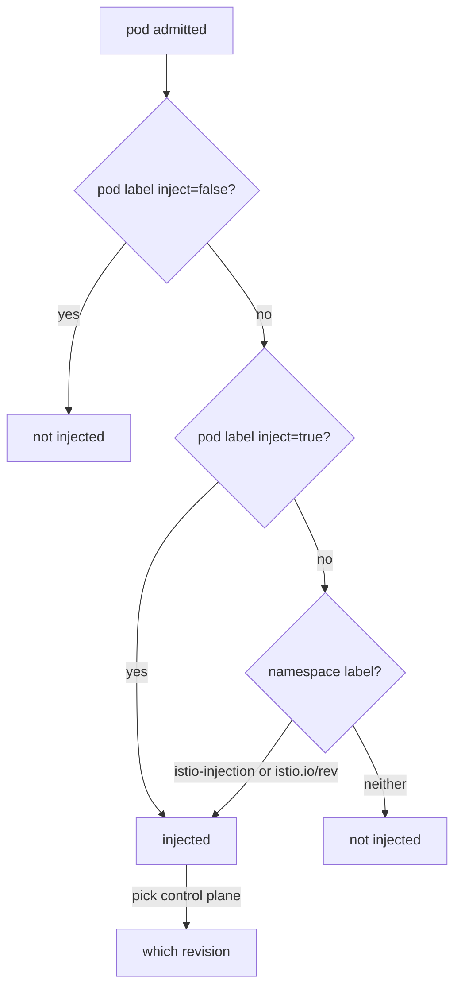

# The Precedence Rules

Three labels decide whether a pod gets a sidecar, the communications officer, and which mission control (control plane) it reports to. This part states exactly how they combine, then tries each rule on the playground's three workloads.

The decision table is the most examinable thing in this module. The rule about which field the label sits on is the most common mistake.

## The four labels in play

Here are the labels, and the object each one goes on:

| Label | Goes on | Means |
| --- | --- | --- |
| `istio-injection=enabled` | namespace | Inject, using the **default** control plane |
| `istio.io/rev=<revision-or-tag>` | namespace | Inject, using **that** control plane |
| `sidecar.istio.io/inject="true"` / `"false"` | **pod template** | Override the namespace decision for this workload |
| `istio.io/rev=<revision>` | **pod template** | Pin this workload to a specific control plane |

A revision is a named mission control, so that two control planes can run side by side, for example during an upgrade. The two `istio.io/rev` rows use the same label key on two different objects. They mean the same thing at two scopes: the whole planet, or one ship.

## The decision, in order

When a pod is created, the labels are read in a fixed order. This section shows that order and the two rules that come out of it.

### Whether, then which



The diagram shows two questions, in this order: *whether* to inject, and only then *which* control plane. A pod template label `sidecar.istio.io/inject: "false"` beats everything. A `"true"` label injects whatever the namespace says. Otherwise the namespace label decides.

For *which* control plane, the pod's own `istio.io/rev` label comes first, then the namespace's `istio-injection` label, then the namespace's `istio.io/rev` label. Most confusion comes from answering the second question while the first has already said no.

### Two rules worth remembering

**The pod label beats the namespace, in both directions.** `"false"` pulls a workload out of an injected namespace, and `"true"` pushes one into an uninjected namespace. They are two separate webhook entries with selectors that complement each other.

**`istio-injection` beats `istio.io/rev` on the same namespace.** If both are present, the workload uses the *default* control plane and the revision label is ignored. There is no warning and no error. This trap makes canary upgrades look as if they do nothing. Removing the old label is part of moving a namespace to a revision, not an optional tidy-up.

## The field that has to be right

The pod-level labels belong in `spec.template.metadata.labels`: the labels that end up on each *pod*. They do not belong in the Deployment's own `metadata.labels`.

```yaml
kind: Deployment
metadata:
  labels: {}                                    # the webhook never reads this
spec:
  template:
    metadata:
      labels:
        sidecar.istio.io/inject: "false"        # here
```

This follows from how the webhook is registered: it is called for `pods`, so its `objectSelector` is checked against the pod object. A label on the Deployment is never copied to the pod unless you put it in the template. Both places apply cleanly, neither gives an error, and only one has any effect.

Note the quotes. Kubernetes label values are always strings, and an unquoted `false` in YAML is a boolean, so the API server rejects the object. That mistake, at least, fails loudly.

## Opting a workload out

The namespace label put a sidecar on every pod in `inject-demo`, including the log shipper. Use the pod template label to take `logging-agent` back out.

### See it in your playground

The namespace `inject-demo` must carry `istio-injection=enabled` and all three pods must have been restarted with a sidecar. Patch the label into `logging-agent`'s pod template:

<!-- astrona:playground:renew -->

```sh
kubectl -n inject-demo patch deployment logging-agent -p \
  '{"spec":{"template":{"metadata":{"labels":{"sidecar.istio.io/inject":"false"}}}}}'
kubectl -n inject-demo rollout status deployment logging-agent --timeout=120s
kubectl -n inject-demo get pods -o custom-columns='POD:.metadata.name,CONTAINERS:.spec.containers[*].name'
```

Expect something like:

```text
POD                        CONTAINERS
batch-job-...              batch-job,istio-proxy
logging-agent-...          logging-agent
notification-service-...   notification-service,istio-proxy
```

`logging-agent` is back to one container. Changing the pod template changes its hash, and that starts a rollout by itself, so you did not need a separate `rollout restart`. Remember the difference: a label change *in the template* restarts the workload for you, and a label change on the *namespace* does not.

### The same label, one level too high

Now make the mistake on purpose, because the lesson sticks once you have watched it fail. Put the label on `batch-job`'s own Deployment metadata, restart, and check:

```sh
kubectl -n inject-demo patch deployment batch-job -p \
  '{"metadata":{"labels":{"sidecar.istio.io/inject":"false"}}}'
kubectl -n inject-demo rollout restart deployment batch-job
kubectl -n inject-demo rollout status deployment batch-job --timeout=120s
kubectl -n inject-demo get pod -l app=batch-job -o jsonpath='{.items[0].spec.containers[*].name}{"\n"}'
kubectl -n inject-demo get deployment batch-job -o jsonpath='{.metadata.labels}{"\n"}'
```

Expect something like:

```text
batch-job istio-proxy

{"app":"batch-job","sidecar.istio.io/inject":"false"}
```

The label is clearly on the Deployment, and the pod still has its sidecar. Nothing rejected it and nothing warned you. That silence is what makes the mistake expensive. Undo it before you go on:

```sh
kubectl -n inject-demo label deployment batch-job sidecar.istio.io/inject-
```

## Forcing a workload in

The same label with `"true"` works the other way. It injects a workload even when its namespace has not opted in. That is how you mesh one job in a namespace that is otherwise outside the mesh.

### See it in your playground

Put `"true"` on `batch-job`'s pod template, remove the namespace label, and restart both meshed workloads:

```sh
kubectl -n inject-demo patch deployment batch-job -p \
  '{"spec":{"template":{"metadata":{"labels":{"sidecar.istio.io/inject":"true"}}}}}'
kubectl label namespace inject-demo istio-injection-
kubectl -n inject-demo rollout restart deployment batch-job notification-service
kubectl -n inject-demo rollout status deployment batch-job --timeout=120s
kubectl -n inject-demo get pods -o custom-columns='POD:.metadata.name,CONTAINERS:.spec.containers[*].name'
```

Expect something like:

```text
namespace/inject-demo unlabeled

POD                        CONTAINERS
batch-job-...              batch-job,istio-proxy
logging-agent-...          logging-agent
notification-service-...   notification-service
```

`notification-service` left the mesh when the namespace label went away and it restarted: no pod label overrides the namespace for it. `batch-job` stayed in because of its own `"true"`, which never looks at the namespace at all.

Put the namespace label back, so the namespace is injected again:

```sh
kubectl label namespace inject-demo istio-injection=enabled
```

## Choosing a control plane, not just a switch

The second question, *which* control plane, only matters when a cluster runs more than one, which is what a canary upgrade creates. `istio-injection=enabled` means "inject, using the default". `istio.io/rev=<revision-or-tag>` names a specific mission control, and the namespace reports to it.

The pod template form of `istio.io/rev` pins one workload to a revision, whatever its namespace says. It is the tool for trying a new control plane on one service inside a namespace, and the same restart rule applies: only new pods pick it up.

This playground runs a single default control plane, so there is no second revision here to pin anything to.

## Common pitfalls

> [!WARNING]
> **`sidecar.istio.io/inject` on the Deployment's `metadata.labels`.** It must be on `spec.template.metadata.labels`. In the wrong place it applies cleanly and does nothing.
>
> **Unquoted `true` or `false`.** Label values are strings; a YAML boolean is rejected by the API server.
>
> **Changing a namespace label and not restarting.** Injection is decided when a pod is created. Without `kubectl rollout restart` the change has no visible effect.
>
> **Both `istio-injection` and `istio.io/rev` on one namespace.** `istio-injection` wins silently, and the workload uses the default control plane, not the revision you named.
>
> **Removing a workload from the mesh under strict mTLS.** A pod without a sidecar has no workload certificate, its ID badge. If a `PeerAuthentication` requires strict mutual TLS, meshed ships refuse its connections. Opting out is a policy decision, not just a saving.
>
> **Treating container count as the only check.** It works only in sidecar mode. In ambient mode, a fully meshed pod keeps exactly one container.

## Your mission: Control Sidecar Injection

You can now opt a namespace in, pull one workload out and force another one in, with every label on the object the webhook reads. Now prove it in a graded mission: build that three-way result in one namespace, starting from no injection label at all.

The mission runs in its own training solar system, so first pause your playground. Nothing in it is lost:

```sh
astrona stop ats-013-playground-020-02
```

Then start the mission:

```sh
astrona run --git ssh://git@github.com/astrona-io/ATS013.git -c sections/section-020/module-02/labs/lab-01
```

Read the task in [`question.md`](./labs/lab-01/question.md) and solve it on your own first. When you think you are done, send it for grading:

```sh
astrona submit -c sections/section-020/module-02/labs/lab-01
```

When the mission is done, remove it and wake your playground up again:

```sh
astrona destroy ats-013-lab-020-02
astrona start ats-013-playground-020-02
```
