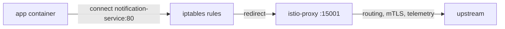

# What Injection Writes Into The Pod

Sidecar injection decides *whether* a ship (a pod) gets a communications officer. This part is about *what* that means in the pod spec: which containers appear, how signals are sent into the proxy without the application knowing, and which ports do what.

Knowing this turns "the sidecar intercepts traffic" from a slogan into something you can check and debug.

## The patch, in summary

When `istiod` injects a pod, it hands the API server a patch. With the `default` profile, the patch adds:

- **`istio-proxy`**: the Envoy sidecar, the communications officer. It receives its orders from `istiod` (mission control) and holds the workload's mTLS identity, its ID badge.
- **`istio-init`**: an init container that runs `istio-iptables` to install the traffic rules. It needs the `NET_ADMIN` and `NET_RAW` capabilities, runs to the end, and is finished before the application starts.
- **Volumes**: `istio-envoy` (the proxy's runtime configuration), `istio-data`, `istio-podinfo`, and `istio-token`. The last one is a short-lived service account token the proxy uses to prove who it is to `istiod` when it asks for a certificate.
- **Environment variables and annotations** that describe the pod to the proxy: its service account, namespace, labels, and the `discoveryAddress` of `istiod`.

The init container is the piece that makes the whole model work, so it is worth understanding properly.

## How traffic gets redirected

`istio-init` is the dock crew who rewire the ship's radio. It runs once, inside the pod's network namespace, before any application container starts. All containers in a pod share that network namespace, so the rules it writes apply to all of them.

### Two capture ports

The rules send traffic to two ports on localhost, where Envoy listens:

- **Outbound** traffic leaving the pod goes to port **15001**.
- **Inbound** traffic arriving at the pod goes to port **15006**.



The diagram shows an outbound signal: the application connects as normal, the `iptables` rules written by `istio-init` send the connection to Envoy on port `15001`, and Envoy applies routing, mutual TLS and telemetry before it opens its own connection to the destination.

That is the whole "no application changes" claim, made concrete. The application opens a connection to `notification-service:80` exactly as it would without a mesh. The kernel redirects it. Envoy picks it up, decides where it really goes, encrypts it and sends it on. Nothing in the application's code or configuration changed, and nothing in it can tell.

### The ports you will see

The ports are fixed, and you will meet them in command output:

| Port | Role |
| --- | --- |
| `15001` | Outbound capture: where redirected outgoing traffic lands |
| `15006` | Inbound capture: where redirected incoming traffic lands |
| `15008` | HBONE, the tunnel used in ambient mode |
| `15020` | Merged telemetry and the proxy's own health endpoint |
| `15021` | Health checking, exposed by gateways and sidecars |
| `15090` | Envoy's raw Prometheus metrics |
| `15012` | On `istiod`'s side: the port sidecars dial for their orders and certificates |

## Reading the change instead of trusting it

`istioctl kube-inject` makes the same change on your own machine and prints the result instead of applying it. Read the name as "Kubernetes manifest, inject": a manifest goes in, and an injected manifest comes out.

It reads the cluster's live injection settings (the `istio-sidecar-injector` ConfigMap and the mesh configuration) to do that. So its output shows what *your* control plane would do, not a generic template. It has two practical uses: checking exactly what injection would do before it happens, and producing manifests for a cluster where the webhook is unavailable or not used on purpose.

### See it in your playground

Save the `notification-service` Deployment to a file, run it through `kube-inject`, and pick out the containers and the `istio-init` arguments:

<!-- astrona:playground:renew -->

```sh
kubectl -n inject-demo get deployment notification-service -o yaml > notification-service.yaml
istioctl kube-inject -f notification-service.yaml | grep -E '^\s+- name: (istio-proxy|istio-init|notification-service)$'
istioctl kube-inject -f notification-service.yaml | grep -A8 'name: istio-init'
```

Expect something like:

```text
      - name: notification-service
      - name: istio-proxy
      - name: istio-init

      - name: istio-init
        image: docker.io/istio/proxyv2:1.30.5
        args:
        - istio-iptables
        - -p
        - "15001"
        - -z
        - "15006"
        - -u
        - "1337"
        - -m
        - REDIRECT
```

`-p 15001` is the outbound capture port and `-z 15006` the inbound one: the two numbers from the diagram, passed to the command that writes the rules. `-u 1337` is the user ID Envoy runs as. Its traffic is left out of the redirect, so the proxy's own signals do not loop back into itself.

Notice that the init container uses the *same* `proxyv2` image as the sidecar. It is one image with several entry points.

## The exclusions you can set

The redirect rules are built from arguments, and you can change those arguments per pod with annotations on the pod template. This section lists the useful ones and shows one becoming a rule.

### Four annotations

- `traffic.sidecar.istio.io/excludeOutboundPorts`: outgoing ports that are not captured.
- `traffic.sidecar.istio.io/excludeInboundPorts`: incoming ports that are not captured.
- `traffic.sidecar.istio.io/excludeOutboundIPRanges`: destinations that are not captured, often a database or a metadata endpoint.
- `traffic.sidecar.istio.io/includeOutboundIPRanges`: the opposite. Capture *only* these, and let everything else out directly.

These are useful and dangerous at the same time. Traffic left out of capture gets no mTLS, no authorization policy and no telemetry. It is outside the mesh while the workload still looks meshed. Use them only for a specific reason, such as a protocol Envoy handles badly, and write the reason next to the annotation.

### See it in your playground

Add an exclusion for port `5432` to `notification-service`, wait for the rollout, and read the new `istio-init` arguments:

```sh
kubectl -n inject-demo patch deployment notification-service -p \
  '{"spec":{"template":{"metadata":{"annotations":{"traffic.sidecar.istio.io/excludeOutboundPorts":"5432"}}}}}'
kubectl -n inject-demo rollout status deployment notification-service --timeout=120s
kubectl -n inject-demo get pod -l app=notification-service \
  -o jsonpath='{.items[0].spec.initContainers[0].args}{"\n"}' | tr ',' '\n' | grep -A1 -- '-o'
```

Expect something like:

```text
"-o"
"5432"
```

The annotation became an `-o 5432` argument to `istio-iptables`, which becomes an exception in the rules. Nothing about the annotation is magic: it is a value passed into a command line.

Remove the exclusion again:

```sh
kubectl -n inject-demo patch deployment notification-service --type=json -p '[{"op":"remove","path":"/spec/template/metadata/annotations/traffic.sidecar.istio.io~1excludeOutboundPorts"}]'
```

## The Istio CNI plugin

The init container needs `NET_ADMIN` and `NET_RAW`, and some clusters forbid those through Pod Security Standards. Istio's answer is the **Istio CNI plugin**: a DaemonSet that does the same network setup from the node, when the pod is created. The dock crew works from the launch pad instead of boarding the ship, so the pod itself needs no extra rights.

With `istio-cni` installed, injection still adds the `istio-proxy` container. The `istio-init` container is replaced by a much smaller `istio-validation` init container, or left out entirely, depending on the settings. The traffic redirect is the same; only who writes the rules changes.

This matters for two reasons. First, if you inspect a pod on a cluster with the CNI plugin and find no `istio-init`, the pod is not broken. Second, ambient mode *requires* the CNI plugin: it is how a workload can join the mesh without any change to the pod.

## Good habits for real clusters

**Namespace label for the default, pod label for the exception.** A namespace-wide rule with a few documented per-workload overrides is far easier to check than labels on every workload. Keep the overrides in the manifests, in version control, with a comment saying why.

**Restarts have a real cost.** Turning on injection across a busy namespace means replacing every pod in it. Check `PodDisruptionBudget`s, go one Deployment at a time, and expect slightly slower pod starts afterwards.

**`istioctl proxy-status` is the cross-check.** Counting containers tells you what the pod spec says. `proxy-status` is a roll call: it tells you which workloads mission control is actually serving. A workload in one list but not the other is a real problem, often a proxy that cannot reach `istiod` on port `15012`.

> [!TIP]
> Before you mesh a workload you do not know well, run `istioctl kube-inject -f` on its manifest and read what would be added. It costs nothing, needs no restart, and shows the exact containers, ports and exclusions your control plane would apply.

## Common pitfalls

> [!WARNING]
> **Assuming a missing `istio-init` means injection failed.** On a cluster with the Istio CNI plugin it is expected. Look for the `istio-proxy` container instead.
>
> **Excluding ports or address ranges without writing down why.** Excluded traffic silently leaves the mesh: no mTLS, no authorization, no telemetry, while the workload still looks meshed.
>
> **Applications that connect the moment they start.** An injected pod has one more container to pull and start, and an application that connects right away can race the proxy. `meshConfig.defaultConfig.holdApplicationUntilProxyReady: true` fixes it at the cost of slower starts. It is an installation setting in the `meshConfig` layer of the `IstioOperator` document.
>
> **Expecting `istioctl kube-inject` output to work everywhere.** It renders against the live cluster's settings, so output from one cluster is not portable to another running a different version.
>
> **Forgetting gateways are not injected.** An ingress or egress gateway is a standalone Envoy Deployment from the profile or the gateway chart. Injection labels on its namespace do not apply to it.
