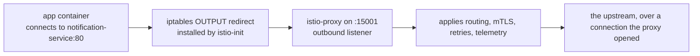

# Part 3 — What Injection Writes Into The Pod

> Prerequisite: [Part 2 — The Precedence Rules](./course-02-the-precedence-rules.md). Next: [the module landing page](./course.md), then [Section 030 — Upgrading Istio](../../section-030/README.md).

Parts 1 and 2 covered *whether* a pod gets injected. This part covers *what* that means in the pod spec: which containers appear, how traffic is redirected into the proxy without the application knowing, and which ports do what. Knowing this turns "the sidecar intercepts traffic" from a slogan into something you can verify and debug.

## The patch, in summary

With the `default` profile, injection adds:

- **`istio-proxy`** — the Envoy sidecar container. It receives configuration from `istiod` over xDS and holds the workload's mTLS identity.
- **`istio-init`** — an init container that runs `istio-iptables` to install the redirection rules. It needs `NET_ADMIN` and `NET_RAW`, runs to completion, and is gone before the application container starts.
- **Volumes** — `istio-envoy` (the proxy's runtime config), `istio-data`, `istio-podinfo`, and `istio-token` (a projected service account token used to authenticate to `istiod` when requesting a certificate).
- **Environment variables and annotations** describing the pod to the proxy — its service account, namespace, labels, and the `discoveryAddress` it should connect to.

The init container is the piece that makes the whole model work, so it is worth understanding rather than skimming.

## How traffic gets redirected

`istio-init` runs once, in the pod's network namespace, before any application container starts. It writes iptables rules into that namespace — which the pod's containers all share — so that:

- **Outbound** traffic leaving the pod is redirected to port **15001** on localhost, where Envoy is listening.
- **Inbound** traffic arriving at the pod is redirected to port **15006**, Envoy's inbound listener.



The application is not configured for any of this. The redirect is what makes the proxy unavoidable, and it is the only reason an unmodified application gets mesh behaviour at all.

That is the entire "no application changes required" claim, made concrete. The application opens a connection to `notification-service:80` exactly as it would without a mesh. The kernel redirects it. Envoy picks it up, decides where it really goes, encrypts it, and sends it on. Nothing in the application's code or configuration changed, and nothing in it can tell the difference.

The ports are fixed and worth recognising in output:

| Port | Role |
| --- | --- |
| `15001` | Outbound capture — where redirected egress lands |
| `15006` | Inbound capture — where redirected ingress lands |
| `15008` | HBONE, used in ambient mode (section 040) |
| `15020` | Merged telemetry and the proxy's own health endpoint |
| `15021` | Health checking, exposed by gateways and sidecars |
| `15090` | Envoy's raw Prometheus metrics |
| `15012` | On `istiod`'s side: the xDS and CA port sidecars dial |

## Reading the mutation rather than trusting it

`istioctl kube-inject` performs the same mutation **client-side**, writing the result to stdout instead of applying it. Read the name as **kube**rnetes-manifest **inject**: manifest in, injected manifest out.

It reads the cluster's live injection configuration — the `istio-sidecar-injector` ConfigMap and the mesh config — to do that, so its output reflects *your* control plane rather than a generic template. Two practical uses: inspecting exactly what injection would do before it happens, and producing manifests for a cluster where the webhook is unavailable or deliberately not used.

> [!TIP]
> **Try it — read the containers and the capture ports**
>
> ```sh
> kubectl -n inject-demo get deployment notification-service -o yaml > notification-service.yaml
> istioctl kube-inject -f notification-service.yaml | grep -E '^\s+- name: (istio-proxy|istio-init|notification-service)$'
> istioctl kube-inject -f notification-service.yaml | grep -A8 'name: istio-init'
> ```
>
> Expect something like:
>
> ```text
>       - name: notification-service
>       - name: istio-proxy
>       - name: istio-init
>
>       - name: istio-init
>         image: docker.io/istio/proxyv2:1.30.5
>         args:
>         - istio-iptables
>         - -p
>         - "15001"
>         - -z
>         - "15006"
>         - -u
>         - "1337"
>         - -m
>         - REDIRECT
> ```
>
> `-p 15001` is the outbound capture port and `-z 15006` the inbound one — the two numbers from the diagram, passed as arguments to the command that writes the rules. `-u 1337` is the UID Envoy runs as, excluded from redirection so the proxy's own traffic does not loop back into itself. Note the init container uses the *same* `proxyv2` image as the sidecar; it is one image with several entry points.

## The exclusions you can set

Because redirection is iptables rules generated from arguments, the arguments are configurable per pod through annotations on the pod template. The ones worth knowing:

- `traffic.sidecar.istio.io/excludeOutboundPorts` — outbound ports left un-captured.
- `traffic.sidecar.istio.io/excludeInboundPorts` — inbound ports left un-captured.
- `traffic.sidecar.istio.io/excludeOutboundIPRanges` — destinations left un-captured, commonly a database or a metadata endpoint.
- `traffic.sidecar.istio.io/includeOutboundIPRanges` — the inverse: capture *only* these, letting everything else out directly.

These are genuinely useful and genuinely dangerous. Traffic excluded from capture gets no mTLS, no authorization policy and no telemetry — it is outside the mesh while appearing to be inside it. Use them for a specific, documented reason, such as a protocol Envoy mishandles, and write the reason next to the annotation.

> [!TIP]
> **Try it — see an exclusion change the generated rules**
>
> ```sh
> kubectl -n inject-demo patch deployment notification-service -p \
>   '{"spec":{"template":{"metadata":{"annotations":{"traffic.sidecar.istio.io/excludeOutboundPorts":"5432"}}}}}'
> kubectl -n inject-demo rollout status deployment notification-service --timeout=120s
> kubectl -n inject-demo get pod -l app=notification-service \
>   -o jsonpath='{.items[0].spec.initContainers[0].args}{"\n"}' | tr ',' '\n' | grep -A1 -- '-o'
> ```
>
> Expect something like:
>
> ```text
> "-o"
> "5432"
> ```
>
> The annotation became an `-o 5432` argument on `istio-iptables`, which becomes an exception in the generated rules. Nothing about the annotation is magic — it is a value threaded into a command line. Remove it again with `kubectl -n inject-demo patch deployment notification-service --type=json -p '[{"op":"remove","path":"/spec/template/metadata/annotations/traffic.sidecar.istio.io~1excludeOutboundPorts"}]'`.

## The CNI variant

The init container needs `NET_ADMIN` and `NET_RAW`, which some clusters forbid outright through Pod Security Standards. Istio's answer is the **Istio CNI plugin**: a DaemonSet that performs the same network-namespace setup from the node, at pod creation time, so the pod itself needs no elevated capabilities.

When `istio-cni` is installed, injection still adds the `istio-proxy` container but the `istio-init` container is replaced by a much smaller `istio-validation` init container — or omitted entirely, depending on configuration. The traffic redirection is identical; only who writes the rules changes.

This matters here for two reasons. First, if you inspect a pod on a CNI-enabled cluster and find no `istio-init`, the pod is not broken. Second, ambient mode in section 040 *requires* the CNI plugin — it is how enrollment can take effect without touching the pod at all.

> [!WARNING]
## Common pitfalls

> [!WARNING]
> **Assuming a missing `istio-init` means injection failed.** On a CNI-enabled cluster it is expected. Check for the `istio-proxy` container instead.
>
> **Excluding ports or IP ranges without recording why.** Excluded traffic silently leaves the mesh: no mTLS, no authorization, no telemetry, while the workload still looks meshed.
>
> **Applications that connect at startup.** An injected pod has one more container to pull and start, and an app that opens connections immediately can race the proxy. `meshConfig.defaultConfig.holdApplicationUntilProxyReady: true` fixes it at the cost of slower starts — an install-time setting, covered in [the customisation module](../module-01/course-01-the-four-configuration-layers.md).
>
> **Expecting `istioctl kube-inject` output to be version-neutral.** It renders against the live cluster's configuration, so output from one cluster is not portable to another running a different version.
>
> **Forgetting gateways are not injected.** An ingress or egress gateway is a standalone Envoy Deployment from the profile or gateway chart. Injection labels on its namespace do not apply to it.

## Operational considerations

**Namespace label for the default, pod label for the exception.** A namespace-wide policy with a handful of documented per-workload overrides is far easier to audit than per-workload labels everywhere. Keep the overrides in the manifests, in version control, with a comment saying why.

**Restarts are a real cost.** Enabling injection across a busy namespace means replacing every pod in it. Check `PodDisruptionBudget`s, go per Deployment rather than all at once, and expect marginally slower pod starts afterwards.

**`istioctl proxy-status` is the cross-check.** Counting containers tells you what the pod spec says. `proxy-status` tells you which workloads the control plane is actually serving. A workload in one list but not the other is a real problem worth chasing — commonly a proxy that cannot reach `istiod` on port 15012.

> *Injection adds a proxy and an init container that writes iptables rules redirecting the pod's traffic to ports 15001 and 15006 — the application never learns anything changed.*

## Reference

- [Sidecar injection annotations](https://istio.io/v1.30/docs/reference/config/annotations/) — every `traffic.sidecar.istio.io/*` exclusion and its effect.
- [Traffic capture and ports](https://istio.io/v1.30/docs/ops/deployment/application-requirements/) — the reserved port list and what Istio expects of an application.
- [Istio CNI plugin](https://istio.io/v1.30/docs/setup/additional-setup/cni/) — the init-container-free variant and why it exists.
- [istioctl kube-inject](https://istio.io/v1.30/docs/reference/commands/istioctl/#istioctl-kube-inject) — flags, including rendering against a local config instead of the cluster.
