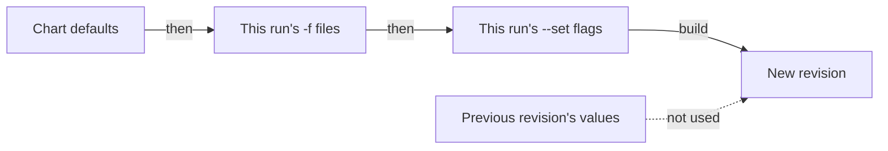

# How `helm upgrade` Computes Values

An upgrade must change the version and keep the settings. `helm upgrade` has one default that sounds reasonable and breaks the second half of that goal: it can drop every setting from the install and still report success. The surest way to remember this is to trigger it on purpose, and watch a working mesh setting disappear while the command prints success. This part explains the rule, the two flags that change it, and how to get the lost values back.

## The rule

**`helm upgrade` starts from the chart's defaults and applies only the `-f` files and `--set` flags you give on this run.** Helm does not carry over the values of the previous revision.



The diagram shows that the values of the previous revision never reach the new revision, so anything you do not pass again is gone.

Most people expect something like `kubectl patch`: change this one thing and leave everything else. Helm works more like `kubectl apply` of a complete object. The arguments you type on this run *are* the desired state.

## The two flags that change it

Two flags change where Helm starts from. Both are useful, and both have a catch.

**`--reuse-values`** starts from the previous revision's user-supplied values and applies this run's `--set` flags on top:


The diagram shows the starting point that `--reuse-values` uses instead of the chart defaults.

The catch is that it does **not** honour removals from a `-f` file. Helm merges the file *onto* the old values, so a key the file no longer contains is still there, inherited from the previous revision. `--reuse-values` with `-f` is a merge, not a replacement.

**`--reset-values`** throws away the previous values and starts from the chart defaults. That is the default behaviour, written out. It is sometimes worth putting in a script so the next reader sees the intent.

Both catches go away with one habit. **Keep one complete values file per release, in version control, and pass it with `-f` on every install and every upgrade.** Then the question "what values does this release have?" has one answer, in one place, and you need neither flag.

## Watching it go wrong

The rule is easier to remember once you have seen its effect. The next step upgrades `istiod` with no values at all, so it destroys settings on purpose. In your playground that is the lesson. On a real cluster it would switch off mesh-wide access logging, switch the autoscaling of `istiod` back on, and reset the resource requests of every sidecar proxy, all in one command that looks successful. Never practise this on a cluster you care about.

<!-- astrona:playground:renew -->

Check the access log setting in the `istio` ConfigMap, upgrade with no values, then read the values and the ConfigMap again:

```sh
kubectl -n istio-system get cm istio -o jsonpath='{.data.mesh}' | grep accessLogFile
helm upgrade istiod istio/istiod -n istio-system --version 1.30.5 --wait
helm get values istiod -n istio-system
kubectl -n istio-system get cm istio -o jsonpath='{.data.mesh}' | grep -c accessLogFile
```

The output looks like this (shortened):

```text
accessLogFile: /dev/stdout

Release "istiod" has been upgraded. Happy Helming!
NAME: istiod
REVISION: 2
STATUS: deployed

USER-SUPPLIED VALUES:
null

0
```

`STATUS: deployed` and `USER-SUPPLIED VALUES: null` appear on the same screen. The `accessLogFile` key that was in the `istio` ConfigMap a moment ago is gone, so every proxy in the mesh has stopped writing access logs. Nothing in the output said so, and the exit code was zero.

Notice what Helm did *not* do: it did not fail, warn, ask, or mark the release unhealthy. You have to catch this yourself, so build the checks into your upgrade steps instead of running them only when something feels wrong.

Now compare the other flag. Roll back to revision 1, then run the same upgrade with `--reuse-values`:

```sh
helm rollback istiod 1 -n istio-system --wait
helm upgrade istiod istio/istiod -n istio-system --version 1.30.5 --reuse-values --wait
helm get values istiod -n istio-system | head -8
```

The output looks like this:

```text
Rollback was a success! Happy Helming!

Release "istiod" has been upgraded. Happy Helming!

USER-SUPPLIED VALUES:
global:
  proxy:
    resources:
      requests:
        cpu: 10m
        memory: 64Mi
```

This time the values survived. `--reuse-values` is a fair tool for a narrow change: change the version, keep everything else. It is also how a values file that *removes* a key gets ignored without a word. Which behaviour you get depends only on the flag you typed, and the output looks the same either way.

## Recovering what was lost

The first upgrade lost the settings, but Helm still has revision 1 in the release history. `helm get values --revision 1` prints the values the install used, and you can write them to a file:

```sh
helm get values istiod -n istio-system --revision 1 | tail -n +2 > istiod-values.yaml
cat istiod-values.yaml
```

The output looks like this:

```text
global:
  proxy:
    resources:
      requests:
        cpu: 10m
        memory: 64Mi
meshConfig:
  accessLogFile: /dev/stdout
  outboundTrafficPolicy:
    mode: ALLOW_ANY
pilot:
  autoscaleEnabled: false
  resources:
    requests:
      cpu: 100m
      memory: 256Mi
```

This file is now the source of truth you were missing, so save it in version control before you do anything else. The real problem was that the cluster held the only copy. Rebuilding the file without saving it leaves that problem where it was.

If someone also removed the history and revision 1 no longer exists, fall back to the live cluster. The `istio` ConfigMap holds the `meshConfig` in effect, and `kubectl get deploy istiod -o yaml` holds the resource requests and replica settings. This is slower, and it misses any setting that had no visible effect, so it is only a fallback.

## Checking before applying

Recovery is the slow path. Two read-only checks catch a missing `-f` before it does any damage, and both take seconds.

The first check is a dry run. `--dry-run --debug` renders the manifests and prints the *computed values* without touching the cluster. Run it with the values file and read the computed values block:

```sh
helm upgrade istiod istio/istiod -n istio-system \
  --version 1.30.5 -f istiod-values.yaml --dry-run --debug 2>&1 | sed -n '/COMPUTED VALUES/,/HOOKS/p' | head -20
```

If the block is `null` or misses keys you expect, stop and find out why before you upgrade.

The second check answers a stronger question: which objects change? It compares the manifest of the live revision with the manifest the upgrade would apply:

```sh
helm get manifest istiod -n istio-system > /tmp/current.yaml
helm upgrade istiod istio/istiod -n istio-system \
  --version 1.30.5 -f istiod-values.yaml --dry-run 2>/dev/null \
  | sed -n '/^MANIFEST:/,$p' | tail -n +2 > /tmp/proposed.yaml
diff /tmp/current.yaml /tmp/proposed.yaml | head -30
```

In a pipeline, the `helm-diff` plugin does this job properly. It is worth installing wherever Helm upgrades run automatically.

You now know that `helm upgrade` builds the new release from the arguments of this run, not from the state of the last one, and that it reports success either way. `--reuse-values` changes the starting point but merges `-f` files, and `helm get values --revision 1` gets lost values back. The open question is how to use a complete values file to upgrade all three Istio releases, and what else must change before the upgrade is really finished.

## Common pitfalls

> [!WARNING]
> **`helm upgrade` with neither `-f` nor `--reuse-values`.** Everything falls back to chart defaults and the command reports success. This is the most expensive mistake in the module.
>
> **`--reuse-values` with a `-f` file that removes a key.** Helm ignores the removal and merges the file onto the old values. To really drop a key, pass a complete file without `--reuse-values`.
>
> **Expecting `--set` to add up across runs.** It applies to this run only, on top of whatever starting point the flags chose.
>
> **Treating exit code zero as proof.** Helm's success means it applied the manifests. Whether they hold what you meant is a separate question with a separate check.
>
> **Recovering a values file and not saving it.** The cluster being the only copy is the real cause; rebuilding the file alone does not fix it.
