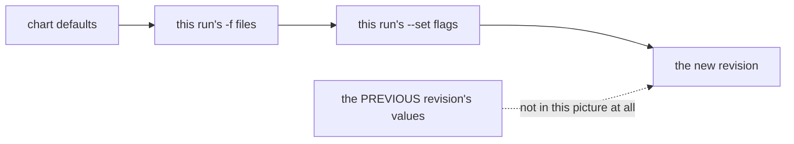

# Part 2 — How `helm upgrade` Computes Values

> Prerequisite: [Part 1 — Where A Release Lives](./course-01-where-a-release-lives.md). Next: [Part 3 — Executing And Reverting An Upgrade](./course-03-executing-and-reverting.md).

This is the part with the incident in it. `helm upgrade` has one default that reads as reasonable and behaves as destructive, and the only reliable way to internalise it is to trigger it on purpose and watch a working mesh setting disappear while the command prints success. That is what this part does.

## The rule

**`helm upgrade` starts from the chart's defaults and applies only the `-f` files and `--set` flags given on this invocation.** Values from the previous revision are not carried over.

Stated as a pipeline, the default upgrade is:



The dotted arrow is the whole lesson: `helm upgrade` does not start from what you installed last time. Anything you do not pass again is gone.

Compare that with the mental model most people arrive with, which is closer to `kubectl patch`: "change this one thing, leave everything else". Helm's model is closer to `kubectl apply` of a complete object — the arguments *are* the desired state.

## The two flags that change it

- **`--reuse-values`** starts from the previous revision's user-supplied values and applies this run's `--set` flags on top.

  ```text
    previous values  ──►  this run's --set flags  ──►  new revision
  ```

  The subtlety: it does **not** honour removals from a `-f` file. The file is merged *onto* the old value set, so a key the file no longer contains is still present, inherited from the previous revision. `--reuse-values` with `-f` is therefore a merge, not a replace, and is a common way to be surprised twice.

- **`--reset-values`** explicitly discards the previous values and starts from chart defaults. That is the default behaviour written down, which is occasionally worth putting in a script so the intent is visible to whoever reads it next.

The habit that removes the whole problem: **keep one complete values file per release, in version control, and pass it with `-f` on every install and every upgrade.** Then "what values does this release have?" has one answer, in one place, and neither flag is needed.

## Watching it go wrong

> [!WARNING]
> **The next checkpoint intentionally destroys configuration**
>
> The command upgrades `istiod` with no values at all. On this playground that is the lesson. On a real cluster it would turn off mesh-wide access logging, re-enable control-plane autoscaling and reset every sidecar's resource requests, in one apparently successful command. Do not practise this against anything you care about.

> [!TIP]
> **Try it — an upgrade that succeeds and breaks things**
>
> ```sh
> kubectl -n istio-system get cm istio -o jsonpath='{.data.mesh}' | grep accessLogFile
> helm upgrade istiod istio/istiod -n istio-system --version 1.30.5 --wait
> helm get values istiod -n istio-system
> kubectl -n istio-system get cm istio -o jsonpath='{.data.mesh}' | grep -c accessLogFile
> ```
>
> Expect something like:
>
> ```text
> accessLogFile: /dev/stdout
>
> Release "istiod" has been upgraded. Happy Helming!
> NAME: istiod
> REVISION: 2
> STATUS: deployed
>
> USER-SUPPLIED VALUES:
> null
>
> 0
> ```
>
> `STATUS: deployed` and `USER-SUPPLIED VALUES: null` on the same screen. The `accessLogFile` key that was in the ConfigMap a moment ago is gone, so every proxy in the mesh has stopped writing access logs — and nothing in the command output said so. The exit code was zero.

That is the whole failure mode. Note especially what it did *not* do: it did not error, warn, prompt, or mark the release unhealthy. Detection has to come from you, which is why the checks in Part 3 are worth building into the procedure rather than running when something feels wrong.

Worth doing once more with the other flag, to feel the difference:

> [!TIP]
> **Try it — the same upgrade with `--reuse-values`**
>
> ```sh
> helm rollback istiod 1 -n istio-system --wait
> helm upgrade istiod istio/istiod -n istio-system --version 1.30.5 --reuse-values --wait
> helm get values istiod -n istio-system | head -8
> ```
>
> Expect something like:
>
> ```text
> Rollback was a success! Happy Helming!
>
> Release "istiod" has been upgraded. Happy Helming!
>
> USER-SUPPLIED VALUES:
> global:
>   proxy:
>     resources:
>       requests:
>         cpu: 10m
>         memory: 64Mi
> ```
>
> The values survived this time. `--reuse-values` is a legitimate tool for a narrow change — bump the version, keep everything else — and it is also how a values file that *removes* a key gets quietly ignored. Which behaviour you got depends entirely on which flag you typed, and the output looks identical either way.

## Recovering what was lost

Part 1 established that Helm kept revision 1. That is the recovery path: `helm get values --revision 1` prints the block the install used, and redirecting it to a file gives back the artifact that should have existed.

> [!TIP]
> **Try it — rebuild the values file from the cluster**
>
> ```sh
> helm get values istiod -n istio-system --revision 1 | tail -n +2 > istiod-values.yaml
> cat istiod-values.yaml
> ```
>
> Expect something like:
>
> ```text
> global:
>   proxy:
>     resources:
>       requests:
>         cpu: 10m
>         memory: 64Mi
> meshConfig:
>   accessLogFile: /dev/stdout
>   outboundTrafficPolicy:
>     mode: ALLOW_ANY
> pilot:
>   autoscaleEnabled: false
>   resources:
>     requests:
>       cpu: 100m
>       memory: 256Mi
> ```
>
> This file is now the source of truth you were missing. Commit it before doing anything else — the point of the exercise is that the cluster being the only copy is the underlying problem, and reconstructing the file without committing it leaves that problem exactly where it was.

If the history has been pruned and revision 1 is gone, the fallback is the live cluster rather than the release: the `istio` ConfigMap holds the effective `meshConfig`, and `kubectl get deploy istiod -o yaml` holds the resource requests and replica settings. It is slower and it misses anything that was set but had no visible effect, which is why it is a fallback.

## Checking before applying

Two read-only checks catch the missing-`-f` mistake before it ships, and both take seconds.

**`--dry-run --debug`** renders the manifests and prints the *computed values* without touching the cluster. The computed values block is the one to read: if it is `null` or missing keys you expect, stop.

```sh
helm upgrade istiod istio/istiod -n istio-system \
  --version 1.30.5 -f istiod-values.yaml --dry-run --debug 2>&1 | sed -n '/COMPUTED VALUES/,/HOOKS/p' | head -20
```

**Diffing the rendered manifest** against what is live answers the stronger question — what objects change:

```sh
helm get manifest istiod -n istio-system > /tmp/current.yaml
helm upgrade istiod istio/istiod -n istio-system \
  --version 1.30.5 -f istiod-values.yaml --dry-run 2>/dev/null \
  | sed -n '/^MANIFEST:/,$p' | tail -n +2 > /tmp/proposed.yaml
diff /tmp/current.yaml /tmp/proposed.yaml | head -30
```

In a pipeline, the equivalent is the `helm-diff` plugin, which does this properly and is worth installing wherever Helm upgrades are automated.

> [!WARNING]
## Common pitfalls

> [!WARNING]
> **`helm upgrade` with neither `-f` nor `--reuse-values`.** Everything falls back to chart defaults and the command reports success. This is the most expensive mistake in the module.
>
> **`--reuse-values` with a `-f` file that removes a key.** The removal is not honoured; the file is merged onto the old values. To genuinely drop a key, pass a complete file without `--reuse-values`.
>
> **Assuming `--set` is additive across runs.** It applies to this invocation only, on top of whatever base the flags selected.
>
> **Treating exit code zero as verification.** Helm's success means the manifests applied. Whether they contain what you intended is a separate question with a separate check.
>
> **Recovering a values file and not committing it.** The cluster being the only copy is the root cause; reconstruction alone does not fix it.

> *`helm upgrade` reconciles to the arguments of this run, not to the state of the last one — and it reports success either way.*

## Reference

- [helm upgrade](https://helm.sh/docs/helm/helm_upgrade/) — the flag reference, including `--reuse-values` and `--reset-values`.
- [Helm: values files](https://helm.sh/docs/chart_template_guide/values_files/) — how value sources are merged.
- [helm-diff plugin](https://github.com/databus23/helm-diff) — rendered-manifest diffs as a first-class step in a pipeline.
- `helm upgrade --help` — confirm flag behaviour on the Helm version you actually have; the semantics have changed across major versions.
