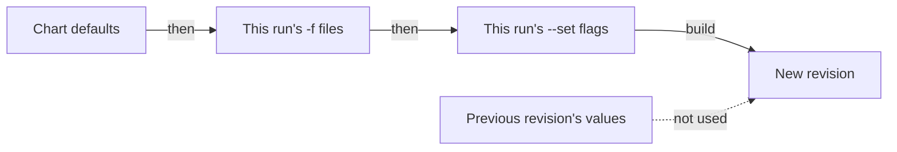

# How `helm upgrade` Computes Values

An upgrade must change the version and keep the settings. `helm upgrade` has one rule that sounds reasonable and breaks the second half of that goal: as soon as you pass one value on the command line, it can drop every other setting from the install and still report success. The surest way to remember this is to trigger it on purpose, and watch a working mesh setting disappear while the command prints success. This part explains the rule, the flags that change it, and how to get the lost values back.

## The rule

**When you pass any `-f` file or `--set` flag, `helm upgrade` starts from the new chart's defaults and applies only the `-f` files and `--set` flags of this run.** Helm does not carry over the values of the previous revision.



The diagram shows that the values of the previous revision never reach the new revision, so anything you do not pass again is gone.

Most people expect something like `kubectl patch`: change this one thing and leave everything else. Helm works more like `kubectl apply` of a complete object. The arguments you type on this run *are* the desired state.

There is one exception, and it hides the rule from many people. When you pass **no** `-f` file and **no** `--set` flag at all, Helm reuses the user-supplied values of the previous revision. So a bare `helm upgrade istiod istio/istiod --version 1.30.5` keeps your settings, and the same command with one extra `--set` loses all the others.

## The flags that change it

Three flags change where Helm starts from. Each is useful, and two have a catch.

**`--reuse-values`** starts from the previous revision's values and applies this run's `-f` files and `--set` flags on top:


The diagram shows the starting point that `--reuse-values` uses instead of the chart defaults.

It has two catches. First, it does **not** honour removals from a `-f` file. Helm merges the file *onto* the old values, so a key the file no longer contains is still there, inherited from the previous revision. Second, and worse for a version upgrade, it reuses the *old chart's* default values too, not only yours. The Istio charts keep the image tag in their default values (`global.tag`), so an upgrade to chart `1.30.5` with `--reuse-values` renders the `1.30.5` templates with the `1.29.8` images.

**`--reset-then-reuse-values`** fixes the second catch. It starts from the new chart's defaults, then applies the last release's user-supplied values, then this run's `-f` files and `--set` flags.

**`--reset-values`** throws away the previous values and starts from the chart defaults. Use it when you really want the chart defaults back.

All the catches go away with one habit. **Keep one complete values file per release, in version control, and pass it with `-f` on every install and every upgrade.** Then the question "what values does this release have?" has one answer, in one place, and you need none of the flags.

## Watching it go wrong

The rule is easier to remember once you have seen its effect. The next step upgrades `istiod` with a single `--set` flag that raises the CPU request of `istiod`, so it destroys the other settings on purpose. In your playground that is the lesson. On a real cluster it would switch off mesh-wide access logging, switch the autoscaling of `istiod` back on, and reset the resource requests of every sidecar proxy, all in one command that looks successful. Never practise this on a cluster you care about.

<!-- astrona:playground:renew -->

Check the access log setting in the `istio` ConfigMap, upgrade with one `--set` flag, then read the values and the ConfigMap again:

```sh
kubectl -n istio-system get cm istio -o jsonpath='{.data.mesh}' | grep accessLogFile
helm upgrade istiod istio/istiod -n istio-system --version 1.30.5 --set pilot.resources.requests.cpu=200m --wait
helm get values istiod -n istio-system
kubectl -n istio-system get cm istio -o jsonpath='{.data.mesh}' | grep -c accessLogFile
```

The output looks like this (shortened: the release notes after `TEST SUITE` are left out):

```text
accessLogFile: /dev/stdout
Release "istiod" has been upgraded. Happy Helming!
NAME: istiod
LAST DEPLOYED: Sat Oct 10 02:26:36 2026
NAMESPACE: istio-system
STATUS: deployed
REVISION: 2
DESCRIPTION: Upgrade complete
TEST SUITE: None
USER-SUPPLIED VALUES:
pilot:
  resources:
    requests:
      cpu: 200m
0
```

`STATUS: deployed` and a values list with only your one new key appear on the same screen. The `accessLogFile` key that was in the `istio` ConfigMap a moment ago is gone, so every proxy in the mesh has stopped writing access logs. Nothing in the output said so, and the exit code was zero.

Notice what Helm did *not* do: it did not fail, warn, ask, or mark the release unhealthy. You have to catch this yourself, so build the checks into your upgrade steps instead of running them only when something feels wrong.

## Going back, and upgrading with the old values

Revision 1 still holds the install's values. Roll back to it. With Helm 3, run:

```sh
helm rollback istiod 1 -n istio-system --wait
```

With Helm 4 (`helm version --short` starts with `v4`), the same command stops with an error like this:

```text
Error: conflict occurred while applying object /istio-validator-istio-system admissionregistration.k8s.io/v1, Kind=ValidatingWebhookConfiguration: Apply failed with 1 conflict: conflict with "pilot-discovery" using admissionregistration.k8s.io/v1: .webhooks[name="rev.validation.istio.io"].failurePolicy
```

Helm 4 applies objects with server-side apply, and `istiod` itself (`pilot-discovery`) owns the `failurePolicy` field of its validating webhook, so Helm 4 must be told to take that field back. Add `--force-conflicts` on the first try. A failed try is recorded as a revision of its own, and the next rollback compares against that failed revision, so it leaves behind objects that only revision 2 had: here the `istiod` HorizontalPodAutoscaler. If that happened, delete it with `kubectl -n istio-system delete hpa istiod`. With Helm 4, run:

```sh
helm rollback istiod 1 -n istio-system --wait --force-conflicts
```

```text
Rollback was a success! Happy Helming!
```

`istiod` runs `1.29.8` again with all the install's settings. Now compare what the two reuse flags would render for an upgrade to `1.30.5`. A dry run (`--dry-run`) renders the manifests without changing the cluster, and `grep` picks out the `istiod` image:

```sh
helm upgrade istiod istio/istiod -n istio-system --version 1.30.5 --reuse-values --dry-run 2>/dev/null | grep -E '^\s+image: .*pilot'
helm upgrade istiod istio/istiod -n istio-system --version 1.30.5 --reset-then-reuse-values --dry-run 2>/dev/null | grep -E '^\s+image: .*pilot'
```

```text
          image: "docker.io/istio/pilot:1.29.8"
          image: "registry.istio.io/release/pilot:1.30.5"
```

With `--reuse-values`, the chart version says `1.30.5` and the image stays `1.29.8`, because the old chart's `global.tag` came along. Applied for real, that mix of `1.30.5` templates and a `1.29.8` `istiod` fails: the old `istiod` cannot read the new injection template, and its new pod crashes. `--reset-then-reuse-values` gives the image the new chart asks for. Run that one:

```sh
helm upgrade istiod istio/istiod -n istio-system --version 1.30.5 --reset-then-reuse-values --wait
helm get values istiod -n istio-system | head -8
```

The output looks like this (shortened: only the first line of the release notes is shown):

```text
Release "istiod" has been upgraded. Happy Helming!
USER-SUPPLIED VALUES:
global:
  proxy:
    resources:
      requests:
        cpu: 10m
        memory: 64Mi
meshConfig:
```

This time the values survived. `--reset-then-reuse-values` is a fair tool for a narrow change: change the version, keep everything you supplied. It still merges a `-f` file onto the old values, so a values file that *removes* a key gets ignored without a word. Which behaviour you get depends only on the flag you typed, and the output looks the same either way.

## Recovering what was lost

The bad upgrade lost the settings, but Helm still has revision 1 in the release history. `helm get values --revision 1` prints the values the install used, and you can write them to a file:

```sh
helm get values istiod -n istio-system --revision 1 | tail -n +2 > istiod-values.yaml
cat istiod-values.yaml
```

The output looks like this:

```text
global:
  proxy:
    resources:
      requests:
        cpu: 10m
        memory: 64Mi
meshConfig:
  accessLogFile: /dev/stdout
  outboundTrafficPolicy:
    mode: ALLOW_ANY
pilot:
  autoscaleEnabled: false
  resources:
    requests:
      cpu: 100m
      memory: 256Mi
```

This file is now the source of truth you were missing, so save it in version control before you do anything else. The real problem was that the cluster held the only copy. Rebuilding the file without saving it leaves that problem where it was.

If someone also removed the history and revision 1 no longer exists, fall back to the live cluster. The `istio` ConfigMap holds the `meshConfig` in effect, and `kubectl get deploy istiod -o yaml` holds the resource requests and replica settings. This is slower, and it misses any setting that had no visible effect, so it is only a fallback.

## Checking before applying

Recovery is the slow path. Two read-only checks catch a wrong set of values before it does any damage, and both take seconds.

The first check is a dry run. `--dry-run --debug` renders the manifests and prints the values without touching the cluster. Run it with the values file and read the `USER-SUPPLIED VALUES` block, which holds exactly what this run passes:

```sh
helm upgrade istiod istio/istiod -n istio-system \
  --version 1.30.5 -f istiod-values.yaml --dry-run --debug 2>&1 | sed -n '/^USER-SUPPLIED VALUES:/,/^COMPUTED VALUES:/p'
```

```text
USER-SUPPLIED VALUES:
global:
  proxy:
    resources:
      requests:
        cpu: 10m
        memory: 64Mi
meshConfig:
  accessLogFile: /dev/stdout
  outboundTrafficPolicy:
    mode: ALLOW_ANY
pilot:
  autoscaleEnabled: false
  resources:
    requests:
      cpu: 100m
      memory: 256Mi

COMPUTED VALUES:
```

If the block is `{}` or misses keys you expect, stop and find out why before you upgrade. The `COMPUTED VALUES` block that follows is the full merge with the chart defaults, a few hundred lines long.

The second check answers a stronger question: which objects change? It compares the manifest of the live revision with the manifest the upgrade would apply. The `sed` commands keep only the lines between `MANIFEST:` and `NOTES:` of the dry run:

```sh
helm get manifest istiod -n istio-system > /tmp/current.yaml
helm upgrade istiod istio/istiod -n istio-system \
  --version 1.30.5 -f istiod-values.yaml --dry-run 2>/dev/null \
  | sed -n '/^MANIFEST:/,/^NOTES:/p' | sed '1d;$d' > /tmp/proposed.yaml
diff /tmp/current.yaml /tmp/proposed.yaml | head -30
```

Here `diff` prints nothing: the file holds the same values the live revision already runs, so no object changes. Change one value in the file, for example the outbound mode, and the same commands print every line that would change.

In a pipeline, the `helm-diff` plugin does this job properly. It is worth installing wherever Helm upgrades run automatically.

You now know that `helm upgrade` builds the new release from the arguments of this run, not from the state of the last one, as soon as you pass any value, and that it reports success either way. `--reuse-values` keeps the old chart's image tag, `--reset-then-reuse-values` keeps only your values, and `helm get values --revision 1` gets lost values back. The open question is how to use a complete values file to upgrade all three Istio releases, and what else must change before the upgrade is really finished.

## Common pitfalls

> [!WARNING]
> **`helm upgrade` with one `--set` and no `-f`.** Every other setting falls back to chart defaults and the command reports success. This is the most expensive mistake in the module.
>
> **`--reuse-values` across Istio versions.** It keeps the old chart's default values, image tag included, so the new chart runs the old images. Use a complete `-f` file, or `--reset-then-reuse-values`.
>
> **`--reuse-values` with a `-f` file that removes a key.** Helm ignores the removal and merges the file onto the old values. To really drop a key, pass a complete file without a reuse flag.
>
> **Expecting `--set` to add up across runs.** It applies to this run only, on top of whatever starting point the flags chose.
>
> **Treating exit code zero as proof.** Helm's success means it applied the manifests. Whether they hold what you meant is a separate question with a separate check.
>
> **Recovering a values file and not saving it.** The cluster being the only copy is the real cause; rebuilding the file alone does not fix it.
