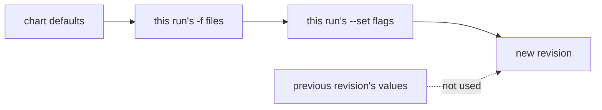

# How `helm upgrade` Computes Values

This is the part with the accident in it. `helm upgrade` has one default that sounds reasonable and acts destructively. The surest way to remember it is to trigger it on purpose and watch a working mesh setting disappear while the command prints success.

In space terms: a Helm values file is the order form for a kit. This part is about which order form Helm uses when you rebuild the kit.

## The rule

Here is how Helm decides the values of a new revision, and how that differs from what most people expect.

### What Helm starts from

**`helm upgrade` starts from the chart's defaults and applies only the `-f` files and `--set` flags you give on this run.** Helm does not carry over the values of the previous revision.

As a picture, the default upgrade is:



The diagram shows that the previous revision's values never reach the new revision. Anything you do not pass again is gone.

### Why this surprises people

Most people expect something like `kubectl patch`: "change this one thing and leave everything else". Helm works more like `kubectl apply` of a complete object. The arguments you type *are* the desired state.

## The two flags that change it

Two flags change where Helm starts from. Both have a catch.

### `--reuse-values`

**`--reuse-values`** starts from the previous revision's user-supplied values and applies this run's `--set` flags on top:

```text
  previous values  ──►  this run's --set flags  ──►  new revision
```

The catch: it does **not** honour removals from a `-f` file. Helm merges the file *onto* the old values. So a key the file no longer contains is still there, inherited from the previous revision. `--reuse-values` with `-f` is a merge, not a replacement, and it can surprise you a second time.

### `--reset-values`

**`--reset-values`** throws away the previous values and starts from the chart defaults. That is the default behaviour, written out. It is sometimes worth putting in a script so the next reader sees the intent.

### The habit that avoids both

**Keep one complete values file per release, in version control, and pass it with `-f` on every install and every upgrade.** Then "what values does this release have?" has one answer, in one place, and you need neither flag.

## Watching it go wrong

Now trigger the accident on purpose, then try the same upgrade with `--reuse-values`.

**The next step destroys settings on purpose.** It upgrades `istiod` with no values at all. In your playground that is the lesson. On a real cluster it would switch off mesh-wide access logging, switch mission control's autoscaling back on, and reset every sidecar's resource requests, all in one command that looks successful. Never practise this on a cluster you care about.

### See an upgrade that succeeds and breaks things

Check the access log setting, upgrade with no values, then check again:

<!-- astrona:playground:renew -->

```sh
kubectl -n istio-system get cm istio -o jsonpath='{.data.mesh}' | grep accessLogFile
helm upgrade istiod istio/istiod -n istio-system --version 1.30.5 --wait
helm get values istiod -n istio-system
kubectl -n istio-system get cm istio -o jsonpath='{.data.mesh}' | grep -c accessLogFile
```

Expect something like:

```text
accessLogFile: /dev/stdout

Release "istiod" has been upgraded. Happy Helming!
NAME: istiod
REVISION: 2
STATUS: deployed

USER-SUPPLIED VALUES:
null

0
```

`STATUS: deployed` and `USER-SUPPLIED VALUES: null` on the same screen. The `accessLogFile` key that was in the `istio` ConfigMap a moment ago is gone. So every proxy in the mesh has stopped writing access logs, and nothing in the output said so. The exit code was zero.

That is the whole failure. Notice what Helm did *not* do: it did not fail, warn, ask, or mark the release unhealthy. You have to catch it yourself, so build the checks into your upgrade steps instead of running them only when something feels wrong.

### See the same upgrade with `--reuse-values`

Roll back to revision 1, then upgrade again with the other flag:

```sh
helm rollback istiod 1 -n istio-system --wait
helm upgrade istiod istio/istiod -n istio-system --version 1.30.5 --reuse-values --wait
helm get values istiod -n istio-system | head -8
```

Expect something like:

```text
Rollback was a success! Happy Helming!

Release "istiod" has been upgraded. Happy Helming!

USER-SUPPLIED VALUES:
global:
  proxy:
    resources:
      requests:
        cpu: 10m
        memory: 64Mi
```

This time the values survived. `--reuse-values` is a fair tool for a narrow change: bump the version, keep everything else. It is also how a values file that *removes* a key gets quietly ignored. Which behaviour you get depends only on the flag you typed, and the output looks the same either way.

## Recovering what was lost

Helm kept revision 1 in its release history. That is your way back: `helm get values --revision 1` prints the values the install used, and you can write them to a file.

### Rebuild the values file from the cluster

```sh
helm get values istiod -n istio-system --revision 1 | tail -n +2 > istiod-values.yaml
cat istiod-values.yaml
```

Expect something like:

```text
global:
  proxy:
    resources:
      requests:
        cpu: 10m
        memory: 64Mi
meshConfig:
  accessLogFile: /dev/stdout
  outboundTrafficPolicy:
    mode: ALLOW_ANY
pilot:
  autoscaleEnabled: false
  resources:
    requests:
      cpu: 100m
      memory: 256Mi
```

This file is now the source of truth you were missing. Save it in version control before you do anything else. The real problem is that the cluster was the only copy. Rebuilding the file without saving it leaves that problem exactly where it was.

### When the history is gone too

If someone removed the history and revision 1 no longer exists, fall back to the live cluster. The `istio` ConfigMap holds the `meshConfig` in effect, and `kubectl get deploy istiod -o yaml` holds the resource requests and replica settings. This is slower, and it misses anything that was set but had no visible effect. That is why it is only a fallback.

## Checking before applying

Two read-only checks catch a missing `-f` before it does damage. Both take seconds.

### Read the computed values in a dry run

**`--dry-run --debug`** renders the manifests and prints the *computed values* without touching the cluster. Read the computed values block. If it is `null` or misses keys you expect, stop.

```sh
helm upgrade istiod istio/istiod -n istio-system \
  --version 1.30.5 -f istiod-values.yaml --dry-run --debug 2>&1 | sed -n '/COMPUTED VALUES/,/HOOKS/p' | head -20
```

### Compare the rendered objects

Comparing the rendered manifest with what is live answers a stronger question: which objects change?

```sh
helm get manifest istiod -n istio-system > /tmp/current.yaml
helm upgrade istiod istio/istiod -n istio-system \
  --version 1.30.5 -f istiod-values.yaml --dry-run 2>/dev/null \
  | sed -n '/^MANIFEST:/,$p' | tail -n +2 > /tmp/proposed.yaml
diff /tmp/current.yaml /tmp/proposed.yaml | head -30
```

In a pipeline, the `helm-diff` plugin does this job properly. It is worth installing wherever Helm upgrades run automatically.

`helm upgrade` builds the new release from the arguments of this run, not from the state of the last one, and it reports success either way.

## Common pitfalls

> [!WARNING]
> **`helm upgrade` with neither `-f` nor `--reuse-values`.** Everything falls back to chart defaults and the command reports success. This is the most expensive mistake in the module.
>
> **`--reuse-values` with a `-f` file that removes a key.** Helm ignores the removal and merges the file onto the old values. To really drop a key, pass a complete file without `--reuse-values`.
>
> **Expecting `--set` to add up across runs.** It applies to this run only, on top of whatever starting point the flags chose.
>
> **Treating exit code zero as proof.** Helm's success means the manifests were applied. Whether they hold what you meant is a separate question with a separate check.
>
> **Recovering a values file and not saving it.** The cluster being the only copy is the real cause; rebuilding the file alone does not fix it.
