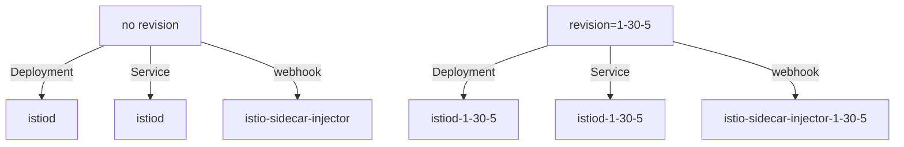

# Revisions: A Named Control Plane

A canary upgrade works because two Istio control planes can run in one cluster without getting in each other's way. That is not a special mode. It follows from how a revision names every object an install creates. This part shows what a revision is at the level of objects, so that the label work that comes after it makes sense instead of being something to memorise.

In space terms, a **revision** is a named mission control. Give it a name, and a second mission control can stand next to the first.

## What `--set revision=` changes

Start by comparing what two installs create. Then you see the rule and the three facts that follow from it.

### Two installs side by side

Compare `istioctl install --set profile=minimal` with the same command plus `--set revision=1-30-5`:



The diagram shows the same three objects twice: once plain, and once with the revision name added as a suffix. A revision is a naming scheme. The same render produces the same objects, each with the revision added to its name. That is why two control planes can run side by side, and why one install never touches the other's objects.

The general rule: **a revision is a named, independent copy of the control plane, and every namespaced object it owns carries the name as a suffix.** An install without a revision name is "the default revision". That is why the existing `istiod` has no suffix, and its webhook has none either.

### Three facts that make the canary work

**Names do not collide.** Two Deployments, two Services, two webhook configurations. Kubernetes has no reason to object.

**Each install only manages its own revision.** `istioctl install` finds and removes the objects it owns by their ownership labels, and those labels include `istio.io/rev`. So an install of `1-30-5` lists and prunes only objects owned by `1-30-5`. It cannot see the default revision's objects, so it cannot delete them.

**The webhooks pick different namespaces.** The default webhook (the dock inspector for the default mission control) matches namespaces labelled `istio-injection=enabled`. The revision's webhook matches `istio.io/rev=1-30-5`. A namespace meets one or the other.

### What the revisions share

Some cluster-wide objects really are shared. The Custom Resource Definitions (CRDs: the forms that teach the cluster Istio's object kinds) are installed once and used by every revision. That is fine, because CRDs are only definitions. It is also why `istioctl uninstall --purge` is so destructive during a canary: removing the shared definitions takes both control planes down.

## Revision names are DNS labels

Revision names become part of Kubernetes object names, so they must be valid DNS labels: lowercase letters, digits and dashes, starting and ending with a letter or digit, and no dots.

That is why the habit is `1-30-5` and not `1.30.5`. Any name works, such as `canary`, `next` or `blue`. But putting the version in the name makes `kubectl get pods` explain itself, and months later it is obvious which revision is the old one.

A dotted name does not give a helpful error at the moment you type it. It produces an object name that is not valid, deeper inside the install. Writing dashes from the start costs nothing.

## Install `minimal` for a canary control plane

The canary install uses the `minimal` profile, which installs `istiod` and nothing else. That choice is on purpose: a canary needs a second **control plane**, not a second set of gateways.

### Why not a full profile

Gateways (the spaceport gates) are not picked by a namespace injection label. They are standalone Envoy Deployments that the profile creates. A full profile as a canary means two gateway Deployments fighting over the same names and the same Service. That is a different and much messier problem. You move the gateways separately, as their own rollout, once the new control plane has proved itself.

### See it in your playground

Install the 1.30.5 revision with the new binary, then list the control plane pods, Services and webhooks:

<!-- astrona:playground:renew -->

```sh
istioctl-1.30.5 install --set profile=minimal --set revision=1-30-5 -y
kubectl -n istio-system get pods -l app=istiod
kubectl -n istio-system get svc | grep istiod
kubectl get mutatingwebhookconfigurations | grep istio
```

Expect something like:

```text
NAME                             READY   STATUS    RESTARTS   AGE
istiod-1-30-5-6b9c8f7d4b-xk2p9   1/1     Running   0          41s
istiod-77d5f6c8b9-qr4tz          1/1     Running   0          12m

istiod           ClusterIP   10.96.31.4    <none>   15010/TCP,15012/TCP,443/TCP,15014/TCP
istiod-1-30-5    ClusterIP   10.96.88.17   <none>   15010/TCP,15012/TCP,443/TCP,15014/TCP

istio-revision-tag-default            ...   12m
istio-sidecar-injector                ...   12m
istio-sidecar-injector-1-30-5         ...   41s
```

Two `istiod` pods, two Services, and a webhook configuration with the suffix. The two Services matter more than they look. A sidecar's `discoveryAddress` points at one of them, and that is how a proxy stays connected to one mission control and not the other.

## Installing a revision moves nothing

This surprises people, and it follows straight from injection. The new control plane has a webhook, but no namespace is labelled for it. Even a relabelled namespace only affects pods created afterwards.

### Which mission control serves this ship?

Your running workload was injected by the old control plane, points at the old control plane's Service, and stays there. `istioctl proxy-status` lets you check this. Its last column, `ISTIOD`, names the control plane *pod* each proxy is connected to. That is the only reliable answer to "which mission control serves this workload?"

### See that nothing changed for the workload

List the pods in `canary-demo`, then the proxy status for that namespace:

```sh
kubectl -n canary-demo get pods
istioctl proxy-status | grep -E 'NAME|canary-demo'
```

Expect something like:

```text
NAME                                       READY   STATUS    RESTARTS   AGE
notification-service-v1-5d9f8b7c6d-p2mzq   2/2     Running   0          13m

NAME                                     CLUSTER      CDS      LDS      EDS      RDS      ISTIOD
notification-service-v1-...canary-demo   Kubernetes   SYNCED   SYNCED   SYNCED   SYNCED   istiod-77d5f6c8b9-qr4tz
```

The pod's `AGE` is older than the canary install, and `RESTARTS` is still 0. The `ISTIOD` column names the *old* control plane pod, the one without a suffix. Installing a revision disturbs nothing, and that is exactly what makes a canary upgrade safe to start.

### See a control plane with no clients

Now check the other half: the new control plane runs and serves nobody.

```sh
istioctl-1.30.5 proxy-status --revision 1-30-5
kubectl -n istio-system logs deploy/istiod-1-30-5 --tail=5 | grep -i 'push\|ads' || echo '(no pushes logged)'
```

Expect something like:

```text
No proxies connected to the control plane.

(no pushes logged)
```

A healthy, running `istiod` with no connected proxies. It has computed nothing and pushed nothing, because no workload has been told to talk to it. Until you start moving namespaces, this idle second mission control is the whole cost of a canary upgrade.

## What this costs

Two control planes run for the whole migration. On a small cluster you notice it: in the `demo` profile, `istiod` requests 500m CPU and 2Gi memory by default, and the canary is a second copy.

That is the price of a rollback that is a label change instead of a reinstall. The overlap is temporary, and it lasts only as long as you take to restart the workloads.

A revision adds a suffix to every namespaced object it owns. That is why two control planes can live side by side, why one install cannot touch the other, and why installing one changes nothing for running pods.

## Common pitfalls

> [!WARNING]
> **Expecting a revision install to move workloads.** It creates a second control plane and nothing else. Nothing moves until you relabel a namespace and recreate its pods.
>
> **Using a revision name that is not a DNS label.** Dots and underscores are rejected. That is why versions appear as `1-30-5` and not `1.30.5`.
>
> **Forgetting that the second control plane costs resources.** Two `istiod` Deployments run until you retire one.
>
> **Assuming the default revision is special.** It is simply the one with no suffix, and it can be the older of the two.
>
> **Installing a full profile as the canary.** Two sets of gateways fight over the same names. Install `minimal` and move the gateways separately.
