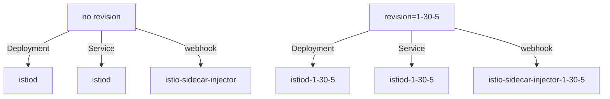

# Revisions: A Named Control Plane

A canary upgrade needs two Istio control planes in one cluster at the same time, and they must not get in each other's way. The control plane is `istiod`: it turns Istio resources into proxy configuration and sends it, together with certificates, to every sidecar proxy. Two copies of it can run side by side because of how a **revision** names the objects an install creates. This part shows what a revision is at the level of Kubernetes objects, so that the label work which follows makes sense and is not just something to memorise.

## What `--set revision=` changes

The quickest way to understand a revision is to compare what two installs create. After that comparison, the rule and the three facts that follow from it are easy to state.

### Two installs side by side

Compare `istioctl install --set profile=minimal` with the same command plus `--set revision=1-30-5`:



The diagram shows the same three objects twice: once plain, and once with the revision name added as a suffix.

A revision is a naming scheme. The same render produces the same objects, and each one gets the revision name added to its name. That is why two control planes can run side by side, and why one install never touches the objects of the other.

The general rule is this: **a revision is a named, independent copy of the control plane, and every namespaced object it owns carries the name as a suffix.** An install without a revision name is called "the default revision". That is why the existing `istiod` has no suffix, and its webhook has none either.

### Three facts that make the canary work

The suffix leads to three facts. Together they make it safe to run a second control plane.

**Names do not collide.** There are two Deployments, two Services and two webhook configurations, so Kubernetes has no reason to object.

**Each install only manages its own revision.** `istioctl install` finds and removes the objects it owns by their ownership labels, and those labels include `istio.io/rev`. So an install of `1-30-5` lists and prunes only objects owned by `1-30-5`. It cannot see the objects of the default revision, so it cannot delete them.

**The webhooks select different namespaces.** A mutating webhook is a call that the Kubernetes API server makes to change an object before it stores it; Istio uses one to add the sidecar to new pods. The default webhook matches namespaces labelled `istio-injection=enabled`. The webhook of the revision matches `istio.io/rev=1-30-5`. A namespace meets one selector or the other.

### What the revisions share

Some cluster-wide objects really are shared. The CRDs (Custom Resource Definitions, which add Istio's object kinds such as `VirtualService` to the Kubernetes API) are installed once and used by every revision. That is fine, because CRDs are only definitions and run nothing. It is also why `istioctl uninstall --purge` is so destructive during a canary upgrade: removing the shared definitions takes both control planes down.

## Revision names are DNS labels

Because the revision name becomes part of Kubernetes object names, it must be a valid DNS label. A DNS label may hold lowercase letters, digits and dashes, must start and end with a letter or a digit, and may not contain dots.

That is why the habit is `1-30-5` and not `1.30.5`. Any valid name works, such as `canary`, `next` or `blue`. But a name that holds the version makes `kubectl get pods` easy to read, and months later it is clear which revision is the old one.

A dotted name does not give a helpful error at the moment you type it. Instead, it produces an object name that is not valid, deeper inside the install. Writing dashes from the start avoids that.

## Install `minimal` for a canary control plane

With the naming rule clear, the next choice is the profile. The canary install uses the `minimal` profile, which installs `istiod` and nothing else. That choice is on purpose: a canary upgrade needs a second **control plane**, not a second set of gateways.

A gateway is a standalone Envoy Deployment that handles traffic entering or leaving the mesh, such as the ingress gateway. No namespace injection label picks a control plane for it; the profile creates it. If you install a full profile as the canary, you get two gateway Deployments that compete for the same names and the same Service. That is a different and much messier problem. You move the gateways separately, as their own rollout, once the new control plane has proved itself.

Now install the 1.30.5 revision with the new binary. Then list the control plane pods, the Services and the webhook configurations:

<!-- astrona:playground:renew -->

```sh
istioctl-1.30.5 install --set profile=minimal --set revision=1-30-5 -y
kubectl -n istio-system get pods -l app=istiod
kubectl -n istio-system get svc | grep istiod
kubectl get mutatingwebhookconfigurations | grep istio
```

The output looks like this (shortened; your pod names, IP addresses and ages differ):

```text
NAME                             READY   STATUS    RESTARTS   AGE
istiod-1-30-5-6b9c8f7d4b-xk2p9   1/1     Running   0          41s
istiod-77d5f6c8b9-qr4tz          1/1     Running   0          12m

istiod           ClusterIP   10.96.31.4    <none>   15010/TCP,15012/TCP,443/TCP,15014/TCP
istiod-1-30-5    ClusterIP   10.96.88.17   <none>   15010/TCP,15012/TCP,443/TCP,15014/TCP

istio-revision-tag-default            ...   12m
istio-sidecar-injector                ...   12m
istio-sidecar-injector-1-30-5         ...   41s
```

You see two `istiod` pods, two Services, and a webhook configuration with the suffix. The two Services matter more than they look. The `discoveryAddress` setting of a sidecar proxy points at one of them, and that is how each proxy stays connected to one control plane and not the other.

## Installing a revision moves nothing

The new control plane runs, but it has no clients yet. This surprises people, and it follows straight from injection. The new control plane has a webhook, but no namespace is labelled for it. Even a relabelled namespace only affects pods created afterwards.

Your running workload was injected by the old control plane, points at the Service of the old control plane, and stays there. `istioctl proxy-status` lets you check this. It lists every proxy that `istiod` knows about. Its last column, `ISTIOD`, names the control plane *pod* each proxy is connected to. That column is the only reliable answer to the question "which control plane serves this workload?".

List the pods in `canary-demo`, then the proxy status for that namespace:

```sh
kubectl -n canary-demo get pods
istioctl proxy-status | grep -E 'NAME|canary-demo'
```

The output looks like this (shortened):

```text
NAME                                       READY   STATUS    RESTARTS   AGE
notification-service-v1-5d9f8b7c6d-p2mzq   2/2     Running   0          13m

NAME                                     CLUSTER      CDS      LDS      EDS      RDS      ISTIOD
notification-service-v1-...canary-demo   Kubernetes   SYNCED   SYNCED   SYNCED   SYNCED   istiod-77d5f6c8b9-qr4tz
```

The `AGE` of the pod is older than the canary install, and `RESTARTS` is still 0. The `ISTIOD` column names the *old* control plane pod, the one without a suffix. Installing a revision disturbs nothing, and that is exactly what makes a canary upgrade safe to start.

The other half of the picture is the new control plane: it runs and serves nobody. Ask the 1.30.5 binary for the proxies of revision `1-30-5`, and look for pushes in the log of the new `istiod`:

```sh
istioctl-1.30.5 proxy-status --revision 1-30-5
kubectl -n istio-system logs deploy/istiod-1-30-5 --tail=5 | grep -i 'push\|ads' || echo '(no pushes logged)'
```

The output looks like this:

```text
No proxies connected to the control plane.

(no pushes logged)
```

This is a healthy, running `istiod` with no connected proxies. A push is `istiod` sending new configuration to a proxy over xDS, the protocol `istiod` uses to send configuration to proxies while they run. This `istiod` has built nothing and pushed nothing, because no workload has been told to connect to it.

## What this costs

The idle second control plane is the whole cost of a canary upgrade until you start moving namespaces. Two control planes run for the whole migration, and on a small cluster you notice it. In the `minimal` and `default` profiles, `istiod` requests 500m CPU and 2Gi of memory, and the canary is a second copy of it.

That is the price of a rollback that is a label change instead of a reinstall. The overlap is temporary: it lasts only as long as you take to restart the workloads.

You now know that a revision adds a suffix to every namespaced object it owns. That suffix is why two control planes can run side by side, why one install cannot touch the other, and why installing a revision changes nothing for running pods. The open question is how to tell a namespace, and its pods, to use the new control plane.

## Common pitfalls

> [!WARNING]
> **Expecting a revision install to move workloads.** It creates a second control plane and nothing else. Nothing moves until you relabel a namespace and create its pods again.
>
> **Using a revision name that is not a DNS label.** Dots and underscores are not allowed. That is why versions appear as `1-30-5` and not `1.30.5`.
>
> **Forgetting that the second control plane costs resources.** Two `istiod` Deployments run until you retire one.
>
> **Assuming the default revision is special.** It is simply the one with no suffix, and it can be the older of the two.
>
> **Installing a full profile as the canary.** Two sets of gateways compete for the same names. Install `minimal` and move the gateways separately.
