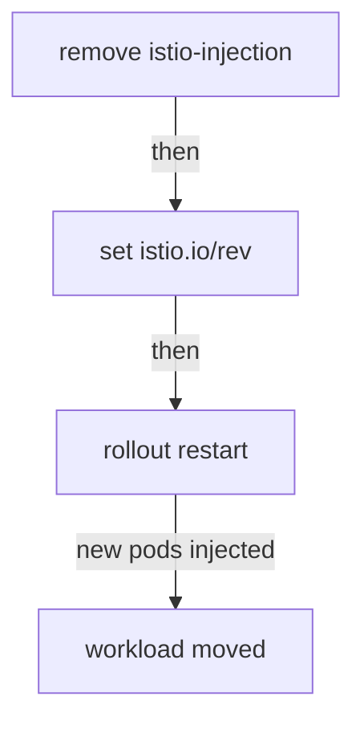

# Moving A Namespace To A Revision

A second control plane that serves no proxies is only half of a canary upgrade. The other half is moving workloads onto it, one namespace at a time, so you can check each step. This part shows the two namespace labels that pick a control plane, which one wins when both are present, and the restart that really performs the move.

The commands below need the 1.30.5 control plane installed as revision `1-30-5`. If `kubectl -n istio-system get deploy istiod-1-30-5` finds nothing, install it first with `istioctl-1.30.5 install --set profile=minimal --set revision=1-30-5 -y`.

## Two labels, and which one wins

A namespace tells the Kubernetes API server which injection webhook to call through its labels. Two labels exist for this, and they do not combine the way people expect.

### What each label selects

Each label selects a different control plane:

- **`istio-injection=enabled`** on a namespace selects the **default** control plane, the one without a revision name.
- **`istio.io/rev=<revision-or-tag>`** on a namespace selects that exact revision.

In practice the two labels rule each other out. If both are present, `istio-injection` wins and the revision label has no effect. Nothing warns you about this, and the workload stays on the control plane you were trying to move *away* from.

### Why `istio-injection` wins

This rule comes from the webhook selectors. The `namespaceSelector` of a webhook is a label selector that the API server checks against the namespace object. The default webhook's `namespaceSelector` matches `istio-injection: enabled`. The revision's webhook matches `istio.io/rev: <name>` *and* requires `istio-injection` to be absent. A namespace with both labels only meets the first selector. No tie-break logic exists: one selector matched, and the other did not.

So removing the old label is the first step of a move, not something to tidy up afterwards.

## The move is three operations

Once you know which label to set, the move itself is short. It takes three operations, and only the last one moves anything:



The diagram shows the order: remove the old label, set the revision label, then restart.

Steps 1 and 2 change which webhook the API server *would* call for future pods. Step 3 creates the pods again, and only a new pod passes through admission, the stage where the API server calls mutating webhooks before it stores an object. So step 3 is where the upgrade happens for that workload.

Move `canary-demo` to revision `1-30-5` and restart its Deployment. Then check which control plane the new pod is connected to, and which proxy image it runs:

<!-- astrona:playground:renew -->

```sh
kubectl label namespace canary-demo istio-injection-
kubectl label namespace canary-demo istio.io/rev=1-30-5 --overwrite
kubectl -n canary-demo rollout restart deployment notification-service-v1
kubectl -n canary-demo rollout status deployment notification-service-v1 --timeout=180s
istioctl-1.30.5 proxy-status --revision 1-30-5 | grep -E 'NAME|canary-demo'
kubectl -n canary-demo get pod -l app=notification-service \
  -o jsonpath='{.items[0].spec.initContainers[?(@.name=="istio-proxy")].image}{"\n"}'
```

`istioctl proxy-status` asks one control plane for its proxies: the default revision, unless you name another one with `--revision`. Plain `istioctl proxy-status` would now print only its header, because the workload has left the default revision. The last command reads `.spec.initContainers`, because Istio runs `istio-proxy` as a native sidecar, an init container with `restartPolicy: Always`.

The output looks like this (shortened: the label, restart and rollout lines are left out):

```text
NAME                                                     CLUSTER        ISTIOD                            VERSION     SUBSCRIBED TYPES
notification-service-v1-756cddfb64-dfk5x.canary-demo     Kubernetes     istiod-1-30-5-67fd8d4b8-6tmgd     1.30.5      4 (CDS,LDS,EDS,RDS)
registry.istio.io/release/proxyv2:1.30.5
```

If the image still reads `1.29.8`, `items[0]` was the old pod, which takes a few seconds to stop; run the command again.

The `ISTIOD` column of `istioctl proxy-status` now names the canary pod, `VERSION` is `1.30.5`, and the injected proxy image is the new version. Both changed at the same moment, when the Deployment controller created the new pod. This is what it means that injection decides everything when the pod is created.

## Rolling back with labels

A move that works one way also works the other way. To go back, run the same three operations in reverse: remove `istio.io/rev`, set `istio-injection=enabled` again, and restart. It works because the old control plane is still running.

That is the whole advantage over an in-place upgrade, which replaces the one control plane. After an in-place upgrade, going back means reinstalling the old version first, and then restarting every workload a second time.

You now know that the `istio.io/rev` label picks a control plane for a namespace, that `istio-injection` must be removed first because it wins, and that no workload moves until its pod is created again. The open question is how to avoid editing the label of every namespace at every upgrade and every rollback.

## Common pitfalls

> [!WARNING]
> **Leaving both `istio-injection` and `istio.io/rev` on a namespace.** `istio-injection` wins and the revision label is ignored. The workload stays on the default control plane, and the upgrade seems to do nothing.
>
> **Forgetting the restart.** Installing a revision and relabelling a namespace changes nothing for running pods. `kubectl rollout restart` is the step that performs the upgrade.
>
> **Trusting the namespace label as proof.** The label only shows what you want. `istioctl proxy-status` and the proxy image of the pod show where the workload really is.
>
> **Skipping a minor version.** Two control planes do not widen the supported gap of one minor version between a proxy and its control plane. Each workload still talks to exactly one control plane, and the limit applies per workload.
