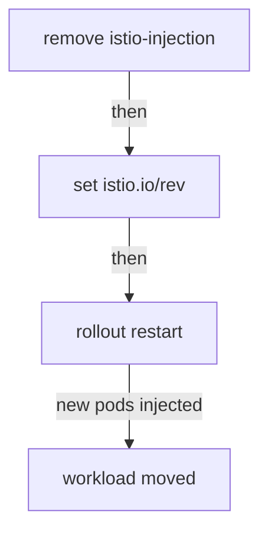

# Moving A Namespace To A Revision

A second control plane that serves nobody is only half a canary upgrade. This part moves a workload onto it. You learn the two labels that pick a control plane, which one wins when both are there, and the restart that really performs the move.

In space terms: the `istio.io/rev` label on a namespace says which mission control a planet reports to. Changing the label changes the orders for ships launched from now on. Ships already flying keep their old communications officer until they relaunch.

This part assumes the 1.30.5 control plane is installed as revision `1-30-5`. If `kubectl -n istio-system get deploy istiod-1-30-5` finds nothing, install it first with `istioctl-1.30.5 install --set profile=minimal --set revision=1-30-5 -y`.

## Two labels, and which one wins

Two namespace labels pick a control plane. Here is what each one selects, and why one beats the other.

### What each label selects

- **`istio-injection=enabled`** on a namespace selects the **default** control plane, the one without a revision name.
- **`istio.io/rev=<revision-or-tag>`** on a namespace selects that exact revision.

In effect they rule each other out. If both are present, `istio-injection` wins and Istio ignores the revision label. It does so quietly, and the workload stays on the control plane you were trying to move *away* from.

### Why `istio-injection` wins

This is not an arbitrary rule. It comes from the webhook selectors. The default webhook's `namespaceSelector` matches `istio-injection: enabled`. The revision's webhook matches `istio.io/rev: <name>` *and* requires `istio-injection` to be absent. A namespace with both labels only satisfies the first. There is no tie-break logic to appeal to: one selector matched, and the other did not.

So removing the old label is step one of a move, not a tidy-up afterwards.

## The move is three operations

Moving a namespace takes three operations, and only the last one moves anything.

### The three steps



The diagram shows the order: remove the old label, set the revision label, then restart. Steps 1 and 2 change which webhook *would* fire for future pods. Step 3 recreates the pods, and only a new pod goes through admission. So step 3 is where the upgrade happens for that workload.

### See it in your playground

Move `canary-demo` to revision `1-30-5`, restart its Deployment, and check which control plane and proxy image the new pod has:

<!-- astrona:playground:renew -->

```sh
kubectl label namespace canary-demo istio-injection-
kubectl label namespace canary-demo istio.io/rev=1-30-5 --overwrite
kubectl -n canary-demo rollout restart deployment notification-service-v1
kubectl -n canary-demo rollout status deployment notification-service-v1 --timeout=180s
istioctl proxy-status | grep -E 'NAME|canary-demo'
kubectl -n canary-demo get pod -l app=notification-service \
  -o jsonpath='{.items[0].spec.containers[?(@.name=="istio-proxy")].image}{"\n"}'
```

Expect something like:

```text
NAME                                     CLUSTER      CDS      LDS      EDS      RDS      ISTIOD
notification-service-v1-...canary-demo   Kubernetes   SYNCED   SYNCED   SYNCED   SYNCED   istiod-1-30-5-6b9c8f7d4b-xk2p9

docker.io/istio/proxyv2:1.30.5
```

The `ISTIOD` column now names the canary pod, and the injected proxy image is the new version. Both changed at the same moment, when the pod was recreated. This is what "injection decides everything when the pod is created" looks like.

## Rolling back with labels

Going back is the same three operations in reverse: remove `istio.io/rev`, set `istio-injection=enabled` again, and restart. It works because the old control plane never went anywhere.

That is the whole advantage over an in-place upgrade. There, going back means reinstalling the old version first, and then restarting everything a second time.

A revision label picks a mission control, and it moves no ship until something recreates the pod.

## Common pitfalls

> [!WARNING]
> **Leaving both `istio-injection` and `istio.io/rev` on a namespace.** `istio-injection` wins and the revision label is ignored. The workload stays on the default control plane, and the upgrade seems to do nothing.
>
> **Forgetting the restart.** Installing a revision and relabelling a namespace changes nothing for running pods. `kubectl rollout restart` is the step that performs the upgrade.
>
> **Trusting the namespace label as proof.** The label only shows intent. `istioctl proxy-status` and the pod's proxy image show where the workload really is.
>
> **Skipping a minor version.** Two control planes do not widen the skew window of one minor version. Each workload still talks to exactly one control plane, and the limit applies per workload.
