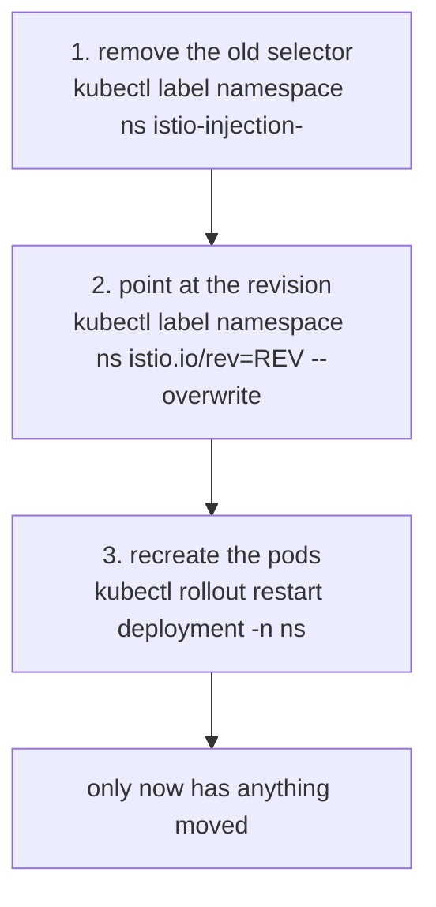
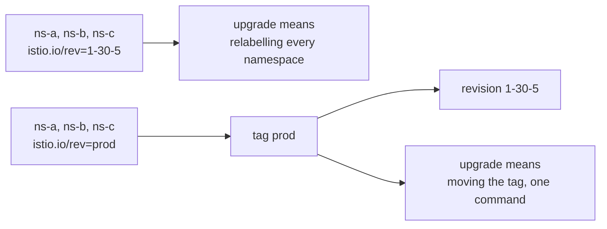

# Part 2 — Selecting, Moving And Retiring A Revision

> Prerequisite: [Part 1 — Revisions: A Named Control Plane](./course-01-revisions-a-named-control-plane.md). Next: [the module landing page](./course.md), then [Module 3 — In-Place Upgrade Of The Control Plane](../module-03/course.md).

Part 1 left you with two control planes and every workload still on the old one. This part moves them: the labels that select a control plane, the restart that actually performs the move, the tag mechanism that makes the whole thing scale past a handful of namespaces, and the ordering rule for retiring what you replaced.

## Two labels, and which one wins

- **`istio-injection=enabled`** on a namespace selects the **default**, unrevisioned control plane.
- **`istio.io/rev=<revision-or-tag>`** on a namespace selects that specific revision.

They are mutually exclusive in effect. If both are present, `istio-injection` wins and the revision label is ignored — quietly, with the workload attached to the control plane you were trying to move *away* from.

That is not arbitrary. [Part 1 of the section 020 injection module](../../section-020/module-02/course-01-injection-as-admission-control.md) showed the webhook selectors: the default webhook's `namespaceSelector` matches `istio-injection: enabled`, and the revisioned webhook's matches `istio.io/rev: <name>` *and* requires `istio-injection` to be absent. A namespace with both satisfies only the first. There is no conflict resolution logic to appeal to — one selector matched and the other did not.

So removing the old label is step one of a move, not a tidy-up afterwards.

## The move is three operations



Steps 1 and 2 change which control plane *future* pods get. Step 3 is the one that moves the workloads you already have.

Step 3 is where the upgrade happens for that workload. Steps 1 and 2 change which webhook *would* fire; only a new pod goes through admission.

> [!TIP]
> **Try it — move `canary-demo` to the new revision**
>
> ```sh
> kubectl label namespace canary-demo istio-injection-
> kubectl label namespace canary-demo istio.io/rev=1-30-5 --overwrite
> kubectl -n canary-demo rollout restart deployment notification-service-v1
> kubectl -n canary-demo rollout status deployment notification-service-v1 --timeout=180s
> istioctl proxy-status | grep -E 'NAME|canary-demo'
> kubectl -n canary-demo get pod -l app=notification-service \
>   -o jsonpath='{.items[0].spec.containers[?(@.name=="istio-proxy")].image}{"\n"}'
> ```
>
> Expect something like:
>
> ```text
> NAME                                     CLUSTER      CDS      LDS      EDS      RDS      ISTIOD
> notification-service-v1-...canary-demo   Kubernetes   SYNCED   SYNCED   SYNCED   SYNCED   istiod-1-30-5-6b9c8f7d4b-xk2p9
>
> docker.io/istio/proxyv2:1.30.5
> ```
>
> The `ISTIOD` column now names the canary pod, and the injected proxy image is the new version. Both changed at the same moment — when the pod was recreated — which is the observable form of "injection decides everything at pod creation".

Rolling back is the same three operations in reverse: remove `istio.io/rev`, restore `istio-injection=enabled`, restart. It works because the old control plane never went anywhere. That is the entire value proposition against an in-place upgrade, where reverting means reinstalling the old version first and then restarting everything a second time.

## Why raw revision labels do not scale

The workflow above has an obvious problem at size. Every upgrade means editing every meshed namespace's labels, and every rollback means editing them all back. With fifty namespaces that is fifty chances to miss one — and a missed namespace is a workload silently left on a control plane you are about to delete.

A **revision tag** is an alias that points at a revision. Namespaces are labelled with the tag once; afterwards you move the tag, not the namespaces.



A tag is a level of indirection between the namespaces and the revision. Without it every upgrade touches every namespace; with it the namespaces never change.

Mechanically a tag is **another mutating webhook configuration** — you saw `istio-revision-tag-default` in Part 1's output — whose `namespaceSelector` matches `istio.io/rev=<tag>` and whose backend is the tagged revision's `istiod` Service. Moving a tag rewrites that webhook's backend. Like everything else here, it changes nothing until pods are recreated.

Read `istioctl tag` as the subcommand family for these aliases: `tag set` creates or moves one, `tag list` shows them and what they point at, `tag remove` deletes one.

> [!TIP]
> **Try it — put the namespace behind a tag instead**
>
> ```sh
> istioctl-1.30.5 tag set prod --revision 1-30-5 -y
> istioctl-1.30.5 tag list
> kubectl get mutatingwebhookconfigurations | grep tag
> kubectl label namespace canary-demo istio.io/rev=prod --overwrite
> kubectl -n canary-demo rollout restart deployment notification-service-v1
> kubectl -n canary-demo rollout status deployment notification-service-v1 --timeout=180s
> istioctl proxy-status | grep -E 'NAME|canary-demo'
> ```
>
> Expect something like:
>
> ```text
> TAG      REVISION   NAMESPACES
> default  default
> prod     1-30-5     canary-demo
>
> istio-revision-tag-default   ...
> istio-revision-tag-prod      ...
>
> NAME                                     CLUSTER      CDS      LDS      EDS      RDS      ISTIOD
> notification-service-v1-...canary-demo   Kubernetes   SYNCED   SYNCED   SYNCED   SYNCED   istiod-1-30-5-...
> ```
>
> `tag list` resolves `prod` to `1-30-5` and shows which namespaces follow it. The new `istio-revision-tag-prod` webhook is the alias made real. Functionally this is identical to the previous step — the difference is that the *next* upgrade will not touch this namespace at all.

## What a tag-based rollback looks like

This is the payoff, and it is worth running to see how small it is.

> [!TIP]
> **Try it — a fleet-wide rollback in two commands**
>
> ```sh
> istioctl tag set prod --revision default --overwrite -y
> kubectl -n canary-demo rollout restart deployment notification-service-v1
> kubectl -n canary-demo rollout status deployment notification-service-v1 --timeout=180s
> istioctl proxy-status | grep -E 'NAME|canary-demo'
> ```
>
> Expect something like:
>
> ```text
> NAME                                     CLUSTER      CDS      LDS      EDS      RDS      ISTIOD
> notification-service-v1-...canary-demo   Kubernetes   SYNCED   SYNCED   SYNCED   SYNCED   istiod-77d5f6c8b9-qr4tz
> ```
>
> Back on the old control plane, with no namespace label touched. One `tag set` plus one restart per namespace — and the restarts can be paced however you like, because the tag change is instant and the workloads follow it whenever they are next recreated.
>
> Point the tag back at `1-30-5` before continuing: `istioctl-1.30.5 tag set prod --revision 1-30-5 --overwrite -y`, then restart the deployment again.

## Retiring the old revision

Once every workload has moved and you are satisfied, the old control plane is dead weight. `istioctl uninstall --revision <name>` removes one named revision and leaves the rest of the install — the shared CRDs and the other revision — alone.

The order is not negotiable: **restart every workload onto the new revision first, then uninstall the old one.**

A pod whose control plane has been removed does not fail immediately, which is what makes reversing the order dangerous. It keeps running on the configuration its proxy last received. What it loses is everything *ongoing*: no configuration updates, no endpoint updates as pods come and go, and no certificate renewal when its current workload certificate expires. The failure arrives hours later and looks nothing like its cause.

> [!WARNING]
> **`--purge` removes the canary too**
>
> `istioctl uninstall --purge` removes **every** revision and all cluster-scoped Istio resources, CRDs included — the new control plane along with the old one. To remove one control plane, always name it: `istioctl uninstall --revision default -y`.

> [!TIP]
> **Try it — check for stragglers before removing anything**
>
> ```sh
> istioctl proxy-status
> kubectl get ns -l istio-injection=enabled
> kubectl get ns -l istio.io/rev=default
> ```
>
> Expect something like:
>
> ```text
> NAME                                     CLUSTER      CDS      LDS      EDS      RDS      ISTIOD
> notification-service-v1-...canary-demo   Kubernetes   SYNCED   SYNCED   SYNCED   SYNCED   istiod-1-30-5-...
>
> No resources found
> No resources found
> ```
>
> Every entry in `proxy-status` naming the *new* control plane pod, and no namespace still labelled for the old one, is the evidence you want before running `istioctl uninstall --revision default -y`. Check both: `proxy-status` catches running pods, the namespace queries catch namespaces whose pods happen to be scaled to zero right now.

## Moving the gateways

Gateways need their own plan, because nothing in this module moves them. An ingress gateway is a standalone Envoy Deployment, not a sidecar, so no namespace label selects a control plane for it. Its control plane is baked into its pod spec at install time.

The two common approaches:

- **Install a revisioned gateway** alongside the existing one, shift traffic at the load balancer or DNS layer, then remove the old one. Safest, and it costs a second public endpoint for the duration.
- **Re-install the gateway against the new revision in place**, accepting a short interruption while the Deployment rolls.

Either way, do it as a distinct step with its own verification, because a gateway is the piece whose failure is immediately visible from outside the cluster.

> [!WARNING]
## Common pitfalls

> [!WARNING]
> **Leaving both `istio-injection` and `istio.io/rev` on a namespace.** `istio-injection` wins and the revision label is ignored. The workload stays on the default control plane and the upgrade appears to do nothing.
>
> **Forgetting the restart.** Installing a revision and relabelling a namespace changes nothing for running pods. `kubectl rollout restart` is the step that performs the upgrade.
>
> **Uninstalling the old revision before restarting workloads.** Those pods lose configuration updates and certificate renewal, and fail later in ways that look unrelated.
>
> **`istioctl uninstall --purge` during a canary.** It removes every revision, including the new one, and the shared CRDs with them.
>
> **Installing a full profile as the canary.** Two sets of gateways contend for the same names. Install `minimal` and migrate gateways separately.
>
> **Using a dotted revision name.** `1.30.5` is not a valid DNS label; use `1-30-5`.
>
> **Assuming a tag change moves workloads.** It rewrites a webhook's backend. Pods still have to be recreated.
>
> **Skipping a minor version.** Two control planes does not widen the one-minor-version skew window — each workload still talks to exactly one control plane, and the constraint is per workload.

## Operational considerations

**Set up tags before you need them.** Converting a fleet from `istio-injection=enabled` to `istio.io/rev=prod` is a one-time cost that has to be paid during a calm period. Doing it mid-upgrade is how namespaces get missed.

**A pod-level `istio.io/rev` overrides the namespace.** Putting the label on `spec.template.metadata.labels` pins one workload to one revision regardless of its namespace — the tool for canarying a single service inside a namespace, subject to the same restart rule as everything else.

**Pace the restarts, but do not leave them.** The tag change is instant; the restarts can be spread over days. Two control planes running is a resource cost and a cognitive one, and a half-migrated mesh is harder to reason about than either end state.

**Keep the old revision until the new one has seen real load.** The rollback is cheap precisely because the old control plane is still running. Deleting it the same afternoon converts a two-command rollback into a reinstall.

> *A revision label picks a control plane, a tag makes that pick indirect, and neither one moves a single pod until something recreates it.*

## Reference

- [Canary upgrades](https://istio.io/v1.30/docs/setup/upgrade/canary/) — the full procedure including gateway handling.
- [Stable revision labels](https://istio.io/v1.30/docs/setup/upgrade/canary/#stable-revision-labels) — revision tags and why they exist.
- [istioctl tag](https://istio.io/v1.30/docs/reference/commands/istioctl/#istioctl-tag) — `set`, `list`, `remove` and their flags.
- [Uninstall a revision](https://istio.io/v1.30/docs/setup/upgrade/canary/#uninstall-old-control-plane) — the ordering relative to restarting workloads.
