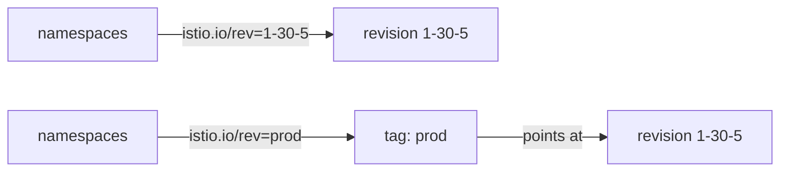

# Revision Tags

Moving one namespace by its revision label works. Moving fifty that way, at every upgrade and every rollback, is how namespaces get missed. This part adds one layer between the namespaces and the revision, a **revision tag**, so the namespaces never have to change again.

In space terms, a revision tag is a call sign such as `prod` that points at one mission control. Planets report to the call sign. Move the call sign, and the planets follow at their next launch.

This part assumes the 1.30.5 control plane is installed as revision `1-30-5`. If `kubectl -n istio-system get deploy istiod-1-30-5` finds nothing, install it first with `istioctl-1.30.5 install --set profile=minimal --set revision=1-30-5 -y`.

## Why raw revision labels do not scale

With raw revision labels, every upgrade means editing the labels of every namespace in the mesh, and every rollback means editing them all back. With fifty namespaces that is fifty chances to miss one. A missed namespace is a workload quietly left on a control plane you are about to delete.

### A tag adds one step of indirection

You label the namespaces with the tag once. After that you move the tag, not the namespaces:



The top row shows namespaces labelled with the revision itself: an upgrade means relabelling each of them. The bottom row shows namespaces labelled with the tag: an upgrade means moving the tag, with one command, and the namespaces never change.

### What a tag is underneath

Underneath, a tag is **another mutating webhook configuration**, another dock inspector. Its `namespaceSelector` matches `istio.io/rev=<tag>`, and its backend is the `istiod` Service of the tagged revision. The `istio-revision-tag-default` webhook you see in `kubectl get mutatingwebhookconfigurations` is one of these. Moving a tag rewrites that webhook's backend. Like everything else here, it changes nothing until pods are recreated.

### The `istioctl tag` commands

`istioctl tag` is the family of commands for these call signs:

- `tag set` creates a tag or moves it.
- `tag list` shows the tags and what they point at.
- `tag remove` deletes one.

## Put the namespace behind a tag

Now create a `prod` tag for revision `1-30-5` and move `canary-demo` onto it.

### See it in your playground

Create the tag, list it, find its webhook, then label the namespace with the tag and restart:

<!-- astrona:playground:renew -->

```sh
istioctl-1.30.5 tag set prod --revision 1-30-5 -y
istioctl-1.30.5 tag list
kubectl get mutatingwebhookconfigurations | grep tag
kubectl label namespace canary-demo istio.io/rev=prod --overwrite
kubectl -n canary-demo rollout restart deployment notification-service-v1
kubectl -n canary-demo rollout status deployment notification-service-v1 --timeout=180s
istioctl proxy-status | grep -E 'NAME|canary-demo'
```

Expect something like:

```text
TAG      REVISION   NAMESPACES
default  default
prod     1-30-5     canary-demo

istio-revision-tag-default   ...
istio-revision-tag-prod      ...

NAME                                     CLUSTER      CDS      LDS      EDS      RDS      ISTIOD
notification-service-v1-...canary-demo   Kubernetes   SYNCED   SYNCED   SYNCED   SYNCED   istiod-1-30-5-...
```

`tag list` resolves `prod` to `1-30-5` and shows which namespaces follow it. The new `istio-revision-tag-prod` webhook is the call sign made real. The workload ends up exactly where a raw revision label would put it. The difference is that the *next* upgrade does not touch this namespace at all.

If `canary-demo` still carries `istio-injection=enabled`, remove it first with `kubectl label namespace canary-demo istio-injection-`. While that label is there, it wins over `istio.io/rev`.

## A rollback with a tag

This is the payoff, and it is worth running to see how small it is.

### See a fleet-wide rollback in two commands

Point `prod` back at the default revision, restart, and check the proxy status:

```sh
istioctl tag set prod --revision default --overwrite -y
kubectl -n canary-demo rollout restart deployment notification-service-v1
kubectl -n canary-demo rollout status deployment notification-service-v1 --timeout=180s
istioctl proxy-status | grep -E 'NAME|canary-demo'
```

Expect something like:

```text
NAME                                     CLUSTER      CDS      LDS      EDS      RDS      ISTIOD
notification-service-v1-...canary-demo   Kubernetes   SYNCED   SYNCED   SYNCED   SYNCED   istiod-77d5f6c8b9-qr4tz
```

The workload is back on the old control plane, and no namespace label changed. It took one `tag set` plus one restart per namespace. You can pace the restarts as you like, because the tag change is instant and the workloads follow it the next time they are recreated.

Point the tag back at `1-30-5` before you go on: run `istioctl-1.30.5 tag set prod --revision 1-30-5 --overwrite -y`, then restart the Deployment again.

## Using tags well

A few habits make tags pay off in a real cluster.

### Set up tags before you need them

Changing a fleet from `istio-injection=enabled` to `istio.io/rev=prod` is a one-time cost. Pay it during a calm period. Doing it in the middle of an upgrade is how namespaces get missed.

### A pod label beats the namespace label

An `istio.io/rev` label on `spec.template.metadata.labels` pins one workload to one revision, whatever its namespace says. That is the tool for trying a single service on the new revision inside a namespace. The same restart rule applies.

A tag makes the choice of mission control indirect, so an upgrade or a rollback is one command. It still moves no ship until something recreates the pod.

## Common pitfalls

> [!WARNING]
> **Assuming a tag change moves workloads.** It rewrites a webhook's backend. Pods still have to be recreated.
>
> **Labelling the namespace with the raw revision when a tag exists.** `istio.io/rev=1-30-5` works today, but the next upgrade means relabelling the namespace again. Label it with the tag.
>
> **Leaving `istio-injection=enabled` next to the tag label.** `istio-injection` wins, and the namespace ignores the tag.
>
> **Moving the tag and forgetting it was moved.** Run `istioctl tag list` to see where each tag points before you restart anything.

## Your mission: Canary Upgrade With Revisions And Tags

You can now install a revision next to the running control plane, put a namespace behind a revision tag, and move its workload across with a restart. Now prove it in a graded mission: build the 1.30.5 mission control as a canary, create the `prod` tag, and move `canary-demo` onto it through the tag, while the old control plane keeps running.

The mission runs in its own training solar system, so first pause your playground. Nothing in it is lost:

```sh
astrona stop ats-013-playground-030-02
```

Then start the mission:

```sh
astrona run --git ssh://git@github.com/astrona-io/ATS013.git -c sections/section-030/module-02/labs/lab-01
```

Read the task in [`question.md`](./labs/lab-01/question.md) and solve it on your own first. When you think you are done, send it for grading:

```sh
astrona submit -c sections/section-030/module-02/labs/lab-01
```

When the mission is done, remove it and wake your playground up again:

```sh
astrona destroy ats-013-lab-030-02
astrona start ats-013-playground-030-02
```
