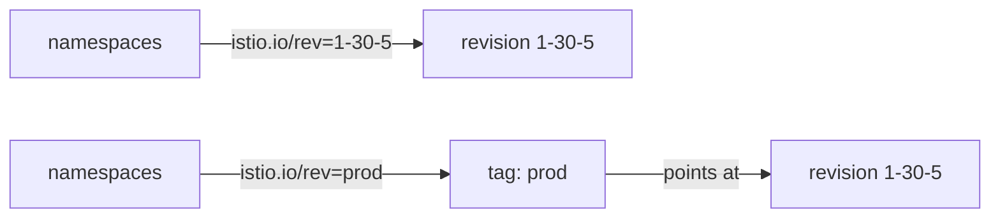

# Revision Tags

Moving one namespace with its revision label works. Moving fifty namespaces that way, at every upgrade and every rollback, is how namespaces get missed. This part adds one layer between the namespaces and the revision, a **revision tag**: a name such as `prod` that points at one revision. With a tag in place, the namespace labels never have to change again.

The commands below need the 1.30.5 control plane installed as revision `1-30-5`. If `kubectl -n istio-system get deploy istiod-1-30-5` finds nothing, install it first with `istioctl-1.30.5 install --set profile=minimal --set revision=1-30-5 -y`.

## Why raw revision labels do not scale

A label such as `istio.io/rev=1-30-5` names one revision directly. With labels like that, every upgrade means editing the labels of every namespace in the mesh, and every rollback means editing them all back. With fifty namespaces, that is fifty chances to miss one. A missed namespace is a workload left on a control plane you are about to delete, and nothing warns you.

### A tag adds one step between namespace and revision

A tag solves this by putting a name between the namespace and the revision. You label the namespaces with the tag once. After that, you move the tag, not the namespaces:



The diagram shows two ways to label namespaces: with the revision itself (top), where an upgrade means relabelling each namespace, and with a tag (bottom), where an upgrade means moving the tag with one command.

### What a tag is underneath

A tag is not a new kind of object. Underneath, it is **another mutating webhook configuration**. Its `namespaceSelector` matches `istio.io/rev=<tag>`, and it sends injection requests to the `istiod` Service of the tagged revision. The `istio-revision-tag-default` webhook that `kubectl get mutatingwebhookconfigurations` lists is one of these. Moving a tag rewrites which `istiod` Service that webhook calls. Like every other change in a canary upgrade, it changes nothing until pods are created again.

### The `istioctl tag` commands

You manage tags with the `istioctl tag` commands:

- `tag set` creates a tag or moves it.
- `tag list` shows the tags and the revision each one points at.
- `tag remove` deletes one.

## Put the namespace behind a tag

With the idea clear, you can put `canary-demo` behind a tag. Create a `prod` tag for revision `1-30-5`, list the tags, and find the webhook the tag created. Then label the namespace with the tag and restart its Deployment:

<!-- astrona:playground:renew -->

```sh
istioctl-1.30.5 tag set prod --revision 1-30-5 -y
istioctl-1.30.5 tag list
kubectl get mutatingwebhookconfigurations | grep tag
kubectl label namespace canary-demo istio.io/rev=prod --overwrite
kubectl -n canary-demo rollout restart deployment notification-service-v1
kubectl -n canary-demo rollout status deployment notification-service-v1 --timeout=180s
istioctl proxy-status | grep -E 'NAME|canary-demo'
```

The output looks like this (shortened):

```text
TAG      REVISION   NAMESPACES
default  default
prod     1-30-5     canary-demo

istio-revision-tag-default   ...
istio-revision-tag-prod      ...

NAME                                     CLUSTER      CDS      LDS      EDS      RDS      ISTIOD
notification-service-v1-...canary-demo   Kubernetes   SYNCED   SYNCED   SYNCED   SYNCED   istiod-1-30-5-...
```

`istioctl tag list` resolves `prod` to `1-30-5` and shows which namespaces follow it. The new `istio-revision-tag-prod` webhook is the tag as Kubernetes sees it. The workload ends up exactly where a raw revision label would put it. The difference is that the *next* upgrade does not touch this namespace at all.

If `canary-demo` still carries `istio-injection=enabled`, remove it first with `kubectl label namespace canary-demo istio-injection-`. While that label is there, it wins over `istio.io/rev`.

## A rollback with a tag

The real benefit of a tag shows when you go back. Point `prod` at the default revision, restart the Deployment, and check the proxy status:

```sh
istioctl tag set prod --revision default --overwrite -y
kubectl -n canary-demo rollout restart deployment notification-service-v1
kubectl -n canary-demo rollout status deployment notification-service-v1 --timeout=180s
istioctl proxy-status | grep -E 'NAME|canary-demo'
```

The output looks like this (shortened):

```text
NAME                                     CLUSTER      CDS      LDS      EDS      RDS      ISTIOD
notification-service-v1-...canary-demo   Kubernetes   SYNCED   SYNCED   SYNCED   SYNCED   istiod-77d5f6c8b9-qr4tz
```

The workload is back on the old control plane, and no namespace label changed. The rollback took one `tag set` plus one restart per namespace. You can space out the restarts as you like, because the tag change takes effect at once and each workload follows it the next time its pods are created.

Point the tag back at `1-30-5` before you go on. Run `istioctl-1.30.5 tag set prod --revision 1-30-5 --overwrite -y`, then restart the Deployment again.

## Using tags well

A tag only helps if the namespaces use it before an upgrade starts. Two habits make tags pay off in a real cluster.

### Set up tags before you need them

Changing a set of namespaces from `istio-injection=enabled` to `istio.io/rev=prod` is a one-time cost. Do it during a calm period. Doing it in the middle of an upgrade is how namespaces get missed.

### A pod label beats the namespace label

An `istio.io/rev` label on `spec.template.metadata.labels` of a Deployment pins that one workload to one revision, whatever its namespace says. Use it to try a single service on the new revision inside a namespace. The same restart rule applies.

You now know that a revision tag is a mutating webhook that points at one revision, that namespaces labelled with the tag follow it, and that an upgrade or a rollback becomes one `tag set` plus restarts. The open question is when and how to remove the old control plane once every workload has moved.

## Common pitfalls

> [!WARNING]
> **Assuming a tag change moves workloads.** It changes which `istiod` Service a webhook calls. Pods still have to be created again.
>
> **Labelling the namespace with the raw revision when a tag exists.** `istio.io/rev=1-30-5` works today, but the next upgrade means relabelling the namespace again. Label it with the tag.
>
> **Leaving `istio-injection=enabled` next to the tag label.** `istio-injection` wins, and the namespace ignores the tag.
>
> **Moving the tag and forgetting it was moved.** Run `istioctl tag list` to see where each tag points before you restart anything.

## Your mission: Canary Upgrade With Revisions And Tags Lab

You can now install a revision next to the running control plane, put a namespace behind a revision tag, and move its workload across with a restart. The lab asks you to install a 1.30.5 canary control plane, create the `prod` tag, and move `canary-demo` onto it through the tag, while the old control plane keeps running.

The lab runs on its own cluster, so first pause your playground. Nothing in it is lost:

```sh
astrona stop ats-013-playground-030-02
```

Then start the lab. The task is on the next page; solve it on your own first:

```sh
astrona run --git ssh://git@github.com/astrona-io/ATS013.git -c sections/section-030/module-02/labs/lab-01
```

When you think you are done, send it for grading:

```sh
astrona submit -c sections/section-030/module-02/labs/lab-01
```

When the lab is done, remove it and start your playground again:

```sh
astrona destroy ats-013-lab-030-02
astrona start ats-013-playground-030-02
```
