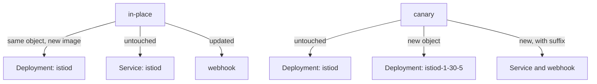

# Replacing The Control Plane

"In place" is an exact statement about which Kubernetes objects keep their identity. It is not a vague word about style. An in-place upgrade replaces the image of the control plane, `istiod`, and keeps every object name the same. This part shows which objects change and which stay, runs the check that makes the upgrade safe, and then performs the upgrade. It also shows the one mistake that throws away a cluster's custom settings without any warning.

## What "in place" means for the objects

There are two ways to upgrade Istio, and the clearest way to tell them apart is to look at what each one does to the objects in `istio-system`. A **revision** is a named installation of the control plane. Its objects carry the revision name as a suffix, for example `istiod-1-30-5`. The default revision has no suffix. A **canary upgrade** installs the new version as a second revision next to the old one, and moves workloads over one namespace at a time. An **in-place upgrade** reuses the existing revision.



The diagram shows that an in-place upgrade changes the objects you already have, while a canary upgrade adds a second set next to them.

Because an in-place upgrade reuses the same revision, every object keeps its name. `istioctl install` updates each object instead of creating a second one. Kubernetes then rolls the `istiod` Deployment like any other Deployment: it starts a new pod, then stops the old one, and the Deployment object stays the same throughout.

That one fact explains both the appeal and the risk. There is nothing to relabel, because no name changed. There is also nothing to fall back to, because the old version of the `istiod` Deployment no longer exists. This is why a canary upgrade can be undone by changing a label, and an in-place upgrade cannot.

The sequence of an in-place upgrade is fixed, and it has three steps, not two:

1. **Pre-check** with the target version, to find anything that would make the upgrade fail.
2. **Install** the new version over the existing revision.
3. **Restart** every workload with a sidecar proxy, so the data plane catches up.

People often drop step 3. The mesh keeps working well enough without it that the gap can last for months.

Before you change anything, record the starting point. Run these four commands to see the versions, the image of `istiod`, the `uid` of the `istiod` Deployment and the proxy status. The `uid` is the unique ID that Kubernetes gives an object when it creates it; it never changes while the object exists. `istioctl proxy-status` lists every proxy that is connected to `istiod`, with the `istiod` pod it uses, its own version and the configuration types it receives.

<!-- astrona:playground:renew -->

```sh
istioctl version
kubectl -n istio-system get deploy istiod -o jsonpath='{.spec.template.spec.containers[0].image}{"\n"}'
kubectl -n istio-system get deploy istiod -o jsonpath='{.metadata.uid}{"\n"}'
istioctl proxy-status
```

The output looks like this:

```text
client version: 1.29.8
control plane version: 1.29.8
data plane version: 1.29.8 (4 proxies)
docker.io/istio/pilot:1.29.8
a09cffc8-faa9-419b-be74-5a9e4b0a44ad
NAME                                                      CLUSTER        ISTIOD                      VERSION     SUBSCRIBED TYPES
istio-ingressgateway-75d6fcbb78-rcdmz.istio-system        Kubernetes     istiod-587b649545-mm8z5     1.29.8      3 (CDS,LDS,EDS)
notification-service-v1-746cd97ddb-b9sxn.inplace-demo     Kubernetes     istiod-587b649545-mm8z5     1.29.8      4 (CDS,LDS,EDS,RDS)
notification-service-v1-746cd97ddb-mpkcl.inplace-demo     Kubernetes     istiod-587b649545-mm8z5     1.29.8      4 (CDS,LDS,EDS,RDS)
tester-577d497fbd-jlnc4.inplace-demo                      Kubernetes     istiod-587b649545-mm8z5     1.29.8      4 (CDS,LDS,EDS,RDS)
```

There are four proxies: the ingress gateway, the two replicas of `notification-service-v1` and the `tester` pod. Every one runs `1.29.8` and is connected to the one `istiod` pod.

Write down the `uid` as well as the version. After the upgrade, the image will be different and the `uid` will not. That turns "in place" into something you can check instead of something you take on trust.

## The pre-upgrade check

With the starting point recorded, the next step is to ask whether the cluster can accept the new version at all. `istioctl x precheck` answers that question. The `x` stands for `experimental`, a group of `istioctl` subcommands whose interface Istio has not promised to keep stable.

`istioctl x precheck` only reads from the Kubernetes API server. It does not check the syntax of your configuration. It checks whether *this cluster* can accept *this version* of Istio, and it looks at:

- **The Kubernetes version**, against the range the target release supports.
- **Existing Istio CRDs (Custom Resource Definitions)**, which add Istio's object kinds to the Kubernetes API, for schemas the target version cannot work with.
- **Existing webhook configurations.** An old mutating webhook that points at a missing Service can block the pods the install creates.
- **Existing Istio configuration objects**, for fields the target version has deprecated or removed.
- **Cluster permissions** the install needs, such as the right to create CRDs, cluster roles and webhook configurations.

The binary you run it with matters. The check is about the version you are moving *to*, and only that binary knows the target version's requirements and its list of deprecated fields. Running `istioctl x precheck` with the installed 1.29.8 binary answers a question you already know the answer to.

Ask the target version whether the cluster is ready:

```sh
istioctl-1.30.5 x precheck
```

The output looks like this:

```text
✔ No issues found when checking the cluster. Istio is safe to install or upgrade!
  To get started, check out https://istio.io/latest/docs/setup/getting-started/.
```

On a clean playground this check passes easily. On a cluster with real history it rarely does, and the warnings are the useful part. They name configuration that will stop working after the upgrade, while the old version still runs and you can still change your plan. Read every line: a warning is advice, and it does not block the install.

`istioctl analyze` asks a different question: "is the Istio configuration in the cluster right now consistent?" Run `precheck` before the upgrade and `analyze` after it, and you have checked both directions.

## Performing the upgrade

Once the check passes, the upgrade itself is `istioctl install`, run with the newer binary. There is also an `istioctl upgrade` command. In 1.30 its help text says that it is an alias for the install command, with the same flags and the same behaviour. Neither command restarts your workloads.

`istioctl install` makes the cluster match the configuration you give it, and removes or resets anything that configuration does not contain. So you must pass the same configuration you installed with. A bare `istioctl install -y` during an upgrade does not mean "keep everything and change the version". It means "make the cluster match the `default` profile". On a cluster with custom settings, that reverts every one of them, and the command still reports success.

| How you installed | How you upgrade |
| --- | --- |
| `istioctl install -f istio.yaml` | `istioctl-<new> install -f istio.yaml -y` |
| `istioctl install --set profile=demo` | `istioctl-<new> install --set profile=demo -y` |
| Nobody remembers | Recover the configuration first |

When nobody knows how the cluster was installed, recover the configuration before the upgrade, not after. Istio has no command that prints the installed configuration, so you rebuild it from the cluster:

- the `istio` ConfigMap in `istio-system` holds the `meshConfig` in effect, which is the mesh-wide configuration `istiod` applies to every proxy;
- `kubectl -n istio-system get deploy` shows which components exist;
- the pod spec of each Deployment shows its resource settings.

Write that into a file. Then compare `istioctl manifest generate -f <your file>` with `istioctl manifest generate --set profile=default` to see where the cluster differs from the default, and upgrade with the file.

The playground was installed with `--set profile=default`, so the upgrade repeats that. Replace the control plane with the 1.30.5 binary, then check the image, the `uid` and the pod:

```sh
istioctl-1.30.5 install --set profile=default -y
kubectl -n istio-system get deploy istiod -o jsonpath='{.spec.template.spec.containers[0].image}{"\n"}'
kubectl -n istio-system get deploy istiod -o jsonpath='{.metadata.uid}{"\n"}'
kubectl -n istio-system get pods -l app=istiod
```

The output looks like this:

```text
✔ Istio core installed ⛵️
✔ Istiod installed 🧠
✔ Ingress gateways installed 🛬
- Pruning removed resources
✔ Installation complete
registry.istio.io/release/pilot:1.30.5
a09cffc8-faa9-419b-be74-5a9e4b0a44ad
NAME                      READY   STATUS    RESTARTS   AGE
istiod-5497897698-wrmkc   1/1     Running   0          15s
```

The install also prints a logo and progress lines; they are left out here. The image is new, and it comes from a new registry: Istio 1.30 images are published under `registry.istio.io/release`, and 1.29 images under `docker.io/istio`. The `uid` is the same one you wrote down, and the pod is newly created. Nobody deleted and created the Deployment again: `istioctl` updated it, and Kubernetes rolled its pods. A canary upgrade would instead have added a second Deployment with a different name.

## The short gap without a control plane

The rollout you just ran has one side effect worth knowing. While Kubernetes rolls the `istiod` Deployment, there is a short time with no ready `istiod` pod, or with one that is still starting. During that time:

- **Existing proxies keep carrying traffic.** Each proxy keeps the last configuration it received, and it does not need `istiod` to forward a request.
- **Configuration changes wait.** The Kubernetes API server stores an object you apply during the gap, but `istiod` does not push it to the proxies until the new pod is ready.
- **New pods in namespaces with injection fail to start.** The injection webhook has `failurePolicy: Fail`, so the API server rejects a new pod when it cannot reach `istiod`, instead of creating the pod without a sidecar proxy. That is the right behaviour, and it means a deployment during the gap fails with an error.
- **Certificate signing pauses.** `istiod` is also the certificate authority that signs the proxies' certificates. A pause of a few seconds does not matter. It matters if the control plane stays down.

With a single `istiod` replica on a small cluster, the gap lasts a few seconds. Running `istiod` with two or more replicas removes it. That is the usual production setting, and it belongs in place before you need it.

You now know that an in-place upgrade keeps every object name and `uid` and changes only the image, that you run `istioctl x precheck` with the target binary, and that you upgrade with the same configuration you installed with. The open question is what happens to the proxies, which still run the old version after the control plane is new.

## Common pitfalls

> [!WARNING]
> **Upgrading with the wrong `istioctl`.** The binary renders the objects, so its version decides what you install. Check the binary before you check the cluster.
>
> **Running a bare `istioctl install` during the upgrade.** It makes the cluster match the `default` profile and drops custom settings without a warning. Pass the same `-f` file or `--set` flags you installed with.
>
> **Skipping `x precheck`, or running it with the old binary.** It is your one cheap chance to see what the new version rejects while the old one still runs.
>
> **Expecting no gap.** With one `istiod` replica, there is a short time with no ready control plane: existing proxies keep working, but new pods and configuration pushes wait.
>
> **Treating an in-place upgrade as easy to undo.** Going back is another in-place upgrade with the same gap. No second control plane is waiting to take over.
