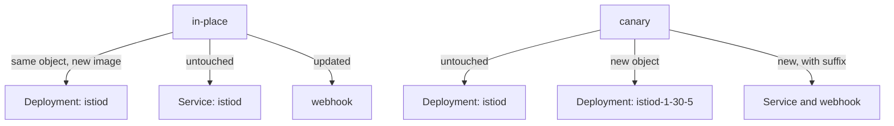

# Replacing The Control Plane

"In place" is an exact statement about which objects keep their identity, not a vague word about style. This part shows which objects an in-place upgrade replaces and which keep their names. Then it runs the pre-flight check that makes the upgrade safe, and performs the upgrade, including the one mistake that quietly throws away a cluster's custom settings.

In space terms: you replace mission control in the same building. Same name on the door, new equipment inside.

## What "in place" means for the objects

Compare the two strategies by what they do to the cluster's objects. Then look at the three steps an in-place upgrade always takes.

### In-place compared with canary



The diagram shows that in-place changes the objects you already have, while canary adds a second set next to them. That difference is why a canary can be undone by relabelling, and an in-place upgrade cannot.

An in-place upgrade **reuses the same revision**, so every object keeps its name. `istioctl install` updates each object instead of creating a sibling. Kubernetes then rolls the `istiod` Deployment like any Deployment: new pod up, old pod down, one object throughout.

That one fact explains both the appeal and the risk. There is nothing to relabel, because no name changed. There is also nothing to fall back to, because the old control plane's Deployment no longer exists in its old form.

### The three steps

The sequence is fixed, and it has **three** steps, not two:

1. **Pre-check** with the target version, to find anything that would make the upgrade fail.
2. **Install** the new version over the existing revision.
3. **Restart** every workload with a sidecar, so the data plane catches up.

Step 3 is the one people drop. The mesh keeps working well enough without it that the gap can last for months.

### See your starting point in the playground

Note the versions, the `istiod` image, the Deployment's `uid`, and the proxy status, so you can compare after the upgrade:

<!-- astrona:playground:renew -->

```sh
istioctl version
kubectl -n istio-system get deploy istiod -o jsonpath='{.spec.template.spec.containers[0].image}{"\n"}'
kubectl -n istio-system get deploy istiod -o jsonpath='{.metadata.uid}{"\n"}'
istioctl proxy-status
```

Expect something like:

```text
client version: 1.29.8
control plane version: 1.29.8
data plane version: 1.29.8 (3 proxies)

docker.io/istio/pilot:1.29.8
4b1e9c2a-3d77-4f21-9c8e-2a1f6d4b8e03

NAME                                     CLUSTER      CDS      LDS      EDS      RDS        ISTIOD
istio-ingressgateway-...istio-system     Kubernetes   SYNCED   SYNCED   SYNCED   NOT SENT   istiod-...
notification-service-v1-...inplace-demo  Kubernetes   SYNCED   SYNCED   SYNCED   SYNCED     istiod-...
notification-service-v1-...inplace-demo  Kubernetes   SYNCED   SYNCED   SYNCED   SYNCED     istiod-...
```

Write down the Deployment's `uid` as well as the version. After the upgrade the image will be different and the `uid` will not. That turns "in place" into something you can check instead of something you take on trust.

## The pre-flight check

`istioctl x precheck` is the pre-flight check of the launch pad. Here is what it looks at, and why the binary you run it with matters.

### What `x precheck` inspects

`istioctl x precheck` is a read-only check that `istioctl` runs against the cluster's API server. It does not check the syntax of your configuration. It asks whether *this cluster* can accept *this version* of Istio. It looks at:

- **The Kubernetes version**, against the range the target release supports.
- **Existing Istio Custom Resource Definitions (CRDs)**, for schemas the target version cannot work with.
- **Existing webhook configurations**, because an old mutating webhook that points at a missing service catches and fails the install's own pod creations.
- **Existing Istio configuration objects**, for fields the target version has deprecated or removed.
- **Cluster permissions** the install needs, such as creating CRDs, cluster roles and webhook configurations.

### Run it with the new binary

The check is about the version you are moving *to*, and only that binary carries the target version's requirements and deprecation list. Running `istioctl x precheck` with the installed binary answers a question you already know the answer to.

### See it in your playground

Ask the target version whether the cluster is ready:

```sh
istioctl-1.30.5 x precheck
```

Expect something like:

```text
✔ No issues found when checking the cluster. Istio is safe to install or upgrade!
  To get started, check out https://istio.io/v1.30/docs/setup/getting-started/
```

On a clean playground this passes easily. On a cluster with real history it rarely does, and the warnings are the valuable part. They name configuration that will stop working after the upgrade, while the old version still runs and you still have options. Read every line: the warnings are advice, so a finding does not block the install.

`istioctl analyze` asks a different question: "is the Istio configuration in the cluster right now consistent?" Run `precheck` before the upgrade and `analyze` after it, and you have covered both directions.

## Performing the upgrade

The upgrade is `istioctl install`, run with the newer binary. Here is the one rule that keeps your settings, and the upgrade itself.

### Pass the same configuration you installed with

There is also an `istioctl upgrade` command. On 1.30 its help text says plainly that it **is an alias for the install command**: same flags, same behaviour. Use whichever reads better in your runbook. They do the same thing, and neither one restarts your workloads.

`istioctl install` makes the cluster match the blueprint you give it, and takes down or resets anything the blueprint does not show. So **you must pass the same configuration you installed with**.

A bare `istioctl install -y` during an upgrade does not mean "keep everything and change the version". It means "make the cluster match the default profile". That reverts every custom setting the cluster had, and it reports success.

| How you installed | How you upgrade |
| --- | --- |
| `istioctl install -f istio.yaml` | `istioctl-<new> install -f istio.yaml -y` |
| `istioctl install --set profile=demo` | `istioctl-<new> install --set profile=demo -y` |
| Nobody remembers | Recover it first, as described below |

### When nobody knows how it was installed

Recover the configuration before the upgrade, not after. Istio has no "what is installed" command, so you rebuild it from the cluster:

- the `istio` ConfigMap holds the `meshConfig` in effect (the fleet's standing orders);
- `kubectl -n istio-system get deploy` shows which components exist;
- each Deployment's pod spec shows its resource settings.

Write that into a file. Then compare `istioctl manifest generate -f <your file>` with `istioctl manifest generate --set profile=default` to see where the cluster differs from the default, and upgrade with the file.

This playground was installed with `--set profile=default`, so that is what the upgrade repeats.

### See it in your playground

Replace the control plane with the 1.30.5 binary, then check the image, the `uid` and the pod:

```sh
istioctl-1.30.5 install --set profile=default -y
kubectl -n istio-system get deploy istiod -o jsonpath='{.spec.template.spec.containers[0].image}{"\n"}'
kubectl -n istio-system get deploy istiod -o jsonpath='{.metadata.uid}{"\n"}'
kubectl -n istio-system get pods -l app=istiod
```

Expect something like:

```text
✔ Istio core installed
✔ Istiod installed
✔ Ingress gateways installed
✔ Installation complete

docker.io/istio/pilot:1.30.5
4b1e9c2a-3d77-4f21-9c8e-2a1f6d4b8e03
NAME                      READY   STATUS    RESTARTS   AGE
istiod-5f4c9d8b7c-w8t4n   1/1     Running   0          38s
```

A new image, the **same `uid`** you noted before, and a newly created pod. Nobody deleted and recreated the Deployment object: `istioctl` updated it, and Kubernetes rolled its pods. In a canary upgrade, by contrast, a second Deployment with a different name appears.

## The short gap without a control plane

Rolling the `istiod` Deployment means a short window with no ready control plane pod, or with one that is still starting. Here is what happens during it, so it does not alarm you:

- **Existing proxies keep carrying traffic.** They hold their last orders and do not need `istiod` to pass a request on.
- **Configuration changes wait.** Kubernetes stores an `apply` made during the gap, but `istiod` does not push it until the new control plane is up.
- **New pods in namespaces with injection fail to start.** The injection webhook's `failurePolicy` is `Fail`, so admission rejects them instead of creating pods without a sidecar. That is the right behaviour, and it does mean a deployment during the gap fails with an error.
- **Certificate signing pauses.** Over a few seconds this does not matter. It matters if the control plane stays down.

For a single `istiod` replica on a small cluster, the gap lasts a few seconds. Running `istiod` with two or more replicas removes it. That is the usual production setting, and it belongs in place before you need it.

In place means the same objects with a new image: same names, same `uid`, nothing to relabel, and nothing to fall back to.

## Common pitfalls

> [!WARNING]
> **Upgrading with the wrong `istioctl`.** The binary renders the manifests, so its version decides what you install. Check it before you check the cluster.
>
> **Running a bare `istioctl install` during the upgrade.** It makes the cluster match the default profile and quietly drops custom settings. Pass the same `-f` file or `--set` flags you installed with.
>
> **Skipping `x precheck`, or running it with the old binary.** It is your one cheap chance to see what the new version rejects while the old one still runs.
>
> **Expecting no gap.** Replacing the control plane means a window with no `istiod`: existing proxies keep working, new pods and configuration pushes wait.
>
> **Treating in-place as easy to undo.** Going back is another in-place upgrade with the same gap. There is no second control plane to fall back to.
