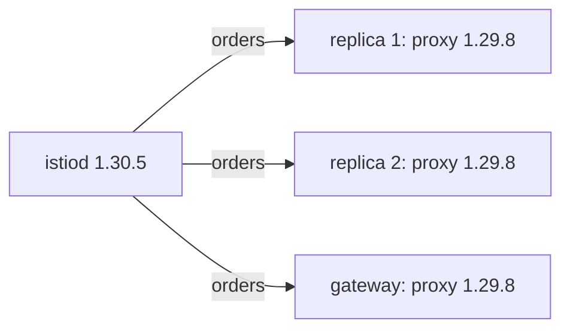

# Skew, Completion And The Cost Of Reverting

After an in-place upgrade, the control plane is new and every proxy in the mesh is still old. That is not a broken state. Every rolling upgrade passes through it, and Istio supports it on purpose. This part covers what that state is, how long it is safe, the restart that ends it, and what going back would cost.

In space terms: mission control runs new software, but every communications officer on board still runs the old version until their ship relaunches.

This part assumes the playground's control plane is already on 1.30.5. If `istioctl-1.30.5 version` still shows `control plane version: 1.29.8`, upgrade first with `istioctl-1.30.5 install --set profile=default -y`.

## What skew is

Here is why the proxies stay old, what Istio promises about it, and the two rules that follow.

### Why the proxies stay old

A sidecar's image is fixed when the pod is created. The injection webhook (the dock inspector) writes the proxy container into the pod spec, and Kubernetes stores that spec. Upgrading the control plane rewrites one Deployment. It cannot rewrite the stored spec of every pod in the cluster.

So right after the upgrade, the mesh looks like this:



The diagram shows a new control plane sending orders to three old proxies: the two `notification-service-v1` replicas in `inplace-demo` and the ingress gateway. Each proxy keeps the image it was injected with until its pod is recreated.

### What Istio promises

A new control plane computing configuration for old proxies is called **version skew**. Istio supports a skew of **one minor version**: a 1.30 control plane may serve 1.29 proxies, and makes no promise about 1.28 ones.

That support is a necessity, not a favour. In a large mesh there is no moment when every proxy can change together, so without a supported skew a rolling upgrade would be impossible. It works because the orders `istiod` sends over xDS (the protocol mission control uses to radio orders to every proxy) stay understandable one version back. The control plane knows it may be talking to older Envoy proxies and avoids anything they cannot read.

### Two rules that follow

**Skew is a window, not a place to stay.** Proxies left behind miss whatever the new version fixed, security fixes included. And when the *next* upgrade starts, they are already at the edge of the supported range.

**You cannot skip a minor version.** Going from 1.28 to 1.30 in one step puts every running proxy two minor versions behind the control plane for the whole upgrade. That is outside the supported window, with no promise about what the old proxies do with the orders they get. Go from 1.28 to 1.29, restart the data plane, then from 1.29 to 1.30.

### See the split, and check whether traffic cares

Read the versions and the proxy status, then send a signal from the `tester` pod to `notification-service`:

<!-- astrona:playground:renew -->

```sh
istioctl-1.30.5 version
istioctl-1.30.5 proxy-status
kubectl -n inplace-demo exec deploy/tester -c tester -- \
  curl -s -o /dev/null -w '%{http_code}\n' http://notification-service/
```

Expect something like:

```text
client version: 1.30.5
control plane version: 1.30.5
data plane version: 1.29.8 (3 proxies)

NAME                                     CLUSTER      CDS      LDS      EDS      RDS      ISTIOD
notification-service-v1-...inplace-demo  Kubernetes   SYNCED   SYNCED   SYNCED   SYNCED   istiod-5f4c9d8b7c-w8t4n
...

200
```

`control plane version: 1.30.5` and `data plane version: 1.29.8` on one screen: that is the skew. Every proxy is still `SYNCED`. The old proxies reconnected to the new control plane and accept its orders without trouble, and the signal still returns `200`. Nothing is broken. The upgrade is simply not finished.

## Ending the skew

A proxy gets a new image the only way any container does: Kubernetes replaces the pod. `kubectl rollout restart deployment` asks the Deployment controller to do that one pod at a time, so the service stays up. In space terms, you relaunch the ships so each gets a fresh communications officer.

### Two replicas let you watch it happen

With two replicas you can watch the change instead of guessing it. During the rollout, `istioctl proxy-status` lists entries on both versions at once.

### Gateways need it too

Gateways need the same restart, and they are the ones people forget most. An ingress gateway runs the same Envoy image as a sidecar, as its own Deployment. The control plane upgrade does not restart it, and it is the workload whose old version is most visible from outside the cluster.

### See the mesh cross over

Restart the application, catch the proxy status in the middle of the rollout, then restart the `tester` and the gateway and read the versions:

```sh
kubectl -n inplace-demo rollout restart deployment notification-service-v1
istioctl-1.30.5 proxy-status | grep inplace-demo
kubectl -n inplace-demo rollout status deployment notification-service-v1 --timeout=180s
kubectl -n inplace-demo rollout restart deployment tester
kubectl -n istio-system rollout restart deployment istio-ingressgateway
kubectl -n inplace-demo rollout status deployment tester --timeout=180s
istioctl-1.30.5 version
```

Expect something like this from the second command, caught in the middle of the rollout:

```text
notification-service-v1-5d9f...  Kubernetes  SYNCED  SYNCED  SYNCED  SYNCED  istiod-5f4c9d8b7c-w8t4n
notification-service-v1-7a2b...  Kubernetes  SYNCED  SYNCED  SYNCED  SYNCED  istiod-5f4c9d8b7c-w8t4n
notification-service-v1-7a2b...  Kubernetes  SYNCED  SYNCED  SYNCED  SYNCED  istiod-5f4c9d8b7c-w8t4n
```

and finally:

```text
client version: 1.30.5
control plane version: 1.30.5
data plane version: 1.30.5 (3 proxies)
```

Three entries in the middle of the rollout where there were two: the old pod and both new ones overlap for a moment. A single `data plane version` that matches the control plane means the upgrade is complete. If two versions are still listed, something was not restarted, and `proxy-status` names it.

### Find the planets you forgot

This command lists every namespace with the injection label:

```sh
kubectl get ns -l istio-injection=enabled
```

Every namespace in that list needs a restart. Workloads that joined the mesh through a pod-level label instead of a namespace label do not show up there, so `istioctl proxy-status` stays the full list.

## What going back costs

The exam expects you to argue the trade-off between in-place and canary, not to recite a favourite. So compare the two paths honestly.

### The two paths side by side

| | In-place | Canary |
| --- | --- | --- |
| Control planes running | One | Two, while the move lasts |
| Moving a workload forward | Restart it | Relabel or move a tag, then restart |
| **Going back** | Reinstall the old version, then restart everything again | Move the label or tag back, then restart |
| Going back under pressure | A full data plane restart, during an incident | One command, then restarts at your own pace |
| Damage from a bad version | The whole mesh at once | One namespace until you widen it |
| Resource cost | Lower | Two control planes |
| Objects to reason about | One set | Two sets, with suffixes |

Going back from an in-place upgrade is not just "more commands". It is a second full data plane restart, done while something is already going wrong, on a cluster whose control plane you are changing at the same time. That imbalance (cheap forward, expensive backward) is the whole argument.

### When in-place is still the right call

In-place stays reasonable for a patch change (1.30.4 to 1.30.5, where you are unlikely to need to go back), a development cluster, or a mesh small enough that a full restart takes minutes, not hours. "Canary in production" is a good default, not a law.

### Have the old configuration before you start

For an in-place upgrade, "go back" means "install the previous version with the previous configuration". If that configuration exists only in the cluster you are about to change, you do not have a plan to go back. Export it first: the `IstioOperator` file if you have one, or a configuration rebuilt from the `istio` ConfigMap and the `istio-system` Deployments if you do not.

## Before an in-place upgrade in a real cluster

A playground forgives everything. A production cluster does not, so plan for these points before you start.

### Know how many restarts it takes

Finishing the upgrade means replacing every pod in the mesh. Count them, check each `PodDisruptionBudget` (the rule that limits how many pods of an app may be down at once), and decide whether this is a maintenance window or a background task. This number usually decides between in-place and canary more than any theory.

### Restart in a chosen order

Restart the least important namespaces first, so a problem shows up while most of the mesh still runs the old proxy. Restart the gateways last, once the services behind them are known to be good.

### Check after, not only before

Run `istioctl analyze` after the upgrade. `precheck` asked whether the cluster was ready for the new version; `analyze` asks whether the configuration now in it is consistent. A field deprecated in the new release shows up here.

### Watch certificates, not just pods

The control plane is also the certificate authority: mission control's badge office. A workload that cannot get a fresh certificate keeps working until its current one expires. Then it fails in a way that looks unrelated to the upgrade.

### Two `istiod` replicas remove the gap

While a single `istiod` rolls, there is a short window with no ready control plane, and new pods in namespaces with injection cannot start. A second replica removes that window. It is cheap insurance, and it belongs in place before the upgrade, not during it.

Skew is supported for one minor version and ends only when every pod is replaced. Going back from an in-place upgrade is a second full data plane restart, taken while something is already wrong.

## Common pitfalls

> [!WARNING]
> **Skipping a minor version.** Going from 1.28 to 1.30 in one step breaks the supported skew window for every running proxy. Go one minor version at a time, restarting the data plane between steps.
>
> **Stopping after the control plane.** The mesh keeps working in skew, so the gap is not obvious. `istioctl version` and `istioctl proxy-status` are the checks that catch it.
>
> **Forgetting the gateways.** They are Envoy workloads with no namespace label driving them. Restart them yourself.
>
> **Assuming going back is symmetric.** Reinstalling the old control plane leaves every pod on the new proxy until you restart them all again.
>
> **Starting without the old configuration.** If it lives only in the cluster you are changing, you cannot go back. Export it first.
>
> **Treating a quiet mesh as a healthy one.** Certificate renewal failures show up hours later, not straight away.

## Your mission: In-Place Upgrade

You can now pre-check with the target binary, replace the control plane in place with its original profile, and close the skew window with restarts. Now prove it in a graded mission: upgrade a single 1.29.8 control plane to 1.30.5 in place, keep its ingress gateway, and leave every proxy, the gateway included, on the new version.

The mission runs in its own training solar system, so first pause your playground. Nothing in it is lost:

```sh
astrona stop ats-013-playground-030-03
```

Then start the mission:

```sh
astrona run --git ssh://git@github.com/astrona-io/ATS013.git -c sections/section-030/module-03/labs/lab-01
```

Read the task in [`question.md`](./labs/lab-01/question.md) and solve it on your own first. When you think you are done, send it for grading:

```sh
astrona submit -c sections/section-030/module-03/labs/lab-01
```

When the mission is done, remove it and wake your playground up again:

```sh
astrona destroy ats-013-lab-030-03
astrona start ats-013-playground-030-03
```
