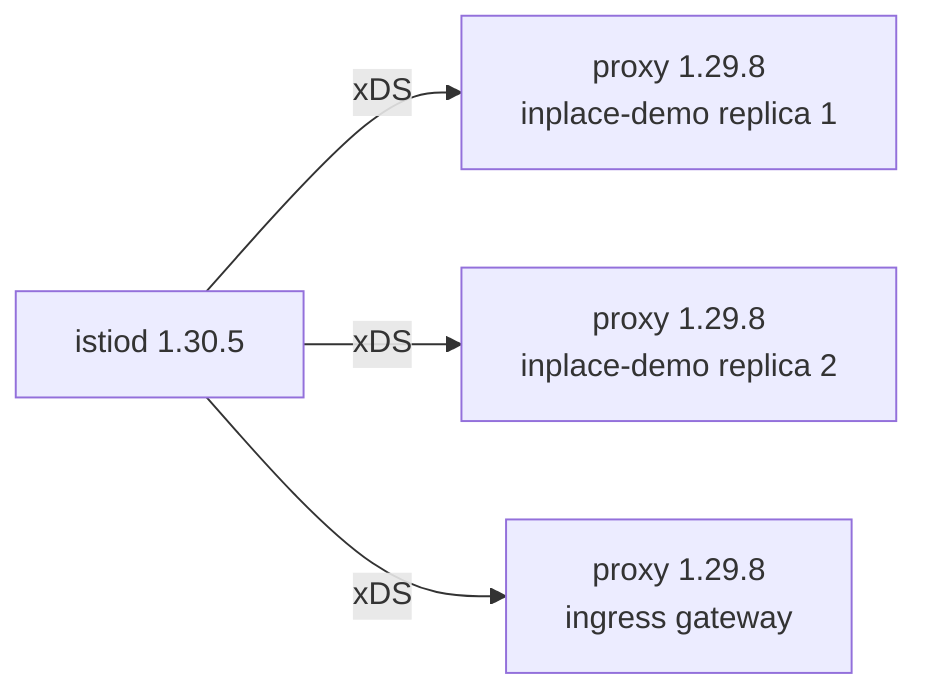

# Part 2 — Skew, Completion And The Cost Of Reverting

> Prerequisite: [Part 1 — Replacing The Control Plane](./course-01-replacing-the-control-plane.md). Next: [the module landing page](./course.md), then [Section 040 — Installing Istio In Sidecar Or Ambient Mode](../../section-040/README.md).

The control plane is new and every proxy in the mesh is still old. That is not a broken state — it is the state every rolling upgrade passes through, and Istio supports it deliberately. This part covers what it is, how long it is safe, the restart that ends it, and what it would cost to go back.

## What skew actually is

A sidecar proxy's image is fixed at pod creation. [The injection module](../../section-020/module-02/course-03-what-injection-writes.md) showed why: the webhook writes the proxy container into the pod spec, and that spec is stored. Upgrading the control plane rewrites one Deployment; it cannot rewrite the stored spec of every pod in the cluster.

So immediately after Part 1's upgrade:



The control plane moved and the data plane did not. Every proxy here is still the image it was injected with, and stays that way until its pod is recreated.

A new control plane computing configuration for old proxies. Istio calls this **version skew** and supports it across **one minor version**: a 1.30 control plane may serve 1.29 proxies, and makes no promise about 1.28 ones.

That support is not generosity, it is a requirement. There is no instant at which every proxy in a large mesh can change together, so without a supported skew window a rolling upgrade would be impossible. What makes it work is that Istio's xDS output for a given configuration stays compatible one version back — the control plane knows it may be talking to older Envoys and avoids resources they cannot parse.

Two consequences follow directly.

**Skew is a window, not a resting place.** Proxies left behind are missing whatever the new version fixed, including security fixes, and they are already at the edge of the supported range when the *next* upgrade starts.

**You cannot skip a minor version.** Going 1.28 → 1.30 in one step puts every running proxy two minors behind the control plane for the entire duration of the upgrade — outside the supported window, with no guarantee about what the old proxies do with what they are sent. Go 1.28 → 1.29, restart the data plane, then 1.29 → 1.30.

> [!TIP]
> **Try it — see the split, and check whether traffic cares**
>
> ```sh
> istioctl-1.30.5 version
> istioctl-1.30.5 proxy-status
> kubectl -n inplace-demo exec deploy/tester -c tester -- \
>   curl -s -o /dev/null -w '%{http_code}\n' http://notification-service/
> ```
>
> Expect something like:
>
> ```text
> client version: 1.30.5
> control plane version: 1.30.5
> data plane version: 1.29.8 (3 proxies)
>
> NAME                                     CLUSTER      CDS      LDS      EDS      RDS      ISTIOD
> notification-service-v1-...inplace-demo  Kubernetes   SYNCED   SYNCED   SYNCED   SYNCED   istiod-5f4c9d8b7c-w8t4n
> ...
>
> 200
> ```
>
> `control plane version: 1.30.5` and `data plane version: 1.29.8` on one screen is the skew. Note that every proxy is still `SYNCED` — the old proxies reconnected to the new control plane and are receiving configuration from it happily — and application traffic returns `200` throughout. Nothing is broken. The upgrade is simply not finished.

## Ending the skew

A proxy gets a new image the only way any container does: the pod is replaced. `kubectl rollout restart deployment` does that through the Deployment controller, one pod at a time, so the service stays up.

With two replicas you can watch the transition rather than infer it — during the rollout, `proxy-status` lists entries on both versions at once.

Gateways need the same treatment and are the most commonly forgotten. An ingress gateway runs the same Envoy image as a sidecar, installed as its own Deployment; the control plane upgrade does not restart it, and it is the workload whose staleness is most visible from outside the cluster.

> [!TIP]
> **Try it — watch the mesh cross over, then confirm**
>
> ```sh
> kubectl -n inplace-demo rollout restart deployment notification-service-v1
> istioctl-1.30.5 proxy-status | grep inplace-demo
> kubectl -n inplace-demo rollout status deployment notification-service-v1 --timeout=180s
> kubectl -n inplace-demo rollout restart deployment tester
> kubectl -n istio-system rollout restart deployment istio-ingressgateway
> kubectl -n inplace-demo rollout status deployment tester --timeout=180s
> istioctl-1.30.5 version
> ```
>
> Expect something like — the middle command caught mid-rollout:
>
> ```text
> notification-service-v1-5d9f...  Kubernetes  SYNCED  SYNCED  SYNCED  SYNCED  istiod-5f4c9d8b7c-w8t4n
> notification-service-v1-7a2b...  Kubernetes  SYNCED  SYNCED  SYNCED  SYNCED  istiod-5f4c9d8b7c-w8t4n
> notification-service-v1-7a2b...  Kubernetes  SYNCED  SYNCED  SYNCED  SYNCED  istiod-5f4c9d8b7c-w8t4n
> ```
>
> and finally:
>
> ```text
> client version: 1.30.5
> control plane version: 1.30.5
> data plane version: 1.30.5 (3 proxies)
> ```
>
> Three entries mid-rollout where there were two — the old pod and both new ones overlapping. A single `data plane version` matching the control plane is the upgrade being complete. If two versions are still listed, something was not restarted, and `proxy-status` names it.

Finding forgotten workloads is worth a command of its own:

```sh
kubectl get ns -l istio-injection=enabled
```

Anything in that list needs a restart. Workloads meshed by a pod-level label rather than a namespace label will not appear there, so `istioctl proxy-status` stays the authoritative inventory.

## What reverting costs

Compare the two paths honestly, because the ICA curriculum expects you to be able to argue the trade-off rather than recite a preference.

| | In-place | Canary |
| --- | --- | --- |
| Control planes running | One | Two, for the duration |
| Moving a workload forward | Restart it | Relabel or move a tag, then restart |
| **Rollback** | Reinstall the old version, then restart everything again | Move the label or tag back, then restart |
| Rollback while under pressure | A full data-plane restart, during an incident | One command, then paced restarts |
| Blast radius of a bad version | The whole mesh at once | One namespace until you widen it |
| Resource cost | Lower | Two control planes |
| Objects to reason about | One set | Two sets, suffixed |

The in-place rollback is not merely "more commands". It is a second full data-plane restart performed while something is already going wrong, on a cluster whose control plane you are simultaneously changing. That asymmetry — cheap forward, expensive backward — is the whole argument.

It is also why in-place remains reasonable for a patch bump (1.30.4 → 1.30.5, where the risk of needing a rollback is genuinely low), a development cluster, or a mesh small enough that a full restart is minutes rather than hours. "Canary in production" is a good default, not a law.

> [!WARNING]
> **Have the old configuration before you start**
>
> For an in-place upgrade, "roll back" means "install the previous version with the previous configuration". If that configuration exists only in the cluster you are about to change, you do not have a rollback plan — you have a hope. Export it first: the `IstioOperator` file if you have one, or the reconstruction described in Part 1 if you do not.

> [!WARNING]
## Common pitfalls

> [!WARNING]
> **Skipping a minor version.** 1.28 → 1.30 in one step breaks the supported skew window for every running proxy. One minor at a time, restarting the data plane between steps.
>
> **Running a bare `istioctl install` during the upgrade.** It reconciles to the default profile and silently discards customisation. Pass the same `-f` file or `--set` flags you installed with.
>
> **Pre-checking with the old binary.** `x precheck` must be run with the target version, or it checks compatibility with the version you already have.
>
> **Stopping after the control plane.** The mesh keeps working in skew, so the omission is not obvious. `istioctl version` and `proxy-status` are the checks that catch it.
>
> **Forgetting gateways.** They are Envoy workloads with no namespace label driving them. Restart them explicitly.
>
> **Assuming a rollback is symmetric.** Reinstalling the old control plane leaves every pod running new proxies until you restart them all again.
>
> **Treating a quiet mesh as a healthy one.** Certificate renewal failures surface hours later, not immediately.

## Operational considerations

**Know the restart bill in advance.** Completing the upgrade means replacing every meshed pod. Count them, check `PodDisruptionBudget`s, and decide whether that is a maintenance window or a background task. This number usually decides in-place versus canary more than any theoretical argument.

**Restart in a deliberate order.** Least critical namespaces first, so a problem shows up while most of the mesh is still on the old proxy. Gateways last, once the services behind them are known good.

**Run `istioctl analyze` after the upgrade.** `precheck` asked whether the cluster was ready for the new version; `analyze` asks whether the configuration now in it is coherent. A field deprecated in the new release shows up here.

**Watch certificate issuance, not just pod status.** The control plane is also the certificate authority. A workload that cannot get a fresh certificate keeps working until its current one expires and then fails in a way that looks unrelated to the upgrade.

**Two `istiod` replicas remove the control plane gap.** Part 1's brief window with no ready control plane — during which new pods in injected namespaces cannot start — disappears with a second replica. It is cheap insurance and it should be in place before the upgrade, not added during it.

> *Skew is supported for one minor version and ends only when every pod is replaced — and an in-place rollback is a second full data-plane restart, taken while something is already wrong.*

## Reference

- [In-place upgrades](https://istio.io/v1.30/docs/setup/upgrade/in-place/) — the procedure and its caveats.
- [Supported releases](https://istio.io/v1.30/docs/releases/supported-releases/) — the one-minor-version skew rule, stated by the project.
- [Canary upgrades](https://istio.io/v1.30/docs/setup/upgrade/canary/) — the alternative the comparison table is against.
- [Diagnostic tools](https://istio.io/v1.30/docs/ops/diagnostic-tools/proxy-cmd/) — reading `proxy-status` during a rollout.
