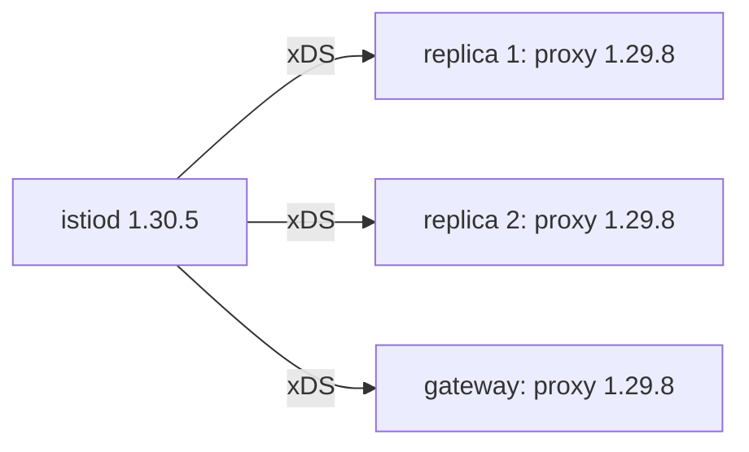

# Version Skew And Finishing The Upgrade

After an in-place upgrade, the control plane is new and every proxy in the mesh is still old. That is not a broken state. Every rolling upgrade passes through it, and Istio supports it on purpose. This part explains what that state is, how long it is safe, and the restarts that end it.

The commands below need the playground's control plane on 1.30.5. If `istioctl-1.30.5 version` still shows `control plane version: 1.29.8`, upgrade first with `istioctl-1.30.5 install --set profile=default -y`.

## Why the proxies stay old

A **sidecar proxy** is an Envoy container that Istio adds to each pod; all inbound and outbound traffic of the pod passes through it. Its image is fixed when the pod is created. The injection webhook writes the `istio-proxy` container into the pod spec, and the Kubernetes API server stores that spec. Upgrading the control plane changes one Deployment. It cannot change the stored spec of every pod in the cluster.

So right after the upgrade, the mesh looks like this:



The diagram shows a new `istiod` sending configuration to three old proxies: the two `notification-service-v1` replicas in `inplace-demo` and the ingress gateway.

xDS is the protocol `istiod` uses to push configuration to the proxies while they run. Each proxy keeps the image it was injected with, and keeps receiving xDS configuration from the new `istiod`, until its pod is created again.

## What Istio promises about skew

A new control plane that sends configuration to older proxies is called **version skew**. Istio supports a skew of **one minor version**: a 1.30 control plane may serve 1.29 proxies, and makes no promise about 1.28 proxies.

That support is a necessity. In a large mesh there is no moment when every proxy can change at once, so without a supported skew, a rolling upgrade would be impossible. It works because `istiod` knows it may be talking to older Envoy proxies, and avoids sending configuration they cannot read.

Two rules follow from that promise. First, **skew is a window, not a place to stay.** Proxies left behind miss what the new version fixed, security fixes included. When the next upgrade starts, they are already at the edge of the supported range.

Second, **you cannot skip a minor version.** Going from 1.28 to 1.30 in one step puts every running proxy two minor versions behind the control plane for the whole upgrade. That is outside the supported window, and Istio makes no promise about what the old proxies do with the configuration they receive. Go from 1.28 to 1.29, restart the data plane, then go from 1.29 to 1.30.

You can see the skew in the playground. Read the versions and the proxy status, then send a request from the `tester` pod to the `notification-service` Service and print only the HTTP status code:

<!-- astrona:playground:renew -->

```sh
istioctl-1.30.5 version
istioctl-1.30.5 proxy-status
kubectl -n inplace-demo exec deploy/tester -c tester -- \
  curl -s -o /dev/null -w '%{http_code}\n' http://notification-service/
```

The output looks like this (shortened):

```text
client version: 1.30.5
control plane version: 1.30.5
data plane version: 1.29.8 (3 proxies)

NAME                                     CLUSTER      CDS      LDS      EDS      RDS      ISTIOD
notification-service-v1-...inplace-demo  Kubernetes   SYNCED   SYNCED   SYNCED   SYNCED   istiod-5f4c9d8b7c-w8t4n
...

200
```

`control plane version: 1.30.5` and `data plane version: 1.29.8` on one screen: that is the skew. Every proxy still shows `SYNCED`, which means it accepted the latest configuration from `istiod`. The old proxies reconnected to the new control plane and accept its configuration, and the request still returns `200`. Nothing is broken. The upgrade is simply not finished.

## Restarting the workloads

A proxy gets a new image the only way any container does: Kubernetes replaces the pod. `kubectl rollout restart deployment` asks the Deployment controller to do that a few pods at a time, so the Service stays up. Each new pod passes through the injection webhook, and `istiod` 1.30.5 gives it a 1.30.5 proxy.

The two replicas of `notification-service-v1` let you watch this happen instead of guessing. During the rollout, `istioctl proxy-status` lists pods on both versions at the same time.

Gateways need the same restart, and people forget them most often. The ingress gateway runs the same Envoy image as a sidecar proxy, in its own Deployment in `istio-system`. The control plane upgrade does not restart it, and it is the workload whose old version is most visible from outside the cluster.

Restart the application, read the proxy status in the middle of the rollout, then restart `tester` and the gateway, and read the versions:

```sh
kubectl -n inplace-demo rollout restart deployment notification-service-v1
istioctl-1.30.5 proxy-status | grep inplace-demo
kubectl -n inplace-demo rollout status deployment notification-service-v1 --timeout=180s
kubectl -n inplace-demo rollout restart deployment tester
kubectl -n istio-system rollout restart deployment istio-ingressgateway
kubectl -n inplace-demo rollout status deployment tester --timeout=180s
istioctl-1.30.5 version
```

The second command, run while the rollout is still going, prints something like this (shortened):

```text
notification-service-v1-5d9f...  Kubernetes  SYNCED  SYNCED  SYNCED  SYNCED  istiod-5f4c9d8b7c-w8t4n
notification-service-v1-7a2b...  Kubernetes  SYNCED  SYNCED  SYNCED  SYNCED  istiod-5f4c9d8b7c-w8t4n
notification-service-v1-7a2b...  Kubernetes  SYNCED  SYNCED  SYNCED  SYNCED  istiod-5f4c9d8b7c-w8t4n
```

The last command prints:

```text
client version: 1.30.5
control plane version: 1.30.5
data plane version: 1.30.5 (3 proxies)
```

There are three entries in the middle of the rollout where there were two, because the old pod and the new ones overlap for a moment. At the end, a single `data plane version` that matches the control plane means the upgrade is complete. If two versions are still listed, a workload was not restarted, and `istioctl proxy-status` names it.

On a cluster with many namespaces, you need the list of workloads to restart. This command lists every namespace with the injection label:

```sh
kubectl get ns -l istio-injection=enabled
```

Every namespace in that list needs a restart. Workloads that joined the mesh through a label on the pod, not on the namespace, do not appear in that list. `istioctl proxy-status` stays the complete list of proxies.

You now know that version skew is the normal state right after an in-place upgrade, that Istio supports one minor version of it, and that only replacing every pod, the gateway included, ends it. The open question is what it costs to go back if the new version turns out to be bad.

## Common pitfalls

> [!WARNING]
> **Skipping a minor version.** Going from 1.28 to 1.30 in one step puts every running proxy outside the supported skew window. Go one minor version at a time, and restart the data plane between steps.
>
> **Stopping after the control plane.** The mesh keeps working in skew, so nothing reports a problem. `istioctl version` and `istioctl proxy-status` are the checks that show it.
>
> **Forgetting the gateways.** They are Envoy workloads in `istio-system`, and no namespace label in your application namespaces covers them. Restart them yourself.
>
> **Restarting only the application.** Every Deployment with a sidecar proxy needs a restart, including client pods such as `tester`. `kubectl -n <namespace> rollout restart deployment` with no name restarts every Deployment in the namespace.

## Your mission: In-Place Upgrade Lab

You can now pre-check with the target binary, replace the control plane in place with its original profile, and end the version skew with restarts. The lab asks you to upgrade a single 1.29.8 control plane to 1.30.5 in place, keep its ingress gateway, and leave every proxy, the gateway included, on the new version.

The lab runs on its own cluster, so first pause your playground. Nothing in it is lost:

```sh
astrona stop ats-013-playground-030-03
```

Then start the lab. The task is on the next page; solve it on your own first:

```sh
astrona run --git ssh://git@github.com/astrona-io/ATS013.git -c sections/section-030/module-03/labs/lab-01
```

When you think you are done, send it for grading:

```sh
astrona submit -c sections/section-030/module-03/labs/lab-01
```

When the lab is done, remove it and start your playground again:

```sh
astrona destroy ats-013-lab-030-03
astrona start ats-013-playground-030-03
```
