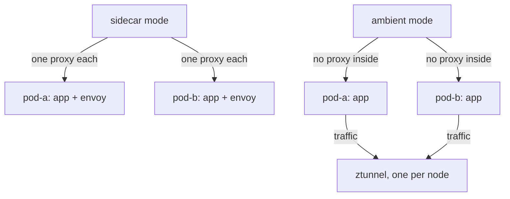
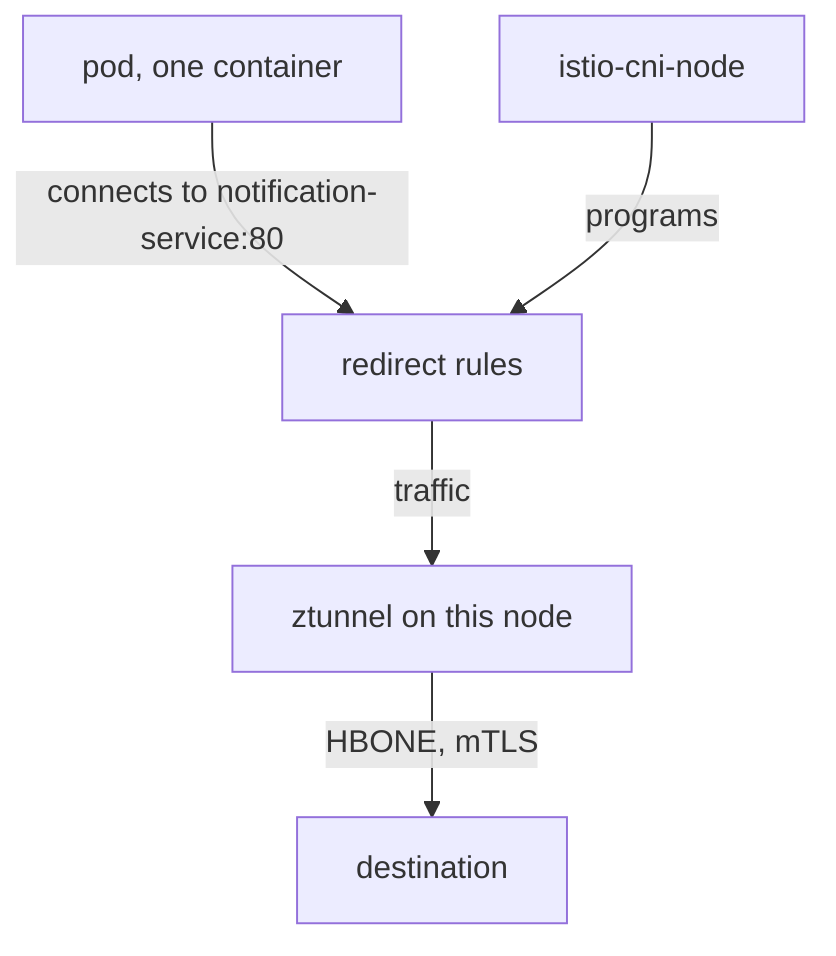

# The Ambient Data Plane

Ambient mode is a different data plane, not a different product. The data plane is the part of the mesh that actually carries the signals (requests) between ships. In this part you see what the `ambient` profile puts on a cluster, why two of its parts run once per node, and how a pod's traffic reaches a proxy that is not inside the pod.

## What the profile installs

<!-- astrona:playground:renew -->

The playground already ran this command for you:

```sh
istioctl install --set profile=ambient -y
```

A **profile** is a stock blueprint from the shipyard catalogue: a ready-made set of settings that `istioctl` turns into Kubernetes objects. The `ambient` profile builds three things.

### The three components

Each component has one clear job. Keep them apart in your head, because most ambient puzzles come from mixing them up.

- **`istiod`** is a Deployment: the same control plane as in sidecar mode. Think of it as mission control. It sends every proxy its orders over xDS (Istio's configuration channel), it is the certificate authority that issues ID badges, and it runs the injection webhook. In ambient mode it also sends orders to ztunnel.
- **`istio-cni-node`** is a DaemonSet: a workload Kubernetes runs once on every node. Think of it as the dock crew at every launch pad, who connect each ship's radio to the relay tower. Despite its name, it does not replace your cluster's own CNI (Container Network Interface) plugin, the program that gives pods their network. It is a *chained* plugin that runs alongside it. Its job is to set up traffic redirection for enrolled pods.
- **`ztunnel`** is also a DaemonSet. The name means **zero-trust tunnel**. It is one proxy per node, shared by every enrolled pod on that node: the relay tower on the launch pad.

"DaemonSet" is the key word for the last two. Sidecar mode adds a proxy for every **pod**. Ambient mode adds a proxy for every **node**.



The diagram shows the proxy moving out of the pod and onto the node. With 80 pods on one node, sidecar mode runs 80 Envoy proxies, and ambient mode runs one ztunnel.

That is why ambient mode exists: it costs less to run. It is also the trade-off. One proxy per node is shared by every pod on that node, so if ztunnel runs short of resources or crashes, every enrolled pod on that node feels it.

### See it in your playground

List the DaemonSets and pods in `istio-system`:

```sh
kubectl -n istio-system get daemonset
kubectl -n istio-system get pods -o wide
```

Expect something like:

```text
NAME             DESIRED   CURRENT   READY   UP-TO-DATE   AVAILABLE   AGE
istio-cni-node   1         1         1       1            1           5m
ztunnel          1         1         1       1            1           5m

NAME                      READY   STATUS    RESTARTS   AGE   NODE
istio-cni-node-8kq2v      1/1     Running   0          5m    astro-...-control-plane
istiod-7c9d64f8b5-rlz6t   1/1     Running   0          5m    astro-...-control-plane
ztunnel-x4m9p             1/1     Running   0          5m    astro-...-control-plane
```

`DESIRED 1` is there because this cluster has one node. On a ten-node cluster both DaemonSets would read 10, and `istiod` would still have one pod. The control plane grows with the cluster, the data plane grows with the number of nodes.

## How traffic reaches a proxy outside the pod

This is the mechanism to understand, because everything surprising about ambient mode follows from it. First look at how sidecar mode did it, then at what ambient mode does instead.

### Sidecar mode: redirect to a proxy in the same pod

In sidecar mode, the `istio-init` container ran inside the pod's own network space. It wrote iptables rules (Linux firewall rules) that sent traffic to `localhost:15001` and `localhost:15006`, where the sidecar listened. The proxy lived in the same network space, so "send it to localhost" was enough.

### Ambient mode: redirect out of the pod to the node

In ambient mode there is no proxy in the pod. The `istio-cni-node` agent still sets up rules in the pod's network space, but they send traffic **out of the pod to the ztunnel on that node**. It uses iptables rules plus a network device that moves packets between network spaces. The pod itself is never changed: no container is added, the spec is not touched, and the pod cannot see any difference.



The diagram shows that the redirect rules are installed from outside the pod by `istio-cni-node`. The pod keeps its one container, and that is why enrolling a workload needs no restart.

### HBONE and port 15008

**HBONE** stands for **HTTP-Based Overlay Network Environment**. It is the sealed tunnel the relay towers use between them. ztunnel carries the original connection inside an HTTP/2 tunnel protected by mutual TLS (mTLS, the secret handshake where both ships show their badges). Both ends are checked, and the contents are encrypted, while neither application knows anything happened.

HBONE uses port **15008**. You will see that port in ztunnel's log lines whenever a connection travels through the tunnel.

### Two consequences

Two facts follow directly from this mechanism.

**`istio-cni` is required.** Without it there is no redirect, so ambient mode does not work at all. That is why the `ambient` profile installs it. A cluster whose own network plugin does not allow chaining cannot run ambient mode, and the symptom there is pods with no network connection at all. Check this before you plan a move to ambient mode.

**Enrollment does not touch the pod.** The redirect lives in node-level rules and in ztunnel's own state. Switching it on or off is a change *outside* the pod, so it takes effect with no restart. That is the biggest practical difference from sidecar mode.

## The same control plane, with one more job

In ambient mode `istiod` does everything it did before and takes on one more job. It tells each ztunnel about the workloads on its node: their identities, their addresses, whether they are enrolled, and whether their destination has a waypoint.

That is why `istioctl` has a matching diagnostic command. `istioctl proxy-config` prints what an Envoy sidecar knows. **`istioctl ztunnel-config`** prints what a ztunnel knows. It is the same idea for a different data plane, and it is the only reliable way to check membership in ambient mode.

### See it in your playground

Check the control plane, then ask the ztunnel on your node which workloads it knows:

```sh
kubectl -n istio-system get deploy istiod
istioctl ztunnel-config workload --node "$(kubectl get nodes -o jsonpath='{.items[0].metadata.name}')" | head -5
```

Expect something like:

```text
NAME     READY   UP-TO-DATE   AVAILABLE   AGE
istiod   1/1     1            1           7m

NAMESPACE     POD NAME                  ADDRESS      NODE                     WAYPOINT  PROTOCOL
istio-system  istiod-7c9d64f8b5-rlz6t   10.244.0.5   astro-...-control-plane  None      TCP
istio-system  ztunnel-x4m9p             10.244.0.6   astro-...-control-plane  None      TCP
kube-system   coredns-...               10.244.0.3   astro-...-control-plane  None      TCP
```

There is one ordinary `istiod` Deployment. The ztunnel already knows every pod on its node, even pods that are not in the mesh. The `PROTOCOL` column tells you which ones it actually tunnels for: `TCP` means plain traffic from a workload that is not enrolled.

## What is not installed

Two things are missing on purpose. Both come up as exam questions.

**No waypoint proxy.** The `ambient` profile installs no Envoy for layer 7 work (reading HTTP: paths, methods, headers). Waypoints are opt-in, per namespace or per service. A waypoint is a checkpoint station you build only where someone must read the signal's contents.

**No Gateway API CRDs.** A CRD (Custom Resource Definition) is a new form the cluster's registry office learns to accept. Istio does not ship the Gateway API CRDs, and ambient mode's layer 4 features do not need them. They become required as soon as you want a waypoint, because a waypoint *is* a Gateway API `Gateway`. You install them separately.

In short: ambient mode moves the proxy from the pod to the node. `istio-cni` sends the pod's traffic out to ztunnel, ztunnel carries it in mTLS on port 15008, and the pod is never changed.

## Common pitfalls

> [!WARNING]
> **Expecting a sidecar container to appear.** Ambient pods keep their original container count. You cannot see membership in `kubectl get pods`.
>
> **Assuming ambient mode gives you layer 7 features.** ztunnel works at layer 4: mTLS and identity, not routing or header matching. Those need a waypoint.
>
> **Forgetting `istio-cni`.** The redirect that ambient mode relies on is set up by the CNI node agent, not by an init container. Without it, nothing reaches ztunnel.
>
> **Treating ztunnel as one per workload.** There is one per node, shared by every enrolled pod on that node.
