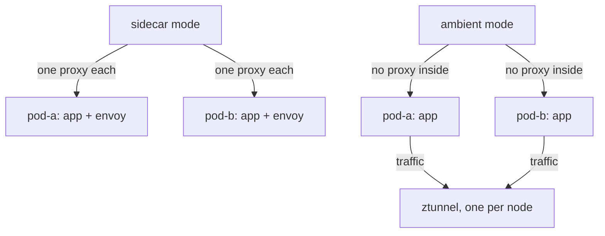
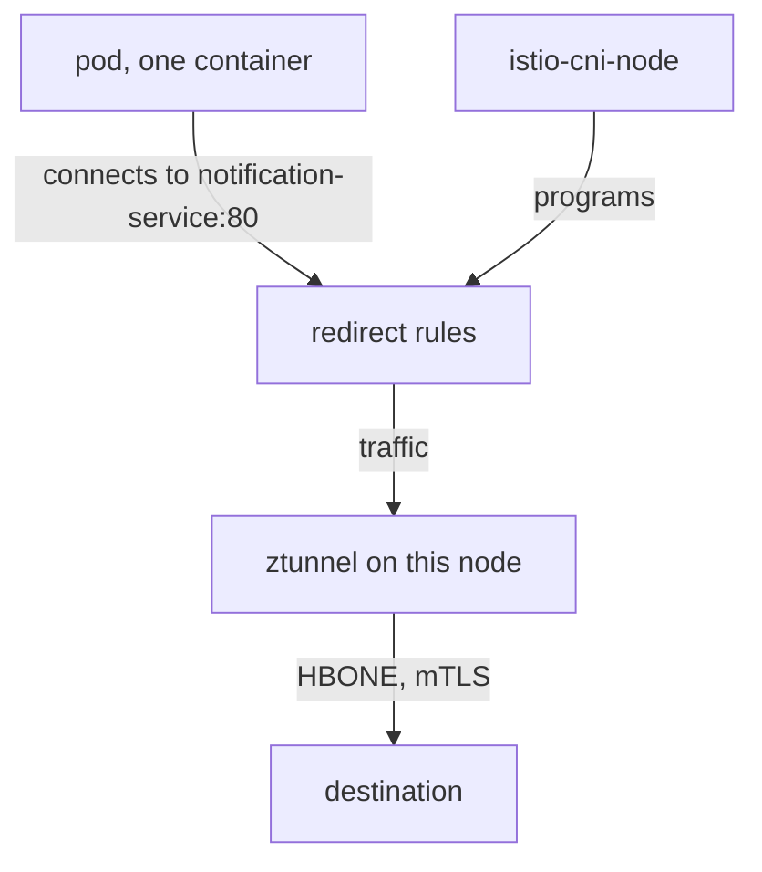

# The Ambient Data Plane

Ambient mode is a different data plane, not a different product. The data plane is the set of proxies that carry requests between workloads. In sidecar mode that is one Envoy proxy inside every pod. In ambient mode the proxy moves out of the pod, and that raises a real question: how does a pod's traffic reach a proxy that is not inside it? This part shows what the `ambient` profile puts on a cluster, why two of its components run once per node, and how the traffic gets to them.

## What the profile installs

The playground already ran the install command for you. A **profile** is a ready-made set of install settings that `istioctl` turns into Kubernetes objects. This is the command it ran:

<!-- astrona:playground:renew -->

```sh
istioctl install --set profile=ambient -y
```

The `ambient` profile installs three components. Each one has one clear job, and most problems with ambient mode come from mixing them up. The first component is the control plane you already know from sidecar mode. The other two are new, and both are DaemonSets. A **DaemonSet** is a Kubernetes workload that runs exactly one pod on every node.

- **`istiod`** is a Deployment and is the same control plane as in sidecar mode. It sends every proxy its configuration over xDS, the protocol Istio uses to push configuration to proxies while they run. It is also the certificate authority that issues workload certificates, and it runs the sidecar injection webhook. In ambient mode it also sends configuration to ztunnel.
- **`istio-cni-node`** is a DaemonSet. Its job is to set up traffic redirection for pods in the mesh. Despite its name, it does not replace your cluster's own CNI (Container Network Interface) plugin, which is the program that gives pods their network. It is a *chained* plugin: it runs after the cluster's own plugin and adds to its work.
- **`ztunnel`** is also a DaemonSet. The name means **zero-trust tunnel**. It is one layer 4 proxy per node, shared by every pod on that node that is in the mesh.

"DaemonSet" is the key word for the last two. Sidecar mode adds a proxy for every **pod**. Ambient mode adds a proxy for every **node**.



The diagram shows the proxy moving out of the pod and onto the node: with 80 pods on one node, sidecar mode runs 80 Envoy proxies, and ambient mode runs one ztunnel.

That lower cost is why ambient mode exists. It is also the trade-off. One ztunnel serves every pod in the mesh on its node, so if ztunnel runs short of resources or crashes, every one of those pods feels it.

You can see the per-node design directly. List the DaemonSets and the pods in `istio-system`:

```sh
kubectl -n istio-system get daemonset
kubectl -n istio-system get pods -o wide
```

The output looks like this (shortened):

```text
NAME             DESIRED   CURRENT   READY   UP-TO-DATE   AVAILABLE   AGE
istio-cni-node   1         1         1       1            1           5m
ztunnel          1         1         1       1            1           5m

NAME                      READY   STATUS    RESTARTS   AGE   NODE
istio-cni-node-8kq2v      1/1     Running   0          5m    astro-...-control-plane
istiod-7c9d64f8b5-rlz6t   1/1     Running   0          5m    astro-...-control-plane
ztunnel-x4m9p             1/1     Running   0          5m    astro-...-control-plane
```

`DESIRED 1` is there because this cluster has one node. On a ten-node cluster both DaemonSets would read 10, and `istiod` would still have one pod. The data plane grows with the number of nodes, not with the number of pods.

## How traffic reaches a proxy outside the pod

Knowing that ztunnel runs on the node leads straight to the main question of this part. Everything surprising about ambient mode follows from the answer. It helps to look first at how sidecar mode solves the same problem.

### Sidecar mode: redirect to a proxy in the same pod

In sidecar mode, the `istio-init` init container runs inside the pod's own network namespace. A network namespace is the private network stack of a pod: its own interfaces, addresses and firewall rules. `istio-init` writes iptables rules (Linux packet filter rules) that send traffic to `localhost:15001` and `localhost:15006`, where the sidecar proxy listens. The proxy lives in the same network namespace, so "send it to localhost" is enough.

### Ambient mode: the node agent sets up the redirect

In ambient mode there is no proxy in the pod. Instead, the `istio-cni-node` agent on the node sets up the redirect from outside the pod. It writes iptables rules inside the pod's network namespace, and ztunnel opens listening sockets in that same network namespace. The pod's traffic is redirected to those sockets, and ztunnel, which runs in its own pod on the node, handles it. The pod spec is never changed: no container is added, and the pod cannot see any difference.



The diagram shows that `istio-cni-node` installs the redirect rules from outside the pod, which is why the pod keeps its one container and why adding a workload to the mesh needs no restart.

### HBONE and port 15008

Once ztunnel has the traffic, it must carry it to the destination securely. **HBONE** stands for **HTTP-Based Overlay Network Environment**. It is the tunnel that ztunnel uses to carry traffic between workloads. ztunnel puts the original connection inside an HTTP/2 tunnel protected by mutual TLS (mTLS): both sides check each other's certificate, and the traffic is encrypted. Neither application knows that this happened.

HBONE uses port **15008**. You see that port in ztunnel's log lines whenever a connection travels through the tunnel.

### Two consequences

Two facts follow directly from this mechanism, and both come up when you plan or debug an ambient install.

**`istio-cni` is required.** Without it there is no redirect, so ambient mode does not work at all. That is why the `ambient` profile installs it. A cluster whose own network plugin does not allow chaining cannot run ambient mode, and the symptom there is pods with no network connection at all. Check this before you plan a move to ambient mode.

**Adding a pod to the mesh does not touch the pod.** The redirect lives in rules that `istio-cni-node` writes and in ztunnel's own state. Switching it on or off is a change *outside* the pod spec, so it takes effect with no restart. That is the biggest practical difference from sidecar mode.

## The same control plane, with one more job

The redirect gets traffic to ztunnel, but ztunnel also needs to know what to do with it. In ambient mode `istiod` does everything it did before, plus one more job. It tells each ztunnel about the workloads on its node: their identities, their addresses, whether they are in the mesh, and whether their destination has a waypoint.

That is why `istioctl` has a matching diagnostic command. `istioctl proxy-config` prints the configuration an Envoy sidecar holds. **`istioctl ztunnel-config`** prints the configuration a ztunnel holds. It is the same idea for a different data plane, and it is the only reliable way to check membership in ambient mode.

Check the control plane, then ask the ztunnel on your node which workloads it knows. The `--node` flag picks the ztunnel on one node, and the `jsonpath` part finds the name of your only node:

```sh
kubectl -n istio-system get deploy istiod
istioctl ztunnel-config workload --node "$(kubectl get nodes -o jsonpath='{.items[0].metadata.name}')" | head -5
```

The output looks like this:

```text
NAME     READY   UP-TO-DATE   AVAILABLE   AGE
istiod   1/1     1            1           7m

NAMESPACE     POD NAME                  ADDRESS      NODE                     WAYPOINT  PROTOCOL
istio-system  istiod-7c9d64f8b5-rlz6t   10.244.0.5   astro-...-control-plane  None      TCP
istio-system  ztunnel-x4m9p             10.244.0.6   astro-...-control-plane  None      TCP
kube-system   coredns-...               10.244.0.3   astro-...-control-plane  None      TCP
```

There is one ordinary `istiod` Deployment. The ztunnel already knows every pod on its node, even pods that are not in the mesh. The `PROTOCOL` column says which ones it actually carries through the tunnel: `TCP` means plain traffic from a workload that is not in the mesh.

## What is not installed

The list of what the profile installs is only half the picture. Two things are missing on purpose, and both come up as exam questions.

**No waypoint proxy.** A **waypoint proxy** is an Envoy proxy that does layer 7 work for a namespace or a Service: it reads HTTP methods, paths and headers. The `ambient` profile installs none. Waypoints are opt-in, and you deploy one only where you need layer 7 features.

**No Gateway API CRDs.** A CRD (Custom Resource Definition) adds a new object kind to the Kubernetes API. Istio does not ship the Gateway API CRDs, and ztunnel's layer 4 features do not need them. They become required as soon as you want a waypoint, because a waypoint *is* a Gateway API `Gateway` object. You install them separately.

You now know that the `ambient` profile installs `istiod` plus two DaemonSets, `istio-cni-node` and `ztunnel`, and that ambient mode moves the proxy from the pod to the node. `istio-cni-node` redirects the pod's traffic to ztunnel, ztunnel carries it in mTLS through HBONE on port 15008, and the pod spec is never changed. The open question is how a namespace actually joins the mesh, and how you prove it did when the pods look exactly the same as before.

## Common pitfalls

> [!WARNING]
> **Expecting a sidecar container to appear.** Ambient pods keep their original container count. You cannot see membership in `kubectl get pods`.
>
> **Assuming ambient mode gives you layer 7 features.** ztunnel works at layer 4: mTLS and identity, not HTTP routing or header matching. Those need a waypoint proxy.
>
> **Forgetting `istio-cni`.** In ambient mode the `istio-cni-node` agent sets up the redirect, not an init container. Without it, no traffic reaches ztunnel.
>
> **Treating ztunnel as one proxy per workload.** There is one per node, shared by every pod in the mesh on that node.
