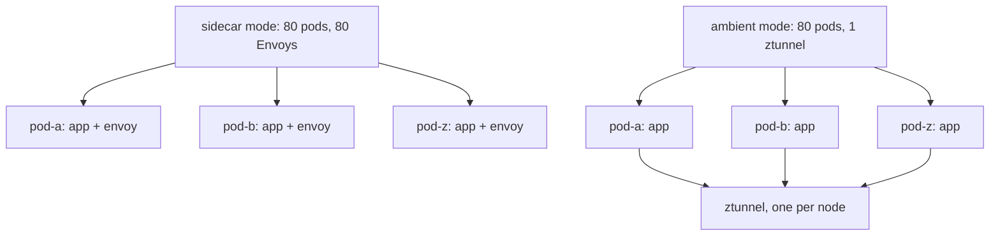
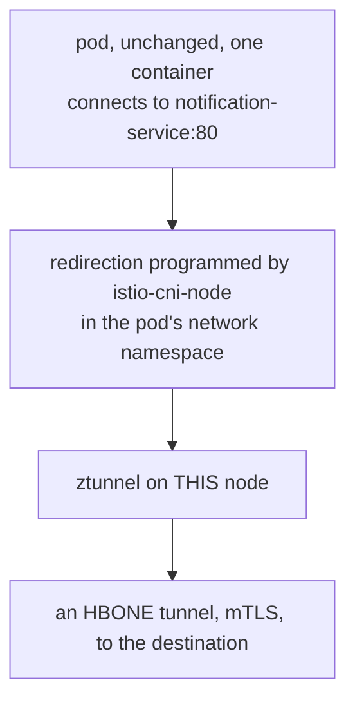

# Part 1 — The Ambient Data Plane

> Prerequisite: [the module landing page](./course.md). Next: [Part 2 — Enrollment, Verification And The L4 Boundary](./course-02-enrollment-and-the-l4-boundary.md).

Ambient mode is a different data plane, not a different product. This part covers what the `ambient` profile puts on a cluster, why two of those components are DaemonSets, and — the piece that makes everything else possible — how a pod's traffic reaches a proxy that is not inside it.

## What the profile installs

```sh
istioctl install --set profile=ambient -y
```

Already done on the playground. It produces three things:

- **`istiod`** — a Deployment, the same control plane as ever. It gains the job of programming ztunnel, but it is the same component doing the same three jobs: xDS server, certificate authority, injection webhook backend.
- **`istio-cni-node`** — a DaemonSet. Despite the name it does not replace your cluster's CNI plugin; it is a *chained* plugin that runs alongside it. Its job is to set up traffic redirection for enrolled pods at the node level.
- **`ztunnel`** — a DaemonSet. One **z**ero-trust **tunnel** proxy per node, shared by every enrolled pod on that node.

DaemonSet is the load-bearing word in the last two. Sidecar mode scales proxies with the number of **pods**; ambient mode scales them with the number of **nodes**.



The proxy moves out of the pod and onto the node. Everything else about ambient follows from that one change — including what it can no longer do without a waypoint.

That is the cost model in one picture, and it is why ambient exists. It is also the trade: one proxy per node is a shared, node-wide dependency, with a node-wide blast radius if it is starved of resources or crashes.

> [!TIP]
> **Try it — the ambient data plane, per node**
>
> ```sh
> kubectl -n istio-system get daemonset
> kubectl -n istio-system get pods -o wide
> ```
>
> Expect something like:
>
> ```text
> NAME             DESIRED   CURRENT   READY   UP-TO-DATE   AVAILABLE   AGE
> istio-cni-node   1         1         1       1            1           5m
> ztunnel          1         1         1       1            1           5m
>
> NAME                      READY   STATUS    RESTARTS   AGE   NODE
> istio-cni-node-8kq2v      1/1     Running   0          5m    astro-...-control-plane
> istiod-7c9d64f8b5-rlz6t   1/1     Running   0          5m    astro-...-control-plane
> ztunnel-x4m9p             1/1     Running   0          5m    astro-...-control-plane
> ```
>
> `DESIRED 1` because this is a one-node cluster; on a ten-node cluster both would read 10 and `istiod` would still read 1. That relationship — control plane scaled by cluster, data plane scaled by nodes — is the whole ambient cost model.

## How traffic reaches a proxy outside the pod

This is the mechanism to understand, because everything surprising about ambient mode follows from it.

In sidecar mode, the `istio-init` container ran inside the pod's network namespace and wrote iptables rules redirecting traffic to `localhost:15001` and `localhost:15006` — where the sidecar was listening. The proxy was in the same network namespace, so "redirect to localhost" was enough.

In ambient mode there is no proxy in the pod. `istio-cni-node` still programs the pod's network namespace, but it redirects traffic **out of the pod to the node's ztunnel** instead, using a combination of iptables rules and a network device that moves packets between namespaces. The pod itself is never modified — no container added, no spec change, nothing the pod can observe.



Nothing was added to the pod. The redirect is installed from outside it, which is why enrolling a workload needs no restart.

Port **15008** is HBONE's port and it will appear in every ztunnel log line you read in Part 2. HBONE — **H**TTP-**B**ased **O**verlay **N**etwork **E**nvironment — is the transport ambient mode uses between ztunnels: the original connection is carried inside an mTLS-encrypted HTTP/2 tunnel, so both ends are authenticated and the payload is encrypted, without either application knowing.

Two consequences worth stating explicitly:

**`istio-cni` is a hard prerequisite.** Without it there is no redirection, so ambient mode simply does not function. This is why the `ambient` profile installs it and why a cluster whose CNI does not tolerate chaining cannot run ambient mode — the failure mode there is pods with no connectivity at all, which is worth checking before planning a migration.

**Enrollment does not touch the pod.** Because the redirection lives in node-level configuration and ztunnel's own state, turning it on or off is a change *outside* the pod. Part 2 shows the consequence: enrollment takes effect with no restart, which is the headline difference from sidecar mode.

## The same control plane, extended

`istiod` in ambient mode does everything it did before and adds one responsibility: it tells each ztunnel about the workloads on its node — their identities, their addresses, whether they are enrolled, and whether their destination service has a waypoint.

That is why `istioctl` has a parallel diagnostic command. `istioctl proxy-config` dumps an Envoy sidecar's view of the world; **`istioctl ztunnel-config`** does the same for a ztunnel. Same idea, different data plane, and Part 2 leans on it heavily because it is the only way to check membership.

> [!TIP]
> **Try it — confirm the control plane is unchanged and ztunnel is talking to it**
>
> ```sh
> kubectl -n istio-system get deploy istiod
> istioctl ztunnel-config workload --node "$(kubectl get nodes -o jsonpath='{.items[0].metadata.name}')" | head -5
> ```
>
> Expect something like:
>
> ```text
> NAME     READY   UP-TO-DATE   AVAILABLE   AGE
> istiod   1/1     1            1           7m
>
> NAMESPACE     POD NAME                  ADDRESS      NODE                     WAYPOINT  PROTOCOL
> istio-system  istiod-7c9d64f8b5-rlz6t   10.244.0.5   astro-...-control-plane  None      TCP
> istio-system  ztunnel-x4m9p             10.244.0.6   astro-...-control-plane  None      TCP
> kube-system   coredns-...               10.244.0.3   astro-...-control-plane  None      TCP
> ```
>
> One ordinary `istiod` Deployment, and a ztunnel that already knows about every pod on its node — including ones that are not in the mesh at all. That is the key to Part 2: ztunnel tracks all workloads and the `PROTOCOL` column tells you which ones it will actually tunnel for. `TCP` means plain, un-enrolled traffic.

## What is *not* installed

Two absences are worth naming, because both come up as questions.

**No waypoint proxy.** The `ambient` profile installs no Envoy for L7 work. That is deliberate: waypoints are opt-in, per namespace or per service, and the next module deploys one.

**No Gateway API CRDs.** Istio does not ship them, and ambient mode's L4 features do not need them. They become a hard requirement the moment you want a waypoint, because a waypoint *is* a `Gateway` — which is why the next module's playground installs them separately.

> *Ambient moves the proxy from the pod to the node: `istio-cni` redirects the pod's traffic out to ztunnel, which tunnels it over mTLS on port 15008, and the pod is never modified.*

## Common pitfalls

> [!WARNING]
> **Expecting a sidecar container to appear.** Ambient pods keep their original container count; membership is not visible in `kubectl get pods`.
>
> **Assuming ambient gives you L7 features.** ztunnel is an L4 boundary — mTLS and identity, not routing or header matching. That needs a waypoint.
>
> **Forgetting `istio-cni`.** The redirection ambient relies on is programmed by the CNI node agent, not by an init container.
>
> **Treating ztunnel as per-workload.** It is one per node, shared by every enrolled pod on it.

## Reference

- [Ambient mode overview](https://istio.io/v1.30/docs/ambient/overview/) — the architecture and its motivation.
- [ztunnel](https://istio.io/v1.30/docs/ambient/architecture/data-plane/) — what the node proxy does and does not do.
- [HBONE](https://istio.io/v1.30/docs/ambient/architecture/hbone/) — the tunnelling protocol and port 15008.
- [Istio CNI plugin](https://istio.io/v1.30/docs/setup/additional-setup/cni/) — chaining, requirements, and troubleshooting when pods lose connectivity.
