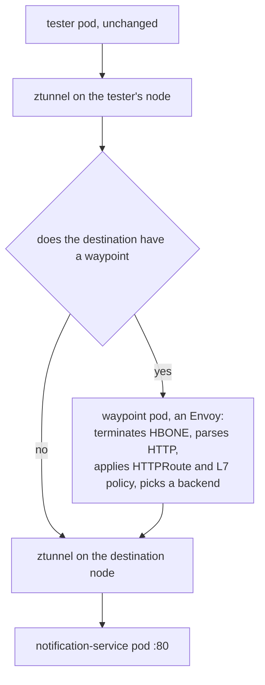

# Part 1 — What A Waypoint Is And How Traffic Reaches It

> Prerequisite: [the module landing page](./course.md). Next: [Part 2 — L7 Configuration Through A Waypoint](./course-02-l7-configuration-through-a-waypoint.md).

Start with the failure, because it is silent and because everything else in the module is easier to justify once you have watched it. Then build the waypoint, and trace exactly how a request ends up going through it when neither pod was changed.

## The gap, demonstrated

An `HTTPRoute` applied to an ambient namespace with no waypoint is accepted by the API server, shows up in `kubectl get httproute`, reports a healthy status — and does nothing. There is nothing in the request path capable of acting on it.

```sh
cat > notification-header.yaml <<'YAML'
apiVersion: gateway.networking.k8s.io/v1
kind: HTTPRoute
metadata:
  name: notification-header
  namespace: ambient-l7
spec:
  parentRefs:
    - group: ""
      kind: Service
      name: notification-service
  rules:
    - filters:
        - type: ResponseHeaderModifier
          responseHeaderModifier:
            set:
              - name: x-processed-by
                value: waypoint
      backendRefs:
        - name: notification-service
          port: 80
YAML
```

The `parentRefs` entry deserves a close read. In ingress use, an `HTTPRoute` attaches to a `Gateway`. Here it attaches to a **Service** — `kind: Service` with an empty `group`, meaning core Kubernetes. That is the Gateway API's **mesh** pattern: the route describes what should happen to traffic destined for that Service, wherever in the mesh it originates.

The rule itself does one trivial, easily observable thing: it sets a response header, `x-processed-by: waypoint`. Trivial is deliberate — only something parsing HTTP can add a header, so the header's presence is unambiguous proof of L7 processing.

> [!TIP]
> **Try it — a route that is accepted and does nothing**
>
> ```sh
> kubectl apply -f notification-header.yaml
> kubectl -n ambient-l7 get httproute
> kubectl -n ambient-l7 get httproute notification-header \
>   -o jsonpath='{.status.parents[0].conditions[*].type}{"\n"}'
> kubectl -n ambient-l7 exec deploy/tester -- curl -s -i http://notification-service/ | head -5
> ```
>
> Expect something like:
>
> ```text
> httproute.gateway.networking.k8s.io/notification-header created
>
> NAME                  HOSTNAMES   AGE
> notification-header               8s
>
> Accepted ResolvedRefs
>
> HTTP/1.1 200 OK
> Server: nginx/1.27.4
> Date: Sat, 27 Sep 2026 09:41:02 GMT
> Content-Type: text/html
> Content-Length: 615
> ```
>
> The route exists, its status says `Accepted` and `ResolvedRefs`, the request succeeds — and there is no `x-processed-by` header. Note the `Server: nginx/1.27.4`: the response came straight from the application, having passed through no HTTP-aware proxy at all.
>
> That combination is the trap. A healthy status means the object is well-formed and bound to a real parent; it says nothing about whether anything exists to execute it.

## A waypoint is a `Gateway` of a particular class

A waypoint is an Envoy deployment created from a Gateway API `Gateway` resource whose `gatewayClassName` is **`istio-waypoint`**. That one field is the entire difference between a waypoint and an ingress gateway: same API, same proxy binary, different class, and therefore a completely different role.

| | Ingress gateway | Waypoint |
| --- | --- | --- |
| `gatewayClassName` | `istio` | `istio-waypoint` |
| Sits | At the cluster edge | Inside the mesh |
| Handles traffic | From outside the cluster | Between meshed workloads |
| Selected by | A `Gateway` listener and its hostnames | ztunnel, per destination |

`istioctl waypoint apply` writes that `Gateway` for you. `--enroll-namespace` additionally labels the namespace `istio.io/use-waypoint`, which is what tells ztunnel to route the namespace's traffic through it.

The two halves are separate and both are required. Creating the waypoint gives you a running proxy; enrolling gives it something to do. Forgetting the second is a common way to end up with a healthy, idle Envoy and no change in behaviour.

Read `istioctl waypoint` as the subcommand family for these proxies: `apply` creates or updates one, `list` shows them, `status` reports readiness, `delete` removes one.

> [!TIP]
> **Try it — create the waypoint and see what it is**
>
> ```sh
> istioctl waypoint apply -n ambient-l7 --enroll-namespace
> kubectl -n ambient-l7 rollout status deployment waypoint --timeout=180s
> kubectl -n ambient-l7 get gateway waypoint \
>   -o custom-columns='NAME:.metadata.name,CLASS:.spec.gatewayClassName,PROGRAMMED:.status.conditions[?(@.type=="Programmed")].status'
> kubectl get ns ambient-l7 --show-labels
> ```
>
> Expect something like:
>
> ```text
> ✓ waypoint ambient-l7/waypoint applied
> ✓ namespace ambient-l7 labeled with "istio.io/use-waypoint: waypoint"
>
> NAME       CLASS            PROGRAMMED
> waypoint   istio-waypoint   True
>
> NAME         STATUS   AGE   LABELS
> ambient-l7   Active   14m   istio.io/dataplane-mode=ambient,istio.io/use-waypoint=waypoint,...
> ```
>
> `CLASS istio-waypoint` is the field that makes this a waypoint. `PROGRAMMED True` means Istio accepted the `Gateway` and produced a running proxy for it. The namespace now carries **two** labels doing two different jobs: `dataplane-mode` puts it in the mesh at L4, `use-waypoint` routes its traffic through L7.

## The path a request takes

The waypoint is not on the network path by default — **ztunnel puts it there**. When ztunnel handles a connection to a destination whose Service has a waypoint registered, it does not connect to the destination pod. It connects to the waypoint instead, over HBONE.



The waypoint is a detour ztunnel takes only when one exists. Every hop is still HBONE and still mTLS — the waypoint adds L7 understanding, not encryption.

Three things follow from that diagram.

**Neither application pod is modified.** The redirection decision lives entirely in ztunnel's configuration, which `istiod` programs. The client does not know a waypoint exists; the server does not know its traffic was inspected.

**The waypoint is an extra hop.** That is the honest cost: added latency, plus a proxy to run, size and keep healthy — paid only for namespaces that need L7.

**mTLS is preserved end to end.** Both legs are HBONE. The waypoint terminates one tunnel and opens another; at no point is the traffic in plaintext on the network.

The `WAYPOINT` column in `istioctl ztunnel-config workload` is where the routing decision becomes checkable. In the previous module it read `None` for everything; after enrollment it should name the waypoint.

> [!TIP]
> **Try it — confirm ztunnel knows where to send traffic**
>
> ```sh
> istioctl ztunnel-config workload | grep ambient-l7
> istioctl waypoint list -n ambient-l7
> ```
>
> Expect something like:
>
> ```text
> NAMESPACE   POD NAME                      ADDRESS      NODE                     WAYPOINT  PROTOCOL
> ambient-l7  notification-service-v1-...   10.244.0.14  astro-...-control-plane  waypoint  HBONE
> ambient-l7  tester-...                    10.244.0.15  astro-...-control-plane  waypoint  HBONE
> ambient-l7  waypoint-5f6d8c9b74-h2vzq     10.244.0.16  astro-...-control-plane  None      HBONE
>
> NAME       REVISION   PROGRAMMED
> waypoint   default    True
> ```
>
> The application workloads now name `waypoint`; the waypoint pod itself reads `None`, because a waypoint does not route through itself — that would be a loop. Enrolling is what changed this column. Creating the `Gateway` without `--enroll-namespace` would leave it at `None` and the waypoint would run with nothing to do.

## Why the Gateway API CRDs are a hard requirement

A waypoint is a `Gateway`. `Gateway`, `GatewayClass` and `HTTPRoute` are Gateway API kinds, and **Istio does not ship those CRDs** — they are a separate Kubernetes SIG project with its own release cadence.

Without them installed, `istioctl waypoint apply` fails with an unknown-kind error that reads like an Istio bug and is not:

```text
error: resource mapping not found for name: "waypoint" namespace: "ambient-l7"
from "": no matches for kind "Gateway" in version "gateway.networking.k8s.io/v1"
ensure CRDs are installed first
```

The final clause is the diagnosis. The playground installed them with the ambient profile's prerequisites; on a cluster you build yourself, they are an explicit step:

```sh
kubectl get crd gateways.gateway.networking.k8s.io >/dev/null 2>&1 || \
  kubectl apply -f https://github.com/kubernetes-sigs/gateway-api/releases/download/v1.5.1/standard-install.yaml
```

> *A waypoint is a `Gateway` of class `istio-waypoint`, and ztunnel — not the application, not the network — is what decides to send traffic through it.*

## Common pitfalls

> [!WARNING]
> **Expecting L7 policy to work without a waypoint.** ztunnel cannot parse HTTP, so an `HTTPRoute` with nothing to execute it is silently inert.
>
> **Forgetting the Gateway API CRDs.** A waypoint is a `Gateway` of a particular class; without the CRDs the apply fails with `no matches for kind`.
>
> **Assuming a waypoint is per pod.** It is per namespace or per service, and it is a separate Deployment you can see and scale.
>
> **Reading the extra hop as a bug.** Traffic to a waypointed destination goes via the waypoint by design; that is where the L7 work happens.

## Reference

- [Waypoint proxies](https://istio.io/v1.30/docs/ambient/usage/waypoint/) — creating, scoping and managing them.
- [Gateway API](https://gateway-api.sigs.k8s.io/) — the upstream project whose CRDs this depends on.
- [Gateway API for service mesh](https://gateway-api.sigs.k8s.io/mesh/) — the `parentRefs` to a Service pattern used here.
- [istioctl waypoint](https://istio.io/v1.30/docs/reference/commands/istioctl/#istioctl-waypoint) — `apply`, `list`, `status`, `delete` and their flags.
