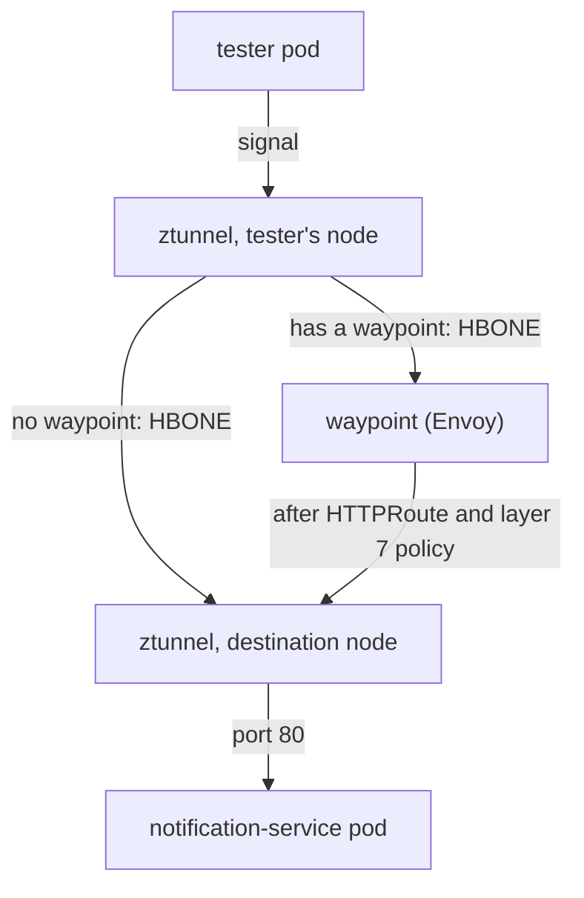

# What A Waypoint Is And How Traffic Reaches It

Start with the failure, because it is silent, and because the rest of this part makes more sense once you have watched it. Then you build the waypoint, the checkpoint station that reads the signal's contents, and trace how a request ends up going through it while neither pod changes.

## The gap, shown

An `HTTPRoute` is a Gateway API object that tells an HTTP-aware proxy what to do with requests: where to send them and how to change them. Applied to an ambient namespace with no waypoint, it is accepted by the API server, shows up in `kubectl get httproute`, and reports a healthy status. And it does nothing, because nothing in the signal's path can act on it.

### Write the route

The route below does one small, easy-to-see thing: it sets a response header, `x-processed-by: waypoint`. Only something that reads HTTP can add a header, so if the header shows up, layer 7 processing is in the path.

<!-- astrona:playground:renew -->

Save this as `notification-header.yaml`:

```yaml
apiVersion: gateway.networking.k8s.io/v1
kind: HTTPRoute
metadata:
  name: notification-header
  namespace: ambient-l7
spec:
  parentRefs:
    - group: ""
      kind: Service
      name: notification-service
  rules:
    - filters:
        - type: ResponseHeaderModifier
          responseHeaderModifier:
            set:
              - name: x-processed-by
                value: waypoint
      backendRefs:
        - name: notification-service
          port: 80
```

Read the `parentRefs` entry closely. At the edge of the cluster, an `HTTPRoute` attaches to a `Gateway`. Here it attaches to a **Service**: `kind: Service`, with an empty `group` that means core Kubernetes. That is the Gateway API's **mesh** pattern. The route describes what should happen to traffic headed for that Service (that beacon), wherever in the mesh it comes from.

### See it in your playground

Apply it:

```sh
kubectl apply -f notification-header.yaml
```

```text
httproute.gateway.networking.k8s.io/notification-header created
```

Then check the result: list the route, read its status, and send a request from `tester`:

```sh
kubectl -n ambient-l7 get httproute
kubectl -n ambient-l7 get httproute notification-header \
  -o jsonpath='{.status.parents[0].conditions[*].type}{"\n"}'
kubectl -n ambient-l7 exec deploy/tester -- curl -s -i http://notification-service/ | head -5
```

Expect something like:

```text
NAME                  HOSTNAMES   AGE
notification-header               8s

Accepted ResolvedRefs

HTTP/1.1 200 OK
Server: nginx/1.27.4
Date: Sat, 27 Sep 2026 09:41:02 GMT
Content-Type: text/html
Content-Length: 615
```

The route exists, its status says `Accepted` and `ResolvedRefs`, and the request succeeds. But there is no `x-processed-by` header. The line `Server: nginx/1.27.4` shows the response came straight from the application, without passing any HTTP-aware proxy.

That mix is the trap. A healthy status means the object is well formed and bound to a real parent. It says nothing about whether anything exists to carry it out.

## A waypoint is a `Gateway` of a particular class

A waypoint is an Envoy deployment created from a Gateway API `Gateway` whose `gatewayClassName` is **`istio-waypoint`**. That one field is the whole difference between a waypoint and an ingress gateway (the spaceport arrival gate): same API, same proxy program, different class, and so a completely different job.

### Waypoint and ingress gateway side by side

The table shows how the class changes the role:

| | Ingress gateway | Waypoint |
| --- | --- | --- |
| `gatewayClassName` | `istio` | `istio-waypoint` |
| Sits | At the edge of the cluster | Inside the mesh |
| Handles traffic | From outside the cluster | Between meshed workloads |
| Chosen by | A `Gateway` listener and its hostnames | ztunnel, per destination |

### Creating it and enrolling to it

`istioctl waypoint apply` writes that `Gateway` for you. The `--enroll-namespace` flag also labels the namespace `istio.io/use-waypoint`. That label tells ztunnel to route the namespace's traffic through the checkpoint station.

The two halves are separate, and you need both. Creating the waypoint gives you a running proxy; enrolling gives it something to do. If you forget the second, you get a healthy Envoy that sits idle, and nothing changes.

Read `istioctl waypoint` as the family of commands for these proxies: `apply` creates or updates one, `list` shows them, `status` reports whether they are ready, and `delete` removes one.

### See it in your playground

Create the waypoint, wait for it, then look at what it is:

```sh
istioctl waypoint apply -n ambient-l7 --enroll-namespace
kubectl -n ambient-l7 rollout status deployment waypoint --timeout=180s
kubectl -n ambient-l7 get gateway waypoint \
  -o custom-columns='NAME:.metadata.name,CLASS:.spec.gatewayClassName,PROGRAMMED:.status.conditions[?(@.type=="Programmed")].status'
kubectl get ns ambient-l7 --show-labels
```

Expect something like:

```text
✓ waypoint ambient-l7/waypoint applied
✓ namespace ambient-l7 labeled with "istio.io/use-waypoint: waypoint"

NAME       CLASS            PROGRAMMED
waypoint   istio-waypoint   True

NAME         STATUS   AGE   LABELS
ambient-l7   Active   14m   istio.io/dataplane-mode=ambient,istio.io/use-waypoint=waypoint,...
```

`CLASS istio-waypoint` is the field that makes this a waypoint. `PROGRAMMED True` means Istio accepted the `Gateway` and built a running proxy for it. The namespace now carries **two** labels with two different jobs: `dataplane-mode` puts it in the mesh at layer 4, and `use-waypoint` sends its traffic through layer 7.

## The path a request takes

The waypoint is not on the network path by default. **ztunnel puts it there.** When ztunnel handles a connection to a destination whose Service has a waypoint, it does not connect to the destination pod. It connects to the waypoint instead, over HBONE, the mutual TLS tunnel the relay towers use between them.

### Follow one signal

The diagram shows one signal from `tester` to `notification-service`:



The waypoint is a detour that ztunnel takes only when one exists for the destination. There the waypoint ends the tunnel, reads the HTTP request, applies the `HTTPRoute` and any layer 7 policy, picks a backend, and opens a new tunnel.

### Three consequences

Three facts follow from that path.

**Neither application pod changes.** The routing decision lives in ztunnel's configuration, which `istiod` (mission control) sends. The client does not know a waypoint exists, and the server does not know its traffic was read.

**The waypoint is an extra hop.** That is the honest cost: a little more delay, plus a proxy to run, size and keep healthy. You pay it only for namespaces that need layer 7.

**Mutual TLS stays in place end to end.** Both legs are HBONE. The waypoint ends one tunnel and opens another, so the traffic is never plain text on the network.

### See it in your playground

ztunnel shows the routing decision in two views. For a waypoint that serves a Service, like this one, the **service** view is the one that names it. Look at the service view and the waypoint list:

```sh
istioctl ztunnel-config service | grep ambient-l7
istioctl waypoint list -n ambient-l7
```

In the service view, the `WAYPOINT` column on the `notification-service` row names `waypoint`. The waypoint list looks something like this:

```text
NAME       REVISION   PROGRAMMED
waypoint   default    True
```

Enrolling is what made ztunnel name the waypoint. If you created the `Gateway` without `--enroll-namespace`, the waypoint would run with nothing to do.

> [!TIP]
> Check the service view, `istioctl ztunnel-config service`, to see whether a Service is routed through a waypoint. The `WAYPOINT` column in the workload view (`istioctl ztunnel-config workload`) stays `None` for a waypoint that serves a Service, so it cannot answer that question.

## Why the Gateway API CRDs are required

A waypoint is a `Gateway`. `Gateway`, `GatewayClass` and `HTTPRoute` are Gateway API kinds, and **Istio does not ship their CRDs**. They come from a separate Kubernetes project with its own release schedule.

### The error you see without them

Without the CRDs, `istioctl waypoint apply` fails with an unknown-kind error. It reads like an Istio bug, but it is not:

```text
error: resource mapping not found for name: "waypoint" namespace: "ambient-l7"
from "": no matches for kind "Gateway" in version "gateway.networking.k8s.io/v1"
ensure CRDs are installed first
```

The last line is the diagnosis. Your playground already has the CRDs. On a cluster you build yourself, installing them is a separate step:

```sh
kubectl get crd gateways.gateway.networking.k8s.io >/dev/null 2>&1 || \
  kubectl apply -f https://github.com/kubernetes-sigs/gateway-api/releases/download/v1.5.1/standard-install.yaml
```

In short: a waypoint is a `Gateway` of class `istio-waypoint`, and ztunnel, not the application and not the network, decides to send traffic through it.

## Common pitfalls

> [!WARNING]
> **Expecting layer 7 rules to work without a waypoint.** ztunnel cannot read HTTP, so an `HTTPRoute` with nothing to carry it out silently does nothing.
>
> **Forgetting the Gateway API CRDs.** A waypoint is a `Gateway` of a particular class. Without the CRDs, the apply fails with `no matches for kind`.
>
> **Assuming a waypoint is one per pod.** It is one per namespace or per service, and it is a separate Deployment you can see and scale.
>
> **Creating the waypoint but not enrolling to it.** Without `--enroll-namespace` or an `istio.io/use-waypoint` label, the proxy runs and gets no traffic.
>
> **Reading the extra hop as a bug.** Traffic to a destination with a waypoint goes through the waypoint on purpose; that is where the layer 7 work happens.
