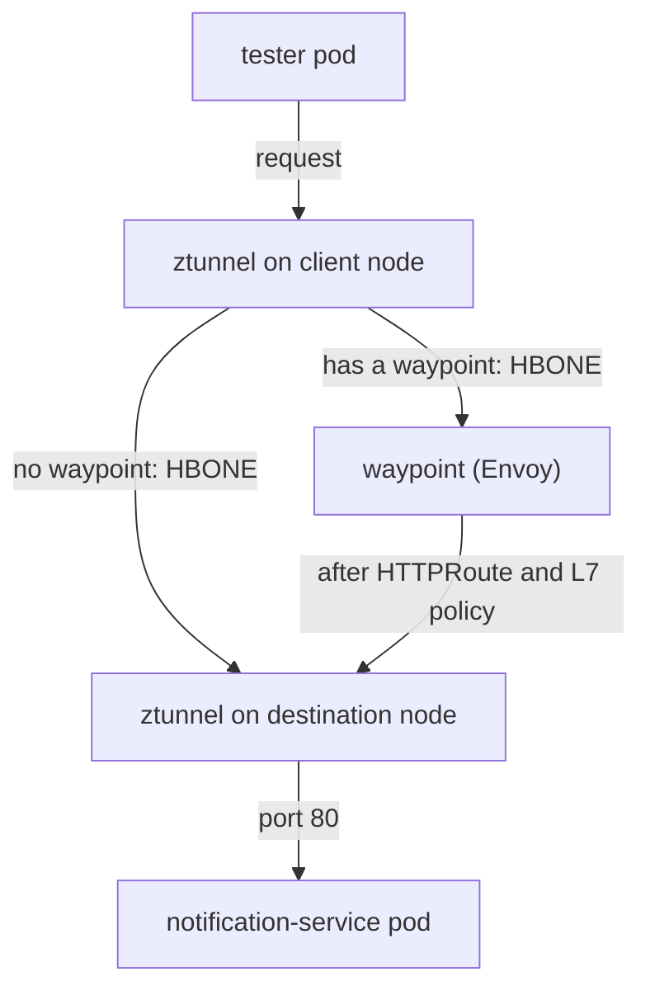

# What A Waypoint Is And How Traffic Reaches It

In an ambient namespace, you can apply a layer 7 rule, see it accepted, and watch it do nothing. No error appears anywhere. The reason is ztunnel, the per-node proxy of ambient mode: it gives workloads mutual TLS (Transport Layer Security) and checks identities and ports, but it does not read HTTP (Hypertext Transfer Protocol) requests. This part starts with that failure, because the rest of the part makes more sense once you have seen it. Then you create a waypoint proxy, the component that reads HTTP requests, and follow how a request reaches it while neither application pod changes.

## A route with nothing to run it

An `HTTPRoute` is a Gateway API object that tells an HTTP-aware proxy what to do with requests: where to send them and how to change them. In an ambient namespace with no waypoint, the API server accepts it, `kubectl get httproute` lists it, and its status looks healthy. Yet it does nothing, because no component in the request path can act on it.

The route below does one small thing that is easy to see: it sets the response header `x-processed-by: waypoint`. Only a proxy that reads HTTP can add a header. If the header appears in a response, layer 7 processing is in the path.

<!-- astrona:playground:renew -->

Save this as `httproute-notification-header.yaml`:

```yaml
apiVersion: gateway.networking.k8s.io/v1
kind: HTTPRoute
metadata:
  name: notification-header
  namespace: ambient-l7
spec:
  parentRefs:
    - group: ""
      kind: Service
      name: notification-service
  rules:
    - filters:
        - type: ResponseHeaderModifier
          responseHeaderModifier:
            set:
              - name: x-processed-by
                value: waypoint
      backendRefs:
        - name: notification-service
          port: 80
```

Read the `parentRefs` entry closely. At the edge of the cluster, an `HTTPRoute` attaches to a `Gateway`. Here it attaches to a **Service**: `kind: Service`, with an empty `group` that means core Kubernetes. This is the Gateway API's **mesh** pattern. The route describes what should happen to traffic sent to that Service, from any workload in the mesh.

Apply it:

```sh
kubectl apply -f httproute-notification-header.yaml
```

```text
httproute.gateway.networking.k8s.io/notification-header created
```

Then check the result. List the route, read its status conditions, and send a request from `tester`:

```sh
kubectl -n ambient-l7 get httproute
kubectl -n ambient-l7 get httproute notification-header \
  -o jsonpath='{.status.parents[0].conditions[*].type}{"\n"}'
kubectl -n ambient-l7 exec deploy/tester -- curl -s -i http://notification-service/ | head -5
```

The output looks like this:

```text
NAME                  HOSTNAMES   AGE
notification-header               0s
Accepted ResolvedRefs ResolvedWaypoints
HTTP/1.1 200 OK
Server: nginx/1.27.5
Date: Sat, 10 Oct 2026 01:02:02 GMT
Content-Type: text/html
Content-Length: 615
```

The route exists, its status lists `Accepted`, `ResolvedRefs` and `ResolvedWaypoints`, and the request succeeds. But the response has no `x-processed-by` header. The line `Server: nginx/1.27.5` shows that the response came straight from nginx, without passing through any HTTP-aware proxy.

That mix is the trap. A healthy status means the object is well formed and bound to a real parent. All three conditions have `status: "True"`, so a quick look says nothing is wrong. Only the message of `ResolvedWaypoints` tells the truth. Read it:

```sh
kubectl -n ambient-l7 get httproute notification-header \
  -o jsonpath='{.status.parents[0].conditions[2].message}{"\n"}'
```

```text
istio.io/use-waypoint label missing from parent and parent namespace; in ambient mode, route will not be respected
```

Istio says it in plain words: no waypoint serves the Service, so the route is not carried out.

## A waypoint is a Gateway of a particular class

The missing component is the waypoint. A waypoint is an Envoy Deployment that Istio creates from a Gateway API `Gateway` whose `gatewayClassName` is **`istio-waypoint`**. Envoy is the proxy program Istio uses for sidecars, gateways and waypoints. That one field is the whole difference between a waypoint and an ingress gateway: same API, same proxy program, different class, and so a different job.

The table shows how the class changes the role:

| | Ingress gateway | Waypoint |
| --- | --- | --- |
| `gatewayClassName` | `istio` | `istio-waypoint` |
| Sits | At the edge of the cluster | Inside the mesh |
| Handles traffic | From outside the cluster | Between meshed workloads |
| Chosen by | A `Gateway` listener and its hostnames | ztunnel, per destination |

`istioctl waypoint apply` writes that `Gateway` for you. The `--enroll-namespace` flag also adds the label `istio.io/use-waypoint` to the namespace. That label tells ztunnel to send the namespace's traffic through the waypoint.

The two steps are separate, and you need both. Creating the waypoint gives you a running proxy; enrolling gives it traffic. If you forget the second step, you get a healthy Envoy that receives no requests, and nothing changes. The `istioctl waypoint` commands form one family: `apply` creates or updates a waypoint, `list` shows them, `status` reports whether they are ready, and `delete` removes one.

Create the waypoint, wait for its Deployment, then look at the `Gateway` and the namespace labels:

```sh
istioctl waypoint apply -n ambient-l7 --enroll-namespace
kubectl -n ambient-l7 rollout status deployment waypoint --timeout=180s
kubectl -n ambient-l7 get gateway waypoint \
  -o custom-columns='NAME:.metadata.name,CLASS:.spec.gatewayClassName,PROGRAMMED:.status.conditions[?(@.type=="Programmed")].status'
kubectl get ns ambient-l7 --show-labels
```

The output looks like this:

```text
✅ waypoint ambient-l7/waypoint applied
✅ namespace ambient-l7 labeled with "istio.io/use-waypoint: waypoint"
Waiting for deployment "waypoint" rollout to finish: 0 of 1 updated replicas are available...
deployment "waypoint" successfully rolled out
NAME       CLASS            PROGRAMMED
waypoint   istio-waypoint   True
NAME         STATUS   AGE   LABELS
ambient-l7   Active   23s   istio.io/dataplane-mode=ambient,istio.io/use-waypoint=waypoint,kubernetes.io/metadata.name=ambient-l7
```

`CLASS istio-waypoint` is the field that makes this `Gateway` a waypoint. `PROGRAMMED True` means Istio accepted the `Gateway` and built a running proxy for it. The namespace now carries **two** labels with two different jobs: `istio.io/dataplane-mode` puts it in the mesh at layer 4, and `istio.io/use-waypoint` sends its traffic through layer 7.

## The path a request takes

A running waypoint is not on the network path by itself. **ztunnel puts it there.** When ztunnel handles a connection to a destination whose Service has a waypoint, it does not connect to the destination pod. It connects to the waypoint instead, over HBONE (HTTP-Based Overlay Network Environment), the mutual TLS tunnel that ztunnel instances use between them.



The diagram shows one request from `tester` to `notification-service`, with and without a waypoint for the destination.

The waypoint ends the first tunnel, reads the HTTP request, applies the `HTTPRoute` and any layer 7 policy, picks a backend, and opens a new tunnel. Three facts follow from that path. **Neither application pod changes:** `istiod`, Istio's control plane, tells ztunnel which destinations have a waypoint, so the routing decision lives in ztunnel's configuration. **The waypoint is an extra hop:** it adds a little delay and is one more proxy to run, size and keep healthy. **Mutual TLS stays in place end to end:** both legs are HBONE, so the traffic is never plain text on the network.

ztunnel shows its routing decision in two views. For a waypoint that serves a Service, like this one, the **service** view is the one that names it. Look at the service view and the waypoint list:

```sh
istioctl ztunnel-config service | grep ambient-l7
istioctl waypoint list -n ambient-l7
```

The output looks like this:

```text
ambient-l7   notification-service        10.96.166.213 waypoint 1/1
ambient-l7   waypoint                    10.96.118.254 None     1/1
NAME         REVISION     TRAFFIC TYPE     PROGRAMMED
waypoint     default      none             True
```

`grep` removes the header of the service view; its columns are `NAMESPACE`, `SERVICE NAME`, `SERVICE VIP`, `WAYPOINT` and `ENDPOINTS`. The `WAYPOINT` column on the `notification-service` row names `waypoint`. The waypoint's own Service is listed too, with no waypoint of its own.

`TRAFFIC TYPE none` in the waypoint list means the `Gateway` carries no `istio.io/waypoint-for` label: `istioctl waypoint apply` without `--for` does not set one. With no label, Istio uses the waypoint for traffic to Services, which is the default, and the service view above shows exactly that.

The enrollment label is what made ztunnel name the waypoint. If you had created the `Gateway` without `--enroll-namespace`, the waypoint would run and the `WAYPOINT` column would stay empty.

> [!TIP]
> To see whether a Service is routed through a waypoint, check the service view, `istioctl ztunnel-config service`. The `WAYPOINT` column in the workload view (`istioctl ztunnel-config workload`) stays `None` for a waypoint that serves a Service, so it cannot answer that question.

## Why the Gateway API CRDs are required

All of this depends on one thing your playground already has. `Gateway`, `GatewayClass` and `HTTPRoute` are Gateway API kinds, and **Istio does not ship their CRDs**. They come from a separate Kubernetes project with its own release schedule.

Without the CRDs, `istioctl waypoint apply` fails with an unknown-kind error. It looks like an Istio bug, but it is not:

```text
error: resource mapping not found for name: "waypoint" namespace: "ambient-l7"
from "": no matches for kind "Gateway" in version "gateway.networking.k8s.io/v1"
ensure CRDs are installed first
```

The last line gives the cause. On a cluster you build yourself, installing the CRDs is a separate step. This command installs them only if they are missing:

```sh
kubectl get crd gateways.gateway.networking.k8s.io >/dev/null 2>&1 || \
  kubectl apply -f https://github.com/kubernetes-sigs/gateway-api/releases/download/v1.5.1/standard-install.yaml
```

You now know that an `HTTPRoute` with no waypoint is accepted and does nothing, that a waypoint is a `Gateway` of class `istio-waypoint`, and that ztunnel, not the application and not the network, sends traffic through it. You also know the Gateway API CRDs must be installed first. The open question is how to prove that the route now takes effect, and that its configuration really reached the waypoint's Envoy.

## Common pitfalls

> [!WARNING]
> **Expecting layer 7 rules to work without a waypoint.** ztunnel cannot read HTTP, so an `HTTPRoute` with no waypoint to carry it out does nothing, and no error appears.
>
> **Forgetting the Gateway API CRDs.** A waypoint is a `Gateway` of a particular class. Without the CRDs, the apply fails with `no matches for kind`.
>
> **Assuming a waypoint runs once per pod.** It runs once per namespace or per Service, as a separate Deployment you can see and scale.
>
> **Creating the waypoint but not enrolling to it.** Without `--enroll-namespace` or an `istio.io/use-waypoint` label, the proxy runs and gets no traffic.
>
> **Reading the extra hop as a bug.** Traffic to a destination with a waypoint goes through the waypoint on purpose; that is where the layer 7 work happens.
