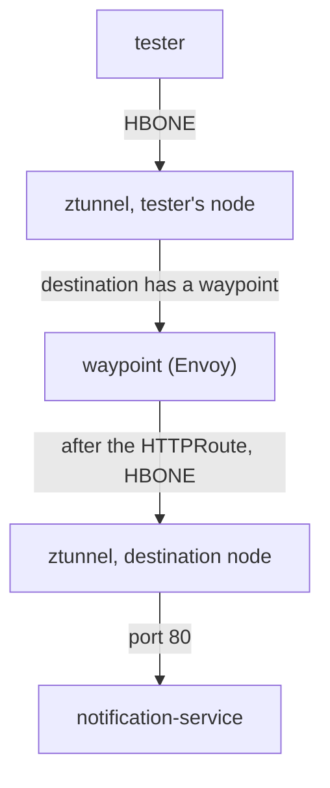

# Solution Walkthrough

Mission debrief, astronaut. Follow these steps to add a checkpoint station (a waypoint) and prove that layer 7 processing is really in the path.

---

## Step 1: See the Gap First

Write the route and apply it **before** you create the waypoint. It is worth watching the failure, because it is silent.

Save this as `notification-header.yaml`:

```yaml
apiVersion: gateway.networking.k8s.io/v1
kind: HTTPRoute
metadata:
  name: notification-header
  namespace: ambient-l7
spec:
  parentRefs:
    - group: ""
      kind: Service
      name: notification-service
  rules:
    - filters:
        - type: ResponseHeaderModifier
          responseHeaderModifier:
            set:
              - name: x-processed-by
                value: waypoint
      backendRefs:
        - name: notification-service
          port: 80
```

Apply it:

```sh
kubectl apply -f notification-header.yaml
```

```text
httproute.gateway.networking.k8s.io/notification-header created
```

Then check the result: read the route's status and send a request from `tester`:

```sh
kubectl -n ambient-l7 get httproute notification-header \
  -o jsonpath='{.status.parents[0].conditions[*].type}{"\n"}'
kubectl -n ambient-l7 exec deploy/tester -- curl -s -i http://notification-service/ | head -3
```

```text
Accepted ResolvedRefs

HTTP/1.1 200 OK
Server: nginx/1.27.4
Date: ...
```

The route exists, its status says `Accepted` and `ResolvedRefs`, and the request succeeds. But there is **no** `x-processed-by` header. `Server: nginx/1.27.4` means the response came straight from the application, through no HTTP-aware proxy.

Look at the `parentRefs` block while you are here. At the edge of the cluster, an `HTTPRoute` attaches to a `Gateway`. Here it attaches to a **Service** (`kind: Service`, with an empty `group` that means core Kubernetes). That is the Gateway API's mesh pattern: the route describes what happens to traffic headed for that Service, wherever it comes from.

---

## Step 2: Create the Waypoint

Create the waypoint, enroll the namespace, and wait for it:

```sh
istioctl waypoint apply -n ambient-l7 --enroll-namespace
kubectl -n ambient-l7 rollout status deployment waypoint --timeout=180s
```

```text
✓ waypoint ambient-l7/waypoint applied
✓ namespace ambient-l7 labeled with "istio.io/use-waypoint: waypoint"
deployment "waypoint" successfully rolled out
```

Two separate things happened:

*   `waypoint apply` created a `Gateway` object, and Istio turned it into a running Envoy Deployment.
*   `--enroll-namespace` labelled the namespace `istio.io/use-waypoint: waypoint`. That label tells ztunnel to route the namespace's traffic through the waypoint.

Without the second, you get a healthy proxy that sits idle, and nothing changes.

Now check the `Gateway` and the namespace labels:

```sh
kubectl -n ambient-l7 get gateway waypoint \
  -o custom-columns='NAME:.metadata.name,CLASS:.spec.gatewayClassName,PROGRAMMED:.status.conditions[?(@.type=="Programmed")].status'
kubectl get ns ambient-l7 --show-labels
```

```text
NAME       CLASS            PROGRAMMED
waypoint   istio-waypoint   True

NAME         STATUS   AGE   LABELS
ambient-l7   Active   12m   istio.io/dataplane-mode=ambient,istio.io/use-waypoint=waypoint,...
```

`gatewayClassName: istio-waypoint` is the one field that makes this a waypoint instead of an ingress gateway: same API, same proxy program, a completely different job. The namespace now carries two labels with two jobs: `dataplane-mode` puts it in the mesh at layer 4, and `use-waypoint` sends its traffic through layer 7.

---

## Step 3: Confirm ztunnel Knows Where to Send Traffic

ztunnel shows the routing decision in its **service** view. Ask it about `ambient-l7`:

```sh
istioctl ztunnel-config service | grep ambient-l7
```

On the `notification-service` row, the `WAYPOINT` column names `waypoint`. This is the check the grader runs. The `WAYPOINT` column in the workload view (`istioctl ztunnel-config workload`) stays `None` for a waypoint that serves a Service, so it cannot answer this question.

The path a request now takes:



The waypoint ends the first tunnel, reads the HTTP request, applies the `HTTPRoute`, and opens a new tunnel. Neither application pod changed. Both legs are HBONE, so mutual TLS stays in place end to end.

---

## Step 4: The Same Request, Through Layer 7

The `HTTPRoute` is still exactly as you applied it in Step 1. Nothing about it needed fixing: it was correct, and nothing was carrying it out. Send the request again:

```sh
kubectl -n ambient-l7 exec deploy/tester -- curl -s -i http://notification-service/ | head -7
```

```text
HTTP/1.1 200 OK
server: istio-envoy
date: ...
content-type: text/html
content-length: 615
x-envoy-upstream-service-time: 2
x-processed-by: waypoint
```

Three signs show that Envoy is now in the path: `x-processed-by: waypoint` (a header no application set), `server: istio-envoy` instead of `nginx/1.27.4`, and `x-envoy-upstream-service-time`, Envoy timing the call to the application.

You can also look at the route from inside the waypoint's Envoy, with the ordinary proxy tools:

```sh
WAYPOINT_POD=$(kubectl -n ambient-l7 get pod -l gateway.networking.k8s.io/gateway-name=waypoint \
  -o jsonpath='{.items[0].metadata.name}')
istioctl proxy-config route "$WAYPOINT_POD.ambient-l7" | head -5
```

Your route's name in the output is the strongest proof that the configuration reached the proxy, and does not merely exist in the cluster.

---

## Step 5: Submit

Send the lab for grading:

```sh
astrona submit
```

The grader checks that:

- the namespace is still ambient;
- the `waypoint` Gateway is class `istio-waypoint`, `Programmed: True`, with a ready Deployment;
- the namespace carries `istio.io/use-waypoint=waypoint`;
- ztunnel's service view names `waypoint` for the `notification-service` Service;
- the `HTTPRoute` attaches to `Service/notification-service` and is `Accepted`;
- a **real request** from `tester` returns `200` with the `x-processed-by: waypoint` header.

That last check is the only one that proves anything is reading HTTP.

---

## Optional: Watch It Shrink

Delete the waypoint and try the request again:

```sh
istioctl waypoint delete waypoint -n ambient-l7
kubectl -n ambient-l7 exec deploy/tester -- curl -s -i http://notification-service/ | head -2
```

```text
HTTP/1.1 200 OK
Server: nginx/1.27.4
```

Traffic still flows, still encrypted and still checked. The mesh did not break; it got smaller. The layer 7 rules silently stopped applying. If an `AuthorizationPolicy` had been enforcing an HTTP-level rule, that rule would now be gone, while the policy object still looked healthy.

Build the waypoint again before you submit:

```sh
istioctl waypoint apply -n ambient-l7 --enroll-namespace
```

---

## Common Mistakes

*   **Applying the `HTTPRoute` and stopping.** It is accepted, gets a status, and does nothing. Check for the waypoint in `istioctl ztunnel-config service` before you debug the route.
*   **Leaving out `--enroll-namespace`.** The proxy runs and receives no traffic.
*   **Pointing `parentRefs` at a `Gateway`.** In the mesh, the route attaches to the **Service**. The grader checks `kind` and `name`.
*   **Reading route status as proof of effect.** `Accepted` means well formed and bound, not enforced. Only a real request proves layer 7 is in the path.
*   **Naming the waypoint something else.** The task asks for `waypoint`, which is also the default name `istioctl waypoint apply` uses.
*   **Removing the ambient label.** A waypoint adds layer 7 on top of the layer 4 mesh. Without `dataplane-mode=ambient`, ztunnel never captures the connection in the first place.
